# Tổng quan các trang website Gcalls — nội dung & ảnh chụp

> ## ⚠️ ẢNH CHỤP CŨ — KHÔNG PHẢI TRẠNG THÁI HIỆN TẠI CỦA SITE
>
> **Tài liệu này được sinh ngày 2026-08-04, TRƯỚC Checkpoint WEB-SITE-QA-001.**
> Nó ghi lại nguyên văn một số nội dung mà checkpoint đó đã **xóa hoặc sửa vì
> không có bằng chứng**. Không dùng tài liệu này để mô tả site hiện tại, và
> tuyệt đối không dùng nó làm nguồn để phục hồi nội dung cũ.
>
> Cụ thể, những nội dung sau xuất hiện trong tài liệu này nhưng **không còn trên
> site**:
>
> | Xuất hiện trong ảnh chụp cũ | Lý do đã xóa/sửa |
> |---|---|
> | `VP BM SV TH` · `4.9` · "Được tin dùng bởi các doanh nghiệp Việt Nam" | Đánh giá và tên doanh nghiệp bịa đặt. Không có hồ sơ đánh giá, không có permission record cho bất kỳ tên khách hàng nào. |
> | `50+ Nhân sự được quản lý` · `100% Dữ liệu tập trung` | Số liệu không có căn cứ, hiển thị ở cấp trang (không phải trong ảnh minh họa sản phẩm). |
> | `Freshsales` trong danh mục tích hợp | Không có trang tích hợp, không có config, không có bằng chứng nào trong repository. |
> | "Đồng bộ **hai chiều**" | Không trang tích hợp nào công bố đồng bộ hai chiều. |
> | "hiển thị popup **ngay lập tức**" | Popup gate chỉ đạt CONTEXT ONLY (INT-02…05); title trang Salesforce đã phải sửa vì đúng claim này. |
> | "Click To Call … CRM, Helpdesk, **ERP**" | Gate Click-to-Call của Freshdesk và Zendesk đều đóng. ERP không phải nhóm tích hợp nào trên site. |
> | "ghi âm tự động" (Data Sync) | Gate đồng bộ ghi âm đóng ở INT-03, INT-04 §11 J, INT-05 §11 J. |
> | "xác thực **OAuth 2.0**, **sandbox miễn phí**" | Không có bằng chứng trong repository. |
> | "nền tảng **phổ biến nhất**" | So sánh nhất không có căn cứ. |
> | "Tích hợp sẵn sàng · **Không cần dev**" · "không yêu cầu kiến thức kỹ thuật chuyên sâu" | Claim tuyệt đối; `src/data/gcallsPlus.ts` đã ghi rõ "Không cần IT" không được duyệt ở dạng tuyệt đối. |
> | "kết nối với nhân viên **trong vòng 30 giây**" · "Kết nối trong 30s" | Cam kết thời gian kết nối, phụ thuộc nhân sự trực và định tuyến nhà mạng. |
> | "**Không bỏ lỡ bất kỳ** cuộc gọi nào" · "không bỏ lỡ bất kỳ cơ hội nào" · "tăng tỷ lệ kết nối thành công" · "**hoàn toàn tự động**" | Cam kết kết quả tuyệt đối. |
>
> Xem `docs/CHECKPOINT_SITE_QA_001.md` §3 để biết lý do đầy đủ của từng mục.
>
> **Chưa sinh lại được.** `scripts/capture-pages.mjs` cần `playwright-core`, hiện
> không có trong `node_modules`; WEB-SITE-QA-001 không được phép thêm dependency.
> Việc chụp lại là một việc riêng, cần chạy dev server và cài lại công cụ chụp.
> Tài liệu cũng chỉ bao gồm **16 trang trong tổng số 38 route đã đăng ký**.

> Sinh tự động ngày **2026-08-04** từ dev server (`localhost:5173`), viewport 1440×900 @2x.
> Mỗi trang gồm 1 ảnh full-page (thu gọn trong mục *Ảnh toàn trang*) và ảnh chụp từng section.

## Mục lục

- **Cốt lõi**
  - [Trang chủ](#trang-chủ) — `/` · 9 section
- **Sản phẩm**
  - [Gcalls Plus Webphone](#gcalls-plus-webphone) — `/gcalls-plus-webphone/` · 18 section
  - [QA/QC Center (QC Bot AI)](#qa-qc-center-qc-bot-ai) — `/qc-bot-ai/` · 19 section
  - [Gcalls CX](#gcalls-cx) — `/gcalls-cx/` · 20 section
  - [Voicebot AI](#voicebot-ai) — `/voicebot-ai/` · 13 section
- **Giải pháp**
  - [Tổng đài tích hợp CRM](#tổng-đài-tích-hợp-crm) — `/tong-dai-tich-hop-crm/` · 19 section
  - [Tổng đài tích hợp Helpdesk](#tổng-đài-tích-hợp-helpdesk) — `/tong-dai-tich-hop-helpdesk/` · 17 section
  - [Tổng đài tích hợp POS](#tổng-đài-tích-hợp-pos) — `/tong-dai-tich-hop-pos/` · 17 section
  - [Tổng đài quốc tế](#tổng-đài-quốc-tế) — `/tong-dai-quoc-te/` · 19 section
- **Tích hợp**
  - [Tích hợp HubSpot](#tích-hợp-hubspot) — `/tich-hop/hubspot/` · 18 section
  - [Tích hợp Salesforce](#tích-hợp-salesforce) — `/tich-hop/salesforce/` · 21 section
  - [Tích hợp Zoho CRM](#tích-hợp-zoho-crm) — `/tich-hop/zoho-crm/` · 20 section
  - [Tích hợp Freshdesk](#tích-hợp-freshdesk) — `/tich-hop/freshdesk/` · 21 section
  - [Tích hợp Zendesk](#tích-hợp-zendesk) — `/tich-hop/zendesk/` · 21 section
- **Định giá**
  - [Bảng giá](#bảng-giá) — `/bang-gia/` · 11 section
  - [Ước tính chi phí](#ước-tính-chi-phí) — `/uoc-tinh-chi-phi/` · 8 section

**Tổng: 16 trang · 271 section được chụp.**

---

## Trang chủ

- **Đường dẫn:** `/`
- **Nhóm:** Cốt lõi
- **Số section:** 9

📄 Ảnh toàn trang (full-page)

### Các section

#### Section 01 — Gcalls Plus Webphone – tổng đài chuyên nghiệp chạy trên trình duyệt

> GCALLS PLUS WEBPHONE Gcalls Plus Webphone – tổng đài chuyên nghiệp chạy trên trình duyệt Gcalls Plus Webphone giúp đội Sales và CSKH nghe gọi, quản lý danh bạ, lịch sử tương tác, ghi chú và theo dõi hoạt động cuộc gọi ngay trên trình duyệt.
> Đăng ký tư vấn Khám phá tính năng Nghe gọi trực tiếp trên trình duyệt Quản lý danh bạ và lịch sử tương tác Ghi chú, nhắc nhở và phân loại cuộc gọi Theo dõi lịch sử, thống kê và hiệu suất đội ngũ VP BM SV TH 4.9 Được tin dùng bởi các doanh nghiệp Việt Nam Gcalls Webphone — Dashboard SIP: Kết nối Cuộc gọi hôm nay 84 +12% Tỷ lệ nghe máy 73% +4% Thời gian TB 5:24 -0:18 Đã chốt deal 11 +3 Lịch sử cuộc gọi Tìm kiếm Nguyễn Văn Minh Khách hàng mới 0901 234 567 3:42 09:14 Trần Thị Lan Gia hạn 0912 345 678 7:18 09:31 Lê Hoàng Phúc 0888 901 234 — 09:52 Phạm Thu Hà Demo 0976 543 210 12:05 10:08 Võ Minh Tuấn Upsell 0933 210 987 5:20 10:45 Đội ngũ H Hằng N.
> Đang gọi · 04:12 T Tuấn V.
> Đang gọi · 01:48 L Linh P.
> Sẵn sàng D Dương M.
> Giải lao Trần Thị Lan Cuộc gọi đến · 7:18 phút Đã nghe 166s Gia hạn gói Cần follow-up Hài lòng Hiệu suất tuần T2 T3 T4 T5 T6 T7 CN 543 Cuộc gọi / tuần +18% CRM Khách hàng 248 liên hệ BM Công ty TNHH Bình Minh Nguyễn Văn Minh · 12 cuộc Demo VP CTCP Việt Phát Trần Thị Lan · 8 cuộc Đàm phán SV Tập đoàn Sao Việt Phạm Thu Hà · 24 cuộc Đề xuất 0901 234 5 Nhập số gọi 1 2 3 4 5 6 7 8 9 * 0 # Gọi ngay

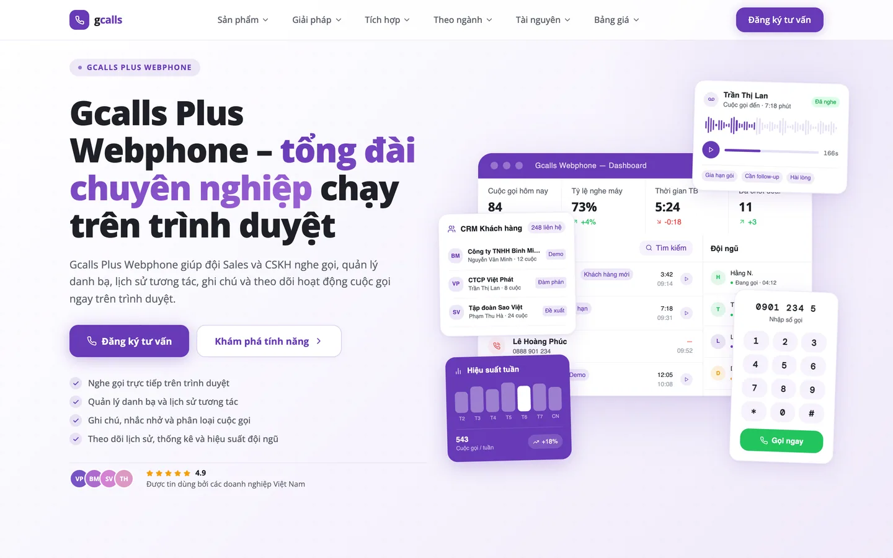

#### Section 02 — Những điểm nghẽn làm giảm hiệu suất nghe gọi của đội Sales và CSKH

> BÀI TOÁN Những điểm nghẽn làm giảm hiệu suất nghe gọi của đội Sales và CSKH Khi dữ liệu khách hàng, lịch sử cuộc gọi và công cụ làm việc nằm ở nhiều nơi, đội ngũ dễ mất ngữ cảnh và tốn thời gian cho thao tác thủ công.
> Dữ liệu khách hàng và lịch sử cuộc gọi bị phân tán 01 Thông tin lưu ở nhiều nơi khác nhau, đội ngũ không có cái nhìn đầy đủ về khách hàng khi cần.
> Nhân viên phải chuyển đổi giữa nhiều công cụ khi gọi và ghi chú 02 Mỗi cuộc gọi yêu cầu thao tác trên nhiều ứng dụng khác nhau, làm chậm quy trình và dễ bỏ sót thông tin.
> Khó theo dõi trạng thái và lịch sử tương tác của từng khách hàng 03 Không có lịch sử tương tác tập trung khiến đội ngũ mất ngữ cảnh và phải hỏi lại thông tin đã có.
> Quản lý thiếu dữ liệu tập trung để theo dõi hoạt động và hiệu suất 04 Không có bảng điều khiển tổng hợp khiến quản lý khó đánh giá hiệu suất và phân bổ nguồn lực hợp lý.
> Đội ngũ làm việc từ nhiều nơi thiếu công cụ thống nhất 05 Sales remote, CSKH tại văn phòng, telesales — mỗi nơi dùng một công cụ, khó phối hợp và giám sát.
> Tổng đài và hệ thống doanh nghiệp hoạt động rời rạc 06 Khi tổng đài và CRM không kết nối, nhân viên phải nhập liệu thủ công, tốn thời gian và dễ sai sót.
> Giải pháp Gcalls Một nền tảng duy nhất để quản lý toàn bộ hoạt động cuộc gọi Từ gọi điện, chăm sóc khách hàng, quản lý danh bạ, ghi âm, báo cáo cho đến phân quyền đội ngũ.
> Webphone trên trình duyệt Danh bạ & lịch sử tương tác CRM tích hợp Báo cáo theo dữ liệu Khám phá Gcalls Webphone Không cần cài đặt phần mềm · Chạy trực tiếp trên trình duyệt

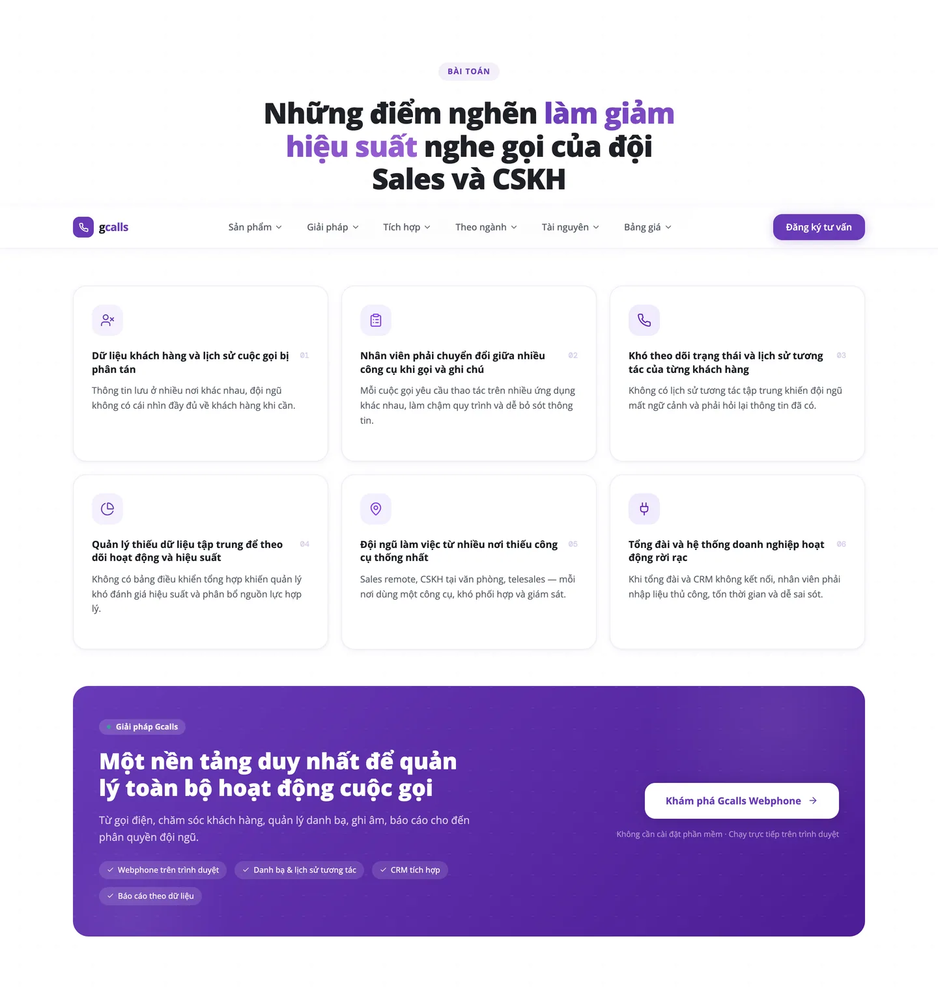

#### Section 03 — Theo dõi toàn bộ hoạt động cuộc gọi theo thời gian thực

> HOẠT ĐỘNG CUỘC GỌI REALTIME Theo dõi toàn bộ hoạt động cuộc gọi theo thời gian thực Từ cuộc gọi đến, cuộc gọi đi, cuộc gọi nhỡ, ghi âm, ghi chú đến đánh giá chất lượng cuộc gọi — tất cả đều được lưu trữ tập trung trên Gcalls Webphone.
> Lưu lịch sử cuộc gọi tự động Ghi âm và nghe lại cuộc gọi Gắn nhãn và phân loại khách hàng Ghi chú sau mỗi cuộc gọi Theo dõi trạng thái cuộc gọi Tìm kiếm lịch sử nhanh chóng 84 Cuộc gọi hôm nay (minh họa) 73% Tỷ lệ nghe máy (minh họa) Ghi âm Tự động theo cuộc gọi Timeline Cuộc gọi Tìm kiếm...
> Tất cả Đến Đi Nhỡ1 Hotline: 1900 1234 1900 5678 Nguyễn Văn Minh Khách hàng mới 0901 234 567 1900 1234 3:42 09:14 Trần Thị Lan Gia hạn 0912 345 678 1900 5678 Cần gửi báo giá gia hạn trước 15h 7:18 09:31 Lê Hoàng Phúc 0888 901 234 1900 1234 — 09:52 Phạm Thu Hà Demo 0976 543 210 1900 5678 12:05 10:08 Võ Minh Tuấn Upsell 0933 210 987 1900 1234 5:20 10:45 Trần Thị Lan7:18 3:09 Gia hạn Cần gửi báo giá gia hạn trước 15h 84 Cuộc gọi hôm nay (minh họa) 73% Tỷ lệ nghe máy (minh họa) Ghi âm Tự động theo cuộc gọi Mỗi cuộc gọi đều trở thành dữ liệu giá trị Lịch sử trao đổi, ghi âm, ghi chú và kết quả cuộc gọi được lưu lại giúp đội Sales và CSKH dễ dàng tiếp nối công việc mà không bỏ lỡ bất kỳ cơ hội nào.
> Xem tính năng Timeline

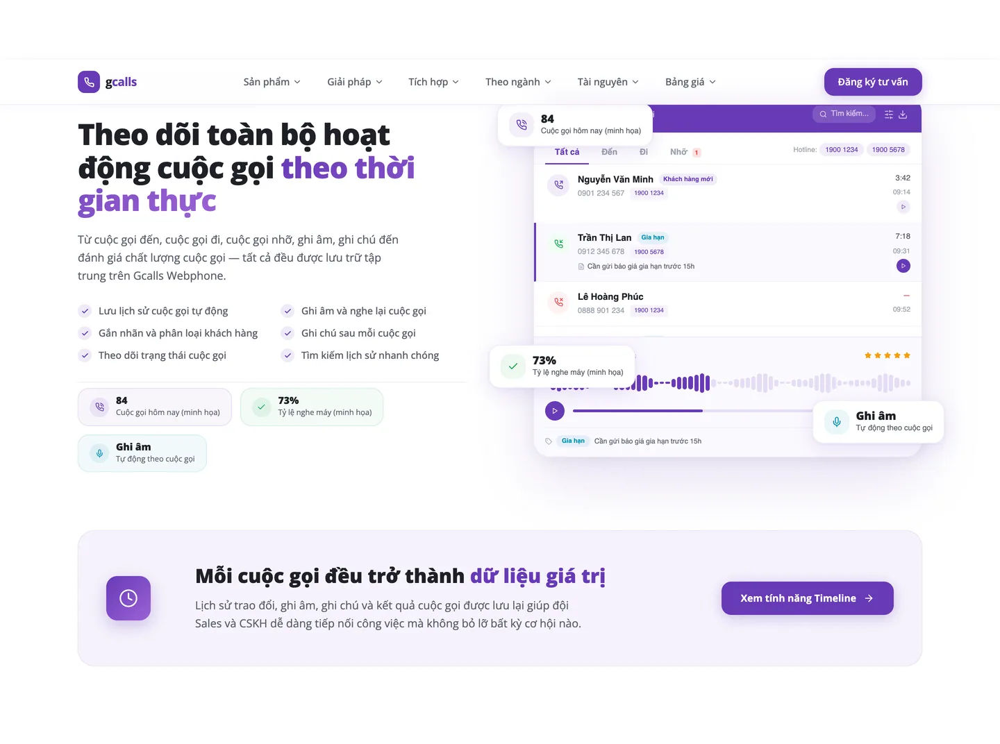

#### Section 04 — Quản lý khách hàng tập trung ngay trên Gcalls

> Danh bạ NM Nguyễn Văn Minh Công ty TNHH Bình Minh TL Trần Thị Lan CTCP Việt Phát PH Phạm Thu Hà Tập đoàn Sao Việt VT Võ Minh Tuấn StartupHub Việt Nam 4 liên hệ · trang 1/12 NM Nguyễn Văn Minh Demo Công ty TNHH Bình Minh Khách hàng mới Demo 0901 234 567 minh.nv@binhminh.vn 12 cuộc gọi Ghi chú gần nhất KH quan tâm gói Business.
> Hẹn demo thứ 5 tuần này.
> Cần gửi proposal trước ngày 25.
> Lịch sử hoạt động Gần nhất Cuộc gọi đến 09:31 7:18 phút · Ghi âm có sẵn Ghi chú 09:35 Cần gửi báo giá gia hạn trước 15h hôm nay Cuộc gọi đi Hôm qua 3:42 phút · Đã nghe máy Gắn nhãn VIP 2 ngày trước Thêm tag: VIP, Gia hạn Cập nhật lần cuối: Hôm nay 09:14 Xem đầy đủ Danh bạ Quản lý tập trung trên Webphone Lịch sử Tương tác được lưu trữ đầy đủ CRM Tích hợp sẵn trong nền tảng CRM MINI TÍCH HỢP Quản lý khách hàng tập trung ngay trên Gcalls Toàn bộ thông tin khách hàng, lịch sử tương tác và ghi chú chăm sóc được lưu trữ tập trung giúp đội Sales và CSKH làm việc hiệu quả hơn.
> Danh bạ khách hàng tập trung Hồ sơ khách hàng chi tiết Ghi chú và lịch sử chăm sóc Phân loại khách hàng bằng Tag Tìm kiếm khách hàng nhanh chóng Theo dõi hoạt động theo thời gian thực Danh bạ Quản lý tập trung trên Webphone Lịch sử Tương tác được lưu trữ đầy đủ CRM Tích hợp sẵn trong nền tảng Mỗi khách hàng đều có một hồ sơ riêng Khi có cuộc gọi đến hoặc đi, nhân viên có thể xem ngay thông tin khách hàng, lịch sử chăm sóc, ghi chú và các hoạt động liên quan mà không cần chuyển đổi giữa nhiều hệ thống.
> Sales Team Xem hồ sơ KH trước khi gọi Ghi chú kết quả tư vấn ngay sau cuộc gọi Theo dõi pipeline theo từng KH CSKH Team Biết ngay lịch sử KH khi nhận cuộc gọi Gắn nhãn phân loại mức độ ưu tiên Ghi nhận phản hồi và yêu cầu hỗ trợ Manager Theo dõi tương tác toàn đội ngũ Kiểm soát chất lượng chăm sóc KH Báo cáo hoạt động theo KH / nhân viên

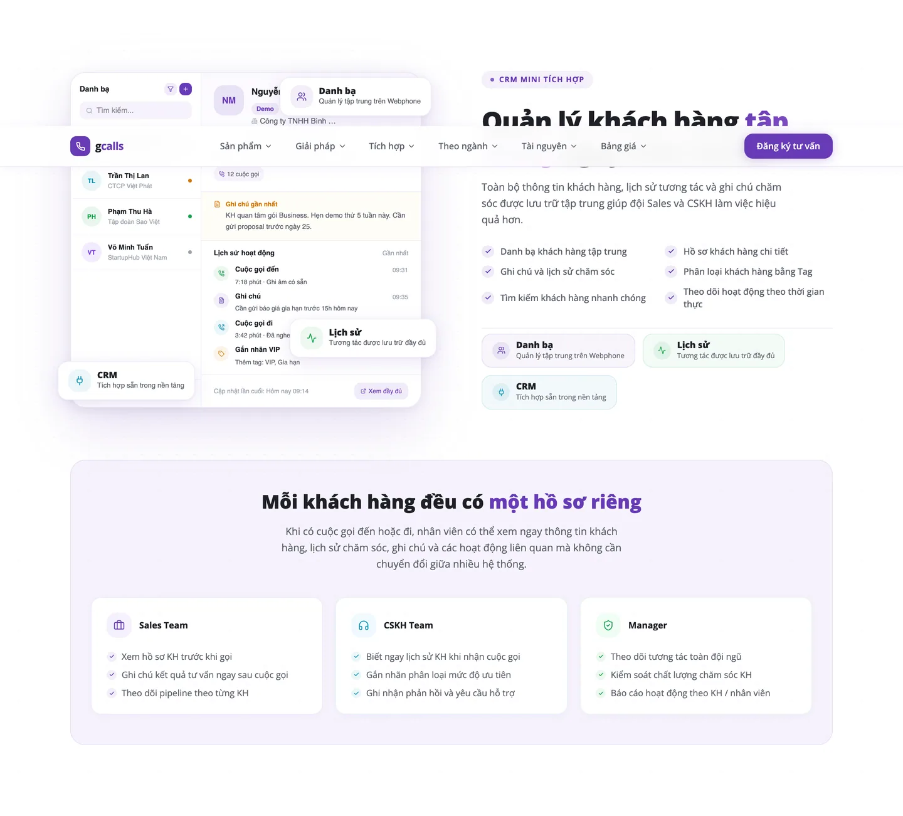

#### Section 05 — Quản lý đội ngũ và phân quyền theo từng vai trò

> TEAM MANAGEMENT Quản lý đội ngũ và phân quyền theo từng vai trò Từ nhân viên Sales, Telesales, CSKH đến quản lý và quản trị hệ thống, Gcalls giúp doanh nghiệp dễ dàng kiểm soát quyền truy cập và hoạt động của từng thành viên.
> Quản lý tài khoản nhân viên Phân quyền theo vai trò Quản lý phòng ban và nhóm Kiểm soát dữ liệu khách hàng Theo dõi hoạt động người dùng Tăng cường bảo mật hệ thống 50+ Nhân sự được quản lý RBAC Role Based Permission 100% Dữ liệu tập trung Quản lý đội ngũ Tìm nhân viên...
> Thêm Người dùng Vai trò & Quyền hạn 44 thành viên NHÂN VIÊN VAI TRÒ NHÓM CUỘC GỌI NH Nguyễn Hằng hang.n@gcalls.vn Sales Nhóm Bắc 24 TT Trần Minh Tuấn tuan.tm@gcalls.vn Telesales Nhóm Nam 18 LL Lê Phương Linh linh.lp@gcalls.vn CSKH Nhóm Trung 31 PD Phạm Đức Dương duong.pd@gcalls.vn Team Leader Nhóm Bắc 9 VT Võ Thị Thanh thanh.vt@gcalls.vn Sales Nhóm Nam 22 DH Đỗ Quang Hải hai.dq@gcalls.vn Manager Ban quản lý 5 Hiển thị 6 / 44 nhân viên 1 2 3 ...
> 50+ Nhân sự được quản lý RBAC Role Based Permission 100% Dữ liệu tập trung Mỗi nhân viên chỉ thấy đúng những gì họ cần Doanh nghiệp có thể thiết lập quyền truy cập cho từng bộ phận, từng nhóm hoặc từng nhân viên nhằm bảo vệ dữ liệu khách hàng và chuẩn hóa quy trình làm việc.
> Sales Team Tập trung vào gọi, ghi chú kết quả, theo dõi pipeline KH được phân công.
> Team Leader Nghe lại ghi âm, đánh giá chất lượng cuộc gọi, huấn luyện nhân viên.
> Manager Xem báo cáo KPI, phân tích hiệu suất nhóm, điều phối nguồn lực.
> Admin Cấu hình hệ thống, quản lý tài khoản, thiết lập bảo mật và tích hợp.
> Từ nhân viên đến quản lý, mọi hoạt động đều được ghi nhận 01 Tạo tài khoản nhân viên Thêm thành viên vào hệ thống, gán hotline và nhóm làm việc 02 Phân quyền theo vai trò Thiết lập quyền truy cập phù hợp cho từng vai trò trong tổ chức 03 Giao khách hàng & hotline Phân công danh sách khách hàng và đường dây riêng cho từng nhân viên 04 Theo dõi cuộc gọi Giám sát realtime: ai đang gọi, ai nhỡ máy, chất lượng từng cuộc gọi 05 Đánh giá KPI Tổng hợp hiệu suất gọi, tỷ lệ chốt deal và điểm chất lượng từng nhân viên Tập trung User Management Toàn bộ nhân sự trong 1 giao diện Linh hoạt Permission Control Phân quyền chi tiết theo role & nhóm Đa phòng ban Multi Department Quản lý nhiều nhóm & phòng ban Realtime Activity Tracking Mọi hoạt động được ghi lại tức thì

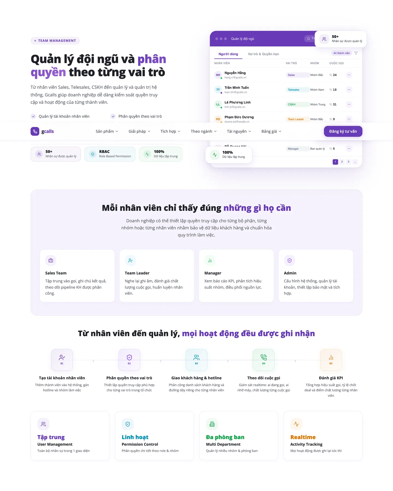

#### Section 06 — Theo dõi hiệu suất đội ngũ theo thời gian thực

> ANALYTICS & KPI DASHBOARD Theo dõi hiệu suất đội ngũ theo thời gian thực Dashboard trực quan giúp quản lý theo dõi tình trạng cuộc gọi, hiệu suất nhân viên và chất lượng vận hành chỉ trong vài giây.
> Thống kê cuộc gọi theo ngày, tuần, tháng Theo dõi hiệu suất từng nhân viên Báo cáo cuộc gọi đến và đi Theo dõi cuộc gọi nhỡ Đo lường thời lượng cuộc gọi Dashboard realtime Live Tỷ lệ bắt máy realtime Minh họa Cuộc gọi Theo dõi theo tháng Dashboard 3m25s Thời lượng trung bình -0:12 Live Cập nhật liên tục Realtime Analytics Dashboard Ngày Tuần Tháng Tổng cuộc gọi 675 Bắt máy 638 Cuộc gọi nhỡ 37 TB thời lượng 3:25 Cuộc gọi theo ngày Đi Đến Nhỡ T2 T3 T4 T5 T6 T7 CN Hiệu suất nhân viên Xem tất cả → NHÂN VIÊN ĐI ĐẾN NHỠ BẮT MÁY TB NH Nguyễn Hằng 38 29 2 97% 3:52 TT Trần M.
> Tuấn 31 22 4 92% 4:10 LL Lê P.
> Linh 44 35 1 98% 3:18 PD Phạm Đ.
> Dương 19 14 6 86% 5:04 Live Tỷ lệ bắt máy realtime Cuộc gọi Theo dõi theo tháng 3m25s Thời lượng trung bình Live Cập nhật liên tục Ra quyết định nhanh hơn với dữ liệu trực quan Không cần tổng hợp báo cáo thủ công từ nhiều nguồn.
> Mọi chỉ số quan trọng đều được hiển thị trực quan giúp quản lý nhanh chóng nắm bắt tình hình vận hành.
> Khám phá Analytics Các chỉ số quan trọng trong một màn hình 284cuộc Cuộc gọi đến +12% 391cuộc Cuộc gọi đi +8% 23cuộc Cuộc gọi nhỡ -5% 3:25phút Thời lượng TB -0:12 — Tỷ lệ bắt máy Minh họa 4.7/ 5 Hiệu suất nhân viên +0.3 Dành cho quản lý, trưởng nhóm và chủ doanh nghiệp Sales Manager Theo dõi KPI từng nhân viên Sales, phân tích tỷ lệ chốt deal và hiệu quả cuộc gọi.
> Tìm hiểu thêm CSKH Manager Giám sát chất lượng phục vụ, theo dõi thời gian xử lý và mức độ hài lòng khách hàng.
> Tìm hiểu thêm Business Owner Nắm tổng quan hiệu suất vận hành, so sánh theo giai đoạn và ra quyết định chiến lược.
> Tìm hiểu thêm Operation Team Cấu hình báo cáo tự động, phân tích tắc nghẽn luồng cuộc gọi và tối ưu phân công.
> Tìm hiểu thêm

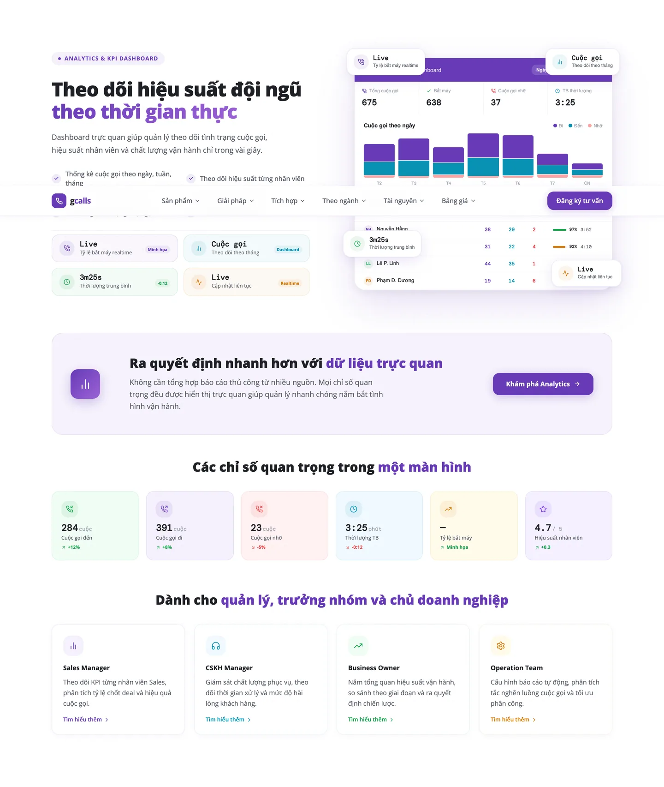

#### Section 07 — Xây dựng hệ thống tổng đài doanh nghiệp trên nền tảng Cloud

> CLOUD CALL CENTER Xây dựng hệ thống tổng đài doanh nghiệp trên nền tảng Cloud Từ doanh nghiệp nhỏ đến Contact Center nhiều chi nhánh, Gcalls giúp triển khai hệ thống tổng đài linh hoạt, dễ mở rộng và vận hành hoàn toàn trên nền tảng điện toán đám mây.
> SIP Account Management IVR nhiều cấp Call Routing thông minh Nhóm đổ chuông Chuyển tiếp cuộc gọi Hotline đa đầu số Cloud Hạ tầng Cloud SaaS SIP SIP Extensions IVR Điều hướng thông minh Multi Hotline đa đầu số Cloud Call Center SIP: Online Cloud SaaS SIP Accounts IVR & Routing Hotlines 5 extensions Thêm EXT NHÂN VIÊN HOTLINE TRẠNG THÁI 101 HN Nguyễn Hằng 1900 1234 Đã đăng ký 102 TT Trần M.
> Tuấn 1900 1234 Đang gọi 103 LL Lê P.
> Linh 1900 5678 Đã đăng ký 104 DP Phạm Đ.
> Dương 1900 5678 Ngoại tuyến 105 TV Võ Thị Thanh 1900 1234 Đã đăng ký SIP Server: sip.gcalls.vn Kết nối: Ổn định Cập nhật 5s trước Cloud Hạ tầng Cloud SaaS SIP SIP Extensions IVR Điều hướng thông minh Multi Hotline đa đầu số Không bỏ lỡ bất kỳ cuộc gọi nào Tự động điều hướng cuộc gọi đến đúng bộ phận, đúng nhân viên hoặc đúng chi nhánh giúp nâng cao trải nghiệm khách hàng và tăng tỷ lệ kết nối thành công.
> Xem Cloud PBX Đầy đủ tính năng Cloud PBX doanh nghiệp SIP Account Tài khoản SIP cho từng nhân viên, đa thiết bị IVR Cây menu tự động nhiều cấp, cấu hình linh hoạt Call Routing Điều hướng thông minh theo kỹ năng, thời gian Ring Group Đổ chuông đồng thời hoặc tuần tự nhiều agent Multi Branch Kết nối nhiều văn phòng, chi nhánh trên 1 hệ thống Số quốc tế DID nội địa & quốc tế, số ảo nhiều vùng Call Forwarding Chuyển tiếp đến di động, email hoặc voicemail Voicemail Hộp thư thoại, nhận qua email, ghi âm lưu trữ Hành trình cuộc gọi từ đầu đến cuối Mỗi cuộc gọi đều được xử lý, ghi nhận và phân tích hoàn toàn tự động Khách hàng gọi đến 1900 1234 · 028 xxxx 01 IVR Bấm 1–Sales, 2–CSKH 02 Call Routing Phân phối thông minh 03 Ring Group Đổ chuông đồng thời 04 Agent Nhân viên nhận máy 05 Recording Ghi âm tự động cuộc gọi 06 Analytics Báo cáo realtime 07

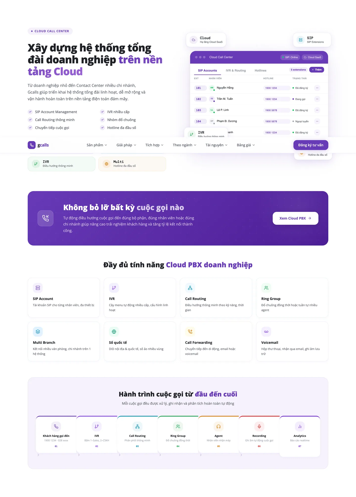

#### Section 08 — Kết nối dữ liệu khách hàng và cuộc gọi trên một nền tảng duy nhất

> INTEGRATIONS & AUTOMATION Kết nối dữ liệu khách hàng và cuộc gọi trên một nền tảng duy nhất Gcalls giúp doanh nghiệp đồng bộ dữ liệu khách hàng, cuộc gọi và hoạt động chăm sóc khách hàng với CRM, Helpdesk và các hệ thống nội bộ thông qua API mở và Webhook.
> HS HubSpot SF Salesforce ZH Zoho CRM FS Freshsales FD Freshdesk ZD Zendesk FB Facebook ZA Zalo OA API Management v1.4.2 · Live sk-gc-••••••••••••••••4f2a Copy 2.4k req/h Endpoints Base URL: api.gcalls.vn GET /v1/calls Lấy danh sách cuộc gọi POST /v1/calls/outbound Khởi tạo cuộc gọi đi GET /v1/contacts/:id Chi tiết khách hàng PUT /v1/contacts/:id Cập nhật thông tin KH POST /v1/webhooks Đăng ký webhook event RESPONSE · 200 OK · 48ms JSON { "id": "call_8f3kd9", "contact": "Nguyễn Văn Minh", "phone": "0901234567", "status": "answered", "duration": 222, "recording_url": "https://..." } HS HubSpot ZD Zendesk SF Salesforce WH Webhook Open API REST API đầy đủ tài liệu, xác thực OAuth 2.0, sandbox miễn phí cho dev.
> Webhook Nhận sự kiện realtime: cuộc gọi đến, kết thúc, ghi âm, ghi chú mới.
> Customer Popup Hiển thị thông tin KH ngay khi nhận cuộc gọi, kéo dữ liệu từ CRM.
> Click To Call Gọi trực tiếp từ CRM, Helpdesk, ERP chỉ bằng một click chuột.
> CRM Integration Đồng bộ hai chiều với HubSpot, Salesforce, Zoho CRM và Freshsales.
> Data Sync Đồng bộ liên hệ, lịch sử, ghi âm tự động — không cần copy thủ công.
> Customer Popup Nhận diện khách hàng ngay khi cuộc gọi đến Gcalls tự động kéo thông tin từ CRM và hiển thị popup ngay lập tức khi có cuộc gọi đến — nhân viên biết ngay đang nói chuyện với ai.
> Biết khách hàng là ai trước khi bắt máy Xem lịch sử chăm sóc và ghi chú ngay lập tức Không cần hỏi lại thông tin đã có Tăng trải nghiệm và sự hài lòng của khách hàng Cuộc gọi đến...
> 1900 1234 · Hà Nội NM Nguyễn Văn Minh Công ty TNHH Bình Minh Demo VIP LỊCH SỬ GẦN NHẤT Gọi đi · 3:42 Hôm nay 09:14 Ghi chú: Cần gửi proposal Hôm nay 09:35 Ghi chú Gắn tag Xem hồ sơ yourwebsite.vn/pricing Call Button Widget Biến khách truy cập website thành cuộc gọi Nhúng nút gọi ngay vào website chỉ với vài dòng code.
> Khách hàng nhập số điện thoại và được kết nối với nhân viên trong vòng 30 giây.
> Tăng tỷ lệ chuyển đổi từ visitor thành lead Thu thập số điện thoại và gọi lại tức thì Theo dõi nguồn cuộc gọi từ từng trang web <script> 1 dòng Kết nối trong 30s Hệ sinh thái tích hợp của Gcalls Kết nối sẵn sàng với các nền tảng phổ biến nhất tại Việt Nam và toàn cầu CRM HS HubSpot SF Salesforce ZH Zoho CRM FS Freshsales Helpdesk FD Freshdesk ZD Zendesk Communication FB Facebook ZA Zalo OA EM Email Developer API Open API WH Webhook DEV Custom HubSpot ✓ Salesforce ✓ Zendesk ✓ Webhook ✓ Open API ✓ Custom Dev ✓ Tích hợp sẵn sàng · Không cần dev Kết nối Gcalls với hệ thống doanh nghiệp của bạn Từ CRM, Helpdesk đến các hệ thống nội bộ — Gcalls kết nối nhanh chóng qua API mở, không yêu cầu kiến thức kỹ thuật chuyên sâu.
> Đăng ký tư vấn Tư vấn tích hợp Đăng ký để nhận tư vấn cấu hình phù hợp với nhu cầu

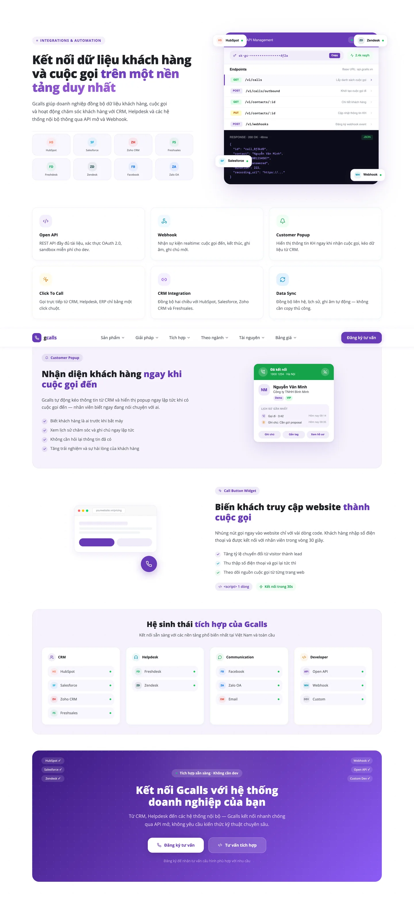

#### Section 09 — Mang tổng đài doanh nghiệp theo bạn đến bất kỳ đâu

> WORK FROM ANYWHERE Mang tổng đài doanh nghiệp theo bạn đến bất kỳ đâu Dù đang ở văn phòng, làm việc tại nhà hay di chuyển gặp khách hàng, đội ngũ vẫn có thể tiếp nhận và thực hiện cuộc gọi như đang ngồi tại tổng đài.
> Đăng nhập trên trình duyệt Không cần cài đặt phức tạp Làm việc mọi nơi Đồng bộ dữ liệu realtime SIP: Online HD 0901 234 Ext: 101 · Hotline: 1900 1234 1 2 3 4 5 6 7 8 9 * 0 # Gọi GỌI NHANH NH Nguyễn Hằng Ext 101 TT Trần M.
> Tuấn Ext 102 Gcalls Softphone Ready TL Trần Thị Lan 0912 345 678 · Gia hạn Cuộc gọi đến · 1900 1234 Bắt máy Từ chối Browser Ready HD Voice No Install Auto Sync Chỉ cần trình duyệt là có thể bắt đầu Webphone Gọi điện trực tiếp trên Chrome, Edge, Safari — không cài extension Softphone Chất lượng âm thanh HD, noise cancellation, dễ cấu hình Cloud System Dữ liệu lưu trên Cloud, truy cập bất cứ đâu, không phụ thuộc server nội bộ Auto Sync Lịch sử, ghi chú, trạng thái đồng bộ tức thì giữa các thiết bị Biết đội ngũ đang làm gì theo thời gian thực Quản lý theo dõi trạng thái từng nhân viên, lịch sử hoạt động và hiệu suất — dù đội ngũ đang làm việc từ bất kỳ đâu.
> Trạng thái đội ngũ · Realtime 2 đang gọi 2 sẵn sàng 6 Tất cả 2 Sẵn sàng 2 Đang gọi 1 Vắng mặt 1 Ngoại tuyến NH Nguyễn Hằng Sẵn sàng · Hà Nội 12 cuộc gọi TT Trần M.
> Tuấn Đang gọi · TP.HCM 01:24 thời gian LL Lê P.
> Linh Sẵn sàng · Đà Nẵng 17 cuộc gọi PD Phạm Đ.
> Dương Vắng mặt · Remote 5 cuộc gọi VT Võ Thị Thanh Đang gọi · TP.HCM 02:58 thời gian DH Đỗ Quang Hải Ngoại tuyến · Hải Phòng 0 cuộc gọi Activity Log Xem tất cả → 10:48 Nguyễn Hằng Chuyển sang Sẵn sàng 10:45 Trần M.
> Tuấn Bắt đầu cuộc gọi · 0912 345 678 10:40 Võ Thị Thanh Bắt đầu cuộc gọi · 0976 543 210 Quản lý từ xa Theo dõi đội ngũ làm việc ở mọi nơi Activity Tracking Ghi lại mọi thay đổi trạng thái KPI Support Dữ liệu hỗ trợ đánh giá năng suất Minh bạch hoạt động Mọi hành động đều được ghi nhận Sales Team Gọi cho KH từ bất kỳ đâu Xem hồ sơ KH ngay trên trình duyệt Ghi chú kết quả sau mỗi cuộc gọi Remote Team Làm việc từ xa như tại văn phòng Quản lý theo dõi realtime Không cần VPN hay thiết bị đặc biệt Multi Branch Kết nối nhiều chi nhánh trên 1 hệ thống Đổ chuông liên chi nhánh Báo cáo tổng hợp toàn bộ Contact Center Điều phối đội ngũ theo ca Giám sát trạng thái realtime Ghi âm tự động cuộc gọi Anywhere Work From Anywhere Cloud Cloud SaaS Live Realtime Sync Multi Any Device Sẵn sàng triển khai ngay hôm nay Tổng đài doanh nghiệp luôn đồng hành cùng đội ngũ của bạn Không cần phần cứng, không cần cài đặt phức tạp — chỉ cần trình duyệt và kết nối internet, đội ngũ của bạn đã có thể bắt đầu ngay.
> Đăng ký tư vấn Khám phá tính năng Đội ngũ Gcalls hỗ trợ cấu hình và triển khai theo nhu cầu thực tế

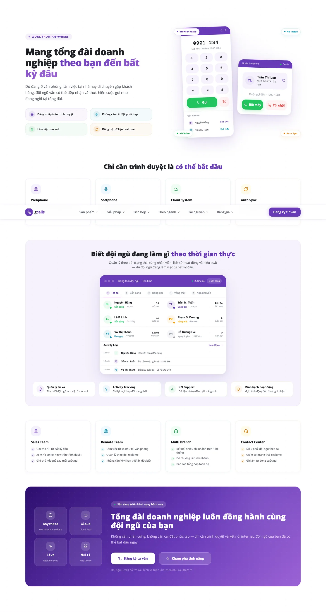

---

## Gcalls Plus Webphone

- **Đường dẫn:** `/gcalls-plus-webphone/`
- **Nhóm:** Sản phẩm
- **Số section:** 18

📄 Ảnh toàn trang (full-page)

### Các section

#### Section 01

> Trang chủ Sản phẩm Gcalls Plus Webphone

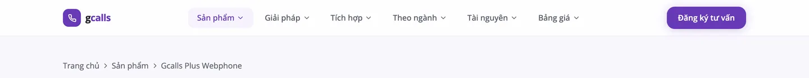

#### Section 02 — Gcalls Plus Webphone – tổng đài doanh nghiệp ngay trên trình duyệt

> GCALLS PLUS WEBPHONE Gcalls Plus Webphone – tổng đài doanh nghiệp ngay trên trình duyệt Nghe gọi, quản lý danh bạ, theo dõi lịch sử tương tác và hoạt động của đội ngũ Sales/CSKH trong một giao diện Webphone tập trung.
> Làm việc ngay trên trình duyệt Đưa hoạt động nghe gọi vào môi trường làm việc trên máy tính thay vì phụ thuộc vào một hệ thống điện thoại rời rạc.
> Theo dõi context khách hàng Danh bạ, lịch sử tương tác, ghi chú và thông tin cuộc gọi được tổ chức để nhân viên dễ tiếp tục cuộc hội thoại.
> Quản lý hoạt động đội ngũ Theo dõi lịch sử và dữ liệu hoạt động cuộc gọi để hỗ trợ quản lý vận hành.
> Đăng ký tư vấn Khám phá tính năng Danh bạ NM Nguyễn Văn Minh Công ty TNHH Bình Minh TL Trần Thị Lan CTCP Việt Phát PH Phạm Thu Hà Tập đoàn Sao Việt VT Võ Minh Tuấn StartupHub Việt Nam 4 liên hệ · trang 1/12 NM Nguyễn Văn Minh Demo Công ty TNHH Bình Minh Khách hàng mới Demo 0901 234 567 minh.nv@binhminh.vn 12 cuộc gọi Ghi chú gần nhất KH quan tâm gói Business.
> Hẹn demo thứ 5 tuần này.
> Cần gửi proposal trước ngày 25.
> Lịch sử hoạt động Gần nhất Cuộc gọi đến 09:31 7:18 phút · Ghi âm có sẵn Ghi chú 09:35 Cần gửi báo giá gia hạn trước 15h hôm nay Cuộc gọi đi Hôm qua 3:42 phút · Đã nghe máy Gắn nhãn VIP 2 ngày trước Thêm tag: VIP, Gia hạn Cập nhật lần cuối: Hôm nay 09:14 Xem đầy đủ Gcalls Softphone Ready TL Trần Thị Lan 0912 345 678 · Gia hạn Cuộc gọi đến · 1900 1234 Bắt máy Từ chối Giao diện minh họa.
> Số liệu hiển thị là dữ liệu mẫu.

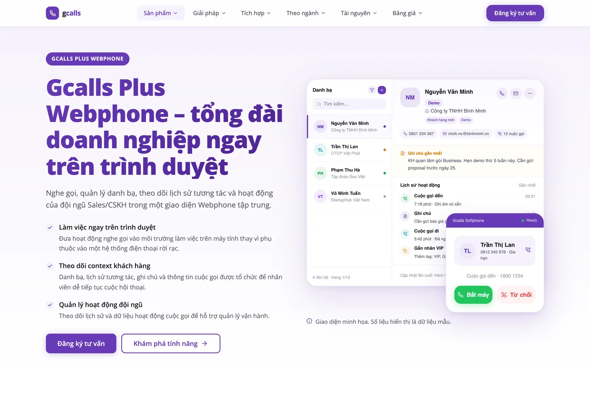

#### Section 03 — Gcalls Plus Webphone là gì?

> ĐỊNH NGHĨA Gcalls Plus Webphone là gì?
> Gcalls Plus Webphone là phần mềm tổng đài Webphone hoạt động trực tiếp trên trình duyệt, giúp đội Sales và Chăm sóc khách hàng thực hiện cuộc gọi, quản lý danh bạ, theo dõi lịch sử tương tác, ghi chú và hoạt động cuộc gọi trên một giao diện tập trung.
> Giải pháp phù hợp với các đội ngũ cần triển khai kênh nghe gọi chuyên nghiệp nhưng muốn giữ quy trình vận hành đơn giản.

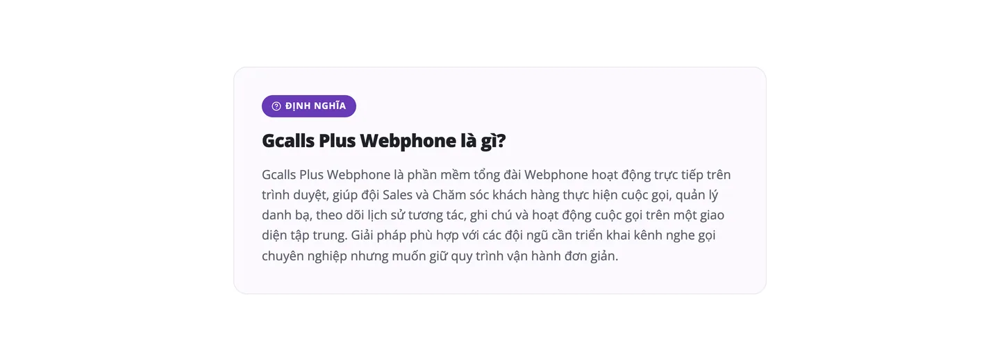

#### Section 04 — Một đội ngũ nhỏ cũng cần quy trình nghe gọi chuyên nghiệp

> BÀI TOÁN Một đội ngũ nhỏ cũng cần quy trình nghe gọi chuyên nghiệp Khi dữ liệu cuộc gọi, ghi chú và lịch sử khách hàng nằm rải rác, ngay cả một đội Sales hoặc CSKH nhỏ cũng có thể mất nhiều thời gian để theo dõi và tiếp tục từng cuộc hội thoại.
> 01 Thông tin cuộc gọi nằm rời rạc Nhân viên gọi điện nhưng lịch sử trao đổi, ghi chú và thông tin khách hàng không nằm trong cùng một luồng làm việc.
> 02 Khó theo dõi những gì đã trao đổi Khi khách hàng quay lại, nhân viên cần biết ai đã liên hệ, trao đổi nội dung gì và bước tiếp theo là gì.
> 03 Quản lý khó nhìn thấy hoạt động của đội ngũ Không có dữ liệu tập trung khiến việc theo dõi lượng cuộc gọi và hoạt động của nhân viên trở nên khó khăn hơn.
> 04 Giải pháp quá phức tạp so với nhu cầu thực tế SME có thể chỉ cần một hệ thống nghe gọi gọn nhẹ thay vì bắt đầu bằng một Contact Center với quá nhiều lớp vận hành.

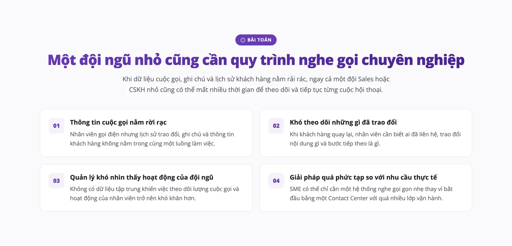

#### Section 05 — Webphone đưa chức năng tổng đài vào trình duyệt

> GCALLS PLUS WEBPHONE Webphone đưa chức năng tổng đài vào trình duyệt Gcalls Plus tập trung các chức năng nghe gọi và quản lý tương tác vào giao diện Webphone để nhân viên có thể xử lý công việc trên máy tính.
> Hoạt động trực tiếp trên trình duyệt Tập trung vào hoạt động nghe gọi và quản lý tương tác Gọn nhẹ hơn so với một Contact Center đa kênh đầy đủ Phù hợp với đội Sales và Chăm sóc khách hàng Gcalls Webphone — Dashboard SIP: Kết nối Cuộc gọi hôm nay 84 +12% Tỷ lệ nghe máy 73% +4% Thời gian TB 5:24 -0:18 Đã chốt deal 11 +3 Lịch sử cuộc gọi Tìm kiếm Nguyễn Văn Minh Khách hàng mới 0901 234 567 3:42 09:14 Trần Thị Lan Gia hạn 0912 345 678 7:18 09:31 Lê Hoàng Phúc 0888 901 234 — 09:52 Phạm Thu Hà Demo 0976 543 210 12:05 10:08 Võ Minh Tuấn Upsell 0933 210 987 5:20 10:45 Đội ngũ H Hằng N.
> Đang gọi · 04:12 T Tuấn V.
> Đang gọi · 01:48 L Linh P.
> Sẵn sàng D Dương M.
> Giải lao Giao diện minh họa.
> Số liệu hiển thị là dữ liệu mẫu.

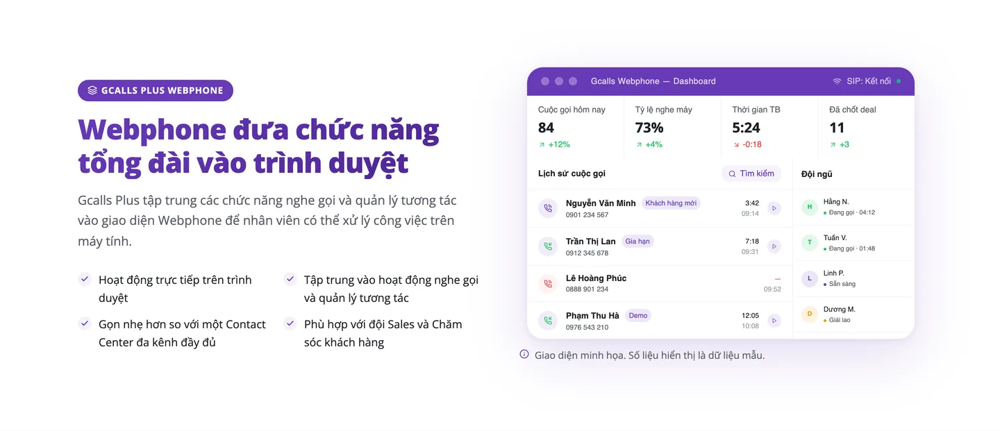

#### Section 06 — Các chức năng cần thiết cho hoạt động nghe gọi hằng ngày

> NĂNG LỰC CỐT LÕI Các chức năng cần thiết cho hoạt động nghe gọi hằng ngày 01 Webphone Thực hiện và tiếp nhận cuộc gọi trực tiếp từ giao diện làm việc trên trình duyệt.
> 02 IVR & Call Flow Thiết lập lời chào và luồng xử lý cuộc gọi phù hợp với cách doanh nghiệp tổ chức tiếp nhận khách hàng.
> 03 Quản lý danh bạ Quản lý thông tin liên hệ phục vụ hoạt động Sales hoặc Chăm sóc khách hàng.
> 04 Lịch sử tương tác Theo dõi lịch sử tương tác để nhân viên có thêm context khi tiếp tục làm việc với khách hàng.
> 05 Ghi chú & Follow-up Ghi lại thông tin liên quan đến cuộc gọi và hỗ trợ nhân viên tiếp tục xử lý ở bước tiếp theo.
> 06 Phân loại cuộc gọi Phân loại cuộc gọi theo nội dung hoặc mục đích để thuận tiện cho quản lý và báo cáo.

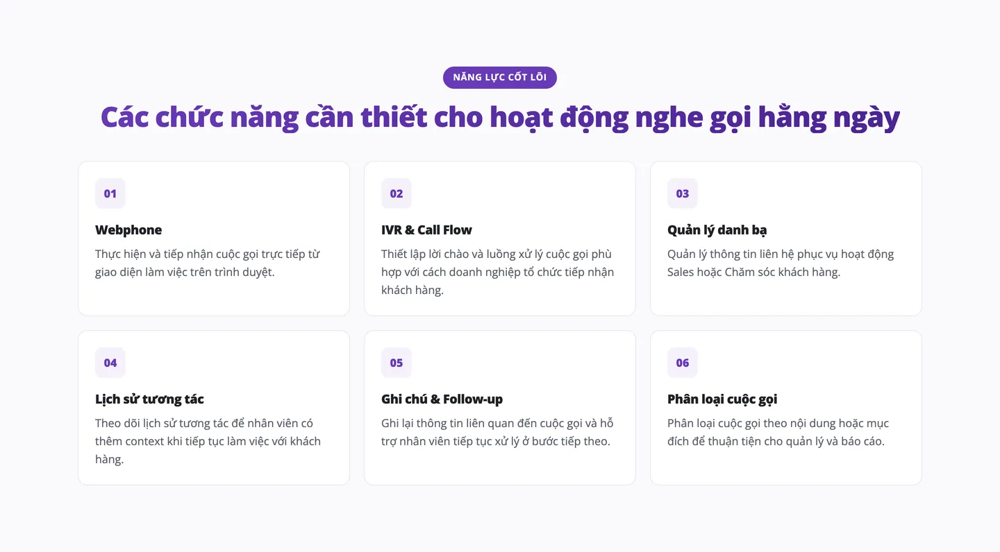

#### Section 07 — Theo dõi hành trình tương tác thay vì chỉ nhìn từng cuộc gọi riêng lẻ

> LỊCH SỬ TƯƠNG TÁC Theo dõi hành trình tương tác thay vì chỉ nhìn từng cuộc gọi riêng lẻ Lịch sử tương tác giúp nhân viên xem lại những lần liên hệ trước, nội dung đã ghi chú và các hoạt động liên quan trước khi tiếp tục xử lý khách hàng.
> Lịch sử cuộc gọi Thời gian tương tác Ghi chú Phân loại Hoạt động liên quan Timeline Cuộc gọi Tìm kiếm...
> Tất cả Đến Đi Nhỡ1 Hotline: 1900 1234 1900 5678 Nguyễn Văn Minh Khách hàng mới 0901 234 567 1900 1234 3:42 09:14 Trần Thị Lan Gia hạn 0912 345 678 1900 5678 Cần gửi báo giá gia hạn trước 15h 7:18 09:31 Lê Hoàng Phúc 0888 901 234 1900 1234 — 09:52 Phạm Thu Hà Demo 0976 543 210 1900 5678 12:05 10:08 Võ Minh Tuấn Upsell 0933 210 987 1900 1234 5:20 10:45 Trần Thị Lan7:18 3:09 Gia hạn Cần gửi báo giá gia hạn trước 15h Giao diện minh họa.
> Số liệu hiển thị là dữ liệu mẫu.

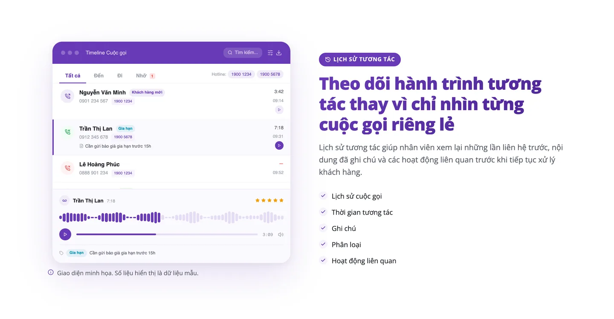

#### Section 08 — Hiểu khách hàng trước khi tiếp tục cuộc hội thoại

> CUSTOMER CONTEXT Hiểu khách hàng trước khi tiếp tục cuộc hội thoại Khi thông tin liên hệ, lịch sử cuộc gọi và ghi chú được tập trung trong cùng một giao diện, nhân viên có thể nhanh chóng xem lại những gì đã diễn ra trước khi tiếp tục trao đổi với khách hàng.
> Thông tin liên hệ Lịch sử cuộc gọi Ghi chú Danh bạ NM Nguyễn Văn Minh Công ty TNHH Bình Minh TL Trần Thị Lan CTCP Việt Phát PH Phạm Thu Hà Tập đoàn Sao Việt VT Võ Minh Tuấn StartupHub Việt Nam 4 liên hệ · trang 1/12 NM Nguyễn Văn Minh Demo Công ty TNHH Bình Minh Khách hàng mới Demo 0901 234 567 minh.nv@binhminh.vn 12 cuộc gọi Ghi chú gần nhất KH quan tâm gói Business.
> Hẹn demo thứ 5 tuần này.
> Cần gửi proposal trước ngày 25.
> Lịch sử hoạt động Gần nhất Cuộc gọi đến 09:31 7:18 phút · Ghi âm có sẵn Ghi chú 09:35 Cần gửi báo giá gia hạn trước 15h hôm nay Cuộc gọi đi Hôm qua 3:42 phút · Đã nghe máy Gắn nhãn VIP 2 ngày trước Thêm tag: VIP, Gia hạn Cập nhật lần cuối: Hôm nay 09:14 Xem đầy đủ SIP: Online HD 0901 234 Ext: 101 · Hotline: 1900 1234 1 2 3 4 5 6 7 8 9 * 0 # Gọi GỌI NHANH NH Nguyễn Hằng Ext 101 TT Trần M.
> Tuấn Ext 102 Giao diện minh họa.
> Số liệu hiển thị là dữ liệu mẫu.

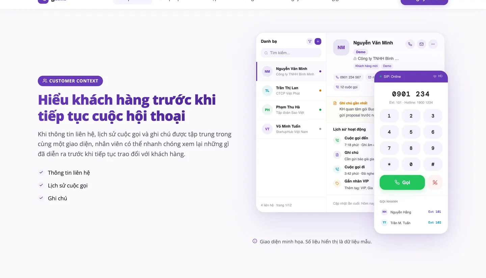

#### Section 09 — Từ cuộc gọi đến bước follow-up tiếp theo

> QUY TRÌNH Từ cuộc gọi đến bước follow-up tiếp theo 01 Tiếp nhận hoặc thực hiện cuộc gọi Nhân viên xử lý cuộc gọi trên Webphone.
> 02 Xem context liên hệ Thông tin khách hàng và lịch sử tương tác hỗ trợ nhân viên hiểu bối cảnh trước khi trao đổi.
> 03 Ghi lại nội dung quan trọng Nhân viên thêm ghi chú, phân loại hoặc thông tin cần follow-up.
> 04 Theo dõi lịch sử Hoạt động được lưu trong lịch sử để đội ngũ có thể tiếp tục xử lý ở lần tương tác tiếp theo.

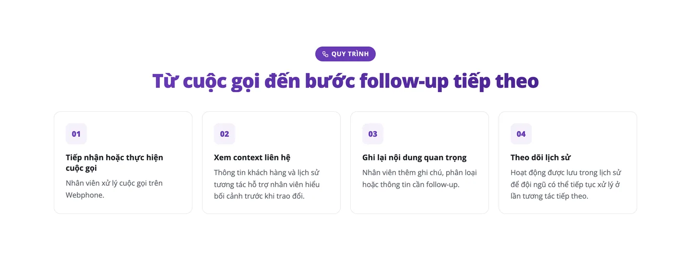

#### Section 10 — Theo dõi hoạt động cuộc gọi của đội ngũ từ dữ liệu tập trung

> QUẢN LÝ HOẠT ĐỘNG Theo dõi hoạt động cuộc gọi của đội ngũ từ dữ liệu tập trung Lịch sử và dữ liệu hoạt động cuộc gọi giúp người quản lý có thêm cơ sở để theo dõi cách đội Sales/CSKH đang vận hành thay vì chỉ dựa vào báo cáo thủ công từ từng nhân viên.
> Lịch sử cuộc gọi của đội ngũ Dữ liệu hoạt động tập trung Trạng thái Agent trong quá trình vận hành Analytics Dashboard Ngày Tuần Tháng Tổng cuộc gọi 675 Bắt máy 638 Cuộc gọi nhỡ 37 TB thời lượng 3:25 Cuộc gọi theo ngày Đi Đến Nhỡ T2 T3 T4 T5 T6 T7 CN Hiệu suất nhân viên Xem tất cả → NHÂN VIÊN ĐI ĐẾN NHỠ BẮT MÁY TB NH Nguyễn Hằng 38 29 2 97% 3:52 TT Trần M.
> Tuấn 31 22 4 92% 4:10 LL Lê P.
> Linh 44 35 1 98% 3:18 PD Phạm Đ.
> Dương 19 14 6 86% 5:04 Trạng thái đội ngũ · Realtime 2 đang gọi 2 sẵn sàng 6 Tất cả 2 Sẵn sàng 2 Đang gọi 1 Vắng mặt 1 Ngoại tuyến NH Nguyễn Hằng Sẵn sàng · Hà Nội 12 cuộc gọi TT Trần M.
> Tuấn Đang gọi · TP.HCM 01:24 thời gian LL Lê P.
> Linh Sẵn sàng · Đà Nẵng 17 cuộc gọi PD Phạm Đ.
> Dương Vắng mặt · Remote 5 cuộc gọi VT Võ Thị Thanh Đang gọi · TP.HCM 02:58 thời gian DH Đỗ Quang Hải Ngoại tuyến · Hải Phòng 0 cuộc gọi Activity Log Xem tất cả → 10:48 Nguyễn Hằng Chuyển sang Sẵn sàng 10:45 Trần M.
> Tuấn Bắt đầu cuộc gọi · 0912 345 678 10:40 Võ Thị Thanh Bắt đầu cuộc gọi · 0976 543 210 Giao diện minh họa.
> Các chỉ số, tên Agent và số liệu hiển thị là dữ liệu mẫu, không phải kết quả vận hành của Gcalls.

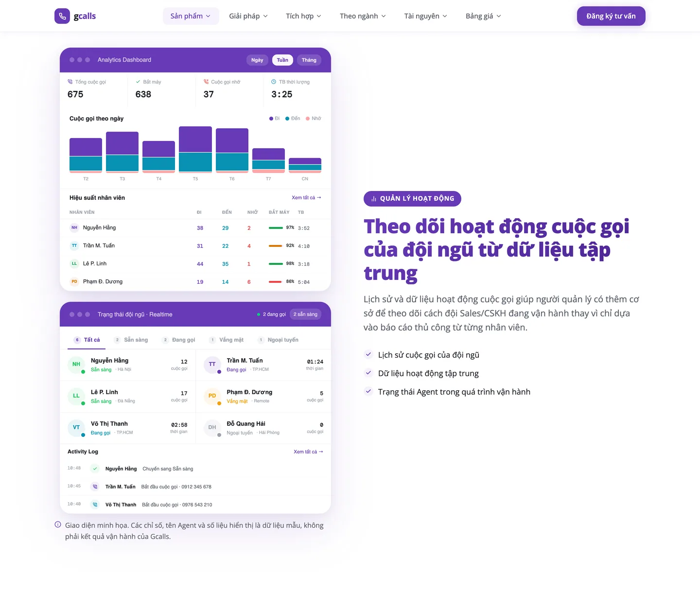

#### Section 11 — Mở rộng Gcalls Plus vào quy trình CRM khi doanh nghiệp cần

> KẾT NỐI HỆ THỐNG Mở rộng Gcalls Plus vào quy trình CRM khi doanh nghiệp cần Khi quy trình Sales hoặc CSKH đã vận hành trên CRM, Gcalls có thể mở rộng từ Webphone sang mô hình tích hợp sâu hơn để hoạt động cuộc gọi gắn với dữ liệu và workflow hiện có của doanh nghiệp.
> Khám phá Tổng đài tích hợp CRM API Management v1.4.2 · Live sk-gc-••••••••••••••••4f2a Copy 2.4k req/h Endpoints Base URL: api.gcalls.vn GET /v1/calls Lấy danh sách cuộc gọi POST /v1/calls/outbound Khởi tạo cuộc gọi đi GET /v1/contacts/:id Chi tiết khách hàng PUT /v1/contacts/:id Cập nhật thông tin KH POST /v1/webhooks Đăng ký webhook event RESPONSE · 200 OK · 48ms JSON { "id": "call_8f3kd9", "contact": "Nguyễn Văn Minh", "phone": "0901234567", "status": "answered", "duration": 222, "recording_url": "https://..." } yourwebsite.vn/pricing Giao diện minh họa.
> Số liệu hiển thị là dữ liệu mẫu.

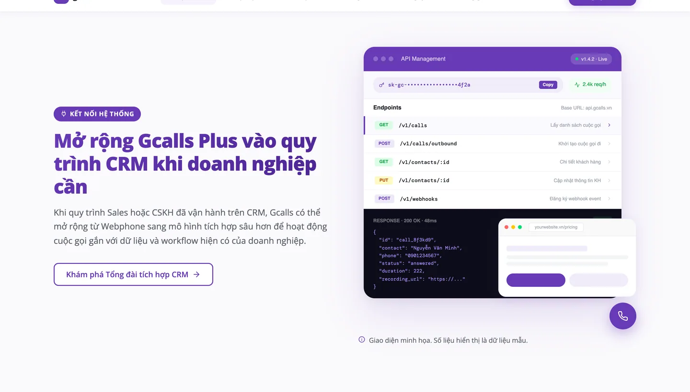

#### Section 12 — Gcalls Plus phù hợp với những đội ngũ nào?

> TÌNH HUỐNG SỬ DỤNG Gcalls Plus phù hợp với những đội ngũ nào?
> Sales Quản lý hoạt động gọi lead, lịch sử liên hệ, ghi chú và follow-up trong một luồng làm việc gọn hơn.
> Chăm sóc khách hàng Tiếp nhận cuộc gọi và xem lại lịch sử tương tác trước khi hỗ trợ khách hàng.
> Giáo dục Phù hợp với đội tư vấn tuyển sinh và chăm sóc học viên cần xử lý lượng liên hệ thường xuyên.
> Giải pháp cho ngành Giáo dục Dịch vụ Phù hợp với các doanh nghiệp dịch vụ cần hotline và hệ thống quản lý hoạt động gọi tập trung.
> Thương mại điện tử Hỗ trợ đội bán hàng hoặc CSKH xử lý cuộc gọi liên quan tới tư vấn, đơn hàng và chăm sóc sau bán.
> Giải pháp cho ngành Thương mại điện tử

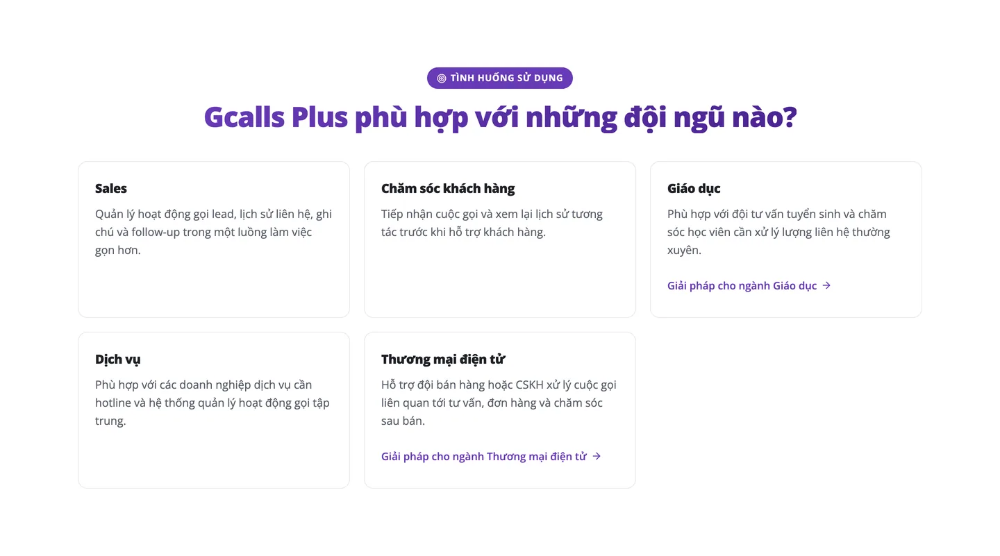

#### Section 13 — Phù hợp khi doanh nghiệp cần sự gọn nhẹ trước khi cần một Contact Center phức tạp

> PHẠM VI PHÙ HỢP Phù hợp khi doanh nghiệp cần sự gọn nhẹ trước khi cần một Contact Center phức tạp PHÙ HỢP VỚI GCALLS PLUS SME / Startup Sales team Customer Service team Đội ngũ quy mô nhỏ và vừa Doanh nghiệp cần quản lý cuộc gọi tập trung KHI NHU CẦU MỞ RỘNG CRM workflow sâu hơn Tổng đài tích hợp CRM Giao tiếp đa kênh Gcalls CX Kiểm soát chất lượng hội thoại bằng AI QA QC Center Liên lạc quốc tế International Calling

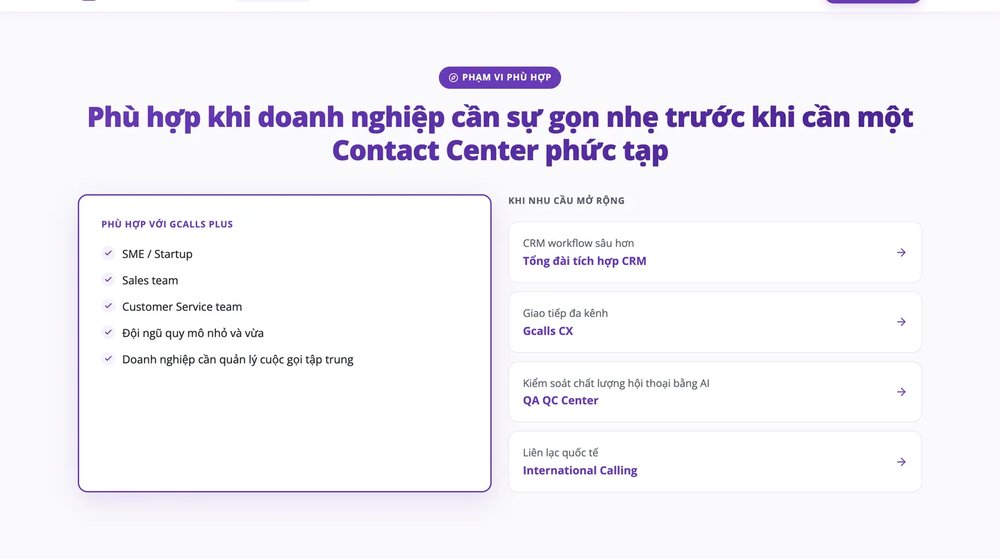

#### Section 14 — Triển khai theo nhu cầu vận hành thực tế

> TRIỂN KHAI Triển khai theo nhu cầu vận hành thực tế Gcalls Plus được thiết kế theo mô hình Webphone để giảm độ phức tạp khi triển khai cho đội ngũ cần một hệ thống nghe gọi tập trung.
> Thời gian triển khai thực tế phụ thuộc vào cấu hình hotline, call flow, số lượng người dùng và yêu cầu tích hợp của doanh nghiệp.
> 01 Khảo sát nhu cầu 02 Xác định hotline và người dùng 03 Thiết lập call flow 04 Kiểm thử 05 Hướng dẫn sử dụng 06 Vận hành

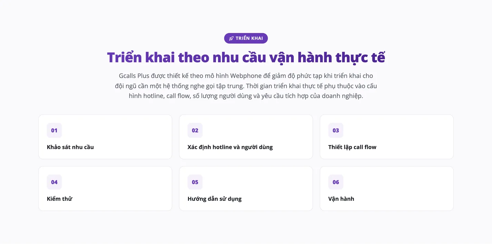

#### Section 15 — Chi phí phụ thuộc vào cấu hình đội ngũ và nhu cầu sử dụng

> CẤU HÌNH & CHI PHÍ Chi phí phụ thuộc vào cấu hình đội ngũ và nhu cầu sử dụng Quy mô người dùng, hotline, lưu lượng gọi và yêu cầu tích hợp có thể ảnh hưởng đến cấu hình giải pháp.
> Sử dụng công cụ ước tính để mô tả nhu cầu trước khi nhận tư vấn. Ước tính cấu hình & chi phí Xem bảng giá Gcalls Chi phí phụ thuộc cấu hình.

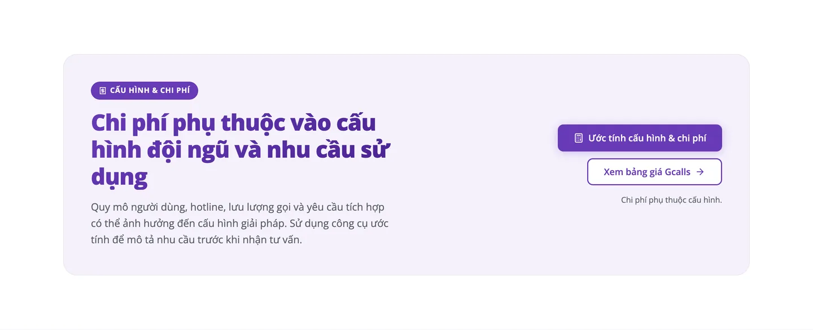

#### Section 16 — Đồng hành cùng nhiều mô hình doanh nghiệp khác nhau

> KHÁCH HÀNG Đồng hành cùng nhiều mô hình doanh nghiệp khác nhau Nội dung khách hàng đang được cập nhật Câu chuyện khách hàng sẽ được bổ sung khi có thông tin được duyệt công bố.
> Đọc bài viết trên Blog Gcalls

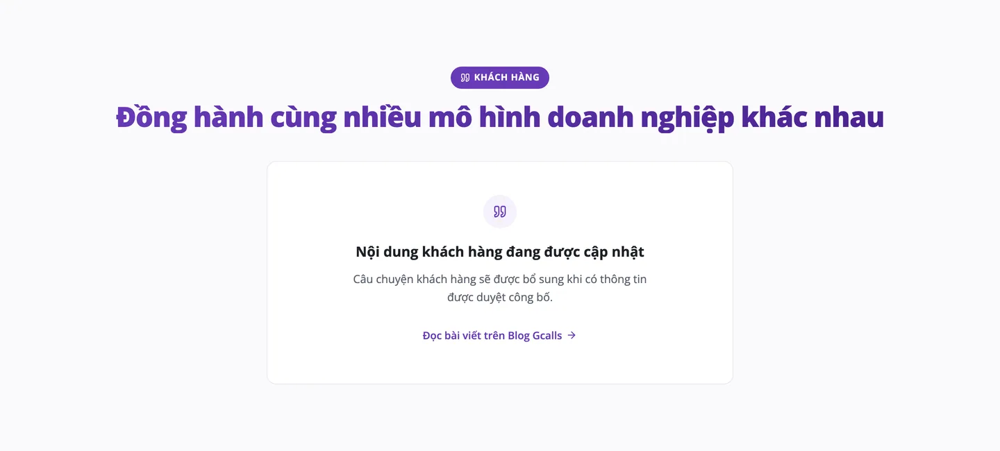

#### Section 17 — Câu hỏi thường gặp về Gcalls Plus Webphone

> CÂU HỎI THƯỜNG GẶP Câu hỏi thường gặp về Gcalls Plus Webphone Gcalls Plus Webphone là gì?
> Gcalls Plus Webphone là giải pháp tổng đài hoạt động trên trình duyệt giúp doanh nghiệp thực hiện cuộc gọi và quản lý các thông tin liên quan đến hoạt động tương tác trong một giao diện tập trung.
> Gcalls Plus có cần điện thoại bàn không?
> Gcalls Plus có lưu lịch sử cuộc gọi không?
> Gcalls Plus có tích hợp CRM không?
> Gcalls Plus phù hợp với ai?
> Tôi có thể biết chi phí trước khi tư vấn không?

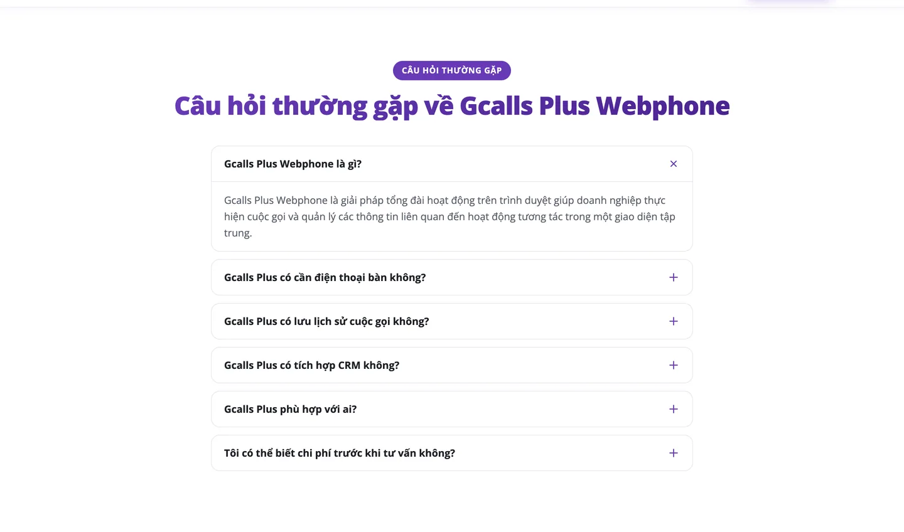

#### Section 18 — Bắt đầu với một hệ thống nghe gọi phù hợp với cách đội ngũ của bạn đang làm việc

> GCALLS PLUS WEBPHONE Bắt đầu với một hệ thống nghe gọi phù hợp với cách đội ngũ của bạn đang làm việc Chia sẻ quy mô Sales/CSKH, số hotline và quy trình hiện tại để Gcalls tư vấn cấu hình Webphone phù hợp.
> Đăng ký tư vấn Ước tính cấu hình 028 7302 5469

---

## QA/QC Center (QC Bot AI)

- **Đường dẫn:** `/qc-bot-ai/`
- **Nhóm:** Sản phẩm
- **Số section:** 19

📄 Ảnh toàn trang (full-page)

### Các section

#### Section 01

> Trang chủ Sản phẩm QA QC Center

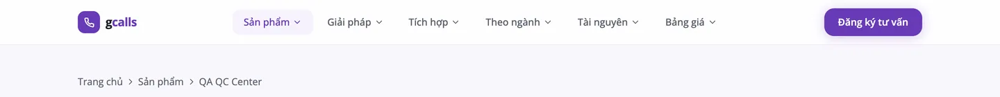

#### Section 02 — QA QC Center – AI hỗ trợ kiểm soát chất lượng cuộc gọi

> QA QC CENTER • POWERED BY QC BOT AI QA QC Center – AI hỗ trợ kiểm soát chất lượng cuộc gọi Chuyển nội dung cuộc gọi thành dữ liệu có cấu trúc, áp dụng tiêu chí QA và làm nổi bật những tín hiệu cần kiểm tra để đội quản lý tập trung vào các hội thoại quan trọng.
> Chuyển hội thoại thành dữ liệu Speech-to-Text giúp đội QA đọc, tìm kiếm và xem lại nội dung cuộc gọi thuận tiện hơn.
> Chuẩn hóa tiêu chí đánh giá Áp dụng bộ tiêu chí và trọng số QA được cấu hình để hỗ trợ quá trình chấm điểm nhất quán hơn. Ưu tiên cuộc gọi cần xem lại Từ khóa, tín hiệu cảm xúc và kết quả phân tích giúp đội QA xác định những hội thoại cần chú ý.
> Yêu cầu demo QA QC Center Khám phá cách hoạt động Conversation Review TRANSCRIPT AGENT Dạ em nghe, em hỗ trợ mình ạ.
> KHÁCH HÀNG Tôi gọi lần thứ hai rồi.
> AGENT Em xin lỗi, em kiểm tra ngay ạ.
> TIÊU CHÍ QA Chào hỏi Kịch bản Xử lý phản hồi ĐIỂM ĐỀ XUẤT 78 Chờ QA xác nhận Giao diện minh họa.
> Số liệu hiển thị là dữ liệu mẫu.

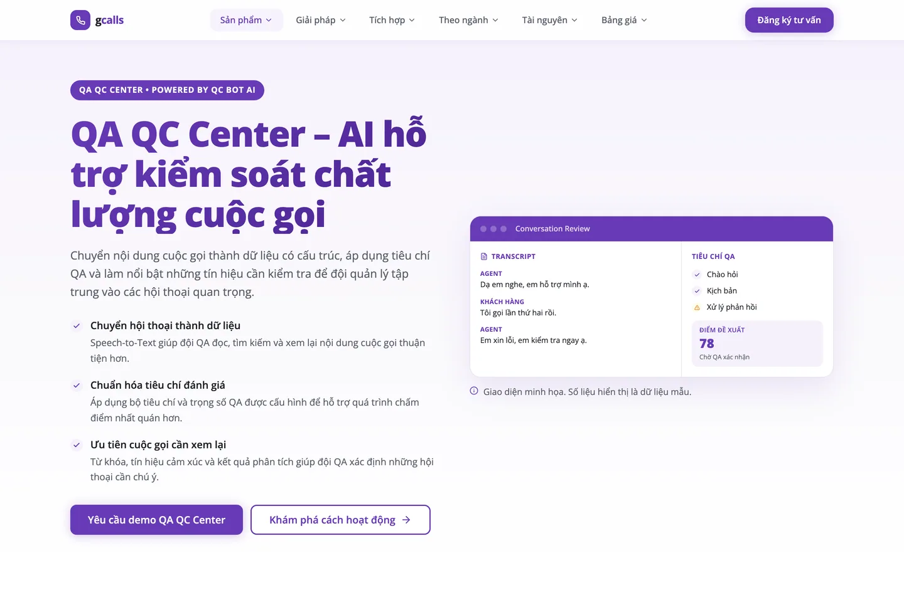

#### Section 03 — QA QC Center là gì?

> ĐỊNH NGHĨA QA QC Center là gì?
> QA QC Center sử dụng năng lực QC Bot AI để chuyển nội dung cuộc gọi thành transcript, đánh giá theo các tiêu chí QA được cấu hình và làm nổi bật những tín hiệu cần kiểm tra như từ khóa, cảm xúc hoặc mức độ tuân thủ.
> Giải pháp giúp đội QA và quản lý tập trung vào các hội thoại cần được xem xét thay vì phụ thuộc hoàn toàn vào việc nghe lại thủ công.

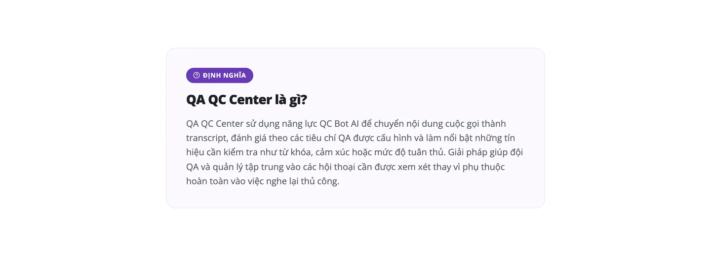

#### Section 04 — Khi số lượng cuộc gọi tăng, nghe lại thủ công không còn đủ để kiểm soát chất lượng

> BÀI TOÁN QA Khi số lượng cuộc gọi tăng, nghe lại thủ công không còn đủ để kiểm soát chất lượng Đội QA thường phải chọn một phần nhỏ cuộc gọi để nghe lại, trong khi những cuộc hội thoại còn lại vẫn có thể chứa vấn đề về quy trình, trải nghiệm khách hàng hoặc cách nhân viên xử lý tình huống.
> 01 Khó xem xét toàn bộ khối lượng hội thoại Số lượng cuộc gọi lớn khiến đội QA phải ưu tiên mẫu kiểm tra thay vì có góc nhìn có cấu trúc trên toàn bộ dữ liệu được đưa vào hệ thống.
> 02 Chấm điểm dễ phụ thuộc vào cách đánh giá của từng người Nếu tiêu chí và trọng số chưa được chuẩn hóa, kết quả đánh giá giữa các QA có thể thiếu nhất quán.
> 03 Tốn thời gian tìm cuộc gọi có vấn đề QA phải nghe lại nhiều cuộc gọi để xác định những hội thoại có từ khóa, nội dung hoặc dấu hiệu cần được kiểm tra.
> 04 Dữ liệu QA khó tổng hợp thành xu hướng Khi đánh giá nằm ở nhiều file hoặc thao tác thủ công, người quản lý khó nhìn thấy xu hướng chất lượng theo đội ngũ và thời gian.

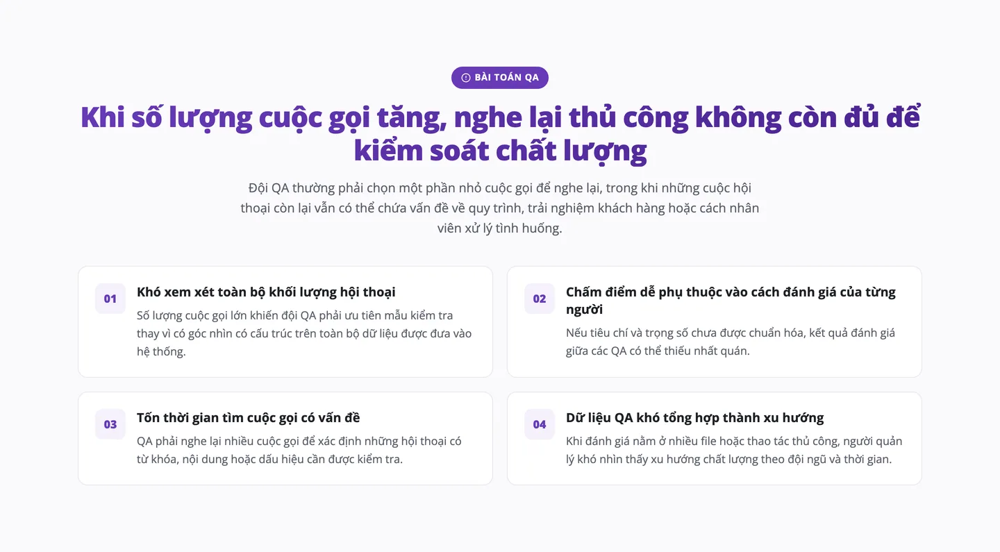

#### Section 05 — Biến cuộc gọi thành dữ liệu có thể tìm kiếm, đánh giá và xem lại

> QC BOT AI Biến cuộc gọi thành dữ liệu có thể tìm kiếm, đánh giá và xem lại QA QC Center kết hợp dữ liệu hội thoại với bộ tiêu chí đánh giá để hỗ trợ đội QA theo dõi chất lượng cuộc gọi theo một quy trình có cấu trúc hơn.
> Là phần mềm QA cuộc gọi, QA QC Center tập hợp bảy thành phần dưới đây thành một quy trình kiểm soát chất lượng duy nhất.
> Transcript QA criteria Scoring Keyword signals Sentiment signals Conversation review Quality dashboard Transcript · Cuộc gọi #A-1042 Tìm trong transcript…
> Demo 00:04 AGENT Dạ em nghe, em có thể hỗ trợ mình thông tin gì ạ?
> 00:11 KHÁCH HÀNG Tôi gọi lần thứ hai rồi mà vẫn chưa được xử lý.
> Từ khóa: lặp lại liên hệ 00:19 AGENT Em xin lỗi vì sự bất tiện này, em kiểm tra ngay giúp mình ạ.
> 00:31 KHÁCH HÀNG Vậy bao lâu thì tôi nhận được phản hồi?
> Giao diện minh họa.
> Số liệu hiển thị là dữ liệu mẫu.

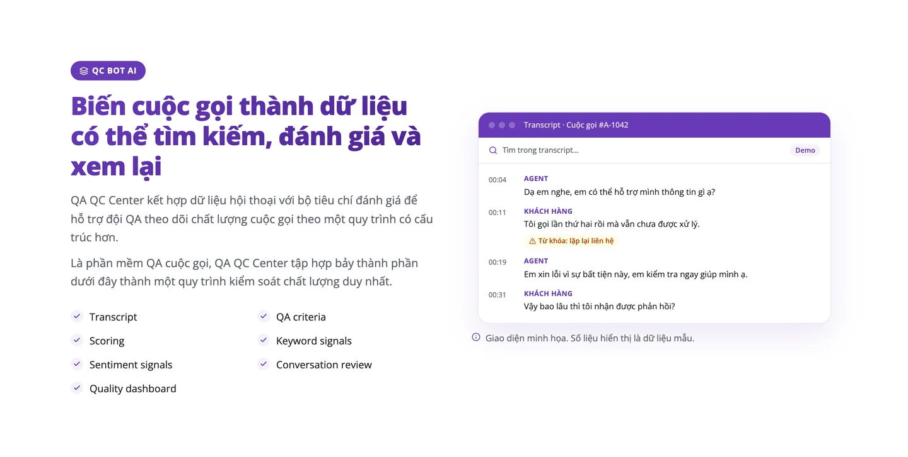

#### Section 06 — Từ bản ghi cuộc gọi đến phiên đánh giá QA

> CÁCH HOẠT ĐỘNG Từ bản ghi cuộc gọi đến phiên đánh giá QA 01 Tiếp nhận dữ liệu cuộc gọi Cuộc gọi được đưa vào luồng phân tích theo cấu hình của hệ thống.
> 02 Chuyển giọng nói thành văn bản Speech-to-Text tạo transcript để nội dung hội thoại có thể được đọc và xử lý dưới dạng dữ liệu.
> 03 Áp dụng tiêu chí QA Hệ thống sử dụng bộ tiêu chí và trọng số được cấu hình để hỗ trợ đánh giá nội dung cuộc gọi.
> 04 Phát hiện tín hiệu cần chú ý Từ khóa, tín hiệu cảm xúc và các điều kiện đánh giá giúp làm nổi bật những cuộc gọi cần được xem xét.
> 05 QA xem lại và phân tích Đội QA sử dụng transcript, scoring và context của cuộc gọi để kiểm tra, xác nhận và tiếp tục quá trình coaching hoặc cải thiện vận hành.

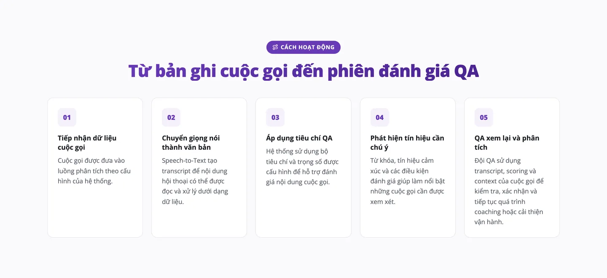

#### Section 07 — Các năng lực cốt lõi hỗ trợ đội QA

> NĂNG LỰC AI Các năng lực cốt lõi hỗ trợ đội QA 01 Speech-to-Text Chuyển nội dung hội thoại thành transcript để hỗ trợ tìm kiếm, đọc và xem lại cuộc gọi.
> 02 QA Criteria Thiết lập các tiêu chí đánh giá phù hợp với quy trình chất lượng của doanh nghiệp.
> 03 AI-assisted Scoring Hỗ trợ chấm điểm trên dữ liệu đã được phân tích dựa trên bộ tiêu chí và trọng số được cấu hình.
> 04 Keyword Analysis Phát hiện các từ khóa hoặc cụm nội dung cần được đội QA chú ý.
> 05 Sentiment Signals Làm nổi bật tín hiệu cảm xúc trong hội thoại để hỗ trợ quá trình xem xét.
> 06 Conversation Review Tập trung transcript, kết quả đánh giá và các tín hiệu liên quan để QA xem lại cuộc gọi hiệu quả hơn.
> 07 Quality Dashboard Tổng hợp dữ liệu đánh giá để người quản lý theo dõi chất lượng và xu hướng vận hành.

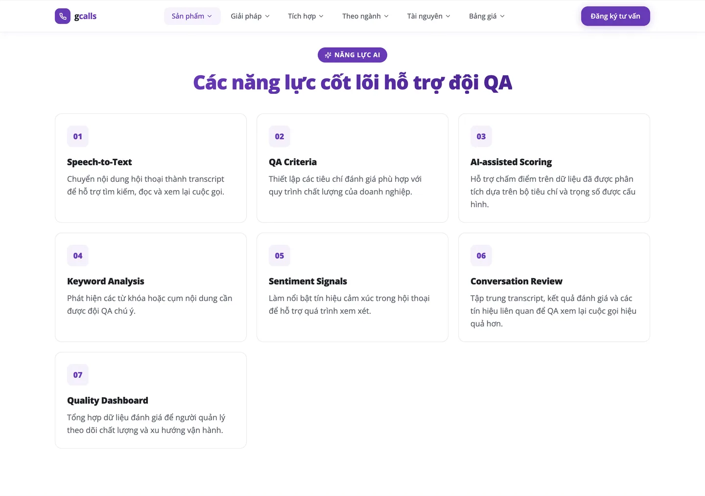

#### Section 08 — Chuẩn hóa chấm điểm cuộc gọi theo tiêu chí rõ ràng

> QA SCORING Chuẩn hóa chấm điểm cuộc gọi theo tiêu chí rõ ràng Thay vì chỉ dựa vào cảm nhận khi nghe lại, doanh nghiệp có thể cấu hình bộ tiêu chí và trọng số để tạo một khung đánh giá nhất quán hơn.
> Thiết lập tiêu chí QA Gán trọng số theo mức độ quan trọng Hỗ trợ scoring trên dữ liệu được phân tích Đưa cuộc gọi cần chú ý vào luồng review Cho phép QA xem lại context trước khi kết luận QA Scoring ĐIỂM ĐỀ XUẤT Chờ QA xác nhận 78 Chào hỏi & xác minh 20% Tuân thủ kịch bản 30% Xử lý phản hồi 30% Kết thúc cuộc gọi 20% Giao diện minh họa.
> Tiêu chí, trọng số và điểm hiển thị là dữ liệu mẫu, không phải kết quả đánh giá thực tế.

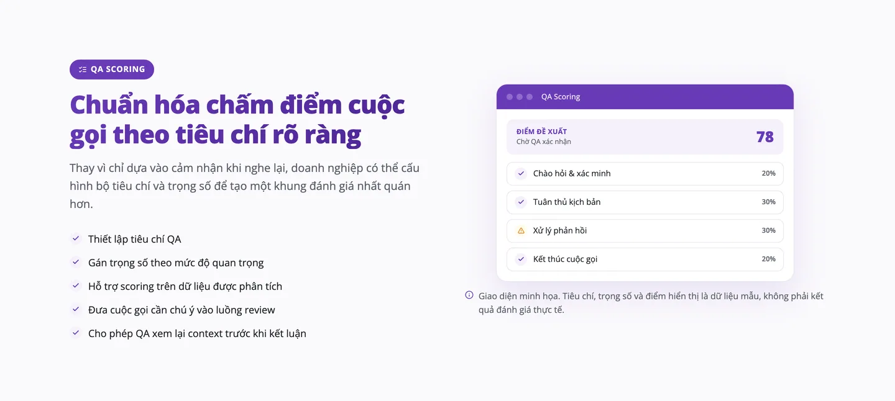

#### Section 09 — Nhận diện từ khóa và tín hiệu hội thoại cần được chú ý

> CONVERSATION SIGNALS Nhận diện từ khóa và tín hiệu hội thoại cần được chú ý Không phải mọi cuộc gọi đều cần mức độ kiểm tra như nhau.
> Các tín hiệu từ nội dung hội thoại có thể giúp đội QA ưu tiên những cuộc gọi cần xem lại trước.
> Tìm từ khóa/cụm nội dung theo cấu hình Làm nổi bật tín hiệu cảm xúc Xác định hội thoại có dấu hiệu bất thường Theo dõi xu hướng thay vì chỉ nhìn từng cuộc gọi riêng lẻ Conversation Signals Cuộc gọi cần xem lại Dữ liệu mẫu #A-1042 Lặp lại liên hệ Tiêu cực #A-1039 Yêu cầu hoàn tiền Tiêu cực #A-1035 Hỏi chính sách Trung tính #A-1028 Xác nhận đơn Tích cực Giao diện minh họa.
> Mã cuộc gọi và tín hiệu hiển thị là dữ liệu mẫu.

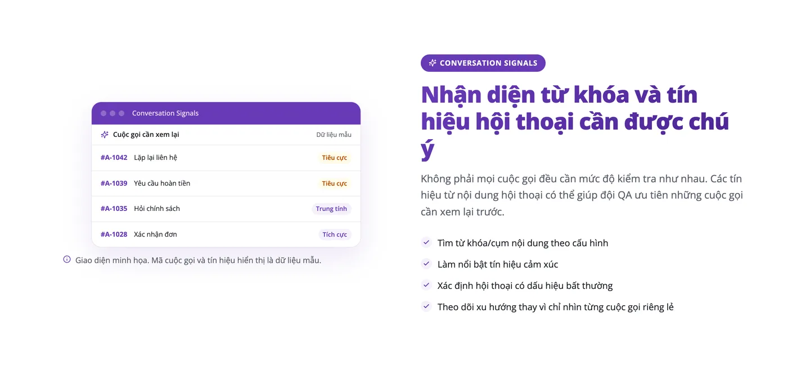

#### Section 10 — AI hỗ trợ sàng lọc dữ liệu, con người vẫn giữ vai trò đánh giá và cải thiện

> AI + HUMAN QA AI hỗ trợ sàng lọc dữ liệu, con người vẫn giữ vai trò đánh giá và cải thiện QA QC Center giúp tự động hóa các bước xử lý dữ liệu và làm nổi bật tín hiệu, nhưng quyết định đánh giá, coaching và thay đổi quy trình vẫn cần được đặt trong bối cảnh vận hành thực tế của doanh nghiệp.
> 01 AI hỗ trợ Phân tích dữ liệu và phát hiện tín hiệu.
> 02 QA xác nhận Xem lại transcript, scoring và context.
> 03 Manager cải thiện Sử dụng dữ liệu để coaching hoặc điều chỉnh quy trình.

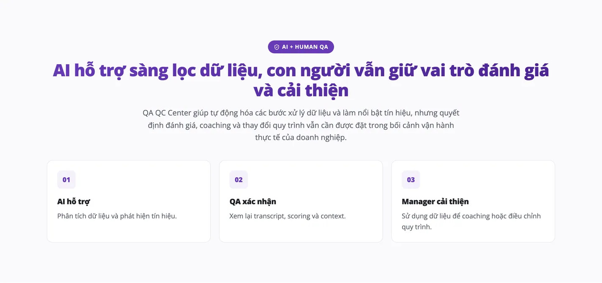

#### Section 11 — Từ từng cuộc gọi đến góc nhìn chất lượng của cả đội ngũ

> QUALITY DASHBOARD Từ từng cuộc gọi đến góc nhìn chất lượng của cả đội ngũ Dashboard tập hợp dữ liệu đánh giá để QA Manager và người vận hành theo dõi các cuộc gọi cần chú ý, kết quả scoring và xu hướng chất lượng theo thời gian.
> Quality Dashboard 1.248 Cuộc gọi đã phân tích 86 Cần xem lại 81 Điểm QA trung bình 34 Phiên review tuần này XU HƯỚNG ĐIỂM QA T2 T3 T4 T5 T6 T7 Giao diện minh họa.
> Toàn bộ chỉ số, điểm số và xu hướng hiển thị là dữ liệu mẫu, không phải kết quả vận hành của khách hàng Gcalls.

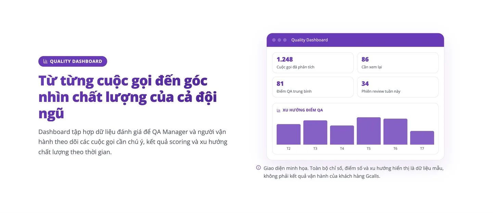

#### Section 12 — Giúp đội QA tập trung thời gian vào việc cần con người xử lý

> GIÁ TRỊ VẬN HÀNH Giúp đội QA tập trung thời gian vào việc cần con người xử lý Giảm thời gian tìm cuộc gọi cần kiểm tra Sử dụng dữ liệu và tín hiệu để ưu tiên review thay vì phải tìm thủ công trong danh sách lớn.
> Chuẩn hóa khung đánh giá Tiêu chí và trọng số được cấu hình giúp đội QA làm việc trên cùng một framework.
> Dễ phát hiện xu hướng Dashboard và dữ liệu có cấu trúc giúp người quản lý theo dõi các mẫu vấn đề lặp lại theo thời gian.
> Hỗ trợ coaching có context Transcript và kết quả review tạo thêm dữ liệu để trao đổi với nhân viên về những tình huống cụ thể.

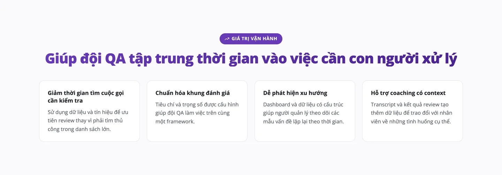

#### Section 13 — QA QC Center phù hợp với những hoạt động nào?

> TÌNH HUỐNG SỬ DỤNG QA QC Center phù hợp với những hoạt động nào?
> Customer Service QA Kiểm tra cách đội CSKH giao tiếp, xử lý tình huống và tuân thủ quy trình dịch vụ.
> Telesales QA Theo dõi nội dung tư vấn, cách trình bày thông tin và những tín hiệu cần coaching trong cuộc gọi bán hàng.
> BPO / Contact Center Hỗ trợ đội QA xử lý lượng lớn dữ liệu hội thoại và ưu tiên những cuộc gọi cần review.
> Giải pháp cho ngành BPO Finance & Insurance Hỗ trợ quy trình QA đối với những cuộc gọi có tiêu chí đánh giá rõ ràng và yêu cầu kiểm tra nội dung hội thoại.
> Tài chính Bảo hiểm

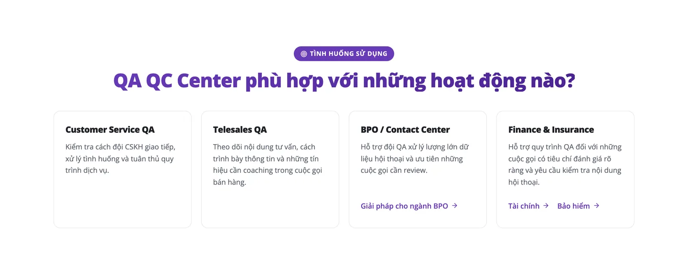

#### Section 14 — Kết nối dữ liệu cuộc gọi với hệ thống vận hành khi cần

> KẾT NỐI DỮ LIỆU Kết nối dữ liệu cuộc gọi với hệ thống vận hành khi cần QA QC Center có thể nằm trong hệ sinh thái giao tiếp Gcalls và được triển khai cùng các giải pháp nghe gọi hoặc tích hợp hệ thống tùy theo kiến trúc của doanh nghiệp.
> Gcalls Plus CRM Integration Gcalls CX

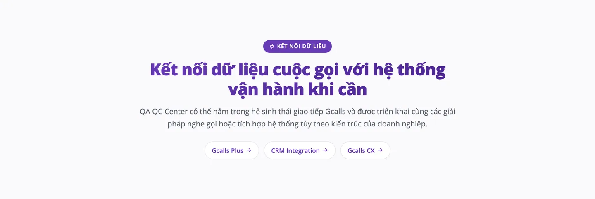

#### Section 15 — Chọn đúng sản phẩm theo bài toán cần giải quyết

> CHỌN SẢN PHẨM Chọn đúng sản phẩm theo bài toán cần giải quyết Nghe gọi trên trình duyệt Gcalls Plus Webphone Quản lý giao tiếp đa kênh Gcalls CX Tích hợp cuộc gọi sâu vào CRM CRM Integration Kiểm soát chất lượng hội thoại QA QC Center TRANG HIỆN TẠI Xem tất cả giải pháp

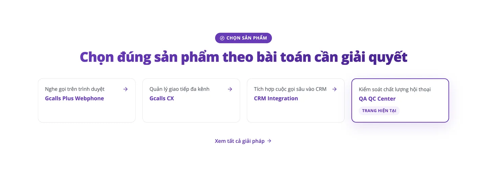

#### Section 16 — Xây dựng quy trình QA dựa trên dữ liệu hội thoại

> QUY TRÌNH QA Xây dựng quy trình QA dựa trên dữ liệu hội thoại Mỗi doanh nghiệp có bộ tiêu chí, quy trình kiểm tra và mục tiêu chất lượng khác nhau.
> QA QC Center cần được cấu hình theo bối cảnh vận hành thực tế trước khi dữ liệu được sử dụng cho đánh giá hoặc coaching.
> Yêu cầu demo theo quy trình QA của doanh nghiệp Đọc bài viết trên Blog Gcalls

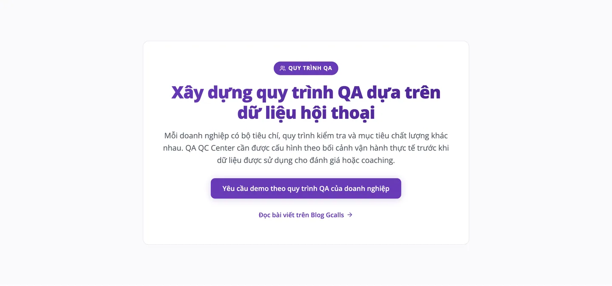

#### Section 17 — Cấu hình QA QC Center theo quy mô và bộ tiêu chí QA

> CẤU HÌNH & CHI PHÍ Cấu hình QA QC Center theo quy mô và bộ tiêu chí QA Cấu hình QA QC Center có thể phụ thuộc vào quy mô đội ngũ, khối lượng hội thoại cần phân tích và bộ tiêu chí QA cần áp dụng. Ước tính cấu hình & chi phí Xem bảng giá Gcalls Chi phí phụ thuộc cấu hình.

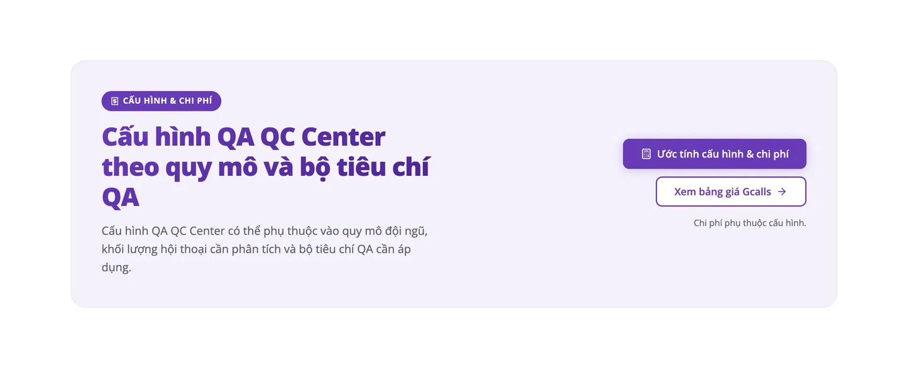

#### Section 18 — Câu hỏi thường gặp về QA QC Center

> CÂU HỎI THƯỜNG GẶP Câu hỏi thường gặp về QA QC Center QA QC Center là gì?
> QA QC Center là giải pháp sử dụng QC Bot AI để chuyển cuộc gọi thành transcript, hỗ trợ đánh giá theo tiêu chí QA và làm nổi bật những tín hiệu cần được đội kiểm soát chất lượng xem xét.
> QC Bot AI có thể tự động chấm điểm cuộc gọi không?
> QC Bot có phân tích từ khóa và cảm xúc không?
> AI có thay thế hoàn toàn nhân viên QA không?
> QA QC Center phù hợp với doanh nghiệp nào?
> QA QC Center có phân tích tất cả cuộc gọi không?

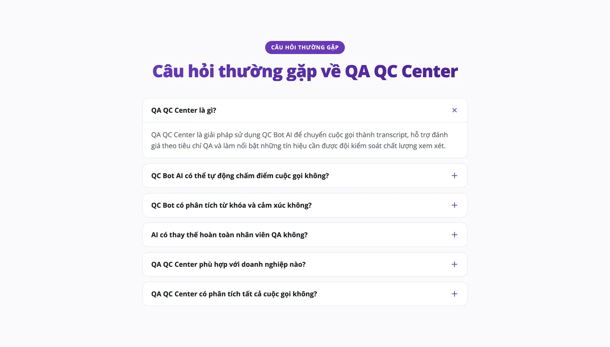

#### Section 19 — Xem QA QC Center hoạt động trên chính bộ tiêu chí của đội ngũ bạn

> QA QC CENTER • POWERED BY QC BOT AI Xem QA QC Center hoạt động trên chính bộ tiêu chí của đội ngũ bạn Chia sẻ quy trình QA, tiêu chí đánh giá và cách đội ngũ đang kiểm tra cuộc gọi để Gcalls tư vấn cấu hình phù hợp.
> Yêu cầu demo QA QC Center Đăng ký tư vấn 028 7302 5469

---

## Gcalls CX

- **Đường dẫn:** `/gcalls-cx/`
- **Nhóm:** Sản phẩm
- **Số section:** 20

📄 Ảnh toàn trang (full-page)

### Các section

#### Section 01

> Trang chủ Sản phẩm Gcalls CX

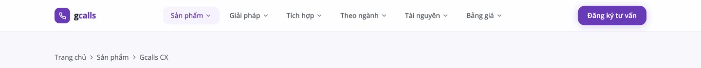

#### Section 02 — Gcalls CX – hợp nhất mọi điểm chạm khách hàng trên một màn hình

> GCALLS CX • OMNICHANNEL CONTACT CENTER Gcalls CX – hợp nhất mọi điểm chạm khách hàng trên một màn hình Tập trung Voice, Zalo, Facebook, SMS, Email và quy trình hỗ trợ khách hàng vào một không gian làm việc để đội CSKH dễ theo dõi hội thoại, ticket và customer context hơn.
> Hợp nhất điểm chạm Đưa các kênh giao tiếp được triển khai vào một không gian làm việc tập trung hơn.
> Quản lý xử lý rõ ràng hơn Tổ chức hội thoại, ticket và trạng thái xử lý để đội ngũ dễ theo dõi công việc đang diễn ra.
> Có thêm context khi chăm sóc khách hàng Kết nối lịch sử tương tác và dữ liệu liên quan để nhân viên hiểu bối cảnh trước khi phản hồi.
> Yêu cầu demo Gcalls CX Khám phá cách Gcalls CX hoạt động Omnichannel Inbox Tất cả Voice Zalo Facebook SMS Email KH #4821 Zalo Đơn của mình khi nào giao?
> Chờ xử lý KH #4817 Voice Cuộc gọi đến · 2:14 Đang xử lý KH #4813 Facebook Shop còn size M không ạ?
> Đang xử lý KH #4809 Email Yêu cầu xuất hóa đơn Đã xong KH #4804 SMS Xác nhận lịch hẹn Đã xong Giao diện minh họa.
> Số liệu hiển thị là dữ liệu mẫu.

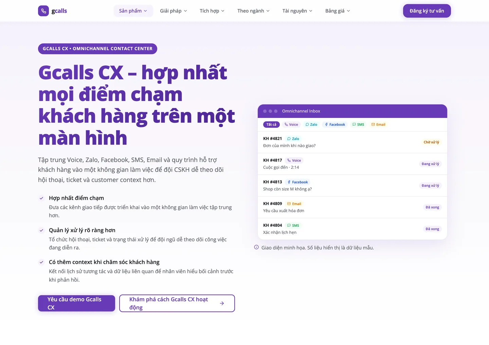

#### Section 03 — Gcalls CX là gì?

> ĐỊNH NGHĨA Gcalls CX là gì?
> Gcalls CX là giải pháp Contact Center đa kênh giúp doanh nghiệp tập trung các điểm chạm như Voice, Zalo, Facebook, SMS và Email vào một không gian quản lý.
> Nền tảng hỗ trợ đội CSKH theo dõi hội thoại, ticket, customer context và hoạt động vận hành tập trung hơn thay vì xử lý từng kênh trên các hệ thống rời rạc.

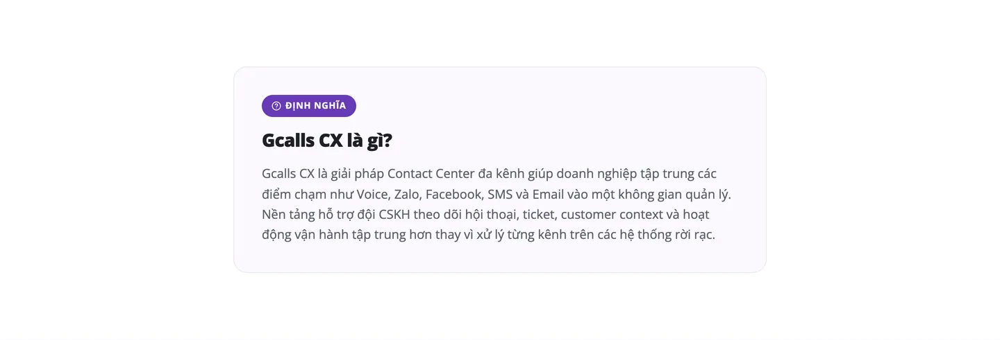

#### Section 04 — Nhiều kênh giao tiếp không đồng nghĩa với một trải nghiệm liền mạch

> BÀI TOÁN ĐA KÊNH Nhiều kênh giao tiếp không đồng nghĩa với một trải nghiệm liền mạch Khi mỗi kênh được vận hành trên một công cụ khác nhau, đội CSKH dễ mất context, khó theo dõi trạng thái xử lý và khó có một bức tranh thống nhất về hành trình tương tác của khách hàng.
> 01 Hội thoại nằm ở nhiều nơi Tin nhắn, cuộc gọi và yêu cầu hỗ trợ được xử lý trên các công cụ riêng khiến nhân viên phải liên tục chuyển đổi giữa nhiều màn hình.
> 02 Tương tác dễ bị bỏ sót Khi khối lượng trao đổi tăng, những hội thoại chưa được phản hồi hoặc chưa có người xử lý có thể khó được phát hiện kịp thời.
> 03 Customer context bị phân mảnh Nhân viên khó nhìn lại lịch sử tương tác khi dữ liệu khách hàng nằm rải rác giữa các kênh.
> 04 Quản lý khó theo dõi hiệu suất đa kênh Dữ liệu riêng lẻ ở từng công cụ khiến người quản lý khó có góc nhìn tập trung về workload, trạng thái xử lý và hoạt động của đội ngũ.

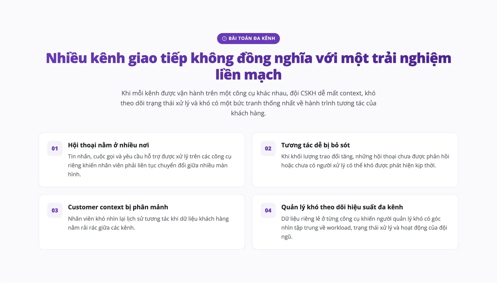

#### Section 05 — Một không gian làm việc cho nhiều điểm chạm khách hàng

> OMNICHANNEL WORKSPACE Một không gian làm việc cho nhiều điểm chạm khách hàng Gcalls CX tập trung các kênh giao tiếp và quy trình chăm sóc vào một workspace để nhân viên có thể theo dõi hội thoại, customer context và trạng thái xử lý thuận tiện hơn.
> Omnichannel Inbox Voice / Hotline Zalo OA Facebook SMS Email Ticket / Workflow Customer Context Reporting Customer Context KH KH #4821 Khách hàng · 3 kênh đã tương tác Zalo Voice Email TƯƠNG TÁC GẦN ĐÂY Zalo Hỏi tình trạng đơn hàng Hôm nay Voice Cuộc gọi đến · 2:14 Hôm qua Email Yêu cầu xuất hóa đơn 3 ngày trước TICKET LIÊN QUAN #T-2043 · Đang xử lý · Agent 02 Giao diện minh họa.
> Số liệu hiển thị là dữ liệu mẫu.

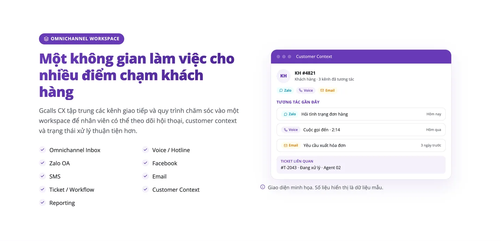

#### Section 06 — Kết nối những kênh khách hàng đang sử dụng

> ĐIỂM CHẠM Kết nối những kênh khách hàng đang sử dụng Voice / Hotline Tiếp nhận và quản lý tương tác thoại trong cùng hệ sinh thái vận hành.
> Zalo OA Đưa hội thoại từ Zalo OA vào luồng xử lý tập trung khi kênh này được cấu hình triển khai.
> Facebook Theo dõi hội thoại từ Facebook Fanpage cùng với các kênh chăm sóc khác.
> SMS Bổ sung SMS vào hành trình giao tiếp khi doanh nghiệp sử dụng kênh nhắn tin này.
> Email Quản lý email như một phần của quy trình hỗ trợ đa kênh nếu được cấu hình.

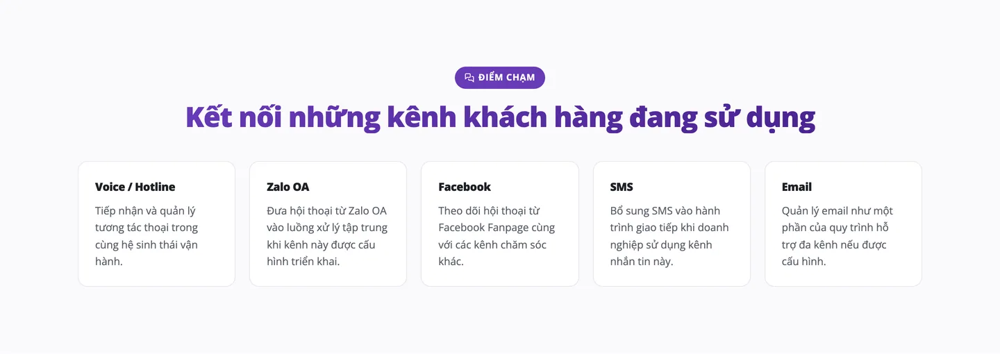

#### Section 07 — Giảm việc chuyển đổi giữa nhiều màn hình khi xử lý khách hàng

> OMNICHANNEL INBOX Giảm việc chuyển đổi giữa nhiều màn hình khi xử lý khách hàng Thay vì mở từng ứng dụng riêng lẻ, đội CSKH có thể làm việc trên một giao diện tập trung hơn để theo dõi hội thoại và trạng thái xử lý của các kênh được kết nối.
> Xem hội thoại theo kênh Theo dõi trạng thái xử lý Xác định hội thoại cần tiếp tục Hỗ trợ phân công xử lý khi workflow được cấu hình Duy trì customer context liên quan Omnichannel Inbox Tất cả Voice Zalo Facebook SMS Email KH #4821 Zalo Đơn của mình khi nào giao?
> Chờ xử lý KH #4817 Voice Cuộc gọi đến · 2:14 Đang xử lý KH #4813 Facebook Shop còn size M không ạ?
> Đang xử lý KH #4809 Email Yêu cầu xuất hóa đơn Đã xong KH #4804 SMS Xác nhận lịch hẹn Đã xong Giao diện minh họa.
> Mã khách hàng, hội thoại và trạng thái hiển thị là dữ liệu mẫu.

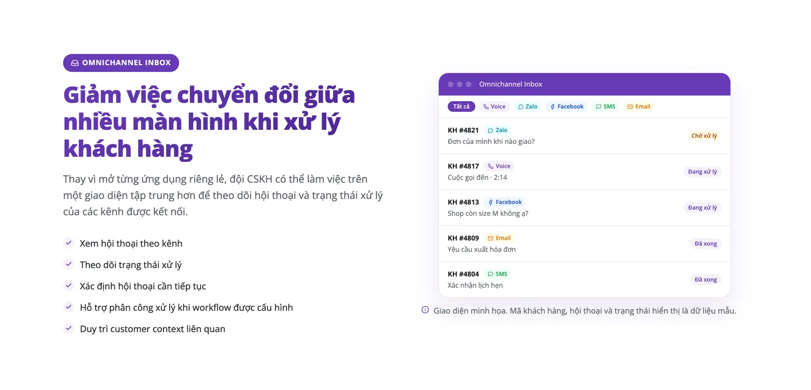

#### Section 08 — Biến hội thoại thành công việc có trạng thái và người chịu trách nhiệm

> TICKET & WORKFLOW Biến hội thoại thành công việc có trạng thái và người chịu trách nhiệm Khi một yêu cầu cần được theo dõi qua nhiều bước, ticket và workflow giúp đội ngũ tổ chức việc tiếp nhận, phân công và tiếp tục xử lý rõ ràng hơn.
> Tạo hoặc quản lý ticket theo workflow được triển khai Theo dõi trạng thái xử lý Phân công người phụ trách Duy trì lịch sử liên quan Hỗ trợ quá trình follow-up Ticket #T-2043 Đang xử lý Zalo Phụ trách: Agent 02 Yêu cầu kiểm tra tình trạng đơn hàng Khách hàng liên hệ qua Zalo OA và cần cập nhật thời gian giao dự kiến.
> 09:12 Tiếp nhận từ Zalo OA 09:20 Phân công cho Agent 02 10:05 Đã phản hồi khách hàng Giao diện minh họa.
> Mã ticket, người phụ trách và lịch sử hiển thị là dữ liệu mẫu.

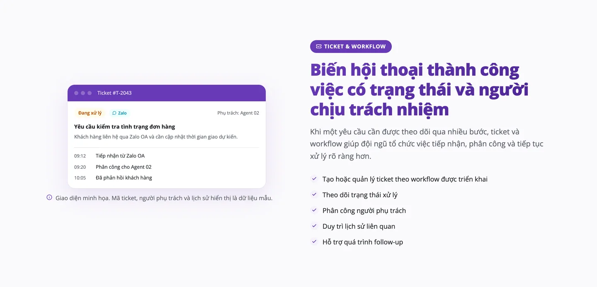

#### Section 09 — Hiểu những gì đã xảy ra trước khi phản hồi khách hàng

> CUSTOMER CONTEXT Hiểu những gì đã xảy ra trước khi phản hồi khách hàng Lịch sử tương tác và dữ liệu liên quan giúp nhân viên có thêm bối cảnh khi tiếp nhận một hội thoại mới hoặc tiếp tục yêu cầu đang xử lý.
> Hồ sơ khách hàng Lịch sử theo kênh Tương tác gần đây Lịch sử ticket Trạng thái xử lý Ghi chú và context liên quan Customer Context KH KH #4821 Khách hàng · 3 kênh đã tương tác Zalo Voice Email TƯƠNG TÁC GẦN ĐÂY Zalo Hỏi tình trạng đơn hàng Hôm nay Voice Cuộc gọi đến · 2:14 Hôm qua Email Yêu cầu xuất hóa đơn 3 ngày trước TICKET LIÊN QUAN #T-2043 · Đang xử lý · Agent 02 Giao diện minh họa.
> Thông tin khách hàng hiển thị là dữ liệu mẫu, không phải dữ liệu thật.

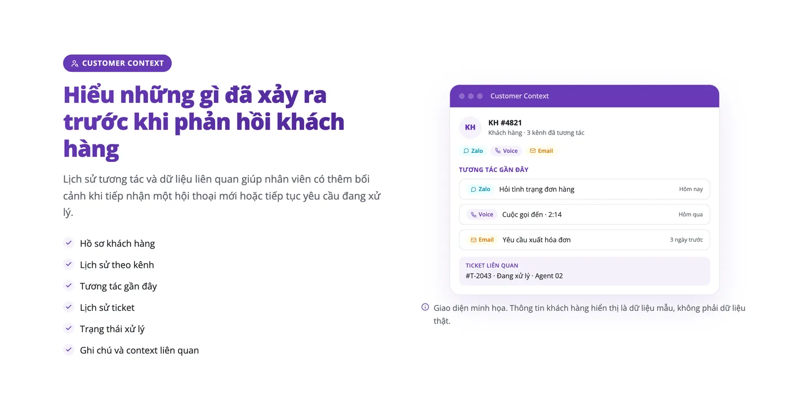

#### Section 10 — Từ nhiều điểm chạm đến một quy trình chăm sóc tập trung hơn

> CÁCH HOẠT ĐỘNG Từ nhiều điểm chạm đến một quy trình chăm sóc tập trung hơn 01 Khách hàng liên hệ qua kênh phù hợp Tương tác có thể bắt đầu từ Voice, Zalo, Facebook, SMS, Email hoặc kênh được doanh nghiệp triển khai.
> 02 Gcalls CX tập trung hội thoại Các điểm chạm được kết nối được đưa vào workspace để đội ngũ theo dõi thuận tiện hơn.
> 03 Xác định context và trạng thái Nhân viên xem thông tin liên quan, lịch sử tương tác và trạng thái xử lý trước khi tiếp tục.
> 04 Phân công hoặc tiếp tục xử lý Hội thoại hoặc ticket được xử lý theo workflow vận hành của doanh nghiệp.
> 05 Theo dõi hoạt động và kết quả Dữ liệu vận hành được tổng hợp để người quản lý có thêm góc nhìn về hoạt động chăm sóc khách hàng.

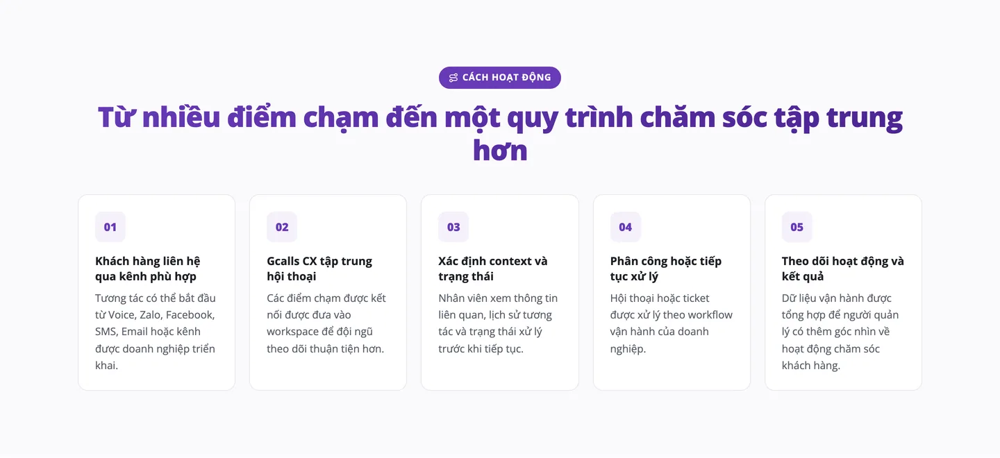

#### Section 11 — Theo dõi hoạt động đa kênh từ dữ liệu tập trung

> BÁO CÁO VẬN HÀNH Theo dõi hoạt động đa kênh từ dữ liệu tập trung Dữ liệu từ các kênh và workflow được triển khai giúp người quản lý có thêm góc nhìn về workload, trạng thái xử lý và hoạt động của đội CSKH.
> Khối lượng hội thoại Trạng thái ticket Phân bổ theo kênh Workload của đội ngũ Báo cáo vận hành 312 Hội thoại hôm nay 47 Ticket đang mở TRẠNG THÁI TICKET Chờ xử lý 12 Đang xử lý 21 Đã xong 14 PHÂN BỔ THEO KÊNH Voice Zalo Facebook Email SMS Giao diện minh họa.
> Toàn bộ số liệu, trạng thái và phân bổ kênh hiển thị là dữ liệu mẫu, không phải kết quả vận hành của khách hàng Gcalls.

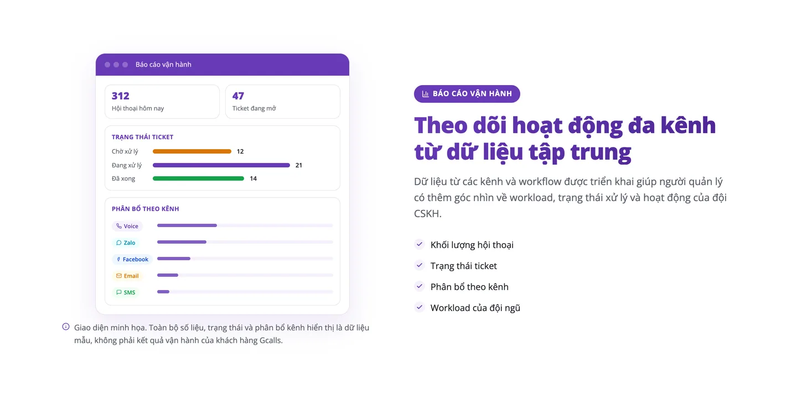

#### Section 12 — Giúp đội CSKH làm việc với ít điểm đứt gãy hơn

> GIÁ TRỊ VẬN HÀNH Giúp đội CSKH làm việc với ít điểm đứt gãy hơn Giảm phân mảnh công cụ Đưa nhiều điểm chạm vào cùng một luồng làm việc giúp nhân viên hạn chế việc chuyển đổi giữa các hệ thống rời rạc.
> Giảm nguy cơ bỏ sót tương tác Trạng thái xử lý tập trung giúp đội ngũ dễ nhận biết những hội thoại cần tiếp tục.
> Giữ customer context xuyên kênh Lịch sử liên quan giúp nhân viên hiểu những tương tác đã diễn ra trước đó.
> Có thêm dữ liệu cho quản lý Reporting giúp người quản lý quan sát hoạt động đa kênh thay vì chỉ theo dõi từng công cụ riêng biệt.

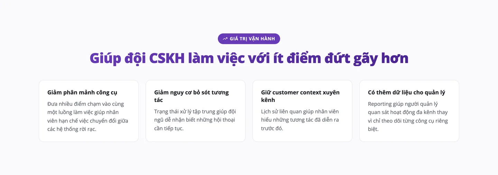

#### Section 13 — Gcalls CX phù hợp với những mô hình có nhiều điểm chạm khách hàng

> TÌNH HUỐNG SỬ DỤNG Gcalls CX phù hợp với những mô hình có nhiều điểm chạm khách hàng Tài chính Hỗ trợ đội chăm sóc quản lý lượng tương tác lớn và theo dõi yêu cầu trên nhiều điểm chạm.
> Giải pháp cho ngành Tài chính Bảo hiểm Tập trung hội thoại và quá trình follow-up khi khách hàng tương tác qua nhiều kênh.
> Giải pháp cho ngành Bảo hiểm Bất động sản Hỗ trợ đội tư vấn và CSKH theo dõi hội thoại, lead và quá trình chăm sóc trên nhiều điểm chạm.
> Giải pháp cho ngành Bất động sản Doanh nghiệp tăng trưởng nhanh Phù hợp khi số lượng kênh, nhân viên và tương tác tăng khiến mô hình xử lý riêng lẻ không còn dễ quản lý.

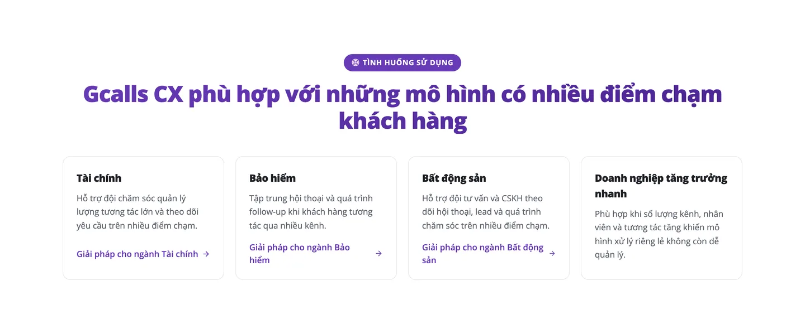

#### Section 14 — Kết nối giao tiếp đa kênh với dữ liệu và quy trình doanh nghiệp

> KẾT NỐI HỆ THỐNG Kết nối giao tiếp đa kênh với dữ liệu và quy trình doanh nghiệp Gcalls CX tập trung vào vận hành giao tiếp đa kênh.
> Khi doanh nghiệp cần kết nối sâu hoạt động cuộc gọi với CRM, Gcalls có giải pháp tích hợp riêng cho workflow Sales và Customer Service.
> Tổng đài tích hợp CRM QA QC Center Gcalls Plus

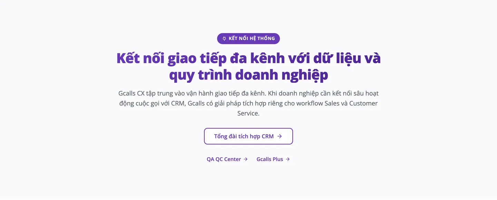

#### Section 15 — Mỗi bài toán giao tiếp cần một lớp sản phẩm khác nhau

> CHỌN ĐÚNG GIẢI PHÁP Mỗi bài toán giao tiếp cần một lớp sản phẩm khác nhau Nghe gọi tập trung trên trình duyệt Gcalls Plus Webphone Quản lý giao tiếp đa kênh Gcalls CX TRANG HIỆN TẠI Kiểm soát chất lượng cuộc gọi bằng AI QA QC Center Tích hợp cuộc gọi sâu vào CRM CRM Integration Liên lạc với thị trường quốc tế International Calling Xem tất cả giải pháp

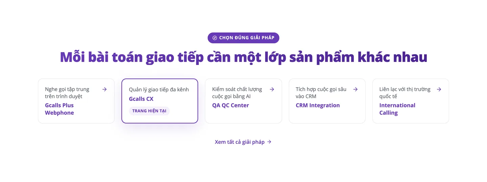

#### Section 16 — Thiết kế cấu hình theo kênh và workflow doanh nghiệp đang sử dụng

> TRIỂN KHAI Thiết kế cấu hình theo kênh và workflow doanh nghiệp đang sử dụng Phạm vi triển khai Gcalls CX phụ thuộc vào các kênh cần kết nối, quy trình ticket, số lượng người dùng và hệ thống doanh nghiệp liên quan.
> 01 Khảo sát các điểm chạm hiện tại 02 Xác định kênh cần kết nối 03 Thiết kế workflow xử lý 04 Cấu hình người dùng và phân quyền 05 Kiểm thử 06 Hướng dẫn vận hành 07 Go-live theo phạm vi đã thống nhất

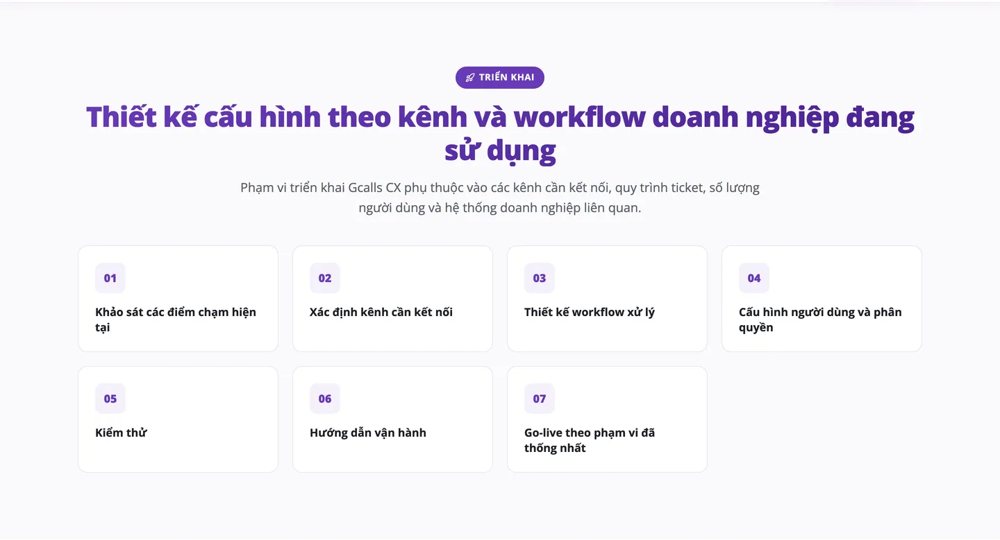

#### Section 17 — Mỗi hành trình khách hàng cần một workflow khác nhau

> TRIỂN KHAI THEO BỐI CẢNH THỰC TẾ Mỗi hành trình khách hàng cần một workflow khác nhau Kênh giao tiếp, cấu trúc đội ngũ và cách xử lý ticket khác nhau giữa từng doanh nghiệp.
> Gcalls CX cần được cấu hình theo quy trình vận hành thực tế thay vì áp dụng một mô hình giống nhau cho mọi tổ chức.
> Yêu cầu demo theo workflow của doanh nghiệp Đọc bài viết trên Blog Gcalls

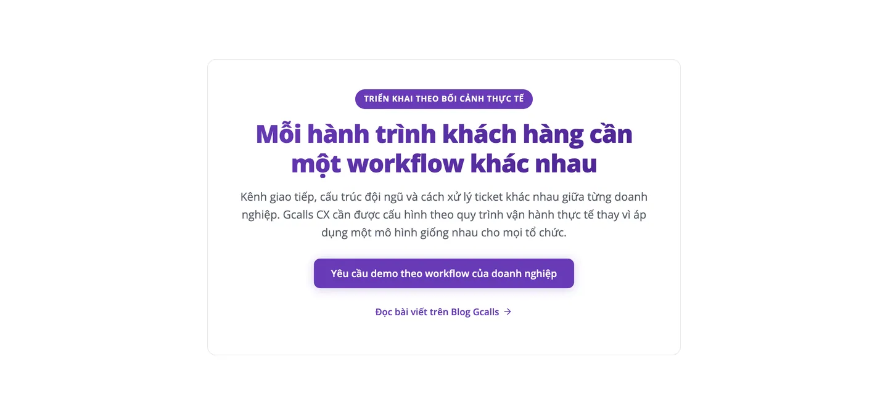

#### Section 18 — Chi phí phụ thuộc vào số kênh, người dùng và phạm vi triển khai

> CẤU HÌNH & CHI PHÍ Chi phí phụ thuộc vào số kênh, người dùng và phạm vi triển khai Cấu hình Gcalls CX có thể thay đổi theo số lượng Agent, các kênh cần kết nối, workflow ticket và yêu cầu tích hợp hệ thống.
> Công cụ ước tính giúp doanh nghiệp mô tả nhu cầu trước khi nhận báo giá chính thức. Ước tính cấu hình & chi phí Xem bảng giá Gcalls Chi phí phụ thuộc cấu hình.

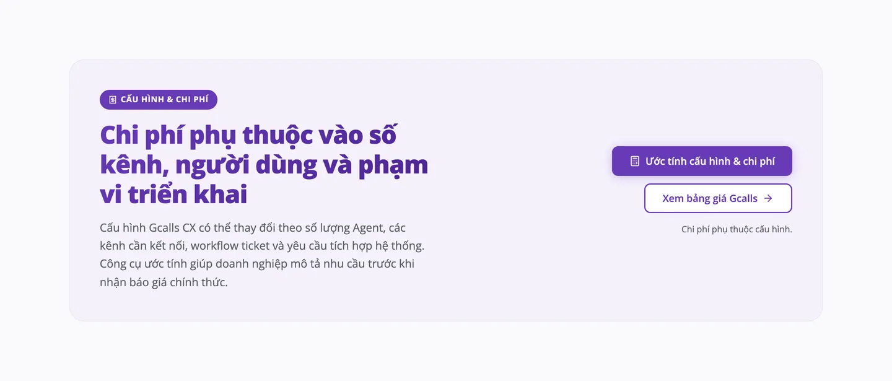

#### Section 19 — Câu hỏi thường gặp về Gcalls CX

> CÂU HỎI THƯỜNG GẶP Câu hỏi thường gặp về Gcalls CX Gcalls CX là gì?
> Gcalls CX là giải pháp Contact Center đa kênh giúp doanh nghiệp tập trung các điểm chạm giao tiếp và quy trình chăm sóc khách hàng trong một không gian làm việc thống nhất hơn.
> Gcalls CX hỗ trợ những kênh nào?
> Gcalls CX có quản lý ticket không?
> Gcalls CX khác Gcalls Plus như thế nào?
> Gcalls CX có thay thế CRM không?
> Gcalls CX phù hợp với doanh nghiệp nào?

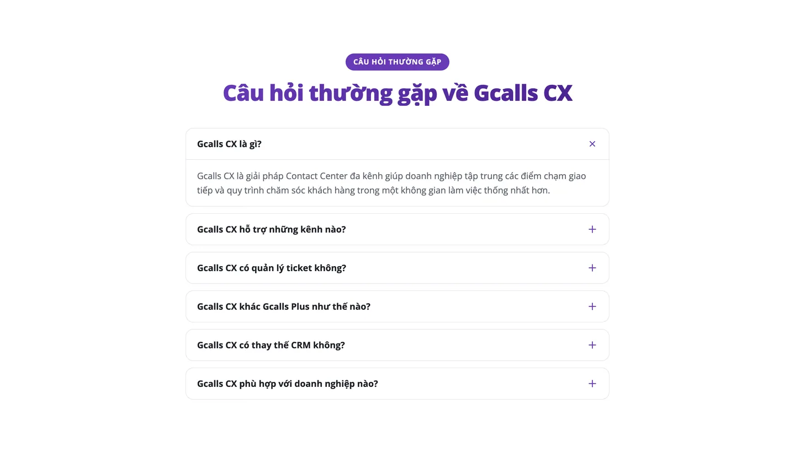

#### Section 20 — Xem Gcalls CX hoạt động trên chính hành trình chăm sóc khách hàng của doanh nghiệp bạn

> GCALLS CX • OMNICHANNEL CONTACT CENTER Xem Gcalls CX hoạt động trên chính hành trình chăm sóc khách hàng của doanh nghiệp bạn Chia sẻ các kênh đang sử dụng, cấu trúc đội CSKH và workflow hiện tại để Gcalls tư vấn cấu hình Contact Center phù hợp.
> Yêu cầu demo Gcalls CX Đăng ký tư vấn 028 7302 5469

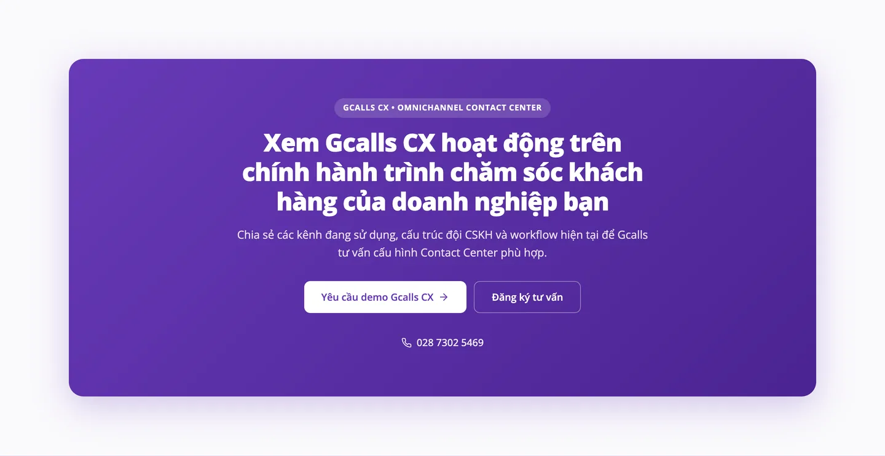

---

## Voicebot AI

- **Đường dẫn:** `/voicebot-ai/`
- **Nhóm:** Sản phẩm
- **Số section:** 13

📄 Ảnh toàn trang (full-page)

### Các section

#### Section 01

> Trang chủ Sản phẩm Gcalls Voicebot AI

#### Section 02 — Tự động hóa các cuộc gọi lặp lại bằng Voicebot AI

> VOICEBOT AI CHO DOANH NGHIỆP Tự động hóa các cuộc gọi lặp lại bằng Voicebot AI Gcalls giúp doanh nghiệp triển khai Voicebot cho các tác vụ như nhắc lịch, xác nhận thông tin, sàng lọc nhu cầu và xử lý bước đầu ngoài giờ — để đội ngũ tập trung vào những tương tác cần chuyên môn và sự thấu hiểu của con người.
> Đăng ký tư vấn Voicebot Khám phá tình huống ứng dụng Gcalls khảo sát quy trình, tư vấn phương án và xác định phạm vi tích hợp phù hợp với hệ thống hiện tại của doanh nghiệp.
> Voicebot · Chiến dịch nhắc lịch hẹn Chiến dịch đang chạy Minh họa 480 Trong danh sách 312 Đã gọi 198 Đã kết nối 24 Cần nhân viên KẾT QUẢ PHẢN HỒI Xác nhận lịch hẹn 46% Đề nghị gọi lại 27% Cần nhân viên hỗ trợ 15% Không kết nối 12% LỊCH SỬ TƯƠNG TÁC LH-2481 09:12 Đã xác nhận LH-2479 09:08 Chuyển nhân viên LH-2476 09:03 Hẹn gọi lại Minh họa giao diện.
> Đây là hình minh họa được dựng lại, không phải ảnh chụp hệ thống đang vận hành; toàn bộ số liệu là dữ liệu mẫu.

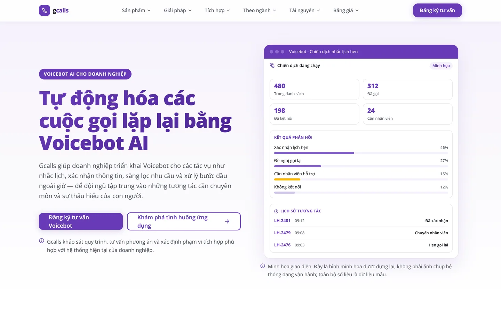

#### Section 03 — Khi những cuộc gọi lặp lại chiếm quá nhiều nguồn lực

> BÀI TOÁN VẬN HÀNH Khi những cuộc gọi lặp lại chiếm quá nhiều nguồn lực Nhiều đội ngũ đang dùng cùng một nguồn lực cho hai loại cuộc gọi rất khác nhau: những cuộc gọi có kịch bản cố định và những cuộc trao đổi cần tư vấn thật sự.
> 01 Thời gian dồn vào các cuộc gọi có kịch bản giống nhau Nhắc lịch, xác nhận thông tin hay nhắc thanh toán thường lặp lại gần như nguyên vẹn ở mỗi cuộc gọi, nhưng vẫn cần nhân viên thực hiện thủ công từng cuộc.
> 02 Khó mở rộng số lượng cuộc gọi trong giai đoạn cao điểm Khi chiến dịch cần liên hệ một lượng lớn khách hàng trong thời gian ngắn, khối lượng cuộc gọi bị giới hạn bởi số nhân sự đang có mặt.
> 03 Ít thời gian còn lại cho khách hàng cần tư vấn chuyên sâu Những tình huống cần giải thích, thương lượng hoặc xử lý khiếu nại là nơi nhân viên tạo ra giá trị rõ nhất, nhưng lại thường bị chia sẻ nguồn lực với các cuộc gọi thủ tục.

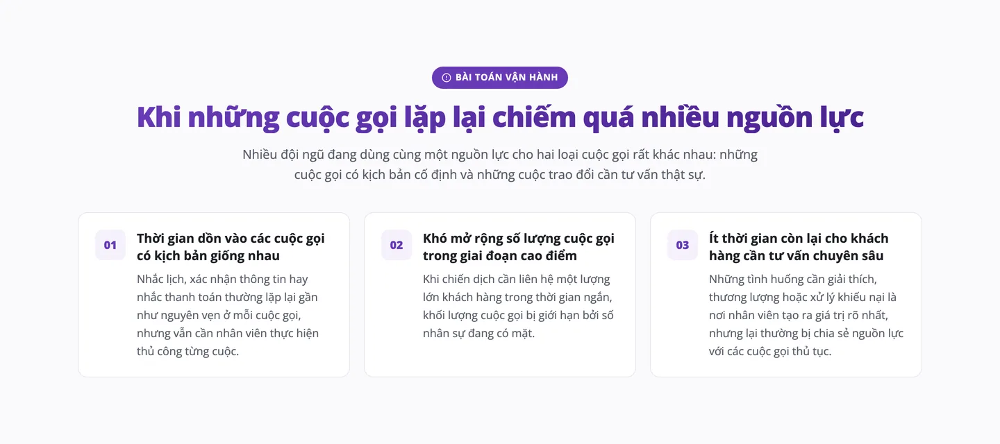

#### Section 04 — Những tình huống cuộc gọi có thể cân nhắc đưa vào Voicebot

> TÌNH HUỐNG ỨNG DỤNG Những tình huống cuộc gọi có thể cân nhắc đưa vào Voicebot Voicebot phù hợp nhất với các cuộc gọi có mục tiêu rõ ràng và kịch bản ổn định.
> Mỗi tình huống dưới đây cần được xem xét theo quy trình và dữ liệu thực tế của doanh nghiệp trước khi triển khai.
> 01 Nhắc lịch hẹn Gọi nhắc khách hàng về lịch hẹn đã đặt và ghi nhận phản hồi xác nhận, dời lịch hoặc cần liên hệ lại.
> 02 Nhắc thanh toán Thực hiện các cuộc gọi nhắc kỳ thanh toán theo kịch bản đã được doanh nghiệp duyệt, với nội dung và thời điểm do doanh nghiệp quy định.
> 03 Xác nhận thông tin Xác nhận đơn hàng, lịch giao nhận hoặc thông tin giao dịch, và ghi nhận kết quả xác nhận để chuyển sang bước xử lý tiếp theo.
> 04 Sàng lọc nhu cầu Liên hệ data thô để xác định mức độ quan tâm trước khi chuyển những trường hợp phù hợp cho nhân viên tư vấn.
> 05 Chiến dịch gọi hàng loạt Thực hiện các cuộc gọi lặp lại theo chiến dịch với cùng một kịch bản, thay vì phân bổ toàn bộ danh sách cho đội ngũ.
> 06 Xử lý bước đầu ngoài giờ Tiếp nhận và ghi nhận nhu cầu ở bước đầu tiên ngoài khung giờ làm việc, sau đó chuyển lại cho đội ngũ xử lý trong giờ hành chính.

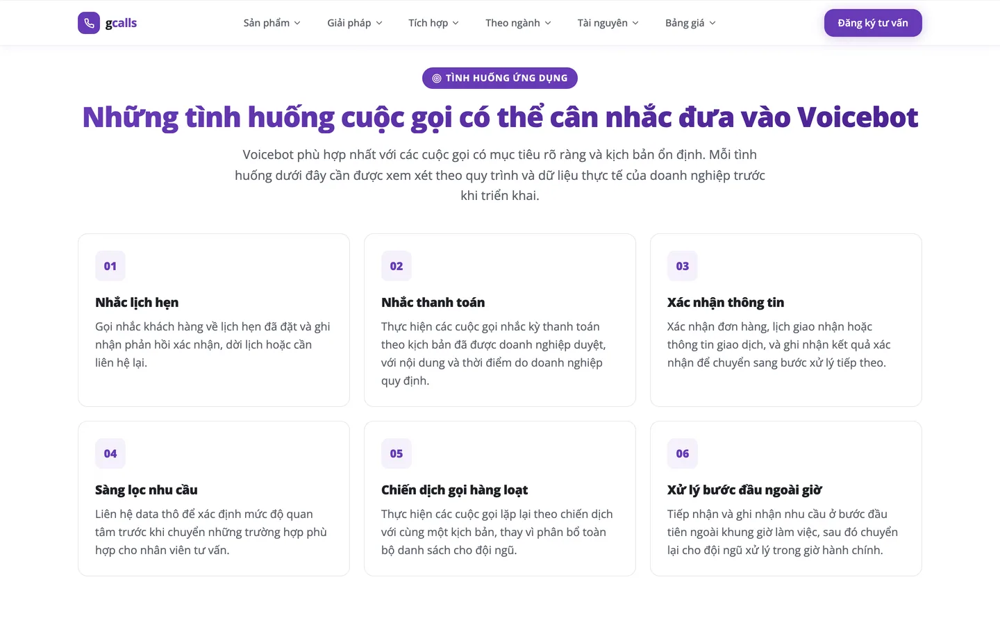

#### Section 05 — Một chiến dịch Voicebot diễn ra như thế nào

> QUY TRÌNH HOẠT ĐỘNG Một chiến dịch Voicebot diễn ra như thế nào Quy trình dưới đây mô tả cách một chiến dịch được chuẩn bị và vận hành.
> Việc bước nào được tự động hóa đến đâu phụ thuộc vào phạm vi triển khai được thống nhất với doanh nghiệp.
> 01 Xác định mục tiêu chiến dịch Doanh nghiệp và Gcalls thống nhất chiến dịch cần đạt điều gì: nhắc lịch, xác nhận, sàng lọc hay thu thập phản hồi.
> 02 Chuẩn bị dữ liệu và kịch bản Danh sách liên hệ và nội dung hội thoại được doanh nghiệp chuẩn bị, rà soát và duyệt trước khi đưa vào chiến dịch.
> 03 Voicebot thực hiện cuộc gọi Các cuộc gọi được thực hiện theo kịch bản và cấu hình đã thiết lập cho chiến dịch.
> 04 Ghi nhận kết quả phản hồi Phản hồi của người nghe được ghi nhận lại theo cách đã được cấu hình cho từng kịch bản.
> 05 Chuyển trường hợp cần thiết cho nhân viên Những tình huống nằm ngoài kịch bản hoặc cần trao đổi thêm được đưa sang đội ngũ để tiếp tục xử lý.
> 06 Theo dõi và tối ưu Đội ngũ xem lại kết quả chiến dịch để điều chỉnh kịch bản, dữ liệu hoặc cách phân luồng cho các đợt tiếp theo.

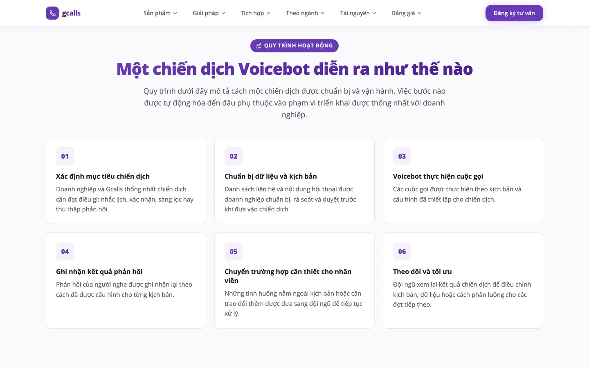

#### Section 06 — Những gì một triển khai Voicebot được xây dựng xoay quanh

> KHẢ NĂNG GIẢI PHÁP Những gì một triển khai Voicebot được xây dựng xoay quanh Phạm vi cụ thể của từng khả năng được xác định trong quá trình khảo sát và kiểm thử, dựa trên use case và hệ thống hiện tại của doanh nghiệp.
> Thực hiện tác vụ gọi theo kịch bản đã thiết lập.
> Ghi nhận phản hồi của khách hàng trong cuộc gọi.
> Phân loại kết quả cuộc gọi theo các nhóm đã được cấu hình.
> Chuyển các tình huống cần con người xử lý sang đội ngũ.
> Cung cấp dữ liệu phục vụ theo dõi chiến dịch.
> Đây là các khả năng được đưa vào phạm vi khảo sát, không phải danh sách tính năng đã cam kết cho mọi triển khai.
> Phân luồng · Cần nhân viên xử lý Cuộc gọi chuyển sang đội ngũ Minh họa LH-2479 Khách hỏi ngoài kịch bản Tư vấn LH-2465 Đề nghị thương lượng điều khoản Tư vấn LH-2452 Phản hồi cần xử lý riêng CSKH LH-2440 Yêu cầu gặp nhân viên CSKH Điều kiện chuyển tiếp được thiết lập theo từng kịch bản.
> Minh họa giao diện.
> Mã liên hệ và lý do chuyển tiếp là dữ liệu mẫu.

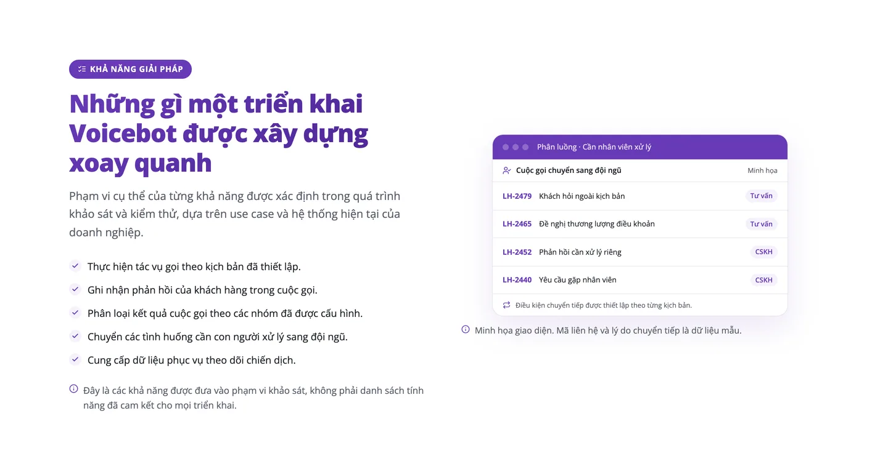

#### Section 07 — AI xử lý tác vụ lặp lại, con người xử lý tương tác có giá trị cao

> CON NGƯỜI VÀ AI AI xử lý tác vụ lặp lại, con người xử lý tương tác có giá trị cao Voicebot được đặt vào quy trình để gánh phần việc có kịch bản rõ ràng.
> Những cuộc trao đổi cần chuyên môn, sự linh hoạt và khả năng đọc ngữ cảnh vẫn thuộc về đội ngũ.
> Voicebot đảm nhận Các tác vụ gọi có quy trình và kịch bản rõ ràng, lặp lại theo chiến dịch.
> Cuộc gọi có nội dung ổn định Tác vụ lặp lại với số lượng lớn Bước ghi nhận phản hồi ban đầu Nhân viên tiếp nhận Những trường hợp cần tư vấn, thương lượng hoặc hiểu bối cảnh riêng của khách hàng.
> Tình huống nằm ngoài kịch bản Khách hàng cần tư vấn chuyên sâu Trao đổi cần thương lượng hoặc xử lý khiếu nại Định hướng của giải pháp là hỗ trợ đội ngũ mở rộng khả năng xử lý cuộc gọi, không phải thay thế vai trò của nhân viên.

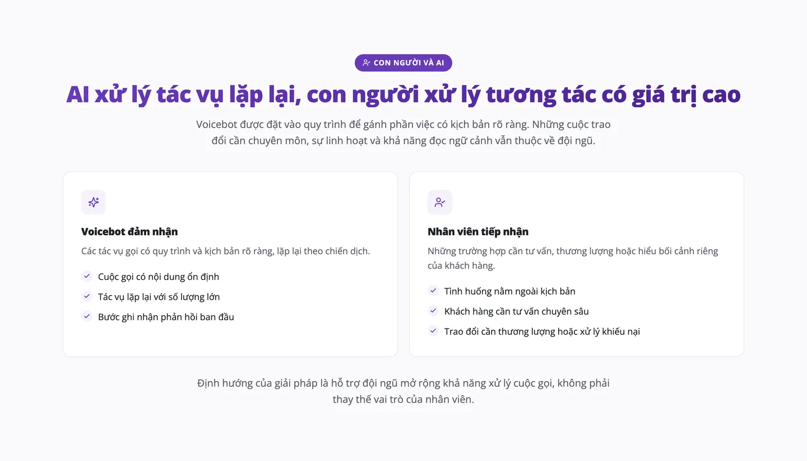

#### Section 08 — Voicebot có thể được khảo sát tích hợp vào hệ thống đang vận hành

> TÍCH HỢP VÀO QUY TRÌNH Voicebot có thể được khảo sát tích hợp vào hệ thống đang vận hành Phạm vi kết nối được xác định trong quá trình khảo sát.
> Gcalls đánh giá hệ thống hiện tại, dữ liệu sẵn có và cách đội ngũ đang làm việc trước khi đề xuất phương án tích hợp.
> Hệ thống tổng đài Có thể được khảo sát tích hợp để cuộc gọi Voicebot nằm chung luồng vận hành thoại của doanh nghiệp.
> CRM Có thể được khảo sát tích hợp để dữ liệu liên hệ và kết quả cuộc gọi nằm cùng nơi đội ngũ đang làm việc.
> Dữ liệu chiến dịch Có thể được khảo sát tích hợp để danh sách liên hệ và trạng thái chiến dịch được đồng bộ theo quy trình hiện tại.
> Quy trình chăm sóc khách hàng Có thể được khảo sát tích hợp để những trường hợp cần con người xử lý đi vào đúng luồng chăm sóc đang có.
> Hệ thống báo cáo Có thể được khảo sát tích hợp để dữ liệu cuộc gọi phục vụ hoạt động theo dõi và báo cáo nội bộ.
> Tổng đài tích hợp CRM Gcalls CX QC Bot AI Xem tất cả sản phẩm Xem tất cả giải pháp

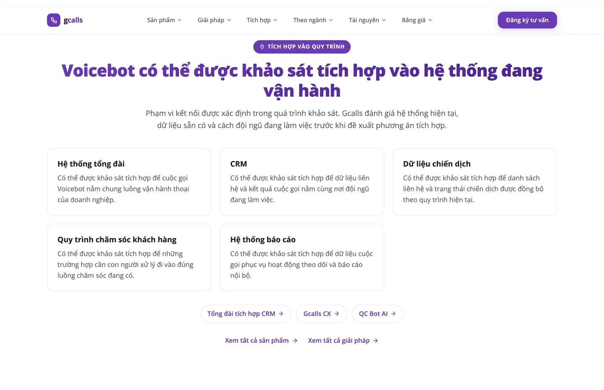

#### Section 09 — Những nhóm ngành thường có nhiều cuộc gọi lặp lại

> NGÀNH PHÙ HỢP Những nhóm ngành thường có nhiều cuộc gọi lặp lại Mỗi ngành có một nhóm cuộc gọi thủ tục riêng.
> Đây là điểm bắt đầu thường gặp khi doanh nghiệp cân nhắc đưa Voicebot vào vận hành.
> Tài chính và bảo hiểm Gọi nhắc kỳ thanh toán hoặc nhắc lịch làm việc theo danh sách đã được duyệt.
> Tài chính Bảo hiểm Giáo dục Gọi nhắc lịch học, lịch tư vấn hoặc xác nhận thông tin ghi danh với số lượng lớn trong thời gian ngắn.
> Giáo dục Thương mại điện tử và bán lẻ Gọi xác nhận đơn hàng và ghi nhận phản hồi của khách trước bước giao nhận.
> Thương mại điện tử BPO và Outsourcing Sàng lọc data thô theo chiến dịch trước khi chuyển những liên hệ phù hợp cho nhân viên.
> BPO

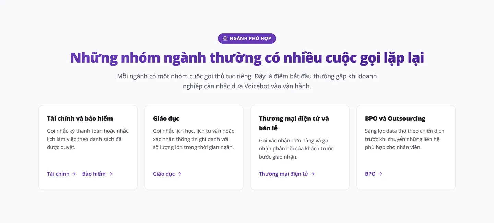

#### Section 10 — Từ khảo sát nhu cầu đến vận hành và tối ưu

> QUY TRÌNH TRIỂN KHAI Từ khảo sát nhu cầu đến vận hành và tối ưu Thời gian của mỗi bước phụ thuộc vào use case, dữ liệu và mức độ tích hợp, nên được xác định cụ thể trong quá trình tư vấn.
> 01 Khảo sát nhu cầu Xem xét quy trình cuộc gọi hiện tại, khối lượng và cách đội ngũ đang xử lý.
> 02 Xác định use case Chọn tình huống cuộc gọi phù hợp để bắt đầu, thay vì đưa toàn bộ hoạt động gọi vào cùng lúc.
> 03 Xây dựng kịch bản Thống nhất nội dung hội thoại, các nhánh phản hồi và điều kiện chuyển sang nhân viên.
> 04 Thiết lập và kiểm thử Cấu hình chiến dịch và kiểm thử trên phạm vi giới hạn trước khi mở rộng.
> 05 Vận hành và tối ưu Theo dõi kết quả thực tế và điều chỉnh kịch bản, dữ liệu hoặc phân luồng theo từng đợt.
> Đăng ký tư vấn Voicebot

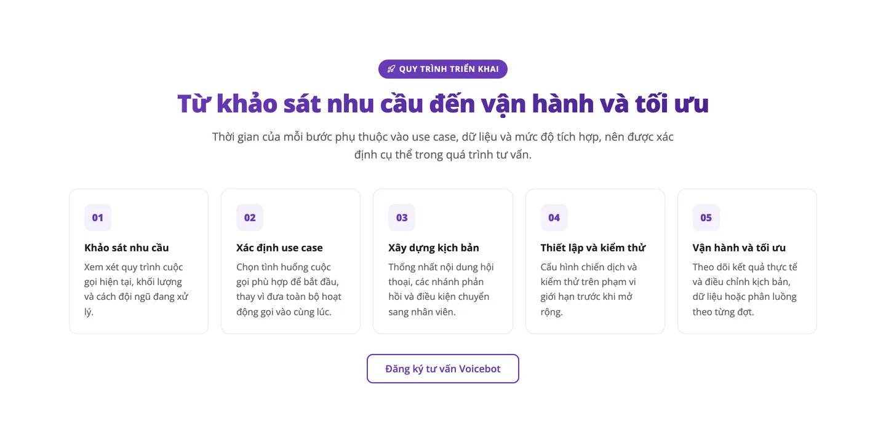

#### Section 11 — Những thay đổi doanh nghiệp có thể hướng tới

> GIÁ TRỊ ĐẦU RA Những thay đổi doanh nghiệp có thể hướng tới Kết quả cụ thể phụ thuộc vào use case, chất lượng dữ liệu và cách chiến dịch được thiết kế.
> Dưới đây là những giá trị mà doanh nghiệp thường đặt làm mục tiêu khi bắt đầu.
> Mở rộng khả năng xử lý cuộc gọi Khối lượng cuộc gọi thủ tục không còn bị giới hạn hoàn toàn bởi số nhân sự trực tại một thời điểm.
> Tăng tính nhất quán của tác vụ lặp lại Cùng một kịch bản được sử dụng cho toàn bộ chiến dịch, thay vì thay đổi theo từng người thực hiện.
> Giúp nhân viên tập trung vào tương tác quan trọng Đội ngũ dành thời gian cho những khách hàng cần tư vấn, thương lượng hoặc xử lý tình huống riêng.
> Dữ liệu cuộc gọi rõ ràng hơn Kết quả chiến dịch được ghi nhận theo cấu hình, phục vụ việc theo dõi và rà soát nội bộ.
> Linh hoạt thử nghiệm theo từng use case Doanh nghiệp có thể bắt đầu từ một tình huống cuộc gọi và mở rộng dần theo kết quả thực tế.

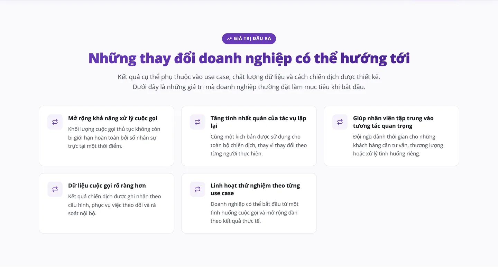

#### Section 12 — Câu hỏi thường gặp về Voicebot AI

> CÂU HỎI THƯỜNG GẶP Câu hỏi thường gặp về Voicebot AI Voicebot AI phù hợp với doanh nghiệp nào?
> Voicebot phù hợp với doanh nghiệp có nhiều cuộc gọi lặp lại theo cùng một kịch bản, chẳng hạn nhắc lịch, xác nhận thông tin hoặc sàng lọc danh sách liên hệ.
> Mức độ phù hợp được xác định dựa trên quy trình và khối lượng cuộc gọi thực tế.
> Voicebot có thể áp dụng cho tình huống nào?
> Có thể kết nối Voicebot với hệ thống hiện tại không?
> Khi nào cuộc gọi cần chuyển sang nhân viên?
> Doanh nghiệp bắt đầu triển khai như thế nào?
> Chi phí Voicebot được xác định ra sao?

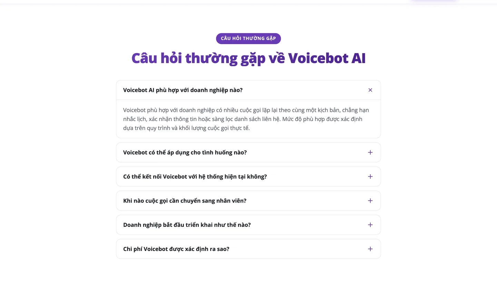

#### Section 13 — Bắt đầu từ một tình huống cuộc gọi phù hợp với doanh nghiệp

> VOICEBOT AI CHO DOANH NGHIỆP Bắt đầu từ một tình huống cuộc gọi phù hợp với doanh nghiệp Chia sẻ quy trình hiện tại để đội ngũ Gcalls cùng bạn xác định use case, phạm vi tích hợp và phương án triển khai Voicebot phù hợp.
> Đăng ký tư vấn Voicebot 028 7302 5469

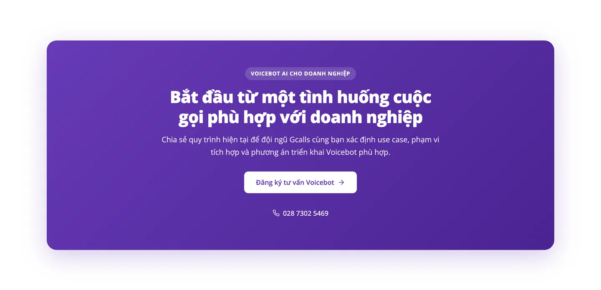

---

## Tổng đài tích hợp CRM

- **Đường dẫn:** `/tong-dai-tich-hop-crm/`
- **Nhóm:** Giải pháp
- **Số section:** 19

📄 Ảnh toàn trang (full-page)

### Các section

#### Section 01

> Trang chủ Giải pháp Tổng đài tích hợp CRM

#### Section 02 — Tổng đài tích hợp CRM – kết nối cuộc gọi với dữ liệu khách hàng

> GCALLS • CRM INTEGRATION Tổng đài tích hợp CRM – kết nối cuộc gọi với dữ liệu khách hàng Đưa hoạt động nghe gọi vào quy trình CRM để đội Sales và CSKH có thể gọi trực tiếp từ hệ thống, nhận biết khách hàng khi có cuộc gọi và lưu lại lịch sử tương tác tập trung hơn.
> Gọi trực tiếp từ CRM — Click-to-Call giúp nhân viên bắt đầu cuộc gọi ngay trong quy trình đang làm việc thay vì nhập lại số điện thoại.
> Nhận biết khách hàng khi có cuộc gọi — Popup thông tin hỗ trợ nhân viên xem customer context trước hoặc trong quá trình trao đổi.
> Giữ lịch sử tương tác tập trung — Dữ liệu cuộc gọi và thông tin liên quan có thể được đồng bộ về CRM theo phạm vi tích hợp được cấu hình.
> Tư vấn tích hợp CRM Khám phá cách tích hợp hoạt động Danh bạ NM Nguyễn Văn Minh Công ty TNHH Bình Minh TL Trần Thị Lan CTCP Việt Phát PH Phạm Thu Hà Tập đoàn Sao Việt VT Võ Minh Tuấn StartupHub Việt Nam 4 liên hệ · trang 1/12 NM Nguyễn Văn Minh Demo Công ty TNHH Bình Minh Khách hàng mới Demo 0901 234 567 minh.nv@binhminh.vn 12 cuộc gọi Ghi chú gần nhất KH quan tâm gói Business.
> Hẹn demo thứ 5 tuần này.
> Cần gửi proposal trước ngày 25.
> Lịch sử hoạt động Gần nhất Cuộc gọi đến 09:31 7:18 phút · Ghi âm có sẵn Ghi chú 09:35 Cần gửi báo giá gia hạn trước 15h hôm nay Cuộc gọi đi Hôm qua 3:42 phút · Đã nghe máy Gắn nhãn VIP 2 ngày trước Thêm tag: VIP, Gia hạn Cập nhật lần cuối: Hôm nay 09:14 Xem đầy đủ SIP: Online HD 0901 234 Ext: 101 · Hotline: 1900 1234 1 2 3 4 5 6 7 8 9 * 0 # Gọi GỌI NHANH NH Nguyễn Hằng Ext 101 TT Trần M.
> Tuấn Ext 102 Giao diện minh họa.
> Số liệu hiển thị là dữ liệu mẫu.

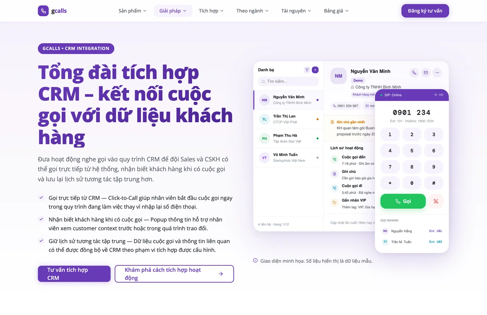

#### Section 03 — Tổng đài tích hợp CRM là gì?

> ĐỊNH NGHĨA Tổng đài tích hợp CRM là gì?
> Tổng đài tích hợp CRM là mô hình kết nối chức năng nghe gọi với hệ thống quản lý khách hàng để nhân viên có thể thực hiện cuộc gọi ngay trong CRM, nhận biết khách hàng khi có cuộc gọi và lưu lịch sử tương tác về cùng một quy trình dữ liệu.
> Với Gcalls, phạm vi đồng bộ phụ thuộc vào nền tảng CRM và cấu hình tích hợp thực tế của doanh nghiệp.
> Cuộc gọi đến...
> 1900 1234 · Hà Nội NM Nguyễn Văn Minh Công ty TNHH Bình Minh Demo VIP LỊCH SỬ GẦN NHẤT Gọi đi · 3:42 Hôm nay 09:14 Ghi chú: Cần gửi proposal Hôm nay 09:35 Ghi chú Gắn tag Xem hồ sơ Giao diện minh họa.
> Số liệu hiển thị là dữ liệu mẫu.

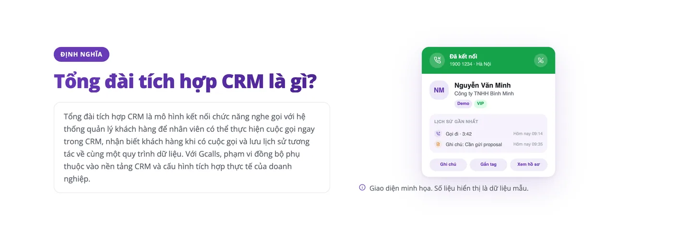

#### Section 04 — Khi CRM và tổng đài hoạt động riêng, nhân viên phải tự nối hai quy trình bằng thao tác thủ công

> BÀI TOÁN VẬN HÀNH Khi CRM và tổng đài hoạt động riêng, nhân viên phải tự nối hai quy trình bằng thao tác thủ công 01 Nhập lại số điện thoại Nhân viên phải copy số từ CRM sang công cụ gọi, tạo thêm thao tác không cần thiết trong mỗi lần liên hệ.
> 02 Không có customer context khi chuông reo Nếu dữ liệu khách hàng và cuộc gọi nằm ở hai hệ thống khác nhau, nhân viên cần mất thêm thời gian để xác định người đang liên hệ.
> 03 Lịch sử cuộc gọi nằm ngoài CRM Khi hoạt động gọi không được ghi nhận cùng dữ liệu khách hàng, đội Sales và CSKH khó theo dõi toàn bộ hành trình tương tác trong một nơi.
> 04 Quản lý khó theo dõi quy trình xuyên hệ thống Dữ liệu phân mảnh khiến việc kiểm tra lịch sử chăm sóc, follow-up và hoạt động đội ngũ trở nên phức tạp hơn.

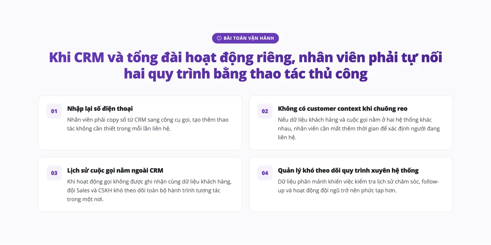

#### Section 05 — Đưa hoạt động cuộc gọi vào nơi đội Sales và CSKH đang làm việc

> CRM + CALLING Đưa hoạt động cuộc gọi vào nơi đội Sales và CSKH đang làm việc 01 CRM record Dữ liệu khách hàng nằm trong CRM.
> 02 Click-to-Call Bắt đầu cuộc gọi từ quy trình đang làm việc.
> 03 Call Cuộc gọi được thực hiện qua hệ thống Gcalls.
> 04 Customer context Thông tin liên quan hỗ trợ nhân viên khi trao đổi.
> 05 Interaction history Dữ liệu tương tác được ghi nhận theo cấu hình.
> 06 Follow-up Đội ngũ tiếp tục chăm sóc trong CRM.

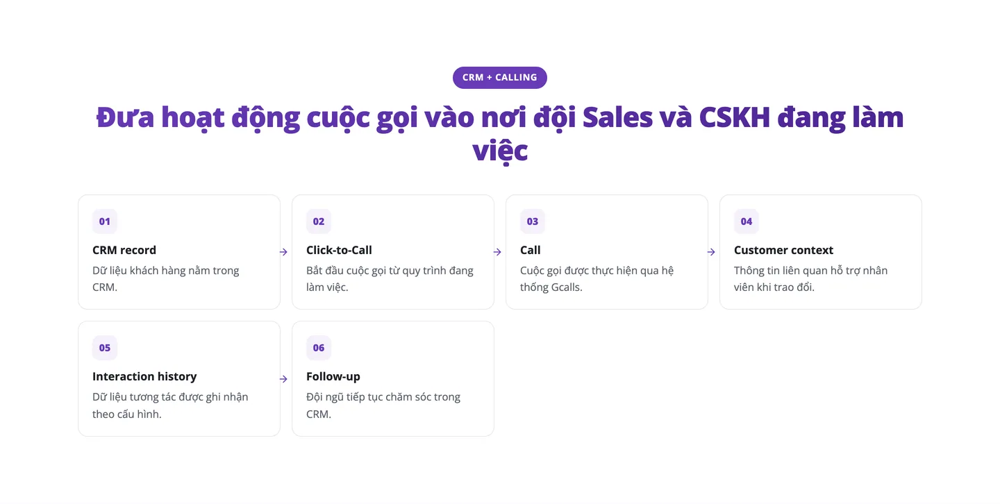

#### Section 06 — Từ dữ liệu CRM đến cuộc gọi và lịch sử tương tác

> CÁCH TÍCH HỢP HOẠT ĐỘNG Từ dữ liệu CRM đến cuộc gọi và lịch sử tương tác 01 Nhân viên làm việc trên CRM Thông tin khách hàng, lead hoặc contact tiếp tục được quản lý trong hệ thống CRM doanh nghiệp đang sử dụng.
> 02 Bắt đầu cuộc gọi Khi nền tảng hỗ trợ và tích hợp được cấu hình, nhân viên có thể thực hiện cuộc gọi trực tiếp từ giao diện CRM.
> 03 Hiển thị customer context Thông tin khách hàng liên quan hỗ trợ nhân viên xác định bối cảnh trước hoặc trong quá trình trao đổi.
> 04 Ghi nhận hoạt động Lịch sử liên hệ và dữ liệu cuộc gọi phù hợp có thể được đưa trở lại CRM theo cấu hình tích hợp.
> 05 Tiếp tục workflow Sales hoặc CSKH tiếp tục follow-up trong hệ thống đang quản lý khách hàng thay vì xây dựng một luồng dữ liệu riêng bên ngoài.

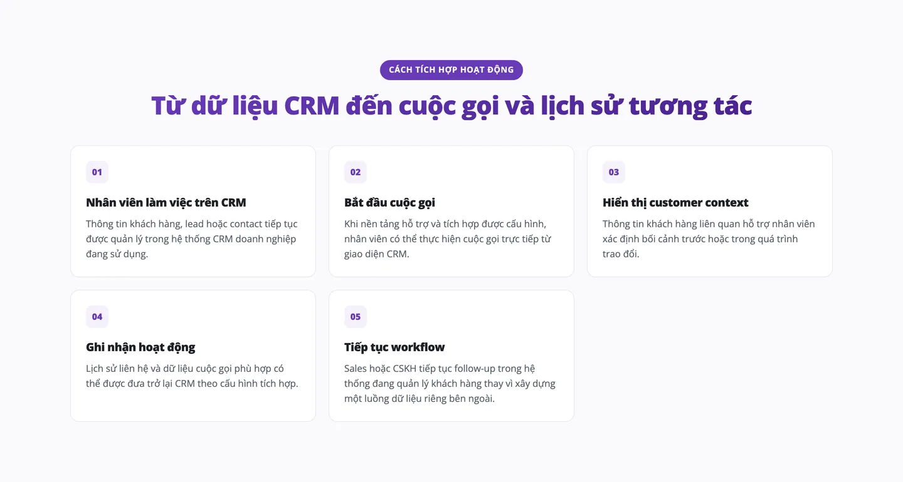

#### Section 07 — Ba năng lực cốt lõi giúp kết nối cuộc gọi với CRM

> NĂNG LỰC TÍCH HỢP Ba năng lực cốt lõi giúp kết nối cuộc gọi với CRM 01 Click-to-Call Thực hiện cuộc gọi từ CRM khi nền tảng và cấu hình tích hợp hỗ trợ, giúp giảm thao tác nhập số thủ công.
> 02 Customer Popup Hiển thị thông tin khách hàng liên quan khi có cuộc gọi để nhân viên có thêm context trước khi trao đổi.
> 03 Interaction History Sync Đồng bộ lịch sử liên hệ và dữ liệu cuộc gọi phù hợp về CRM theo phạm vi tích hợp được cấu hình.

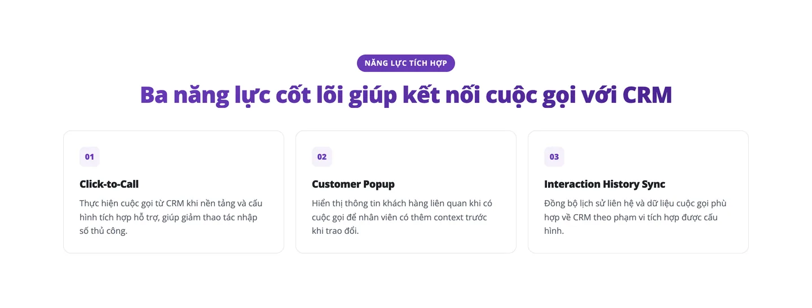

#### Section 08 — Click-to-Call

> CLICK-TO-CALL Click-to-Call Thực hiện cuộc gọi từ CRM khi nền tảng và cấu hình tích hợp hỗ trợ, giúp giảm thao tác nhập số thủ công. yourwebsite.vn/pricing Giao diện minh họa.
> Số liệu hiển thị là dữ liệu mẫu.

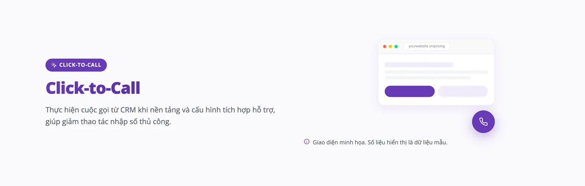

#### Section 09 — Giảm những điểm chuyển đổi thủ công trong quy trình Sales và CSKH

> TRƯỚC & SAU TÍCH HỢP Giảm những điểm chuyển đổi thủ công trong quy trình Sales và CSKH Trước tích hợp CRM Copy số điện thoại Công cụ gọi Cuộc gọi Ghi chú thủ công Quay lại CRM Cập nhật thủ công Sau tích hợp CRM Click-to-Call Cuộc gọi Dữ liệu tương tác Workflow CRM tiếp tục Ít điểm chuyển đổi thủ công hơn

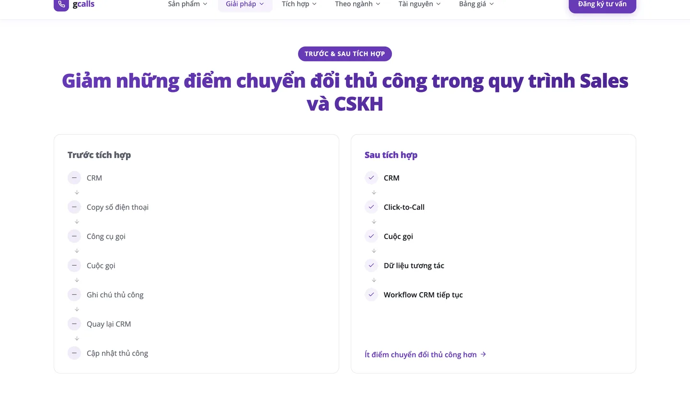

#### Section 10 — Triển khai theo nền tảng CRM doanh nghiệp đang sử dụng

> CRM ECOSYSTEM Triển khai theo nền tảng CRM doanh nghiệp đang sử dụng HubSpot Kết nối hoạt động nghe gọi với dữ liệu khách hàng trên HubSpot theo phạm vi tích hợp được xác nhận.
> Tìm hiểu tích hợp — HubSpot Salesforce Kết nối hoạt động nghe gọi với dữ liệu khách hàng trên Salesforce theo phạm vi tích hợp được xác nhận.
> Tìm hiểu tích hợp — Salesforce Zoho CRM Kết nối hoạt động nghe gọi với dữ liệu khách hàng trên Zoho CRM theo phạm vi tích hợp được xác nhận.
> Tìm hiểu tích hợp — Zoho CRM Khác Với hệ thống CRM khác, Gcalls sẽ khảo sát khả năng kết nối trước khi đề xuất phương án tích hợp.
> Tìm hiểu tích hợp — Khác Khả năng kết nối và phạm vi dữ liệu có thể khác nhau giữa các nền tảng, và được Gcalls xác nhận theo hệ thống thực tế của doanh nghiệp.

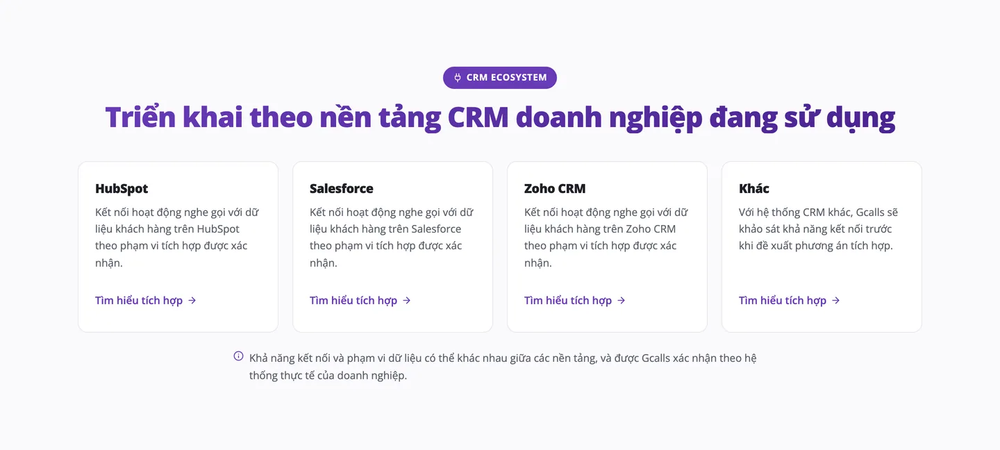

#### Section 11 — Biết khách hàng đang nói chuyện với mình là ai trước khi tiếp tục xử lý

> CUSTOMER CONTEXT Biết khách hàng đang nói chuyện với mình là ai trước khi tiếp tục xử lý Khi CRM và cuộc gọi được kết nối, nhân viên có thể sử dụng thông tin khách hàng và lịch sử liên quan để hiểu bối cảnh thay vì bắt đầu mỗi cuộc hội thoại từ đầu.
> Contact profile Lead / company context Hoạt động gần đây Lịch sử tương tác Thông tin cuộc gọi Danh bạ NM Nguyễn Văn Minh Công ty TNHH Bình Minh TL Trần Thị Lan CTCP Việt Phát PH Phạm Thu Hà Tập đoàn Sao Việt VT Võ Minh Tuấn StartupHub Việt Nam 4 liên hệ · trang 1/12 NM Nguyễn Văn Minh Demo Công ty TNHH Bình Minh Khách hàng mới Demo 0901 234 567 minh.nv@binhminh.vn 12 cuộc gọi Ghi chú gần nhất KH quan tâm gói Business.
> Hẹn demo thứ 5 tuần này.
> Cần gửi proposal trước ngày 25.
> Lịch sử hoạt động Gần nhất Cuộc gọi đến 09:31 7:18 phút · Ghi âm có sẵn Ghi chú 09:35 Cần gửi báo giá gia hạn trước 15h hôm nay Cuộc gọi đi Hôm qua 3:42 phút · Đã nghe máy Gắn nhãn VIP 2 ngày trước Thêm tag: VIP, Gia hạn Cập nhật lần cuối: Hôm nay 09:14 Xem đầy đủ Giao diện minh họa.
> Số liệu hiển thị là dữ liệu mẫu.

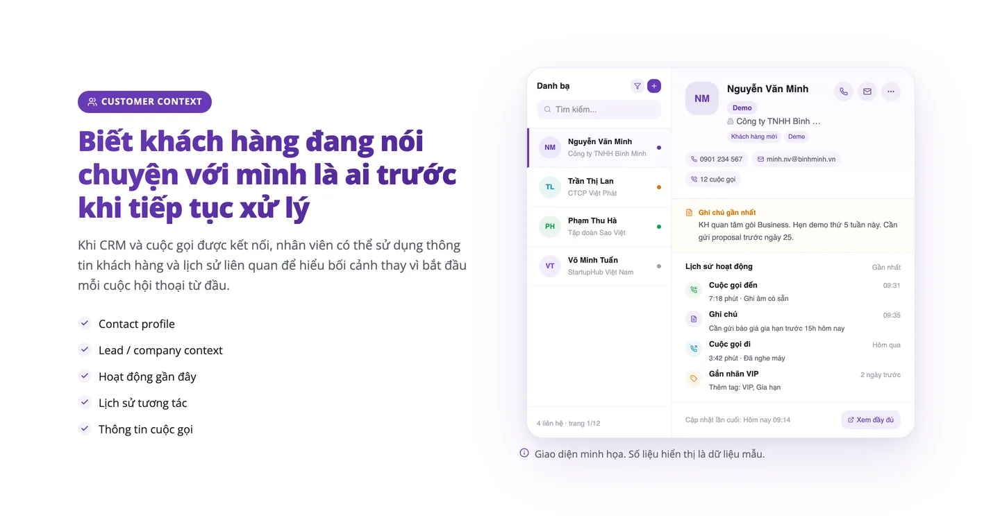

#### Section 12 — Giữ dữ liệu cuộc gọi gần với hồ sơ khách hàng

> DỮ LIỆU TƯƠNG TÁC Giữ dữ liệu cuộc gọi gần với hồ sơ khách hàng Tùy nền tảng và phạm vi tích hợp, lịch sử cuộc gọi và dữ liệu liên quan có thể được ghi nhận vào CRM để đội ngũ theo dõi hành trình khách hàng tập trung hơn.
> Phạm vi dữ liệu được xác định theo cấu hình tích hợp Khả năng ghi nhận tùy thuộc nền tảng CRM Chỉ đồng bộ dữ liệu phù hợp với quy trình doanh nghiệp Các trường cụ thể được thống nhất trong khảo sát kỹ thuật Timeline Cuộc gọi Tìm kiếm...
> Tất cả Đến Đi Nhỡ1 Hotline: 1900 1234 1900 5678 Nguyễn Văn Minh Khách hàng mới 0901 234 567 1900 1234 3:42 09:14 Trần Thị Lan Gia hạn 0912 345 678 1900 5678 Cần gửi báo giá gia hạn trước 15h 7:18 09:31 Lê Hoàng Phúc 0888 901 234 1900 1234 — 09:52 Phạm Thu Hà Demo 0976 543 210 1900 5678 12:05 10:08 Võ Minh Tuấn Upsell 0933 210 987 1900 1234 5:20 10:45 Trần Thị Lan7:18 3:09 Gia hạn Cần gửi báo giá gia hạn trước 15h Giao diện minh họa.
> Số liệu hiển thị là dữ liệu mẫu.

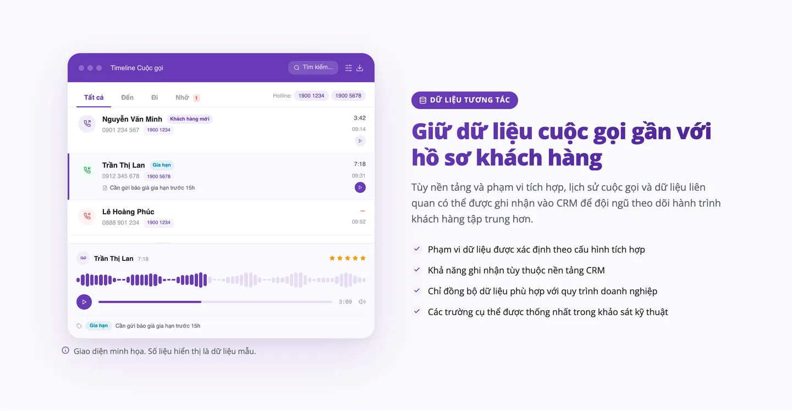

#### Section 13 — Giảm thao tác giữa gọi điện và quản lý cơ hội bán hàng

> SALES Giảm thao tác giữa gọi điện và quản lý cơ hội bán hàng Sales có thể bắt đầu cuộc gọi từ context của lead hoặc contact và tiếp tục follow-up trong CRM sau tương tác, thay vì duy trì một lịch sử cuộc gọi tách biệt.
> Prospecting Follow-up Lead context Call activity Pipeline workflow CUSTOMER SERVICE Đưa customer context vào quy trình tiếp nhận cuộc gọi Đội CSKH có thể sử dụng thông tin khách hàng và lịch sử tương tác từ CRM để hiểu bối cảnh trước khi tiếp tục hỗ trợ.
> Customer identification Previous interaction Context Follow-up Activity history

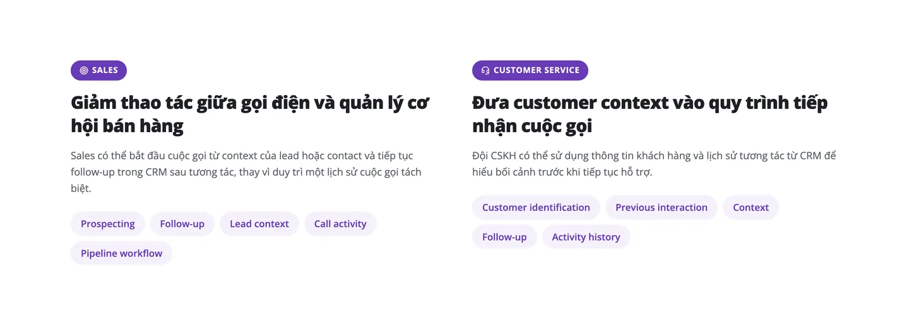

#### Section 14 — CRM, Helpdesk và Omnichannel giải quyết những phần khác nhau của hành trình khách hàng

> CHỌN ĐÚNG LUỒNG TÍCH HỢP CRM, Helpdesk và Omnichannel giải quyết những phần khác nhau của hành trình khách hàng CRM Integration Trang này Sales/CSKH đã vận hành quanh CRM record và dữ liệu khách hàng.
> Helpdesk Integration Đội hỗ trợ vận hành quanh ticket và quy trình xử lý yêu cầu.
> Tìm hiểu Helpdesk Integration Gcalls CX Doanh nghiệp cần tập trung giao tiếp trên nhiều kênh khách hàng.
> Tìm hiểu Gcalls CX Gcalls Plus Đội ngũ chủ yếu cần nghe gọi gọn nhẹ trên trình duyệt.
> Tìm hiểu Gcalls Plus Các luồng liên quan khác: Tổng đài tích hợp POS QA QC Center

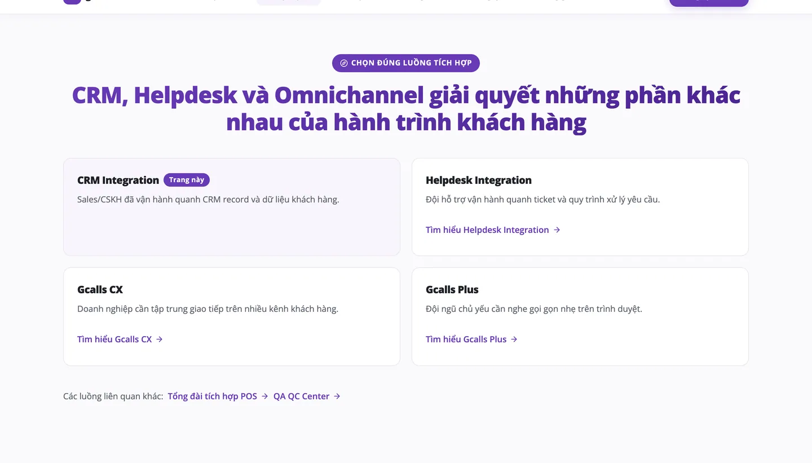

#### Section 15 — Từ kết nối đến vận hành theo quy trình rõ ràng

> TRIỂN KHAI Từ kết nối đến vận hành theo quy trình rõ ràng 01 Khảo sát hệ thống và quy trình hiện tại 02 Xác định nền tảng CRM và capability cần tích hợp 03 Kết nối hoặc cấu hình theo nhu cầu 04 Kiểm thử dữ liệu và luồng làm việc 05 Hướng dẫn người dùng 06 Đưa vào vận hành và theo dõi

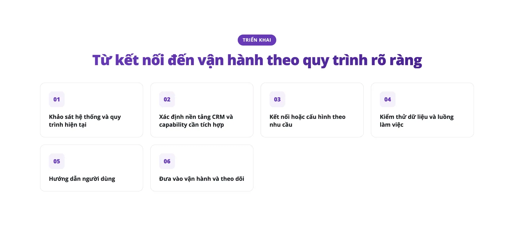

#### Section 16 — Tích hợp cần bắt đầu từ workflow thực tế của doanh nghiệp

> BỐI CẢNH TRIỂN KHAI Tích hợp cần bắt đầu từ workflow thực tế của doanh nghiệp Mỗi CRM có cấu trúc dữ liệu, permission và quy trình vận hành khác nhau.
> Vì vậy phạm vi tích hợp cần được xác định từ hệ thống đang sử dụng thay vì áp dụng một cấu hình giống nhau cho mọi doanh nghiệp.
> Trao đổi về hệ thống CRM đang sử dụng Đọc bài viết trên Blog Gcalls

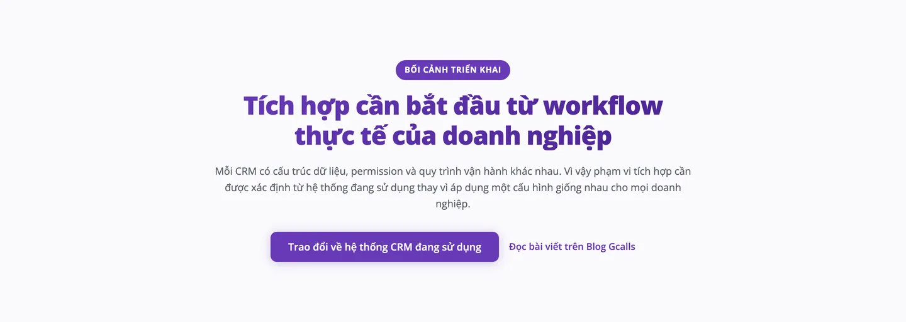

#### Section 17 — Chi phí phụ thuộc vào nền tảng, người dùng và phạm vi tích hợp

> CẤU HÌNH & CHI PHÍ Chi phí phụ thuộc vào nền tảng, người dùng và phạm vi tích hợp Cấu hình tổng đài tích hợp CRM có thể thay đổi theo số lượng người dùng, nền tảng CRM, hotline, dữ liệu cần đồng bộ và yêu cầu workflow.
> Gcalls sẽ xác định phạm vi kỹ thuật trước khi đưa ra báo giá chính thức. Ước tính cấu hình & chi phí Xem bảng giá Gcalls Chi phí phụ thuộc cấu hình.

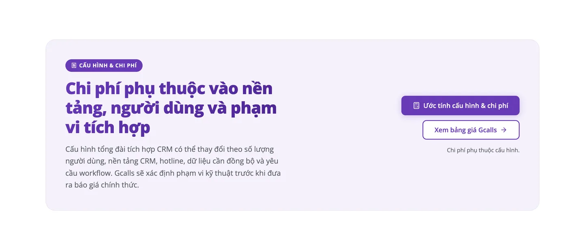

#### Section 18 — Câu hỏi thường gặp về tổng đài tích hợp CRM

> CÂU HỎI THƯỜNG GẶP Câu hỏi thường gặp về tổng đài tích hợp CRM Tổng đài tích hợp CRM là gì?
> Tổng đài tích hợp CRM kết nối chức năng nghe gọi với hệ thống quản lý khách hàng để nhân viên có thể thực hiện cuộc gọi, nhận biết khách hàng và theo dõi lịch sử tương tác trong cùng quy trình dữ liệu.
> Gcalls tích hợp được những CRM nào?
> Click-to-Call là gì?
> Khi có cuộc gọi đến, CRM có thể hiển thị thông tin khách hàng không?
> Lịch sử cuộc gọi có được đồng bộ về CRM không?
> Tích hợp CRM có thay thế CRM hiện tại không?

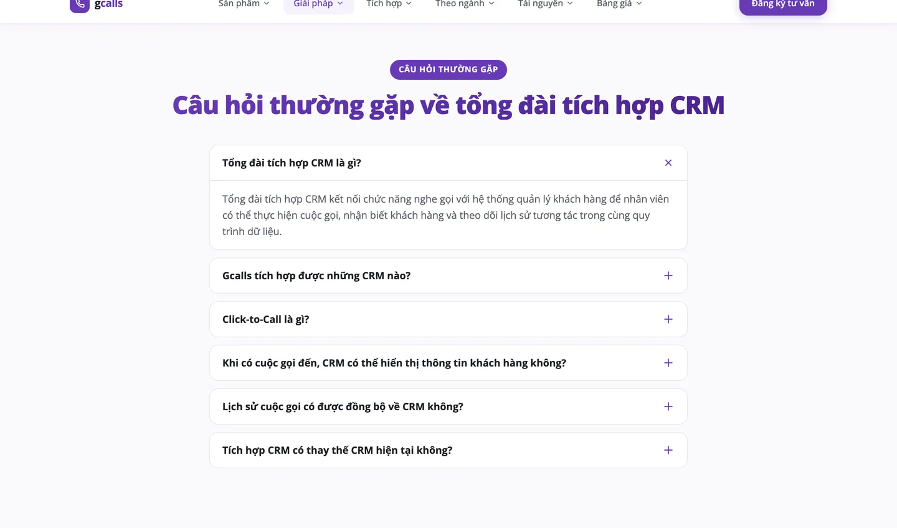

#### Section 19 — Đưa cuộc gọi vào đúng quy trình Sales và CSKH đang sử dụng

> CRM INTEGRATION Đưa cuộc gọi vào đúng quy trình Sales và CSKH đang sử dụng Chia sẻ nền tảng CRM, số lượng người dùng và workflow hiện tại để Gcalls xác định cách kết nối phù hợp.
> Tư vấn tích hợp CRM Ước tính cấu hình 028 7302 5469

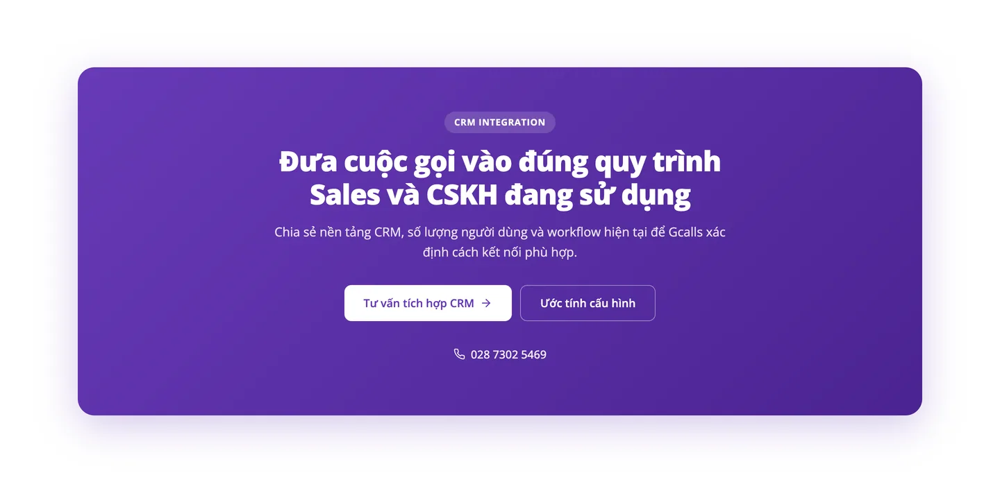

---

## Tổng đài tích hợp Helpdesk

- **Đường dẫn:** `/tong-dai-tich-hop-helpdesk/`
- **Nhóm:** Giải pháp
- **Số section:** 17

📄 Ảnh toàn trang (full-page)

### Các section

#### Section 01

> Trang chủ Giải pháp Tổng đài tích hợp Helpdesk

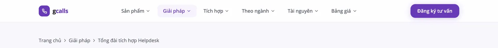

#### Section 02 — Tổng đài tích hợp Helpdesk – kết nối cuộc gọi với ticket và lịch sử hỗ trợ

> GCALLS • HELPDESK INTEGRATION Tổng đài tích hợp Helpdesk – kết nối cuộc gọi với ticket và lịch sử hỗ trợ Đưa cuộc gọi vào quy trình hỗ trợ để nhân viên có thêm context khách hàng, theo dõi ticket và lịch sử tương tác tập trung hơn thay vì phải chuyển đổi liên tục giữa Helpdesk và hệ thống nghe gọi.
> Cuộc gọi gắn với quy trình hỗ trợ — Kết nối hoạt động nghe gọi với hồ sơ hoặc ticket hỗ trợ theo khả năng của nền tảng và cấu hình tích hợp.
> Có thêm context khi xử lý ticket — Giúp nhân viên xem thông tin và lịch sử liên quan trước khi tiếp tục hỗ trợ khách hàng.
> Theo dõi lịch sử hỗ trợ tập trung hơn — Dữ liệu cuộc gọi phù hợp có thể được ghi nhận cùng workflow Helpdesk để đội ngũ tiếp tục xử lý thuận tiện hơn.
> Tư vấn tích hợp Helpdesk Khám phá cách tích hợp hoạt động GCALLS · CUỘC GỌI ĐẾN KH KH #2318 Đang kết nối · Agent 04 Lớp tích hợp Gcalls HỒ SƠ HỖ TRỢ Đã liên kết Cuộc gọi đến Hôm nay Yêu cầu hỗ trợ đang xử lý Đang mở Tương tác trước đó 2 lần Giao diện minh họa.
> Số liệu hiển thị là dữ liệu mẫu.

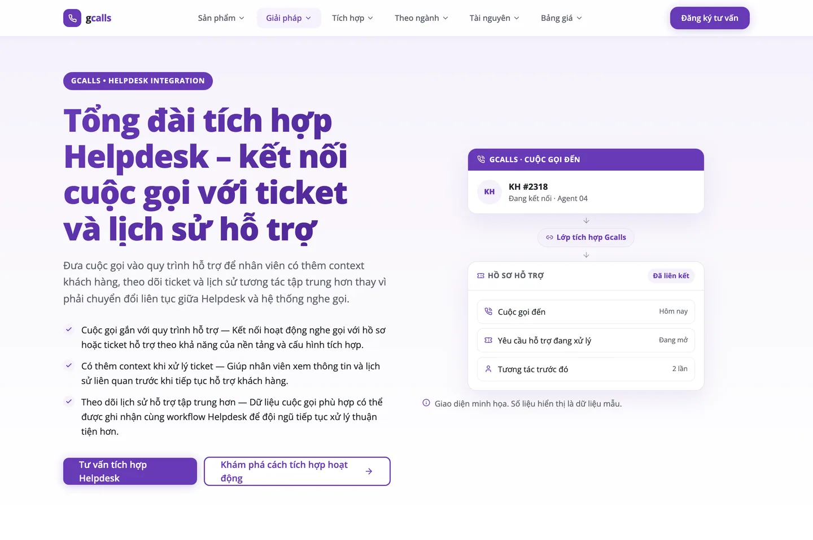

#### Section 03 — Tổng đài tích hợp Helpdesk là gì?

> ĐỊNH NGHĨA Tổng đài tích hợp Helpdesk là gì?
> Tổng đài tích hợp Helpdesk là mô hình kết nối hoạt động nghe gọi với hệ thống quản lý yêu cầu hỗ trợ để nhân viên có thể sử dụng cuộc gọi, ticket và lịch sử tương tác trong cùng một quy trình chăm sóc khách hàng.
> Phạm vi đồng bộ phụ thuộc vào nền tảng Helpdesk, API và cấu hình tích hợp thực tế của doanh nghiệp.

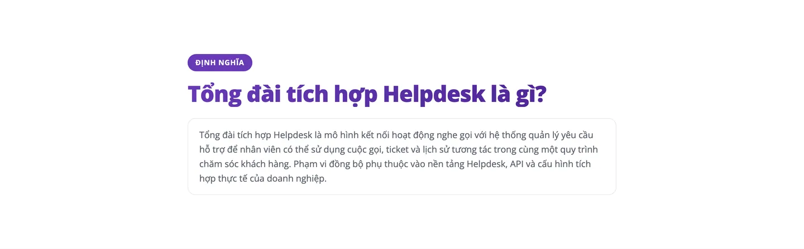

#### Section 04 — Khi cuộc gọi và ticket nằm ở hai nơi, đội CSKH phải tự ghép lại hành trình hỗ trợ

> BÀI TOÁN HỖ TRỢ KHÁCH HÀNG Khi cuộc gọi và ticket nằm ở hai nơi, đội CSKH phải tự ghép lại hành trình hỗ trợ 01 Nhân viên phải chuyển đổi giữa nhiều công cụ Agent tiếp nhận cuộc gọi trên một hệ thống nhưng lại quản lý yêu cầu hỗ trợ trên Helpdesk, khiến workflow bị chia thành nhiều bước.
> 02 Ticket thiếu context cuộc gọi Nếu dữ liệu nghe gọi không gắn với hồ sơ hỗ trợ, nhân viên có thể phải tìm lại thông tin trước khi tiếp tục xử lý.
> 03 Lịch sử hỗ trợ bị phân mảnh Cuộc gọi, ticket, ghi chú và các lần tương tác khác nằm ở nhiều nơi khiến quá trình hỗ trợ khó được theo dõi xuyên suốt.
> 04 Nhập lại thông tin làm tăng thao tác thủ công Khi hai hệ thống không kết nối, nhân viên có thể phải ghi lại cùng một nội dung nhiều lần để duy trì lịch sử hỗ trợ.

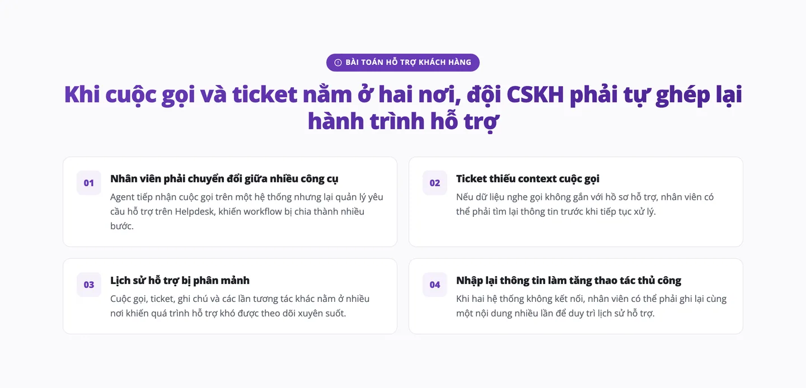

#### Section 05 — Đưa cuộc gọi vào quy trình xử lý yêu cầu hỗ trợ

> HELPDESK + CALLING Đưa cuộc gọi vào quy trình xử lý yêu cầu hỗ trợ 01 Customer Khách hàng cần được hỗ trợ.
> 02 Call Cuộc gọi diễn ra qua hệ thống Gcalls.
> 03 Identification / Context Thông tin liên quan giúp agent xác định bối cảnh.
> 04 Support record / ticket Cuộc gọi được gắn với hồ sơ hỗ trợ theo cấu hình.
> 05 Interaction history Lịch sử liên hệ phù hợp được ghi nhận.
> 06 Follow-up Đội ngũ tiếp tục xử lý trong Helpdesk.

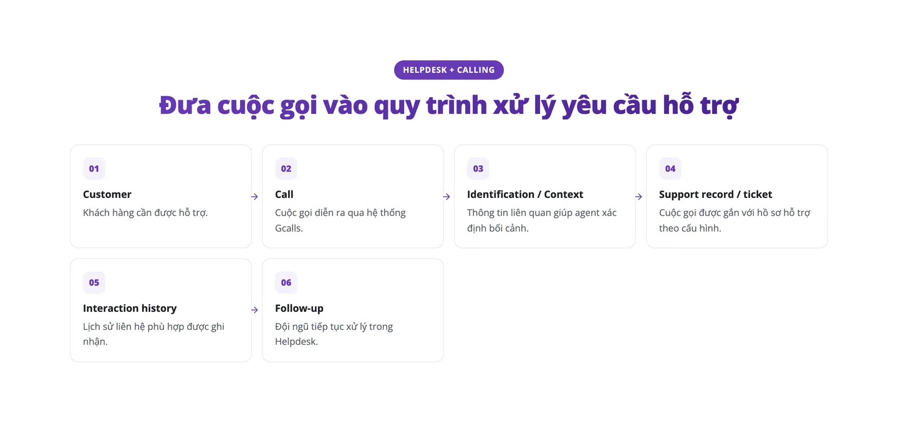

#### Section 06 — Từ cuộc gọi đến ticket và bước xử lý tiếp theo

> CÁCH TÍCH HỢP HOẠT ĐỘNG Từ cuộc gọi đến ticket và bước xử lý tiếp theo 01 Khách hàng liên hệ Khách hàng gọi đến hoặc nhân viên thực hiện cuộc gọi trong phạm vi giải pháp được triển khai.
> 02 Xác định customer context Thông tin liên quan giúp nhân viên hiểu khách hàng hoặc yêu cầu hỗ trợ đang xử lý.
> 03 Kết nối với hồ sơ Helpdesk Dữ liệu cuộc gọi phù hợp được liên kết với workflow hỗ trợ theo khả năng nền tảng và cấu hình tích hợp.
> 04 Cập nhật lịch sử tương tác Thông tin liên quan đến cuộc gọi có thể được ghi nhận để đội ngũ tiếp tục theo dõi trong quy trình hỗ trợ.
> 05 Tiếp tục ticket / follow-up Agent xử lý các bước tiếp theo trong Helpdesk thay vì duy trì một lịch sử riêng bên ngoài hệ thống.

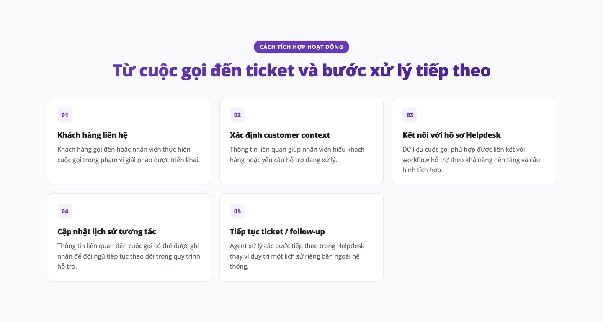

#### Section 07 — Kết nối cuộc gọi với những dữ liệu đội CSKH cần để xử lý ticket

> NĂNG LỰC TÍCH HỢP Kết nối cuộc gọi với những dữ liệu đội CSKH cần để xử lý ticket 01 Call Context Đưa thông tin liên quan đến cuộc gọi vào bối cảnh hỗ trợ để agent dễ xác định khách hàng và yêu cầu đang xử lý.
> 02 Ticket / Support Record Connection Liên kết dữ liệu cuộc gọi với ticket hoặc hồ sơ hỗ trợ khi nền tảng Helpdesk và cấu hình tích hợp cho phép.
> 03 Interaction History Ghi nhận lịch sử liên hệ phù hợp trong workflow hỗ trợ để nhân viên có thể tiếp tục xử lý với nhiều context hơn.
> 04 Customer Identification Hỗ trợ nhận biết khách hàng hoặc hồ sơ liên quan khi dữ liệu và nền tảng tích hợp cho phép.

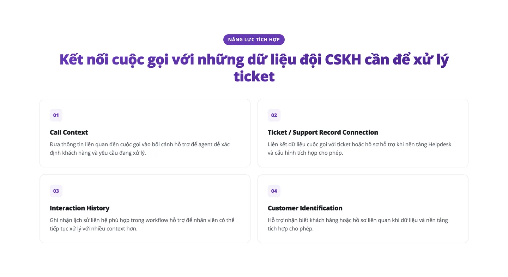

#### Section 08 — Hiểu lịch sử hỗ trợ trước khi tiếp tục cuộc hội thoại

> SUPPORT CONTEXT Hiểu lịch sử hỗ trợ trước khi tiếp tục cuộc hội thoại Khi ticket, thông tin khách hàng và lịch sử liên quan được đặt gần dữ liệu cuộc gọi, agent có thể hiểu bối cảnh tốt hơn trước khi phản hồi hoặc follow-up.
> Customer identity Ticket đang xử lý Ticket trước đó Tương tác gần đây Ghi chú Trạng thái hiện tại CONTEXT HỖ TRỢ Khách hàng KH #2318 Ticket đang xử lý Đang mở Ticket trước đó 2 Tương tác gần đây Cuộc gọi · Hôm nay Trạng thái Chờ phản hồi Giao diện minh họa.
> Số liệu hiển thị là dữ liệu mẫu.

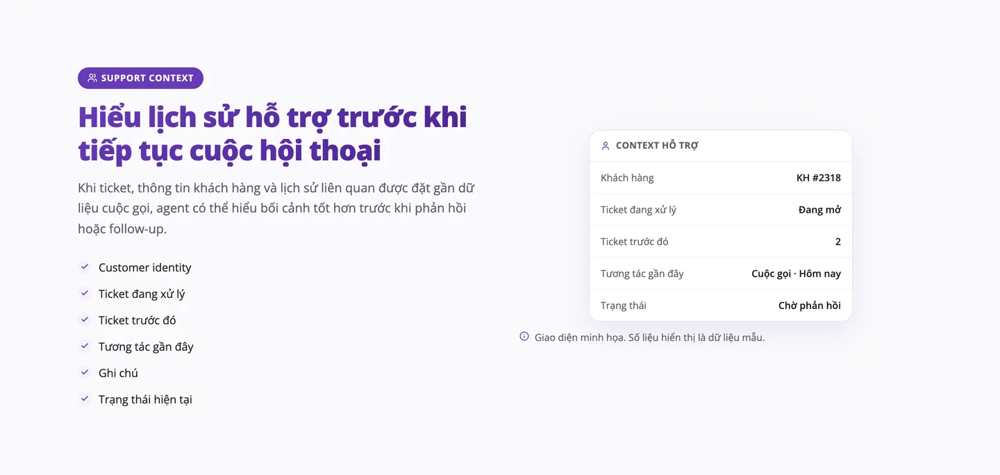

#### Section 09 — Giảm những bước chuyển đổi thủ công trong quy trình CSKH

> TRƯỚC & SAU TÍCH HỢP Giảm những bước chuyển đổi thủ công trong quy trình CSKH Trước tích hợp Hệ thống nghe gọi Xác định khách hàng thủ công Mở Helpdesk Tìm ticket Nhập ghi chú Tiếp tục hỗ trợ Sau tích hợp Cuộc gọi / workflow Helpdesk Customer context Ticket hoặc hồ sơ hỗ trợ liên quan Lịch sử tương tác Follow-up Ít điểm chuyển đổi thủ công hơn

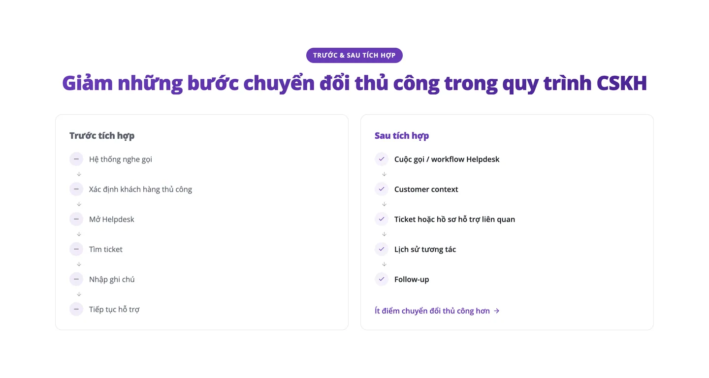

#### Section 10 — Triển khai theo Helpdesk doanh nghiệp đang sử dụng

> HELPDESK ECOSYSTEM Triển khai theo Helpdesk doanh nghiệp đang sử dụng Freshdesk Kết nối hoạt động nghe gọi với quy trình hỗ trợ trên Freshdesk theo phạm vi tích hợp được xác nhận.
> Tìm hiểu tích hợp — Freshdesk Zendesk Kết nối hoạt động nghe gọi với quy trình hỗ trợ trên Zendesk theo phạm vi tích hợp được xác nhận.
> Tìm hiểu tích hợp — Zendesk Khác Với Helpdesk khác, Gcalls sẽ khảo sát API và khả năng kết nối trước khi đề xuất phương án tích hợp.
> Tìm hiểu tích hợp — Khác Khả năng kết nối, dữ liệu khả dụng và luồng xử lý có thể khác nhau giữa từng nền tảng Helpdesk, và được Gcalls xác nhận theo hệ thống thực tế của doanh nghiệp.

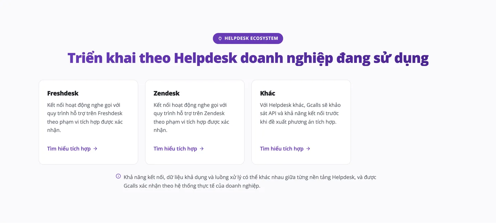

#### Section 11 — Phù hợp với những đội hỗ trợ cần theo dõi cuộc gọi và ticket trong cùng hành trình

> TÌNH HUỐNG SỬ DỤNG Phù hợp với những đội hỗ trợ cần theo dõi cuộc gọi và ticket trong cùng hành trình SaaS Customer Support Hỗ trợ agent theo dõi cuộc gọi cùng ticket và lịch sử xử lý khi khách hàng cần hỗ trợ sản phẩm hoặc dịch vụ.
> E-commerce Customer Service Giúp đội CSKH kết nối cuộc gọi với yêu cầu hỗ trợ để tiếp tục quá trình xử lý khách hàng có context hơn.
> Giải pháp cho Thương mại điện tử Service Operations Phù hợp với doanh nghiệp dịch vụ có nhiều yêu cầu cần follow-up sau khi khách hàng gọi đến.
> BPO / Support Center Hỗ trợ đội vận hành xử lý lượng lớn cuộc gọi và ticket theo workflow có cấu trúc hơn.
> Giải pháp cho BPO

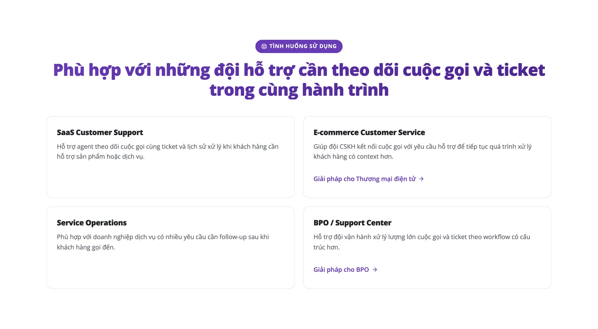

#### Section 12 — CRM, Helpdesk và Omnichannel giải quyết những phần khác nhau của hành trình khách hàng

> CHỌN ĐÚNG LUỒNG TÍCH HỢP CRM, Helpdesk và Omnichannel giải quyết những phần khác nhau của hành trình khách hàng Helpdesk Integration Trang này Đội hỗ trợ vận hành quanh ticket, case và quy trình xử lý yêu cầu.
> CRM Integration Sales/CSKH chủ yếu vận hành quanh CRM record, lead và dữ liệu khách hàng.
> Tìm hiểu CRM Integration Gcalls CX Doanh nghiệp cần tập trung hội thoại trên nhiều kênh khách hàng.
> Tìm hiểu Gcalls CX Gcalls Plus Đội ngũ chủ yếu cần nghe gọi gọn nhẹ trên trình duyệt.
> Tìm hiểu Gcalls Plus Các luồng liên quan khác: Tổng đài tích hợp POS QA QC Center

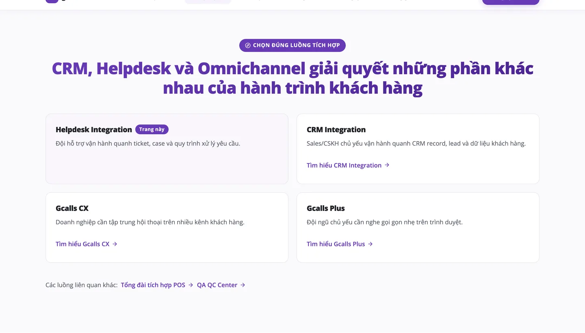

#### Section 13 — Kết nối Helpdesk theo workflow hỗ trợ doanh nghiệp đang sử dụng

> TRIỂN KHAI Kết nối Helpdesk theo workflow hỗ trợ doanh nghiệp đang sử dụng 01 Khảo sát Helpdesk và quy trình hiện tại 02 Xác định dữ liệu/capability cần kết nối 03 Thiết kế luồng cuộc gọi và ticket 04 Cấu hình tích hợp 05 Kiểm thử dữ liệu và workflow 06 Hướng dẫn đội CSKH 07 Đưa vào vận hành

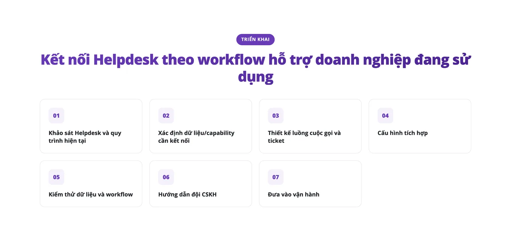

#### Section 14 — Mỗi Helpdesk có cấu trúc ticket và dữ liệu khác nhau

> TRIỂN KHAI THEO WORKFLOW THỰC TẾ Mỗi Helpdesk có cấu trúc ticket và dữ liệu khác nhau Field, permission, API và quy trình xử lý khác nhau giữa từng nền tảng.
> Vì vậy phạm vi tích hợp cần được xác định từ hệ thống doanh nghiệp đang sử dụng thay vì áp dụng cùng một cấu hình cho mọi tổ chức.
> Trao đổi về Helpdesk đang sử dụng Đọc bài viết trên Blog Gcalls

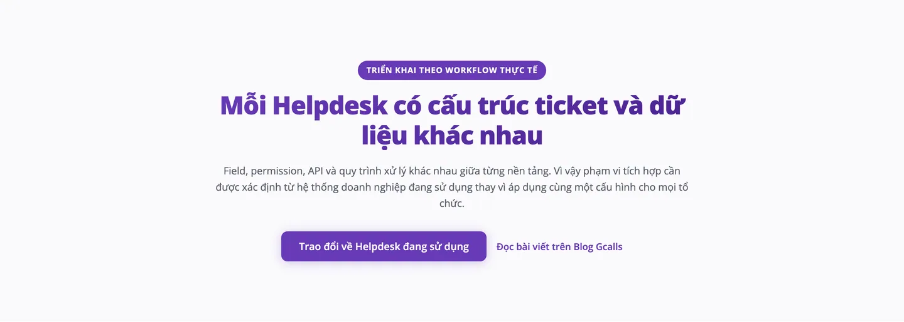

#### Section 15 — Chi phí phụ thuộc vào nền tảng, người dùng và phạm vi tích hợp

> CẤU HÌNH & CHI PHÍ Chi phí phụ thuộc vào nền tảng, người dùng và phạm vi tích hợp Phạm vi triển khai có thể thay đổi theo Helpdesk doanh nghiệp đang sử dụng, số lượng người dùng, hotline, dữ liệu cần đồng bộ và workflow hỗ trợ.
> Gcalls sẽ xác định yêu cầu kỹ thuật trước khi đưa ra báo giá chính thức. Ước tính cấu hình & chi phí Xem bảng giá Gcalls Chi phí phụ thuộc cấu hình.

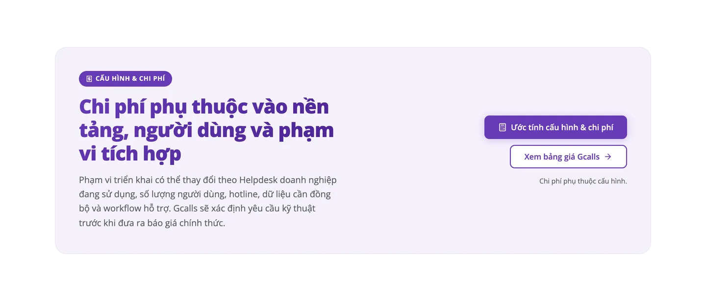

#### Section 16 — Câu hỏi thường gặp về tổng đài tích hợp Helpdesk

> CÂU HỎI THƯỜNG GẶP Câu hỏi thường gặp về tổng đài tích hợp Helpdesk Tổng đài tích hợp Helpdesk là gì?
> Tổng đài tích hợp Helpdesk kết nối hoạt động nghe gọi với hệ thống quản lý yêu cầu hỗ trợ để nhân viên có thể sử dụng cuộc gọi, ticket và lịch sử tương tác trong cùng một quy trình CSKH.
> Gcalls có thể tích hợp với Helpdesk nào?
> Cuộc gọi có thể được gắn với ticket không?
> Gcalls có tự động tạo ticket sau cuộc gọi không?
> Lịch sử cuộc gọi có được lưu trong Helpdesk không?
> Helpdesk Integration khác Gcalls CX như thế nào?

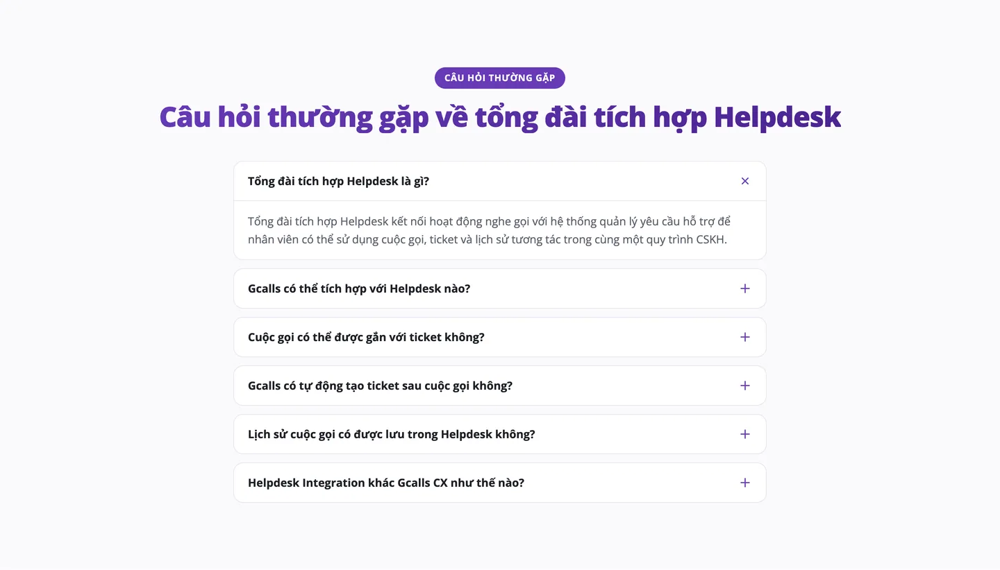

#### Section 17 — Đưa cuộc gọi vào đúng quy trình hỗ trợ đội CSKH đang sử dụng

> HELPDESK INTEGRATION Đưa cuộc gọi vào đúng quy trình hỗ trợ đội CSKH đang sử dụng Chia sẻ nền tảng Helpdesk, cấu trúc ticket và workflow hiện tại để Gcalls xác định cách tích hợp phù hợp.
> Tư vấn tích hợp Helpdesk Ước tính cấu hình 028 7302 5469

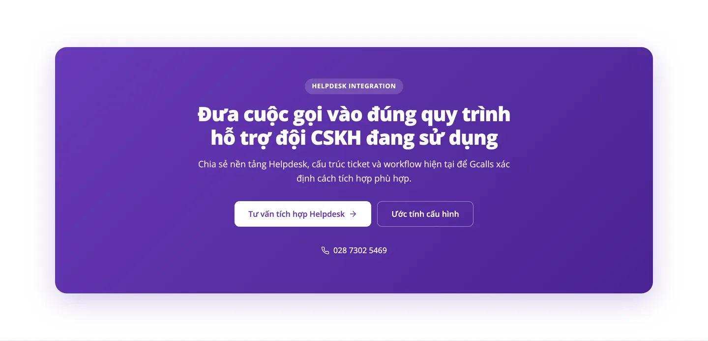

---

## Tổng đài tích hợp POS

- **Đường dẫn:** `/tong-dai-tich-hop-pos/`
- **Nhóm:** Giải pháp
- **Số section:** 17

📄 Ảnh toàn trang (full-page)

### Các section

#### Section 01

> Trang chủ Giải pháp Tổng đài tích hợp POS

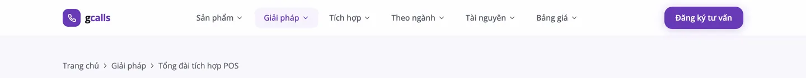

#### Section 02 — Tổng đài tích hợp POS – kết nối cuộc gọi với dữ liệu bán hàng

> GCALLS • POS INTEGRATION Tổng đài tích hợp POS – kết nối cuộc gọi với dữ liệu bán hàng Kết nối hoạt động nghe gọi với dữ liệu khách hàng và thông tin bán hàng phù hợp để đội Sales/CSKH có thêm context khi tư vấn, xử lý đơn hàng hoặc chăm sóc sau mua.
> Nhận biết customer context — Thông tin liên quan giúp nhân viên hiểu khách hàng trước hoặc trong quá trình trao đổi.
> Tra cứu dữ liệu bán hàng thuận tiện hơn — Khi hệ thống và cấu hình tích hợp hỗ trợ, dữ liệu liên quan tới khách hàng hoặc giao dịch có thể được đưa gần hơn với quy trình gọi.
> Theo dõi quá trình chăm sóc — Lịch sử tương tác phù hợp có thể được ghi nhận để đội ngũ tiếp tục follow-up trong quy trình đang sử dụng.
> Tư vấn tích hợp POS Khám phá cách tích hợp hoạt động GCALLS · CUỘC GỌI KH KH #5074 Đang trao đổi · Agent 07 SALES CONTEXT Theo cấu hình Hồ sơ khách hàng liên quan Dữ liệu bán hàng phù hợp Lịch sử tương tác Trường dữ liệu cụ thể phụ thuộc vào hệ thống và API.
> Giao diện minh họa.
> Số liệu hiển thị là dữ liệu mẫu.

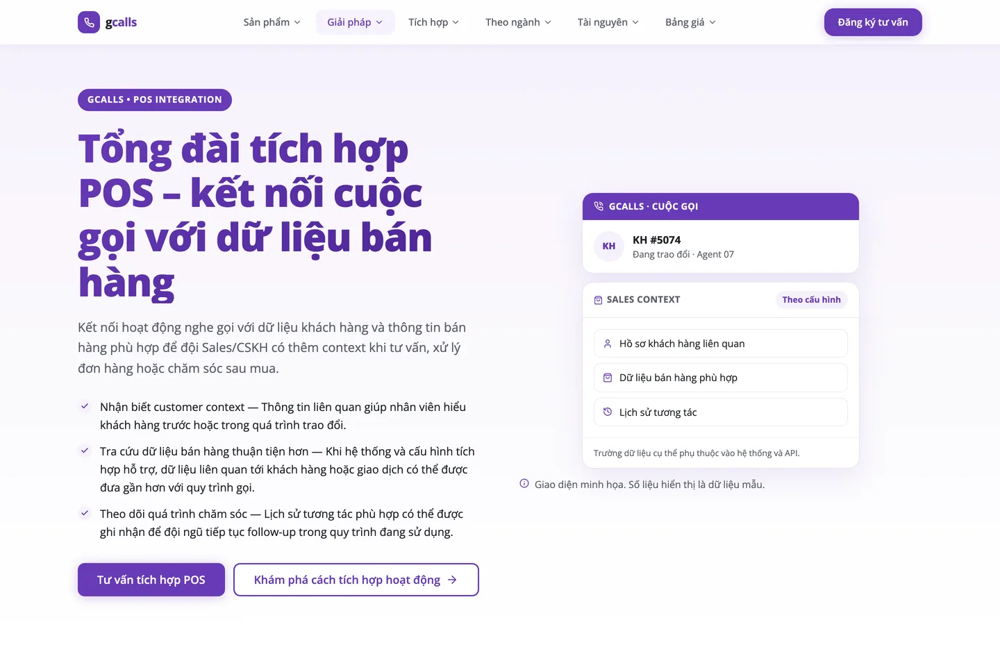

#### Section 03 — Tổng đài tích hợp POS là gì?

> ĐỊNH NGHĨA Tổng đài tích hợp POS là gì?
> Tổng đài tích hợp POS là mô hình kết nối hoạt động nghe gọi với hệ thống bán hàng để nhân viên có thể sử dụng thông tin khách hàng, dữ liệu bán hàng phù hợp và lịch sử tương tác trong cùng quy trình chăm sóc.
> Phạm vi dữ liệu hiển thị hoặc đồng bộ phụ thuộc vào nền tảng POS, API và cấu hình tích hợp thực tế của doanh nghiệp.

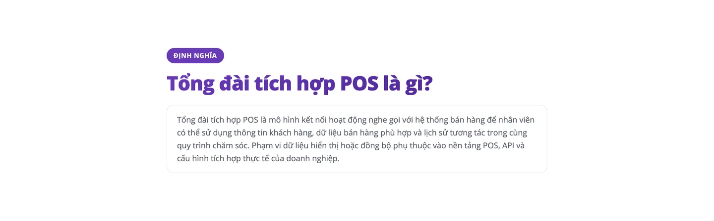

#### Section 04 — Khi dữ liệu bán hàng và cuộc gọi nằm ở hai nơi, nhân viên phải tự tìm context trong lúc khách hàng đang chờ

> BÀI TOÁN BÁN HÀNG Khi dữ liệu bán hàng và cuộc gọi nằm ở hai nơi, nhân viên phải tự tìm context trong lúc khách hàng đang chờ 01 Khó nhận biết khách hàng khi có cuộc gọi Nếu hệ thống nghe gọi không kết nối với dữ liệu bán hàng, nhân viên cần tra cứu thủ công trước khi hiểu khách hàng đang liên hệ.
> 02 Dữ liệu mua hàng không nằm cạnh cuộc hội thoại Thông tin giao dịch và lịch sử gọi bị tách rời khiến nhân viên mất thêm thời gian tìm context phù hợp.
> 03 Chăm sóc sau mua bị phân mảnh Lịch sử bán hàng và lịch sử tương tác nằm ở nhiều nơi khiến quá trình follow-up khó được theo dõi liên tục.
> 04 Nhập lại thông tin tạo thêm thao tác Nhân viên có thể phải ghi chép hoặc chuyển dữ liệu giữa hệ thống gọi và phần mềm bán hàng nếu hai luồng không kết nối.

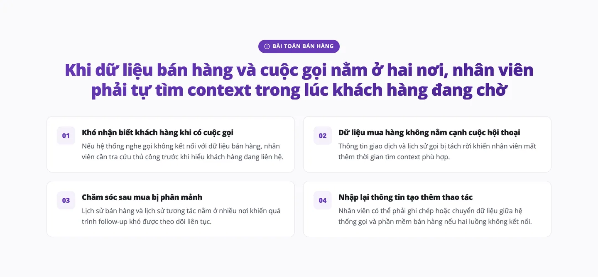

#### Section 05 — Đưa dữ liệu bán hàng vào đúng thời điểm khách hàng đang tương tác

> POS + CALLING Đưa dữ liệu bán hàng vào đúng thời điểm khách hàng đang tương tác 01 Customer Khách hàng cần tư vấn hoặc hỗ trợ.
> 02 Call Cuộc gọi diễn ra qua hệ thống Gcalls.
> 03 Identification Hồ sơ liên quan được xác định khi cấu hình cho phép.
> 04 Sales / Order Context Dữ liệu bán hàng phù hợp được đưa gần quy trình gọi.
> 05 Conversation Nhân viên trao đổi với nhiều context hơn.
> 06 Interaction History Lịch sử tương tác phù hợp được ghi nhận.
> 07 Follow-up Đội ngũ tiếp tục chăm sóc khách hàng.

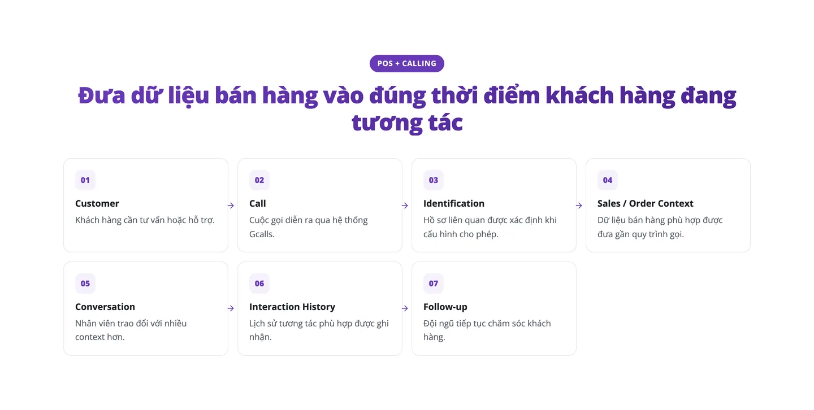

#### Section 06 — Từ cuộc gọi đến customer context và bước chăm sóc tiếp theo

> CÁCH TÍCH HỢP HOẠT ĐỘNG Từ cuộc gọi đến customer context và bước chăm sóc tiếp theo 01 Khách hàng liên hệ Khách hàng gọi đến hoặc nhân viên thực hiện cuộc gọi trong quy trình bán hàng/chăm sóc.
> 02 Xác định khách hàng Dữ liệu liên quan hỗ trợ hệ thống xác định hồ sơ khách hàng khi nền tảng và cấu hình tích hợp cho phép.
> 03 Hiển thị sales context phù hợp Nhân viên có thể xem thông tin liên quan từ hệ thống bán hàng theo phạm vi dữ liệu được tích hợp.
> 04 Thực hiện cuộc hội thoại Agent tư vấn, xử lý yêu cầu hoặc chăm sóc khách hàng với nhiều context hơn.
> 05 Ghi nhận tương tác Lịch sử cuộc gọi hoặc dữ liệu phù hợp có thể được ghi nhận theo phạm vi tích hợp.
> 06 Tiếp tục follow-up Đội ngũ tiếp tục quá trình bán hàng hoặc chăm sóc trong workflow doanh nghiệp đang sử dụng.

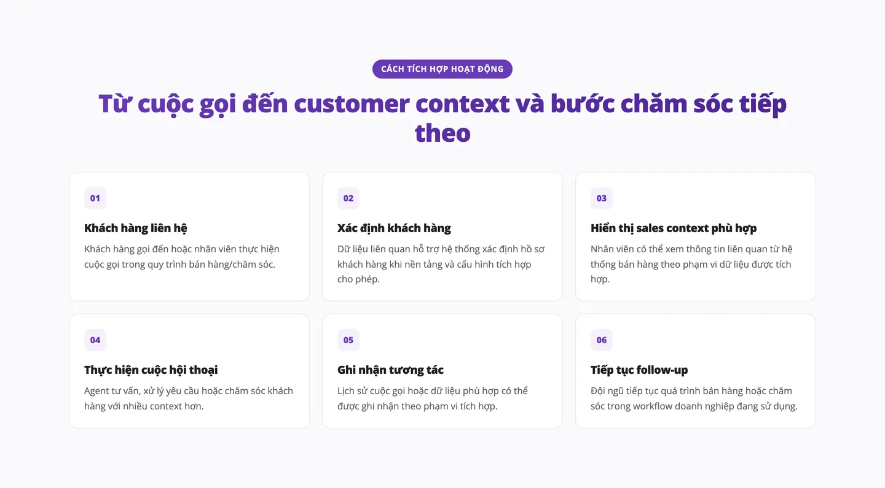

#### Section 07 — Kết nối cuộc gọi với những dữ liệu đội bán hàng và CSKH cần

> NĂNG LỰC TÍCH HỢP Kết nối cuộc gọi với những dữ liệu đội bán hàng và CSKH cần 01 Customer Identification Hỗ trợ nhận biết khách hàng hoặc hồ sơ liên quan khi dữ liệu và nền tảng tích hợp cho phép.
> 02 Customer Context Đưa thông tin khách hàng phù hợp vào bối cảnh cuộc gọi để nhân viên hiểu người đang liên hệ.
> 03 Sales Data Context Hiển thị dữ liệu bán hàng phù hợp theo khả năng của nền tảng và phạm vi tích hợp được cấu hình.
> 04 Interaction History Ghi nhận hoặc liên kết lịch sử tương tác để hỗ trợ quá trình tư vấn và chăm sóc tiếp theo.

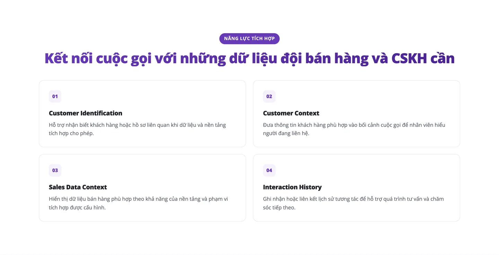

#### Section 08 — Sử dụng dữ liệu phù hợp để hiểu khách hàng trước khi tư vấn

> SALES CONTEXT Sử dụng dữ liệu phù hợp để hiểu khách hàng trước khi tư vấn Thông tin khách hàng và dữ liệu bán hàng liên quan giúp nhân viên có thêm bối cảnh khi tư vấn, hỗ trợ hoặc tiếp tục quá trình chăm sóc.
> Hồ sơ khách hàng liên quan Dữ liệu bán hàng phù hợp Lịch sử tương tác Ghi chú liên quan Các trường dữ liệu cụ thể phụ thuộc vào hệ thống bán hàng, API và phạm vi tích hợp, và được Gcalls xác định trong quá trình khảo sát kỹ thuật.
> SALES CONTEXT Theo cấu hình Hồ sơ khách hàng liên quan Dữ liệu bán hàng phù hợp Lịch sử tương tác Trường dữ liệu cụ thể phụ thuộc vào hệ thống và API.
> Giao diện minh họa.
> Số liệu hiển thị là dữ liệu mẫu.

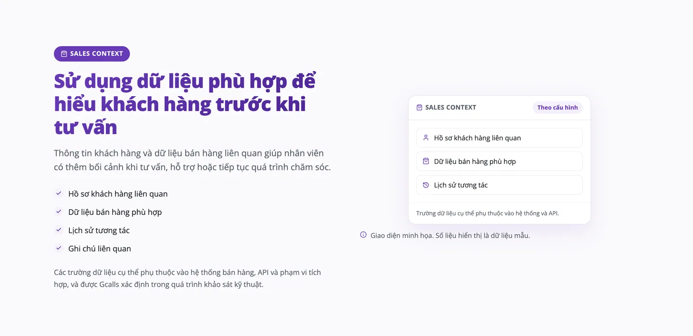

#### Section 09 — Giảm việc tra cứu thủ công giữa cuộc gọi và hệ thống bán hàng

> TRƯỚC & SAU TÍCH HỢP Giảm việc tra cứu thủ công giữa cuộc gọi và hệ thống bán hàng Trước tích hợp Cuộc gọi Hỏi lại thông tin khách hàng Mở hệ thống bán hàng Tra cứu thủ công Xem sales context Quay lại quy trình gọi Ghi chú tương tác thủ công Sau tích hợp Cuộc gọi Customer identification Sales context phù hợp Cuộc hội thoại Lịch sử tương tác Follow-up Ít điểm chuyển đổi thủ công hơn

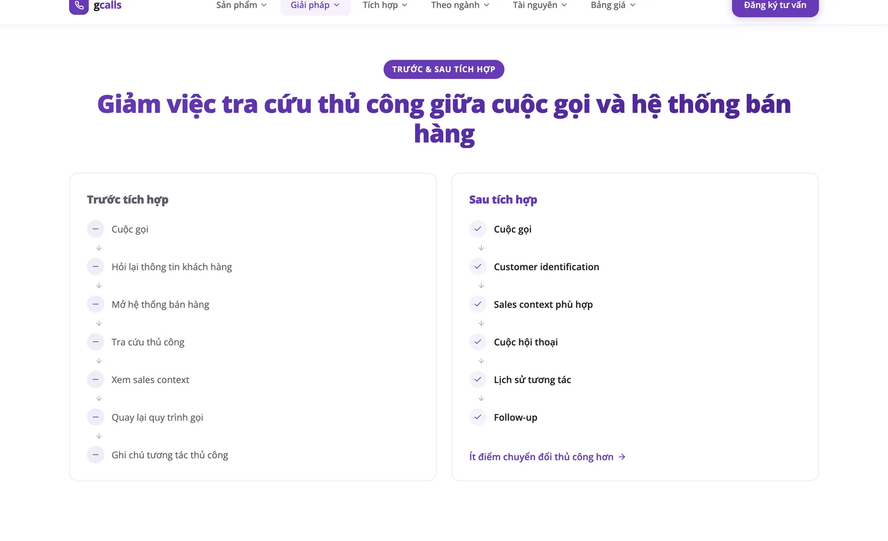

#### Section 10 — Kết nối cuộc gọi với quá trình chăm sóc khách hàng tại cửa hàng hoặc chuỗi

> BÁN LẺ Kết nối cuộc gọi với quá trình chăm sóc khách hàng tại cửa hàng hoặc chuỗi Đội bán hàng và CSKH có thể sử dụng customer context liên quan để hiểu khách hàng trước khi tư vấn hoặc tiếp tục hỗ trợ sau mua.
> Customer inquiry Tư vấn sản phẩm / dịch vụ Hỗ trợ sau mua Follow-up THƯƠNG MẠI ĐIỆN TỬ Giữ cuộc gọi gần hơn với quy trình bán hàng trực tuyến Khi khách hàng liên hệ qua điện thoại, đội ngũ có thể sử dụng dữ liệu bán hàng phù hợp để hỗ trợ quá trình tư vấn hoặc chăm sóc tiếp theo.
> Giải pháp cho Thương mại điện tử

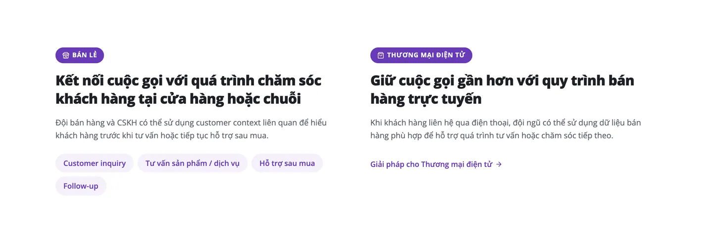

#### Section 11 — CRM, Helpdesk và POS cung cấp những loại customer context khác nhau

> CHỌN ĐÚNG LUỒNG TÍCH HỢP CRM, Helpdesk và POS cung cấp những loại customer context khác nhau POS Integration Trang này Đội ngũ cần customer context và dữ liệu bán hàng từ workflow bán lẻ hoặc quản lý đơn hàng.
> CRM Integration Sales/CSKH vận hành quanh lead, contact và workflow quản lý khách hàng.
> Tìm hiểu CRM Integration Helpdesk Integration Đội hỗ trợ vận hành quanh ticket và quy trình xử lý yêu cầu.
> Tìm hiểu Helpdesk Integration Gcalls CX Doanh nghiệp cần hội thoại tập trung trên nhiều kênh giao tiếp.
> Tìm hiểu Gcalls CX Các luồng liên quan khác: Xem tất cả giải pháp QA QC Center

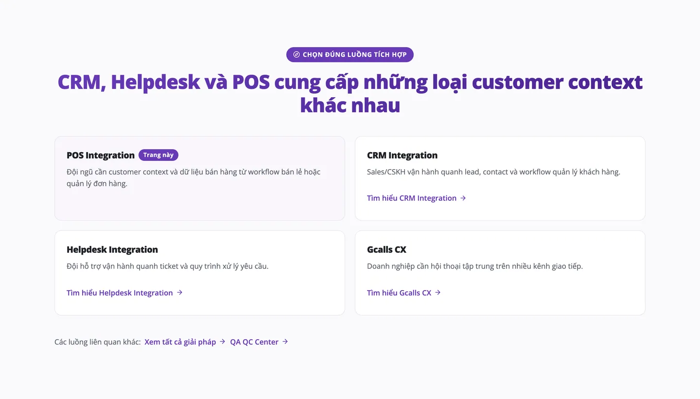

#### Section 12 — Kết nối tổng đài với dữ liệu bán hàng khi đội ngũ cần nhiều context hơn

> LỚP NGHE GỌI Kết nối tổng đài với dữ liệu bán hàng khi đội ngũ cần nhiều context hơn Gcalls Plus giải quyết nhu cầu Webphone và quản lý hoạt động nghe gọi.
> POS Integration mở rộng luồng này bằng cách đưa dữ liệu bán hàng phù hợp vào workflow khi doanh nghiệp cần kết nối với hệ thống bán hàng.
> Gcalls Plus Webphone GCALLS · CUỘC GỌI KH KH #5074 Đang trao đổi · Agent 07 SALES CONTEXT Theo cấu hình Hồ sơ khách hàng liên quan Dữ liệu bán hàng phù hợp Lịch sử tương tác Trường dữ liệu cụ thể phụ thuộc vào hệ thống và API.
> Giao diện minh họa.
> Số liệu hiển thị là dữ liệu mẫu.

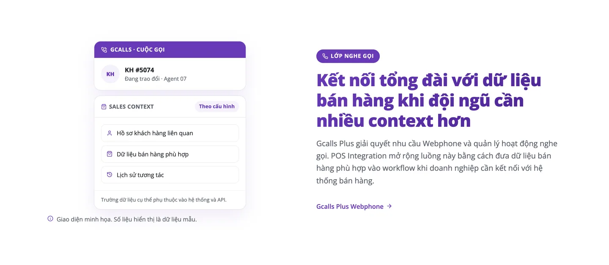

#### Section 13 — Tích hợp theo hệ thống bán hàng và dữ liệu doanh nghiệp đang sử dụng

> TRIỂN KHAI Tích hợp theo hệ thống bán hàng và dữ liệu doanh nghiệp đang sử dụng 01 Khảo sát hệ thống POS / sales system 02 Xác định dữ liệu cần sử dụng trong call workflow 03 Kiểm tra API và khả năng kết nối 04 Thiết kế luồng customer identification / context 05 Cấu hình tích hợp 06 Kiểm thử dữ liệu và cuộc gọi 07 Hướng dẫn đội Sales/CSKH 08 Đưa vào vận hành

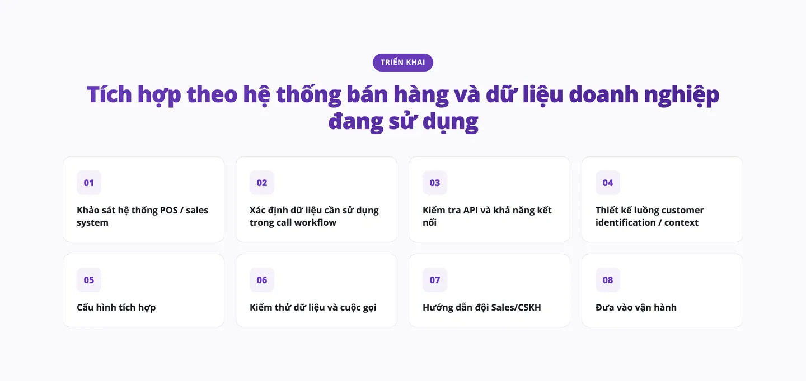

#### Section 14 — Mỗi hệ thống bán hàng có cấu trúc dữ liệu và API khác nhau

> TÍCH HỢP THEO DỮ LIỆU THỰC TẾ Mỗi hệ thống bán hàng có cấu trúc dữ liệu và API khác nhau Customer fields, dữ liệu bán hàng, permission và workflow khác nhau giữa từng nền tảng.
> Phạm vi tích hợp cần được xác định từ hệ thống doanh nghiệp đang sử dụng.
> Trao đổi về hệ thống bán hàng hiện tại Xem các tích hợp Gcalls Đọc bài viết trên Blog Gcalls

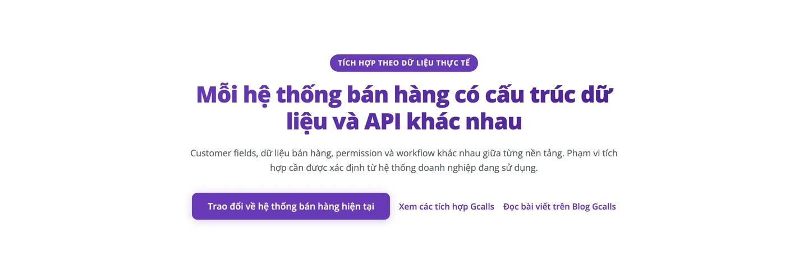

#### Section 15 — Chi phí phụ thuộc vào hệ thống, người dùng và phạm vi dữ liệu tích hợp

> CẤU HÌNH & CHI PHÍ Chi phí phụ thuộc vào hệ thống, người dùng và phạm vi dữ liệu tích hợp Phạm vi triển khai có thể thay đổi theo hệ thống bán hàng doanh nghiệp đang sử dụng, số lượng người dùng, hotline, dữ liệu cần kết nối và workflow chăm sóc.
> Gcalls sẽ xác định yêu cầu kỹ thuật trước khi đưa ra báo giá chính thức. Ước tính cấu hình & chi phí Xem bảng giá Gcalls Chi phí phụ thuộc cấu hình.

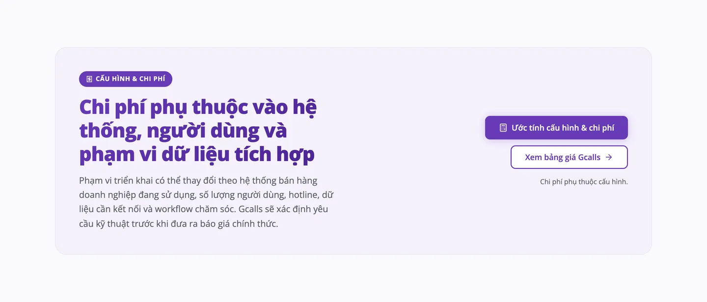

#### Section 16 — Câu hỏi thường gặp về tổng đài tích hợp POS

> CÂU HỎI THƯỜNG GẶP Câu hỏi thường gặp về tổng đài tích hợp POS Tổng đài tích hợp POS là gì?
> Tổng đài tích hợp POS kết nối hoạt động nghe gọi với hệ thống bán hàng để nhân viên có thể sử dụng customer context, dữ liệu bán hàng phù hợp và lịch sử tương tác trong cùng quy trình chăm sóc.
> Tích hợp POS giúp nhân viên nhận biết khách hàng như thế nào?
> Nhân viên có xem được thông tin đơn hàng khi khách gọi không?
> Lịch sử cuộc gọi có được lưu cùng dữ liệu khách hàng không?
> Gcalls tích hợp được những phần mềm POS nào?
> POS Integration khác CRM Integration như thế nào?

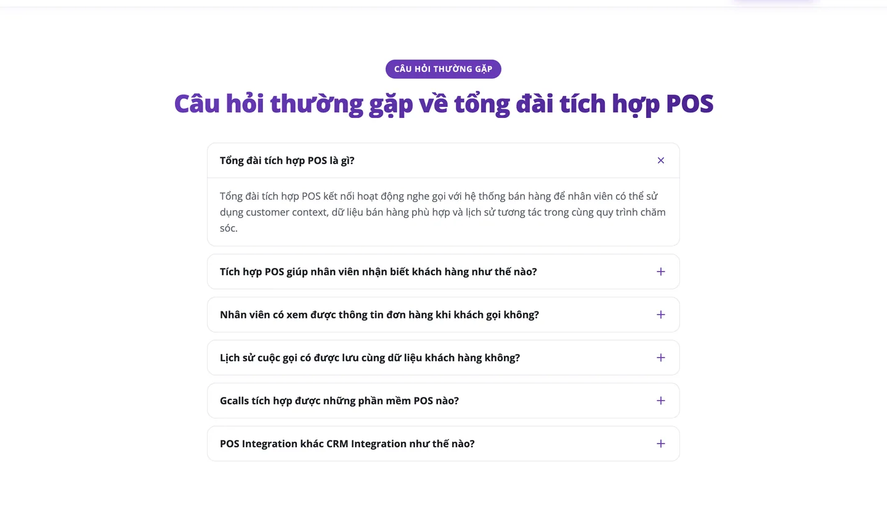

#### Section 17 — Đưa customer context và dữ liệu bán hàng vào đúng lúc đội ngũ đang trao đổi với khách hàng

> POS INTEGRATION Đưa customer context và dữ liệu bán hàng vào đúng lúc đội ngũ đang trao đổi với khách hàng Chia sẻ hệ thống bán hàng, dữ liệu cần sử dụng và workflow hiện tại để Gcalls xác định phạm vi tích hợp phù hợp.
> Tư vấn tích hợp POS Ước tính cấu hình 028 7302 5469

---

## Tổng đài quốc tế

- **Đường dẫn:** `/tong-dai-quoc-te/`
- **Nhóm:** Giải pháp
- **Số section:** 19

📄 Ảnh toàn trang (full-page)

### Các section

#### Section 01

> Trang chủ Giải pháp Tổng đài quốc tế

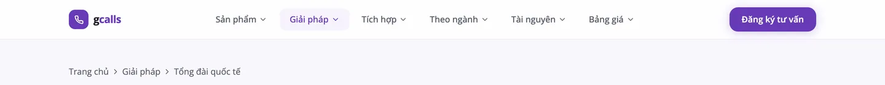

#### Section 02 — Tổng đài quốc tế – kết nối doanh nghiệp với khách hàng tại nhiều thị trường

> GCALLS • INTERNATIONAL CALLING Tổng đài quốc tế – kết nối doanh nghiệp với khách hàng tại nhiều thị trường Gcalls hỗ trợ doanh nghiệp thiết lập và vận hành hoạt động nghe gọi cho thị trường quốc tế: xác định đầu số phù hợp, chuẩn bị hồ sơ đăng ký theo quy định từng quốc gia và đưa cuộc gọi vào quy trình làm việc của đội ngũ.
> Hiện diện tại thị trường mục tiêu — Sử dụng đầu số phù hợp với từng thị trường để khách hàng liên hệ theo cách quen thuộc tại quốc gia của họ.
> Cấu hình theo quy định từng quốc gia — Loại đầu số, hồ sơ và điều kiện sử dụng khác nhau tùy quốc gia.
> Gcalls hỗ trợ khảo sát thủ tục trước khi triển khai.
> Vận hành trên cùng một hệ thống — Đội ngũ nghe gọi, theo dõi hoạt động và quản lý đầu số quốc tế trong cùng nền tảng đang sử dụng.
> Tư vấn tổng đài quốc tế Khám phá cách triển khai GCALLS · ĐẦU SỐ •• Thị trường 01 Đầu số nội địa Tùy quốc gia •• Thị trường 02 Đầu số toàn quốc Tùy quốc gia •• Thị trường 03 Miễn phí cuộc gọi đến Tùy quốc gia Loại đầu số khả dụng được xác nhận theo quy định từng thị trường.
> LUỒNG GỌI Theo cấu hình Cuộc gọi đến Định tuyến theo cấu hình Cuộc gọi ra Chọn đầu số theo cấu hình Đội ngũ phụ trách Phân công theo nhóm Giao diện minh họa.
> Số liệu hiển thị là dữ liệu mẫu.

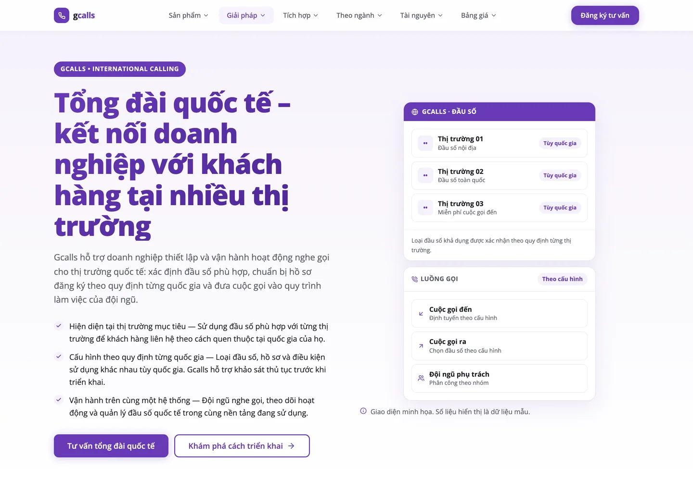

#### Section 03 — Tổng đài quốc tế là gì?

> ĐỊNH NGHĨA Tổng đài quốc tế là gì?
> Tổng đài quốc tế là mô hình tổng đài doanh nghiệp sử dụng đầu số và cấu hình liên lạc gắn với các thị trường nước ngoài, để đội ngũ có thể nhận cuộc gọi từ khách hàng quốc tế và gọi ra tới các thị trường đó trong cùng một hệ thống.
> Loại đầu số có thể sử dụng, hồ sơ cần chuẩn bị và điều kiện vận hành khác nhau tùy quốc gia và tùy quy định của từng thị trường, nên phạm vi triển khai được xác định theo từng yêu cầu cụ thể.

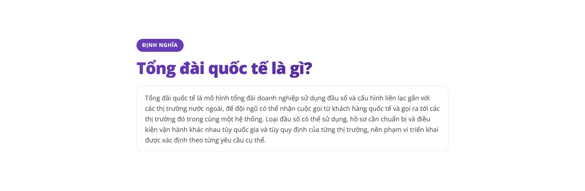

#### Section 04 — Khi khách hàng ở nhiều quốc gia, hoạt động liên lạc dễ bị phân mảnh theo từng thị trường

> BÀI TOÁN ĐA THỊ TRƯỜNG Khi khách hàng ở nhiều quốc gia, hoạt động liên lạc dễ bị phân mảnh theo từng thị trường 01 Khách hàng quốc tế khó liên hệ lại Nếu doanh nghiệp chỉ có đầu số trong nước, khách hàng tại thị trường khác phải gọi quốc tế và thường ngần ngại liên hệ.
> 02 Mỗi thị trường một cách làm khác nhau Đầu số, quy định sử dụng và hồ sơ đăng ký khác nhau tùy quốc gia, khiến việc mở rộng sang thị trường mới mất nhiều thời gian tìm hiểu.
> 03 Hoạt động nghe gọi nằm rải rác Khi mỗi thị trường dùng một kênh liên lạc riêng, doanh nghiệp khó theo dõi hoạt động và lịch sử trao đổi một cách thống nhất.
> 04 Thủ tục đăng ký đầu số không rõ ràng Yêu cầu giấy tờ và điều kiện sử dụng đầu số thay đổi theo quy định từng quốc gia, nên đội ngũ nội bộ khó tự xác định cần chuẩn bị những gì.

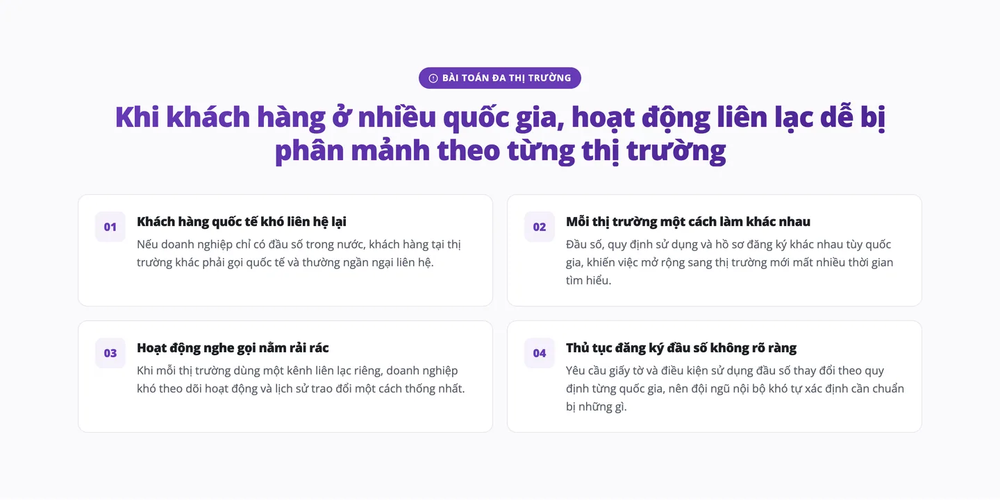

#### Section 05 — Đầu số quốc tế là cách doanh nghiệp hiện diện tại một thị trường mà không cần đặt tổng đài ở đó

> ĐẦU SỐ QUỐC TẾ Đầu số quốc tế là cách doanh nghiệp hiện diện tại một thị trường mà không cần đặt tổng đài ở đó Đầu số quốc tế là số điện thoại thuộc một quốc gia hoặc vùng lãnh thổ, được cấu hình để cuộc gọi đi và đến được xử lý trên hệ thống tổng đài của doanh nghiệp.
> Khách hàng tại thị trường đó liên hệ theo cách quen thuộc, còn đội ngũ vẫn làm việc trên nền tảng hiện tại.
> 01 Đầu số nội địa của thị trường Số gắn với một quốc gia hoặc khu vực cụ thể, thường dùng khi doanh nghiệp muốn khách hàng tại thị trường đó liên hệ như với một số trong nước.
> 02 Đầu số miễn phí cuộc gọi đến Loại đầu số mà người gọi không phải trả phí.
> Điều kiện cung cấp và cách tính cước khác nhau tùy quốc gia.
> 03 Đầu số phạm vi toàn quốc Số không gắn với một khu vực cụ thể trong quốc gia đó, phù hợp khi doanh nghiệp phục vụ khách hàng trên toàn thị trường.
> Không phải quốc gia nào cũng cung cấp đủ các loại đầu số trên, và điều kiện để doanh nghiệp nước ngoài được sử dụng từng loại cũng khác nhau.
> Gcalls xác định loại đầu số phù hợp theo từng thị trường trong quá trình khảo sát.

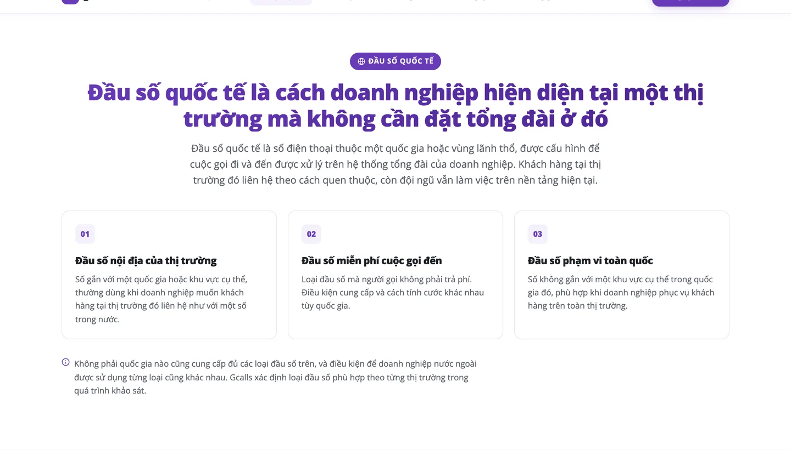

#### Section 06 — Mỗi thị trường có quy định riêng về đầu số và điều kiện sử dụng

> KHÁC BIỆT THEO QUỐC GIA Mỗi thị trường có quy định riêng về đầu số và điều kiện sử dụng Viễn thông được quản lý ở cấp quốc gia, nên cùng một nhu cầu có thể cần cách triển khai khác nhau ở hai thị trường.
> Bốn nhóm khác biệt dưới đây là những yếu tố cần xác định trước khi triển khai.
> 01 Hồ sơ doanh nghiệp Giấy tờ pháp lý cần cung cấp để đăng ký đầu số khác nhau tùy quốc gia và tùy loại đầu số.
> 02 Yêu cầu hiện diện tại thị trường Một số thị trường yêu cầu doanh nghiệp có địa chỉ, pháp nhân hoặc đại diện tại quốc gia đó mới được sử dụng đầu số nội địa.
> 03 Loại đầu số được phép sử dụng Không phải loại đầu số nào cũng mở cho doanh nghiệp nước ngoài.
> Danh mục khả dụng cần được kiểm tra theo từng thị trường.
> 04 Điều kiện vận hành và thời gian xử lý Quy định về mục đích sử dụng, cách hiển thị số gọi ra và thời gian xét hồ sơ phụ thuộc vào cơ quan quản lý và nhà cung cấp tại từng quốc gia.
> Gcalls hỗ trợ khảo sát thủ tục và chuẩn bị hồ sơ theo yêu cầu của từng thị trường.
> Gcalls không thay thế tư vấn pháp lý, và điều kiện cuối cùng do quy định tại quốc gia đó quyết định.
> THỊ TRƯỜNG THƯỜNG ĐƯỢC YÊU CẦU Doanh nghiệp Việt Nam thường bắt đầu từ những thị trường nào Đây là các thị trường doanh nghiệp thường nêu khi trao đổi với Gcalls, cũng là các lựa chọn trong công cụ ước tính chi phí.
> Danh sách này mô tả nhu cầu thường gặp, không phải danh sách quốc gia được cam kết cung cấp đầu số.
> Mỹ Cần khảo sát Anh Cần khảo sát Singapore Cần khảo sát Úc Cần khảo sát Nhật Bản Cần khảo sát Hàn Quốc Cần khảo sát Thị trường khác Cần khảo sát Khả năng cung cấp đầu số, loại đầu số và hồ sơ cần thiết tại mỗi thị trường được Gcalls xác nhận theo từng yêu cầu cụ thể, dựa trên quy định hiện hành tại quốc gia đó.

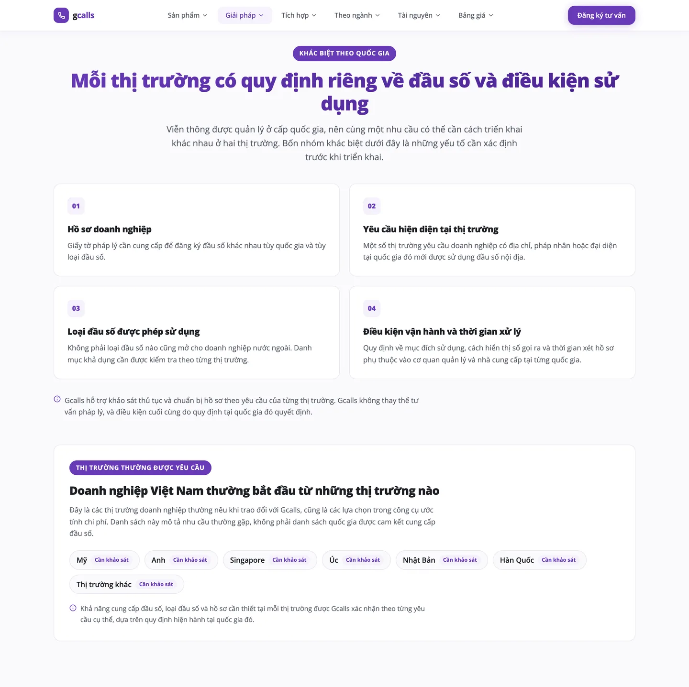

#### Section 07 — Từ thị trường mục tiêu đến đầu số hoạt động trong quy trình của đội ngũ

> CÁCH TRIỂN KHAI HOẠT ĐỘNG Từ thị trường mục tiêu đến đầu số hoạt động trong quy trình của đội ngũ 01 Xác định thị trường mục tiêu Doanh nghiệp cho biết cần hiện diện hoặc liên lạc tại những quốc gia nào và phục vụ nhu cầu gì.
> 02 Khảo sát quy định và loại đầu số Gcalls kiểm tra loại đầu số khả dụng, điều kiện sử dụng và hồ sơ cần chuẩn bị theo quy định từng thị trường.
> 03 Chuẩn bị hồ sơ đăng ký Doanh nghiệp cung cấp giấy tờ theo danh mục đã được xác định.
> Gcalls hỗ trợ hoàn thiện và gửi hồ sơ.
> 04 Cấp và cấu hình đầu số Sau khi hồ sơ được chấp thuận, đầu số được cấu hình trên hệ thống Gcalls theo luồng gọi vào và gọi ra đã thống nhất.
> 05 Kiểm thử luồng gọi Cuộc gọi đến và cuộc gọi ra được kiểm thử theo từng thị trường trước khi đưa vào vận hành.
> 06 Vận hành và theo dõi Đội ngũ nghe gọi trên nền tảng Gcalls; hoạt động cuộc gọi và lịch sử tương tác được theo dõi theo cấu hình.

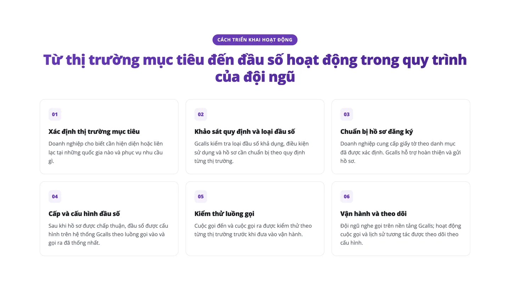

#### Section 08 — Nhận cuộc gọi từ khách hàng quốc tế trên cùng hệ thống với đội ngũ trong nước

> CUỘC GỌI ĐẾN Nhận cuộc gọi từ khách hàng quốc tế trên cùng hệ thống với đội ngũ trong nước Cuộc gọi tới đầu số quốc tế được đưa về hệ thống Gcalls và phân phối cho đội ngũ theo cấu hình doanh nghiệp thiết lập, thay vì phải bố trí một tổng đài riêng cho từng thị trường.
> Định tuyến cuộc gọi theo đầu số hoặc theo thị trường Phân phối tới nhóm hoặc người phụ trách phù hợp Ghi nhận hoạt động cuộc gọi theo cấu hình Xử lý cuộc gọi ngoài giờ theo thiết lập Cách định tuyến và các thiết lập ngoài giờ được cấu hình theo quy trình vận hành của doanh nghiệp và theo điều kiện của từng đầu số.
> LUỒNG GỌI Theo cấu hình Cuộc gọi đến Định tuyến theo cấu hình Cuộc gọi ra Chọn đầu số theo cấu hình Đội ngũ phụ trách Phân công theo nhóm Giao diện minh họa.
> Số liệu hiển thị là dữ liệu mẫu.

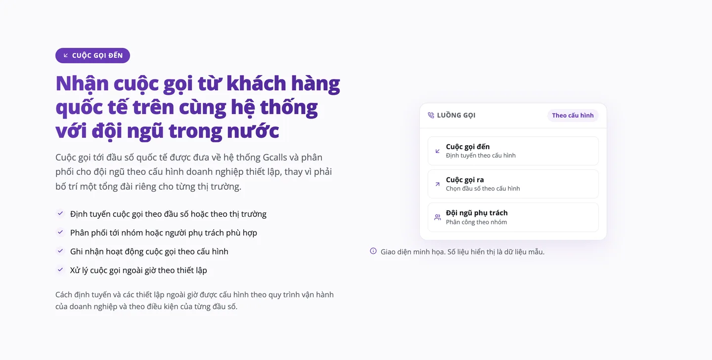

#### Section 09 — Gọi ra thị trường quốc tế từ chính công cụ đội ngũ đang dùng

> CUỘC GỌI RA Gọi ra thị trường quốc tế từ chính công cụ đội ngũ đang dùng Đội Sales và CSKH thực hiện cuộc gọi ra tới khách hàng ở thị trường nước ngoài trên nền tảng Gcalls, không cần chuyển sang thiết bị hay ứng dụng khác.
> Gọi ra từ giao diện làm việc hằng ngày Chọn đầu số sử dụng cho cuộc gọi theo cấu hình Ghi nhận lịch sử cuộc gọi cho từng khách hàng Theo dõi lưu lượng gọi ra theo thị trường Số hiển thị với người nhận phụ thuộc vào cấu hình đầu số và quy định về hiển thị số tại quốc gia được gọi đến.
> Cước gọi ra thay đổi theo thị trường và được xác nhận trong báo giá.
> GCALLS · ĐẦU SỐ •• Thị trường 01 Đầu số nội địa Tùy quốc gia •• Thị trường 02 Đầu số toàn quốc Tùy quốc gia •• Thị trường 03 Miễn phí cuộc gọi đến Tùy quốc gia Loại đầu số khả dụng được xác nhận theo quy định từng thị trường.
> Giao diện minh họa.
> Số liệu hiển thị là dữ liệu mẫu.

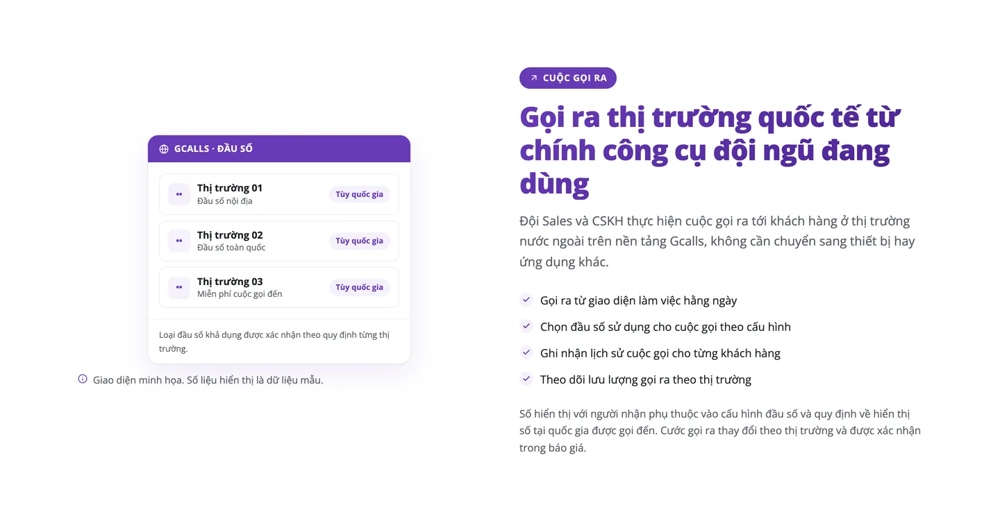

#### Section 10 — Quy trình chuẩn bị hồ sơ và đăng ký đầu số theo từng thị trường

> ĐĂNG KÝ ĐẦU SỐ Quy trình chuẩn bị hồ sơ và đăng ký đầu số theo từng thị trường Đăng ký đầu số quốc tế là một quy trình có hồ sơ, không phải một thao tác cấu hình.
> Gcalls hỗ trợ doanh nghiệp xác định và hoàn thiện các bước dưới đây.
> 01 Xác định thị trường và loại đầu số cần đăng ký 02 Nhận danh mục giấy tờ theo yêu cầu của thị trường đó 03 Doanh nghiệp chuẩn bị hồ sơ pháp lý và thông tin sử dụng 04 Gcalls rà soát hồ sơ trước khi gửi 05 Gửi hồ sơ tới nhà cung cấp hoặc cơ quan quản lý liên quan 06 Bổ sung thông tin nếu hồ sơ được yêu cầu làm rõ 07 Đầu số được cấp và bàn giao để cấu hình Thời gian xử lý phụ thuộc vào quốc gia, loại đầu số và tính đầy đủ của hồ sơ, nên không có mốc thời gian chung cho mọi thị trường.
> Gcalls thông báo yêu cầu và tiến độ theo từng hồ sơ cụ thể.

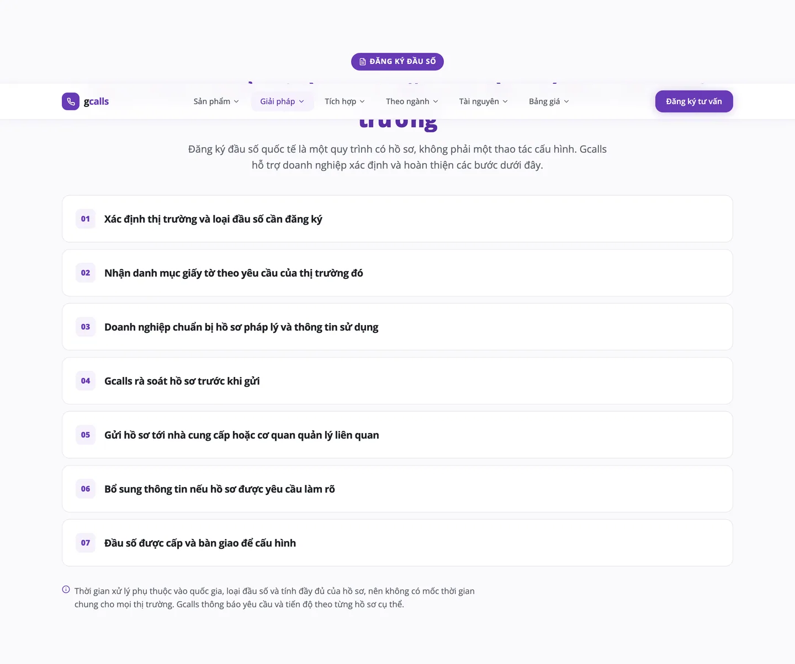

#### Section 11 — Quản lý đầu số, đội ngũ và hoạt động gọi ở nhiều thị trường trong một nền tảng

> QUẢN LÝ VẬN HÀNH Quản lý đầu số, đội ngũ và hoạt động gọi ở nhiều thị trường trong một nền tảng Khi doanh nghiệp vận hành nhiều thị trường, phần khó không chỉ là có đầu số mà là quản lý hoạt động liên lạc một cách thống nhất.
> 01 Quản lý danh mục đầu số Theo dõi các đầu số đang sử dụng và mục đích sử dụng của từng đầu số theo thị trường.
> 02 Phân quyền và phân công đội ngũ Gán đầu số hoặc luồng gọi cho nhóm phụ trách tương ứng theo cấu hình doanh nghiệp thiết lập.
> 03 Theo dõi hoạt động cuộc gọi Xem hoạt động nghe gọi và lưu lượng theo đầu số hoặc theo nhóm, theo phạm vi dữ liệu hệ thống ghi nhận.
> 04 Lịch sử tương tác tập trung Giữ lịch sử trao đổi với khách hàng ở các thị trường khác nhau trong cùng một nơi để đội ngũ tiếp tục follow-up.

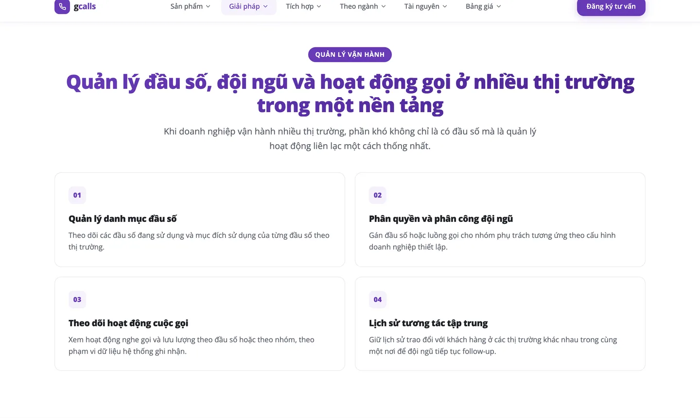

#### Section 12 — Doanh nghiệp dùng tổng đài quốc tế cho những bài toán nào

> NHU CẦU THƯỜNG GẶP Doanh nghiệp dùng tổng đài quốc tế cho những bài toán nào Local presence Doanh nghiệp muốn khách hàng tại thị trường nước ngoài thấy một đầu số quen thuộc để dễ liên hệ.
> Sales Đội bán hàng gọi ra tới khách hàng và đối tác ở thị trường quốc tế từ cùng một hệ thống.
> Customer Service Đội CSKH tiếp nhận yêu cầu từ khách hàng nước ngoài và theo dõi lịch sử hỗ trợ tập trung.
> BPO / Operations Đơn vị vận hành dịch vụ cho khách hàng ở nhiều quốc gia cần nhiều đầu số và phân công theo dự án.

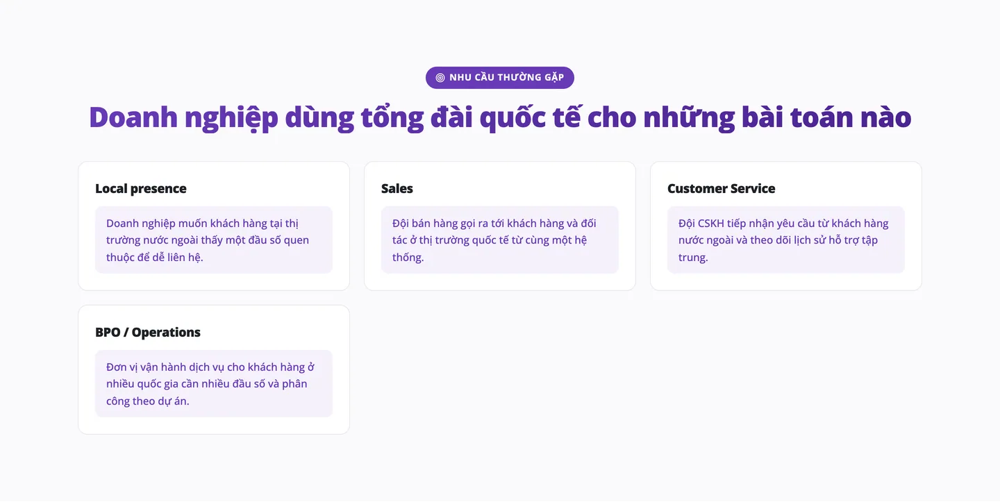

#### Section 13 — Tổng đài quốc tế giải quyết bài toán thị trường, không thay thế các luồng tích hợp

> CHỌN ĐÚNG GIẢI PHÁP Tổng đài quốc tế giải quyết bài toán thị trường, không thay thế các luồng tích hợp Tổng đài quốc tế Trang này Doanh nghiệp cần đầu số và cấu hình liên lạc cho một hoặc nhiều thị trường nước ngoài.
> Gcalls Plus Webphone Đội ngũ cần kênh nghe gọi trên trình duyệt và quản lý hoạt động cuộc gọi.
> Tìm hiểu Gcalls Plus Webphone CRM Integration Sales/CSKH vận hành quanh lead, contact và workflow quản lý khách hàng.
> Tìm hiểu CRM Integration Gcalls CX Doanh nghiệp cần hội thoại tập trung trên nhiều kênh giao tiếp, không chỉ kênh thoại.
> Tìm hiểu Gcalls CX Các luồng liên quan khác: Tích hợp Helpdesk Tích hợp POS Xem tất cả giải pháp

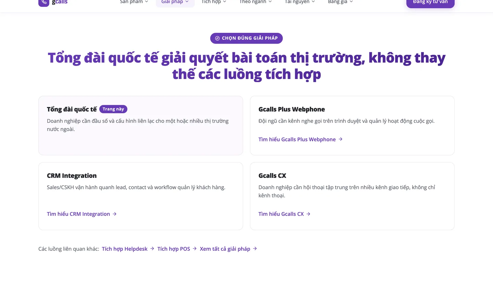

#### Section 14 — Triển khai theo từng thị trường và theo quy định áp dụng

> TRIỂN KHAI Triển khai theo từng thị trường và theo quy định áp dụng 01 Trao đổi nhu cầu và thị trường mục tiêu 02 Khảo sát quy định và loại đầu số theo từng quốc gia 03 Xác định phạm vi triển khai và cấu hình cần thiết 04 Chuẩn bị và gửi hồ sơ đăng ký đầu số 05 Cấu hình luồng gọi vào và gọi ra 06 Kiểm thử theo từng đầu số và từng thị trường 07 Hướng dẫn đội Sales/CSKH sử dụng 08 Đưa vào vận hành và theo dõi

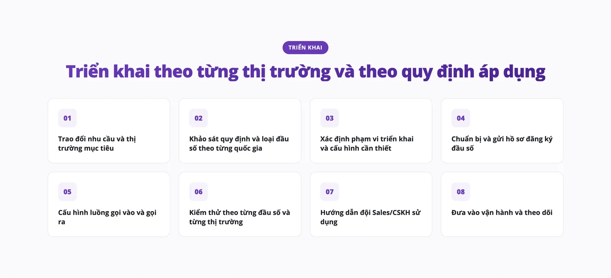

#### Section 15 — Chi phí phụ thuộc vào quốc gia, loại đầu số, hồ sơ đăng ký và lưu lượng sử dụng

> CẤU HÌNH & CHI PHÍ Chi phí phụ thuộc vào quốc gia, loại đầu số, hồ sơ đăng ký và lưu lượng sử dụng Mỗi thị trường có mức cước và yêu cầu hồ sơ riêng, nên chi phí được xác định theo phạm vi triển khai thực tế: số thị trường, số đầu số, loại đầu số và lưu lượng gọi dự kiến.
> Gcalls xác nhận yêu cầu trước khi đưa ra báo giá chính thức.
> Quốc gia / thị trường Loại đầu số Hồ sơ đăng ký Lưu lượng gọi

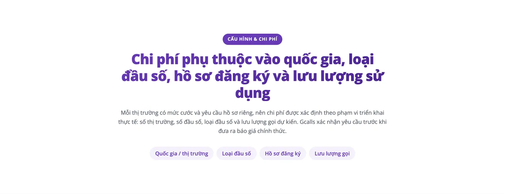

#### Section 16 — Chuẩn bị cấu hình trước khi nhận báo giá chính thức

> ƯỚC TÍNH Chuẩn bị cấu hình trước khi nhận báo giá chính thức Chọn thị trường, số đầu số và lưu lượng dự kiến để có cấu hình tham khảo, sau đó gửi yêu cầu để Gcalls xác nhận phạm vi triển khai. Ước tính cấu hình & chi phí Xem bảng giá Gcalls Chi phí phụ thuộc cấu hình.

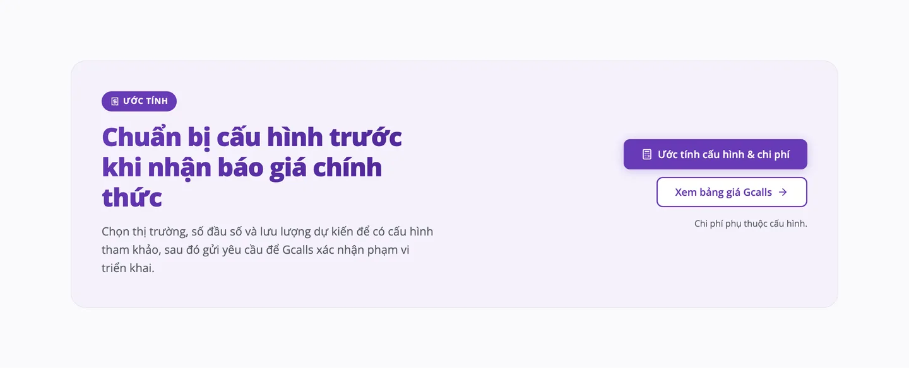

#### Section 17 — Mỗi thị trường được khảo sát trước khi cam kết phạm vi triển khai

> CÁCH GCALLS LÀM VIỆC Mỗi thị trường được khảo sát trước khi cam kết phạm vi triển khai Thay vì đưa ra một danh sách quốc gia chung, Gcalls kiểm tra điều kiện thực tế của từng thị trường doanh nghiệp cần: loại đầu số khả dụng, hồ sơ theo quy định hiện hành và cấu hình phù hợp với quy trình vận hành.
> Phạm vi và chi phí chỉ được xác nhận sau bước này.
> Trao đổi về thị trường doanh nghiệp cần Gcalls Plus Webphone Xem tất cả giải pháp

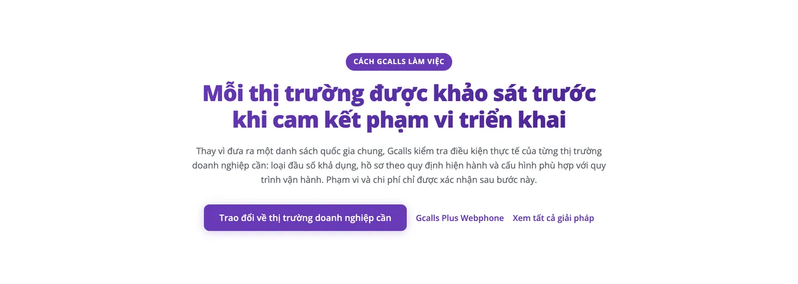

#### Section 18 — Câu hỏi thường gặp về tổng đài quốc tế

> CÂU HỎI THƯỜNG GẶP Câu hỏi thường gặp về tổng đài quốc tế Tổng đài quốc tế là gì?
> Tổng đài quốc tế là mô hình tổng đài doanh nghiệp sử dụng đầu số và cấu hình liên lạc gắn với thị trường nước ngoài, để đội ngũ nhận và thực hiện cuộc gọi với khách hàng quốc tế trong cùng một hệ thống.
> Gcalls hỗ trợ đầu số tại những quốc gia nào?
> Doanh nghiệp cần chuẩn bị hồ sơ gì để đăng ký đầu số quốc tế?
> Mất bao lâu để có đầu số quốc tế?
> Chi phí tổng đài quốc tế được tính như thế nào?
> Khách hàng ở nước ngoài sẽ thấy số nào khi doanh nghiệp gọi ra?
> Tổng đài quốc tế khác gì so với Gcalls Plus Webphone?

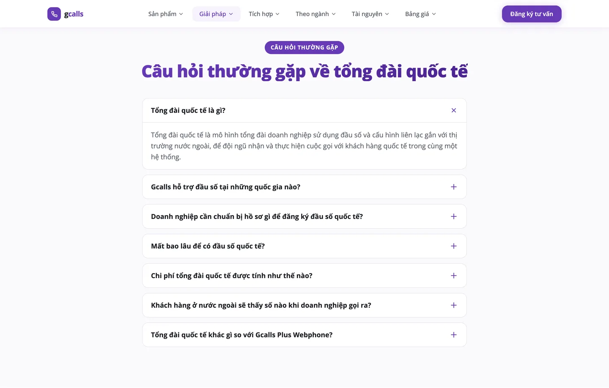

#### Section 19 — Cho Gcalls biết thị trường doanh nghiệp cần, phần thủ tục để Gcalls khảo sát

> INTERNATIONAL CALLING Cho Gcalls biết thị trường doanh nghiệp cần, phần thủ tục để Gcalls khảo sát Chia sẻ quốc gia cần hiện diện, mục đích sử dụng và quy mô đội ngũ để Gcalls xác định loại đầu số, hồ sơ cần chuẩn bị và phạm vi triển khai phù hợp.
> Đăng ký tư vấn tổng đài quốc tế Ước tính cấu hình 028 7302 5469

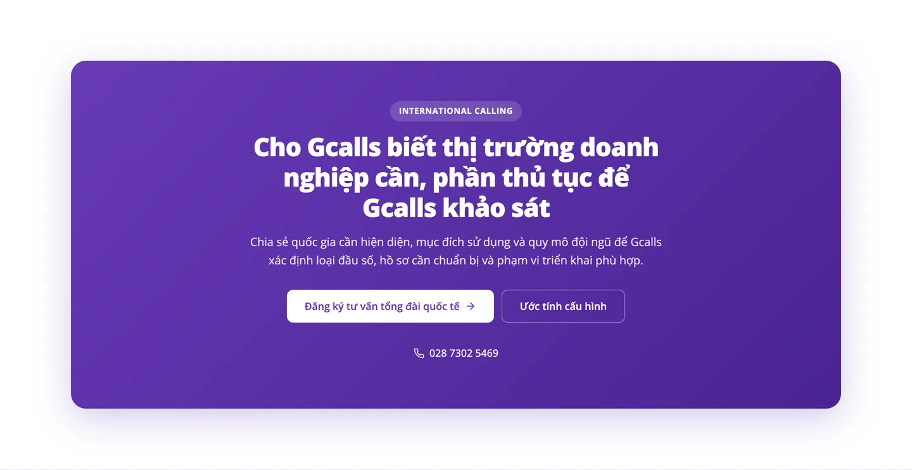

---

## Tích hợp HubSpot

- **Đường dẫn:** `/tich-hop/hubspot/`
- **Nhóm:** Tích hợp
- **Số section:** 18

📄 Ảnh toàn trang (full-page)

### Các section

#### Section 01

> Trang chủ Tích hợp HubSpot

#### Section 02 — Tổng đài Gcalls tích hợp HubSpot – đưa cuộc gọi vào quy trình CRM

> GCALLS × HUBSPOT Tổng đài Gcalls tích hợp HubSpot – đưa cuộc gọi vào quy trình CRM Kết nối chức năng nghe gọi của Gcalls với HubSpot để đội Sales và CSKH có thể thực hiện cuộc gọi, nhận biết customer context và theo dõi hoạt động tương tác mà không phải tách quy trình làm việc thành nhiều hệ thống rời rạc.
> Gọi trực tiếp từ HubSpot — Click-to-Call giúp nhân viên bắt đầu cuộc gọi từ số điện thoại hoặc hồ sơ khách hàng trong CRM khi tích hợp được cấu hình.
> Nhận biết khách hàng khi có cuộc gọi — Thông tin liên quan từ HubSpot giúp nhân viên có thêm context trước khi tiếp tục cuộc hội thoại.
> Giữ hoạt động cuộc gọi gần CRM — Dữ liệu tương tác phù hợp có thể được ghi nhận trong workflow HubSpot để đội ngũ tiếp tục follow-up thuận tiện hơn.
> Xem demo tích hợp HubSpot Xem cách hoạt động CRM RECORD Theo cấu hình Contact KH #2148 Company Công ty mẫu Lần liên hệ gần nhất Đã ghi nhận SỐ ĐIỆN THOẠI ••• ••• •48 Click-to-Call Giao diện minh họa.
> Số liệu hiển thị là dữ liệu mẫu.

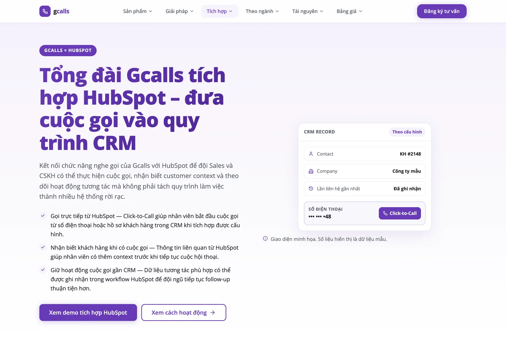

#### Section 03 — Tổng đài tích hợp HubSpot là gì?

> ĐỊNH NGHĨA Tổng đài tích hợp HubSpot là gì?
> Tổng đài tích hợp HubSpot kết nối chức năng nghe gọi của Gcalls với quy trình CRM HubSpot để nhân viên có thể thực hiện cuộc gọi từ CRM, nhận biết khách hàng khi có cuộc gọi và ghi nhận dữ liệu tương tác phù hợp vào workflow đang sử dụng.
> Phạm vi chức năng phụ thuộc vào cấu hình Gcalls, HubSpot và yêu cầu triển khai của doanh nghiệp.

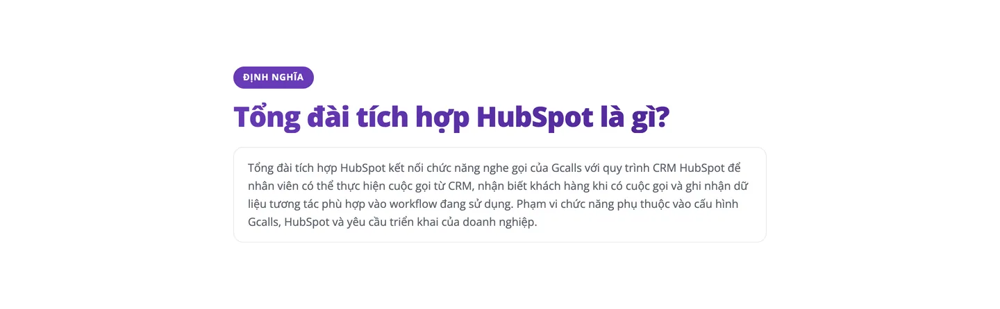

#### Section 04 — HubSpot quản lý khách hàng, nhưng cuộc gọi vẫn có thể nằm ngoài workflow

> BÀI TOÁN HubSpot quản lý khách hàng, nhưng cuộc gọi vẫn có thể nằm ngoài workflow 01 Phải copy số điện thoại để gọi Nhân viên tìm contact trong HubSpot nhưng lại thực hiện cuộc gọi trên một công cụ khác, tạo thêm thao tác trong mỗi lần follow-up.
> 02 Không biết ngay ai đang gọi Khi cuộc gọi đến không gắn với customer context, agent cần tìm lại hồ sơ trước khi hiểu lịch sử khách hàng.
> 03 Call activity bị tách khỏi CRM Nếu hoạt động gọi không được ghi nhận cùng customer record, Sales và CSKH khó nhìn lại toàn bộ quá trình tương tác.
> 04 Follow-up dễ trở thành quy trình thủ công Nhân viên phải tự ghi chú hoặc cập nhật lại HubSpot sau cuộc gọi nếu hai hệ thống chưa được kết nối phù hợp.

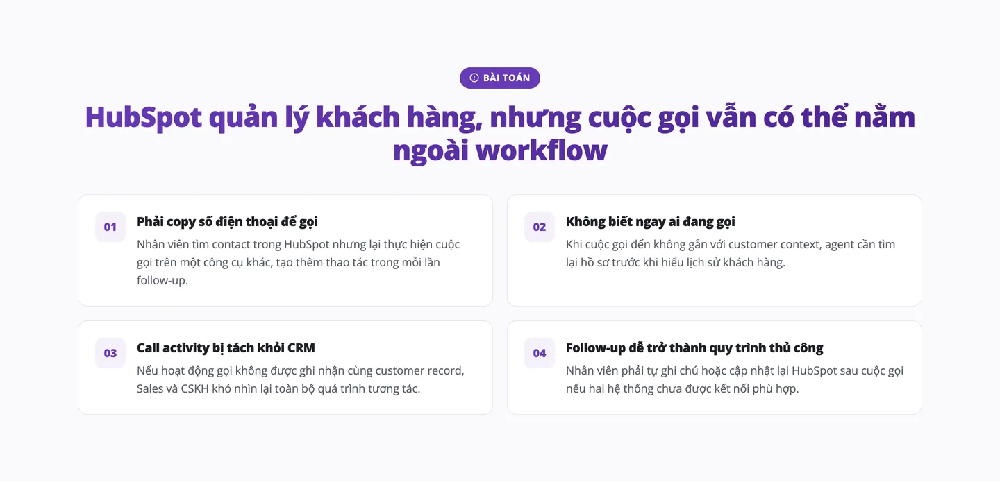

#### Section 05 — Đưa lớp giao tiếp thoại vào nơi đội ngũ đang quản lý khách hàng

> GCALLS FOR HUBSPOT Đưa lớp giao tiếp thoại vào nơi đội ngũ đang quản lý khách hàng 01 HubSpot Contact Nhân viên làm việc trên dữ liệu khách hàng đang quản lý.
> 02 Click-to-Call Cuộc gọi bắt đầu từ hồ sơ khi tích hợp được cấu hình.
> 03 Gcalls conversation Gcalls xử lý lớp giao tiếp thoại.
> 04 Customer context Thông tin liên quan hỗ trợ agent trong cuộc trao đổi.
> 05 Call activity Dữ liệu tương tác phù hợp được ghi nhận.
> 06 Follow-up in HubSpot Đội ngũ tiếp tục workflow trong CRM.

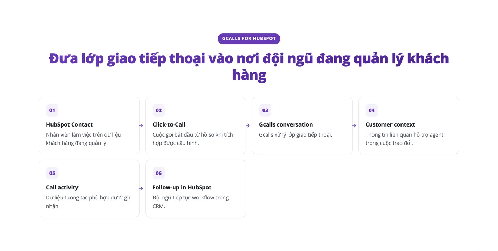

#### Section 06 — Những năng lực giúp kết nối cuộc gọi với workflow HubSpot

> TÍNH NĂNG TÍCH HỢP Những năng lực giúp kết nối cuộc gọi với workflow HubSpot 01 Click-to-Call Cho phép bắt đầu cuộc gọi từ số điện thoại hoặc contact trong HubSpot khi extension/integration được cấu hình.
> 02 Incoming Call Notification Khi có cuộc gọi đến, Gcalls có thể cung cấp call box để nhân viên tiếp nhận cuộc gọi trong môi trường làm việc tích hợp.
> 03 Customer Context Thông tin liên quan giúp nhân viên nhận biết khách hàng và truy cập customer record trước hoặc trong quá trình trao đổi.
> 04 Call Activity / History Thông tin cuộc gọi phù hợp có thể được ghi nhận để đội ngũ tiếp tục theo dõi quá trình tương tác.

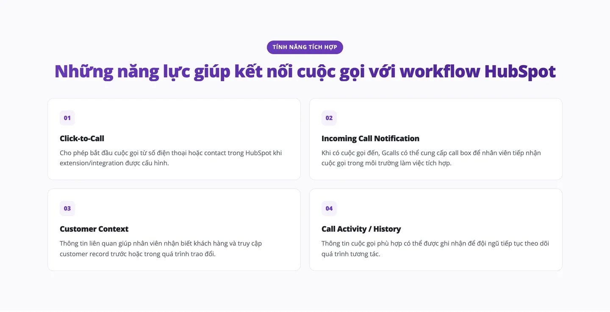

#### Section 07 — Từ HubSpot contact đến cuộc gọi và follow-up

> QUY TRÌNH Từ HubSpot contact đến cuộc gọi và follow-up 01 Mở contact hoặc customer record Nhân viên tiếp tục làm việc trên dữ liệu đang được quản lý trong HubSpot.
> 02 Bắt đầu hoặc tiếp nhận cuộc gọi Click-to-Call hoặc call box hỗ trợ hoạt động thoại theo cấu hình tích hợp.
> 03 Xem customer context Thông tin liên quan giúp agent hiểu người đang trao đổi và lịch sử trước đó.
> 04 Thực hiện cuộc hội thoại Gcalls xử lý lớp giao tiếp thoại trong workflow được triển khai.
> 05 Ghi nhận hoạt động phù hợp Call activity và dữ liệu liên quan có thể được ghi nhận theo phạm vi tích hợp.
> 06 Tiếp tục Sales / Service workflow Nhân viên follow-up trong HubSpot thay vì duy trì một luồng dữ liệu riêng bên ngoài CRM.

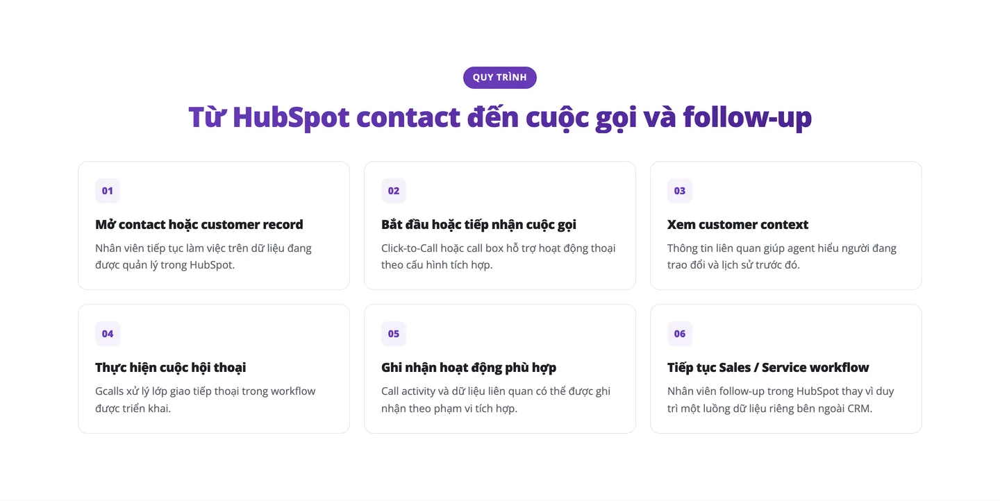

#### Section 08 — Giảm những điểm chuyển đổi không cần thiết trong quy trình HubSpot

> GIÁ TRỊ VẬN HÀNH Giảm những điểm chuyển đổi không cần thiết trong quy trình HubSpot 01 Giảm thao tác copy số Click-to-Call giúp đưa thao tác gọi gần hơn với customer record đang được xử lý.
> 02 Có context trước cuộc hội thoại Thông tin khách hàng giúp agent chuẩn bị tốt hơn trước khi tư vấn hoặc hỗ trợ.
> 03 Theo dõi tương tác tập trung hơn Call activity phù hợp được đặt gần workflow CRM để đội ngũ dễ tiếp tục follow-up.
> 04 Giảm dữ liệu bị phân mảnh Kết nối hai hệ thống giúp hạn chế việc duy trì lịch sử khách hàng ở những luồng tách rời.

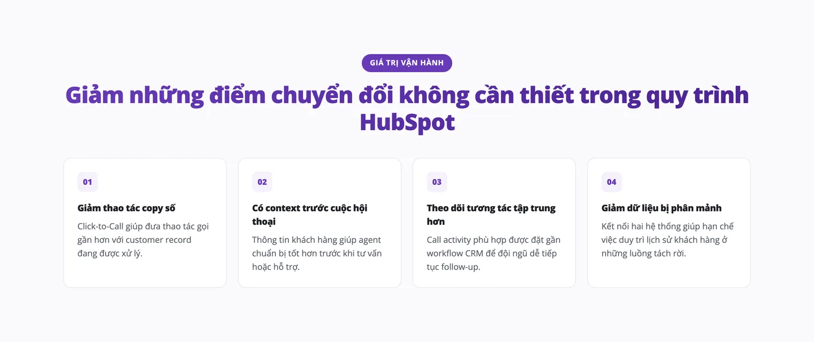

#### Section 09 — Gcalls × HubSpot phù hợp với những workflow nào?

> TÌNH HUỐNG SỬ DỤNG Gcalls × HubSpot phù hợp với những workflow nào?
> Inbound Sales Sales nhận lead trong HubSpot, thực hiện cuộc gọi và tiếp tục follow-up từ customer context hiện có.
> Lead Follow-up Nhân viên làm việc với danh sách lead/contact và gọi theo quy trình thay vì duy trì danh sách số điện thoại riêng.
> Customer Service Agent sử dụng customer record và lịch sử liên quan để có thêm bối cảnh khi khách hàng gọi đến.
> Customer Success Đội CS có thể giữ hoạt động gọi gần hơn với dữ liệu vòng đời khách hàng đang quản lý trên HubSpot.

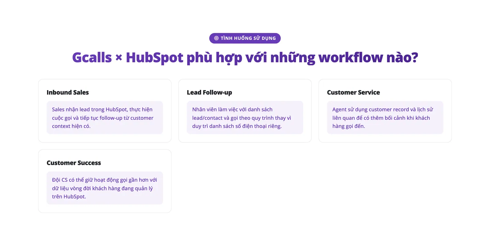

#### Section 10 — Tích hợp theo cấu hình HubSpot và workflow doanh nghiệp đang sử dụng

> THIẾT LẬP Tích hợp theo cấu hình HubSpot và workflow doanh nghiệp đang sử dụng 01 Khảo sát workflow HubSpot hiện tại 02 Xác định user và hotline 03 Xác định capability cần sử dụng 04 Kiểm tra quyền truy cập và phương thức kết nối hiện hành 05 Cấu hình integration / extension cần thiết 06 Kiểm thử Click-to-Call, incoming call và dữ liệu 07 Hướng dẫn người dùng 08 Go-live

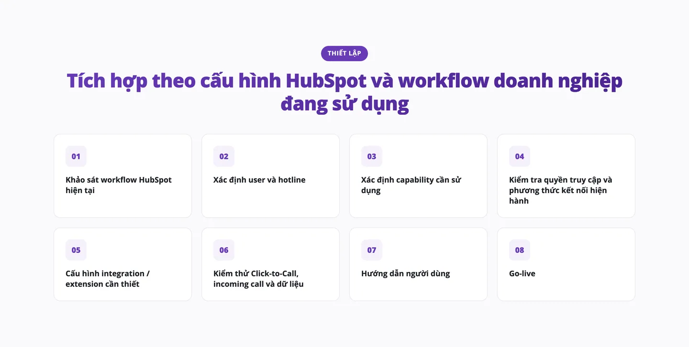

#### Section 11

> Phạm vi và thời gian triển khai phụ thuộc vào hotline, số lượng người dùng, quyền truy cập và capability cần sử dụng, nên được xác định sau bước khảo sát thay vì theo một mốc cố định.

#### Section 12 — Giữ customer context gần cuộc gọi

> GIAO DIỆN TÍCH HỢP Giữ customer context gần cuộc gọi Các giao diện dưới đây là bề mặt phía Gcalls trong luồng tích hợp: thao tác gọi từ hồ sơ khách hàng, call box khi có cuộc gọi đến và hoạt động tương tác được ghi nhận.
> Cuộc gọi đến...
> 1900 1234 · Hà Nội NM Nguyễn Văn Minh Công ty TNHH Bình Minh Demo VIP LỊCH SỬ GẦN NHẤT Gọi đi · 3:42 Hôm nay 09:14 Ghi chú: Cần gửi proposal Hôm nay 09:35 Ghi chú Gắn tag Xem hồ sơ Timeline Cuộc gọi Tìm kiếm...
> Tất cả Đến Đi Nhỡ1 Hotline: 1900 1234 1900 5678 Nguyễn Văn Minh Khách hàng mới 0901 234 567 1900 1234 3:42 09:14 Trần Thị Lan Gia hạn 0912 345 678 1900 5678 Cần gửi báo giá gia hạn trước 15h 7:18 09:31 Lê Hoàng Phúc 0888 901 234 1900 1234 — 09:52 Phạm Thu Hà Demo 0976 543 210 1900 5678 12:05 10:08 Võ Minh Tuấn Upsell 0933 210 987 1900 1234 5:20 10:45 Trần Thị Lan7:18 3:09 Gia hạn Cần gửi báo giá gia hạn trước 15h Giao diện minh họa phía Gcalls với dữ liệu mẫu.
> Đây không phải ảnh chụp màn hình HubSpot, và bố cục thực tế phụ thuộc vào cấu hình tích hợp của doanh nghiệp.

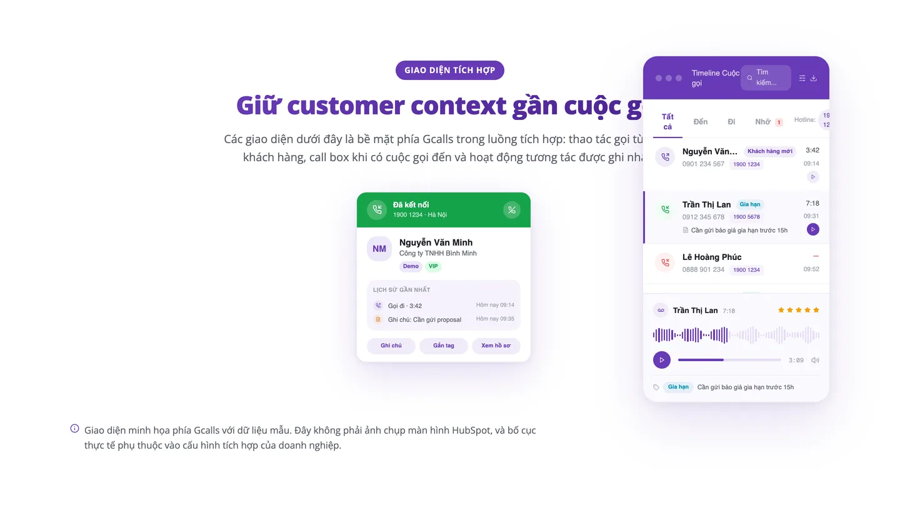

#### Section 13 — Trang này dành cho doanh nghiệp đã chọn HubSpot làm CRM

> HUBSPOT-SPECIFIC WORKFLOW Trang này dành cho doanh nghiệp đã chọn HubSpot làm CRM Nếu doanh nghiệp đang đánh giá cách tích hợp tổng đài với CRM nói chung, hãy xem giải pháp Tổng đài tích hợp CRM.
> Trang này tập trung vào workflow khi HubSpot đã là hệ thống quản lý khách hàng hiện tại.
> Xem giải pháp Tổng đài tích hợp CRM

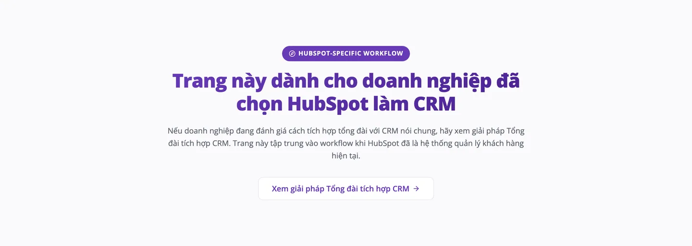

#### Section 14 — Doanh nghiệp đang sử dụng CRM khác?

> Mỗi nền tảng CRM có cấu trúc dữ liệu và cách kết nối riêng.
> Xem trang tương ứng với hệ thống doanh nghiệp đang sử dụng.
> Salesforce Kết nối hoạt động nghe gọi với workflow Salesforce.
> Tìm hiểu thêm Zoho CRM Kết nối hoạt động nghe gọi với workflow Zoho CRM.
> Tìm hiểu thêm Danh mục tích hợp Xem toàn bộ nền tảng đang có trang tích hợp riêng.
> Tìm hiểu thêm

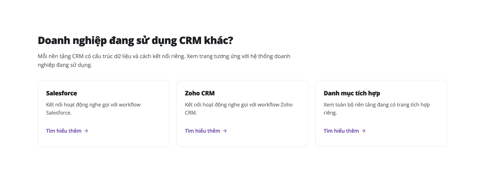

#### Section 15 — Tích hợp cần bắt đầu từ workflow và dữ liệu doanh nghiệp đang sử dụng

> PHẠM VI TRIỂN KHAI Tích hợp cần bắt đầu từ workflow và dữ liệu doanh nghiệp đang sử dụng Permission, cấu trúc dữ liệu, user, hotline và yêu cầu đồng bộ có thể khác nhau giữa từng tài khoản HubSpot.
> Vì vậy phạm vi triển khai cần được xác định trong bước khảo sát và kiểm thử.
> Trao đổi về workflow HubSpot hiện tại Ước tính cấu hình & chi phí Xem bảng giá Gcalls

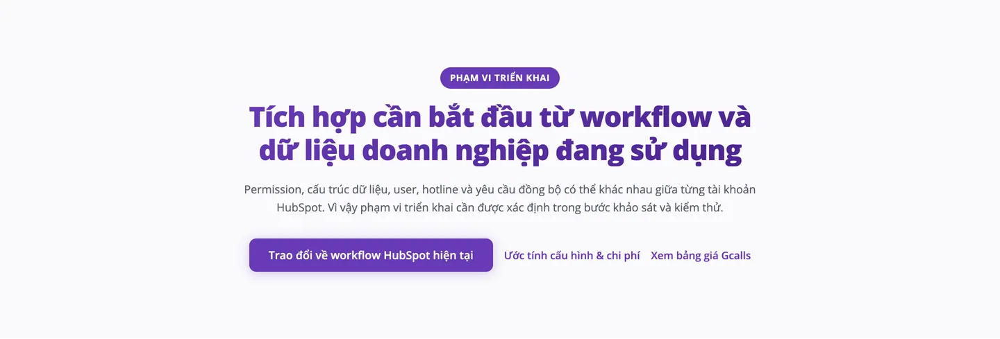

#### Section 16 — Câu hỏi thường gặp về Gcalls tích hợp HubSpot

> CÂU HỎI THƯỜNG GẶP Câu hỏi thường gặp về Gcalls tích hợp HubSpot Tổng đài tích hợp HubSpot là gì?
> Đây là mô hình kết nối chức năng nghe gọi của Gcalls với workflow HubSpot để nhân viên có thể thực hiện cuộc gọi, nhận biết customer context và ghi nhận dữ liệu tương tác phù hợp trong quy trình CRM.
> Gcalls có hỗ trợ Click-to-Call trên HubSpot không?
> Khi khách hàng gọi đến có thể xem thông tin HubSpot không?
> Dữ liệu cuộc gọi có được lưu lại không?
> Gcalls có thể tạo Ticket trên HubSpot không?
> Gcalls tích hợp HubSpot có thay thế HubSpot không?
> Tích hợp HubSpot mất bao lâu?

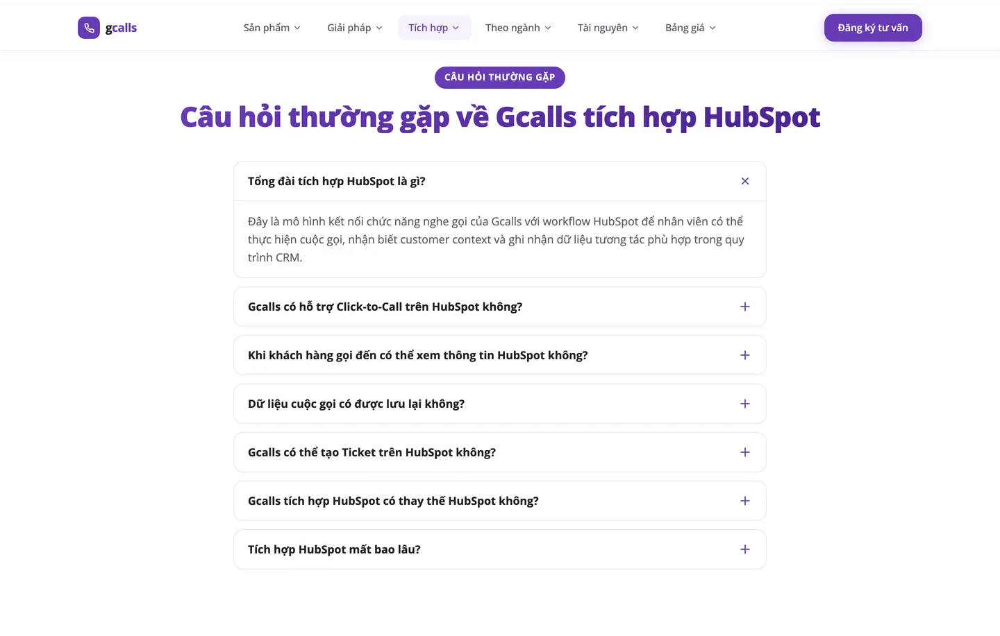

#### Section 17 — Xem thêm

> Gcalls Plus Webphone Gcalls CX Bảng giá Gcalls Ước tính chi phí Blog Gcalls Liên hệ

#### Section 18 — Xem hoạt động nghe gọi vận hành ngay trong workflow HubSpot của doanh nghiệp bạn

> GCALLS × HUBSPOT Xem hoạt động nghe gọi vận hành ngay trong workflow HubSpot của doanh nghiệp bạn Chia sẻ cách đội Sales/CSKH đang sử dụng HubSpot để Gcalls tư vấn phạm vi tích hợp và demo workflow phù hợp.
> Xem demo tích hợp HubSpot Tư vấn tích hợp 028 7302 5469

---

## Tích hợp Salesforce

- **Đường dẫn:** `/tich-hop/salesforce/`
- **Nhóm:** Tích hợp
- **Số section:** 21

📄 Ảnh toàn trang (full-page)

### Các section

#### Section 01

> Trang chủ Tích hợp Salesforce

#### Section 02 — Tổng đài tích hợp Salesforce cho đội Sales và Customer Service

> GCALLS × SALESFORCE Tổng đài tích hợp Salesforce cho đội Sales và Customer Service Kết nối chức năng nghe gọi của Gcalls với Salesforce để nhân viên có thể thực hiện cuộc gọi, nhận biết customer context và theo dõi hoạt động tương tác gần hơn với quy trình CRM đang sử dụng.
> Gọi từ customer record — Click-to-Call giúp nhân viên bắt đầu cuộc gọi từ dữ liệu đang xử lý trong Salesforce khi tích hợp được cấu hình.
> Có context khi cuộc gọi bắt đầu — Thông tin liên quan giúp nhân viên nhận biết khách hàng trước hoặc trong quá trình trao đổi.
> Giữ call activity gần CRM — Dữ liệu tương tác phù hợp có thể được ghi nhận theo phạm vi tích hợp để đội ngũ tiếp tục follow-up trong Salesforce.
> Xem demo tích hợp Salesforce Xem workflow tích hợp CRM RECORD Theo cấu hình Contact KH #2148 Company Công ty mẫu Lần liên hệ gần nhất Đã ghi nhận SỐ ĐIỆN THOẠI ••• ••• •48 Click-to-Call Giao diện minh họa.
> Số liệu hiển thị là dữ liệu mẫu.

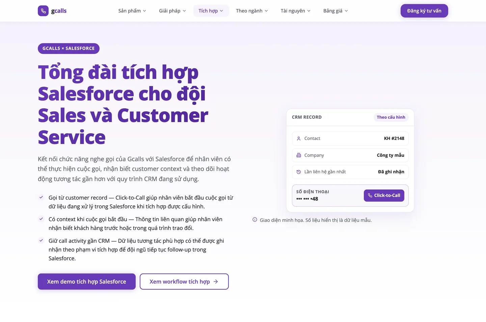

#### Section 03 — Tổng đài tích hợp Salesforce là gì?

> ĐỊNH NGHĨA Tổng đài tích hợp Salesforce là gì?
> Tổng đài tích hợp Salesforce kết nối chức năng nghe gọi của Gcalls với quy trình CRM Salesforce để nhân viên có thể thực hiện cuộc gọi từ customer record, nhận biết khách hàng khi có cuộc gọi và ghi nhận dữ liệu tương tác phù hợp vào workflow đang sử dụng.
> Phạm vi chức năng phụ thuộc vào cấu hình Gcalls, Salesforce và yêu cầu triển khai của doanh nghiệp.

#### Section 04 — Salesforce quản lý quy trình khách hàng, nhưng cuộc gọi vẫn có thể nằm ngoài dữ liệu CRM

> BÀI TOÁN ENTERPRISE CRM Salesforce quản lý quy trình khách hàng, nhưng cuộc gọi vẫn có thể nằm ngoài dữ liệu CRM 01 Nhân viên phải copy số để gọi Customer record nằm trong Salesforce nhưng thao tác nghe gọi diễn ra ở một hệ thống riêng, tạo thêm bước trong quy trình Sales và Service.
> 02 Cuộc gọi đến thiếu customer context Khi call system chưa kết nối phù hợp, nhân viên cần tìm lại hồ sơ trước khi hiểu người đang liên hệ.
> 03 Call history bị phân mảnh Thông tin cuộc gọi nằm ngoài Salesforce khiến đội ngũ khó nhìn lại đầy đủ quá trình tương tác với khách hàng.
> 04 Dữ liệu khó tiếp tục khi ownership thay đổi Khi lịch sử liên hệ không nằm gần customer record, nhân viên tiếp nhận mới có thể thiếu bối cảnh để tiếp tục follow-up.

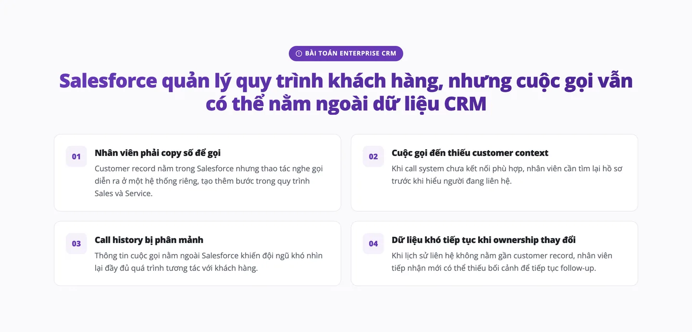

#### Section 05 — Đưa lớp giao tiếp thoại vào workflow Salesforce

> GCALLS FOR SALESFORCE Đưa lớp giao tiếp thoại vào workflow Salesforce Salesforce tiếp tục là hệ thống quản lý khách hàng và quy trình.
> Gcalls bổ sung lớp nghe gọi để cuộc hội thoại và dữ liệu tương tác được đặt gần hơn với customer record đang được xử lý.
> 01 Salesforce record Nhân viên làm việc trên dữ liệu đang được quản lý trong Salesforce.
> 02 Click-to-Call Cuộc gọi bắt đầu từ customer record khi tích hợp được cấu hình.
> 03 Gcalls conversation Gcalls xử lý lớp giao tiếp thoại.
> 04 Customer context Thông tin liên quan hỗ trợ nhân viên trong cuộc trao đổi.
> 05 Call activity Dữ liệu tương tác phù hợp được ghi nhận theo phạm vi tích hợp.
> 06 Sales / Service follow-up Đội ngũ tiếp tục workflow trong Salesforce.

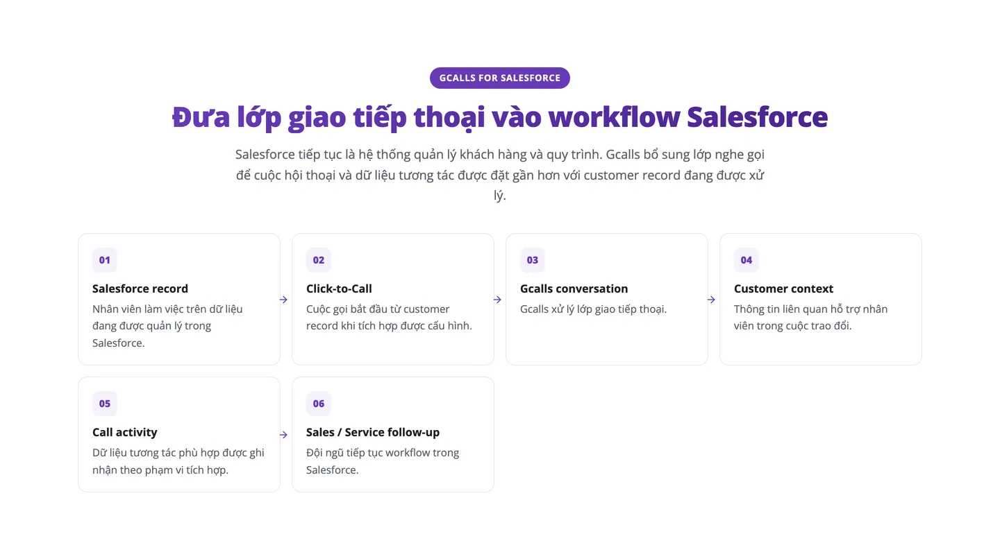

#### Section 06 — Những năng lực cốt lõi khi kết nối Gcalls với Salesforce

> TÍNH NĂNG TÍCH HỢP Những năng lực cốt lõi khi kết nối Gcalls với Salesforce 01 Click-to-Call Bắt đầu cuộc gọi từ số điện thoại hoặc customer record trong Salesforce khi integration được cấu hình phù hợp.
> 02 Incoming Customer Context Thông tin liên quan hỗ trợ nhân viên nhận biết khách hàng khi cuộc gọi đến và truy cập customer record phù hợp.
> 03 Call Activity Dữ liệu cuộc gọi phù hợp có thể được ghi nhận hoặc liên kết theo phạm vi tích hợp.
> 04 Interaction History Lịch sử tương tác giúp Sales và Service tiếp tục xử lý với nhiều bối cảnh hơn thay vì duy trì một lịch sử riêng bên ngoài CRM.

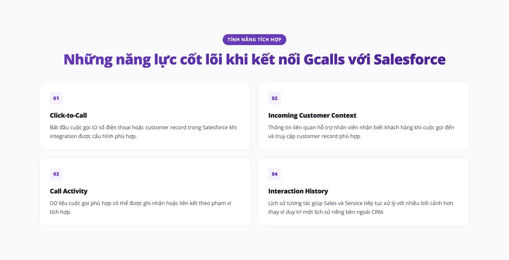

#### Section 07 — Từ Salesforce record đến cuộc gọi và bước xử lý tiếp theo

> QUY TRÌNH Từ Salesforce record đến cuộc gọi và bước xử lý tiếp theo 01 Mở lead, contact hoặc customer record Nhân viên tiếp tục làm việc trên dữ liệu được quản lý trong Salesforce.
> 02 Bắt đầu hoặc tiếp nhận cuộc gọi Click-to-Call hoặc lớp call integration hỗ trợ hoạt động thoại theo cấu hình triển khai.
> 03 Xem customer context Thông tin liên quan giúp nhân viên hiểu khách hàng và lịch sử trước đó.
> 04 Thực hiện cuộc hội thoại Gcalls xử lý lớp giao tiếp thoại trong workflow được triển khai.
> 05 Ghi nhận call activity phù hợp Dữ liệu cuộc gọi có thể được liên kết hoặc ghi nhận theo phạm vi tích hợp.
> 06 Tiếp tục Sales hoặc Service workflow Nhân viên follow-up trong Salesforce thay vì duy trì dữ liệu cuộc gọi ở một luồng riêng.

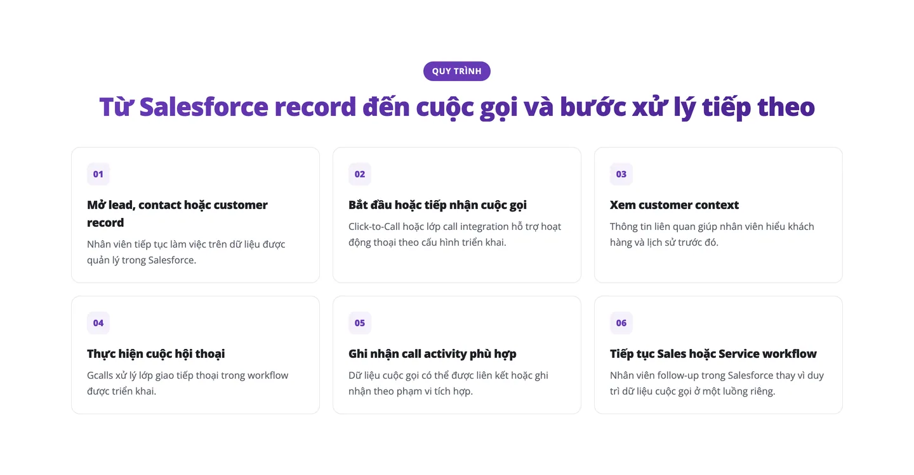

#### Section 08 — Giảm những bước chuyển đổi thủ công giữa Salesforce và hệ thống gọi

> TRƯỚC & SAU TÍCH HỢP Giảm những bước chuyển đổi thủ công giữa Salesforce và hệ thống gọi Trước tích hợp Salesforce record Copy phone number Call tool Conversation Manual note Quay lại Salesforce Cập nhật follow-up Sau tích hợp Salesforce record Click-to-Call Conversation Call activity Workflow tiếp tục Ít điểm chuyển đổi thủ công hơn

#### Section 09 — Giữ dữ liệu cuộc gọi gần hơn với quy trình Sales và Service

> GIÁ TRỊ VẬN HÀNH Giữ dữ liệu cuộc gọi gần hơn với quy trình Sales và Service Giảm thao tác copy số Có customer context trước cuộc hội thoại Theo dõi call activity tập trung hơn Dễ tiếp tục xử lý khi ownership thay đổi

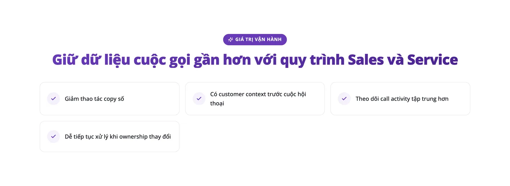

#### Section 10 — Gcalls × Salesforce phù hợp với những workflow nào?

> TÌNH HUỐNG SỬ DỤNG Gcalls × Salesforce phù hợp với những workflow nào?
> Enterprise Sales Sales làm việc với lead và opportunity trong Salesforce, thực hiện cuộc gọi và tiếp tục follow-up từ customer context hiện có.
> Sales Operations Đội vận hành có thêm dữ liệu cuộc gọi phù hợp để theo dõi quy trình tương tác gần hơn với CRM.
> Customer Service Agent sử dụng customer record và lịch sử liên quan để có thêm context khi tiếp nhận cuộc gọi.
> Account Management Người phụ trách tài khoản có thể giữ hoạt động liên hệ gần hơn với dữ liệu và quá trình chăm sóc khách hàng.

#### Section 11

> Đánh giá chất lượng cuộc gọi không phải là chức năng của lớp tích hợp Salesforce.
> Nhu cầu này thuộc về QA QC Center

#### Section 12 — Tích hợp theo cấu hình Salesforce và workflow doanh nghiệp đang sử dụng

> THIẾT LẬP Tích hợp theo cấu hình Salesforce và workflow doanh nghiệp đang sử dụng 01 Khảo sát Salesforce workflow 02 Xác định object/record liên quan 03 Xác định user và hotline 04 Xác định capability cần tích hợp 05 Kiểm tra quyền truy cập/API 06 Cấu hình integration 07 Kiểm thử cuộc gọi và dữ liệu 08 Hướng dẫn người dùng 09 Go-live

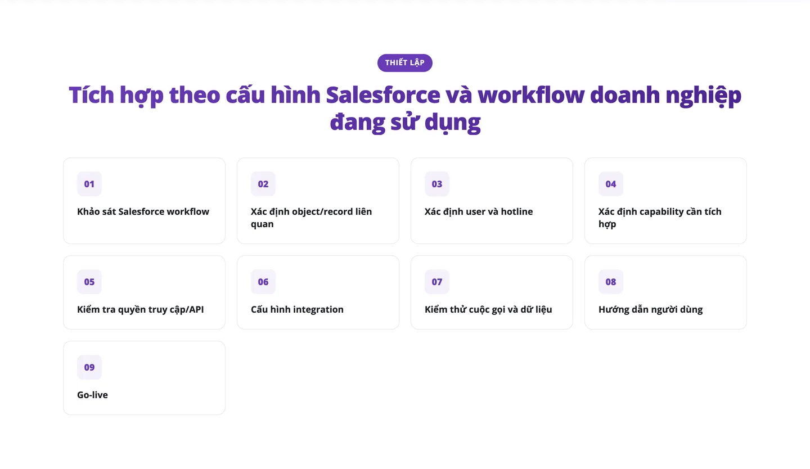

#### Section 13

> Phạm vi và thời gian triển khai phụ thuộc vào object, permission, số lượng người dùng, hotline và capability cần sử dụng, nên được xác định sau bước khảo sát thay vì theo một mốc cố định.
> Gcalls không mặc định mọi edition hoặc gói Salesforce đều hỗ trợ cùng một phạm vi tích hợp.

#### Section 14 — Giữ customer context gần hoạt động nghe gọi

> GIAO DIỆN TÍCH HỢP Giữ customer context gần hoạt động nghe gọi Các giao diện dưới đây là bề mặt phía Gcalls trong luồng tích hợp: customer context khi có cuộc gọi đến, thao tác gọi từ customer record và hoạt động tương tác được ghi nhận.
> Cuộc gọi đến...
> 1900 1234 · Hà Nội NM Nguyễn Văn Minh Công ty TNHH Bình Minh Demo VIP LỊCH SỬ GẦN NHẤT Gọi đi · 3:42 Hôm nay 09:14 Ghi chú: Cần gửi proposal Hôm nay 09:35 Ghi chú Gắn tag Xem hồ sơ Timeline Cuộc gọi Tìm kiếm...
> Tất cả Đến Đi Nhỡ1 Hotline: 1900 1234 1900 5678 Nguyễn Văn Minh Khách hàng mới 0901 234 567 1900 1234 3:42 09:14 Trần Thị Lan Gia hạn 0912 345 678 1900 5678 Cần gửi báo giá gia hạn trước 15h 7:18 09:31 Lê Hoàng Phúc 0888 901 234 1900 1234 — 09:52 Phạm Thu Hà Demo 0976 543 210 1900 5678 12:05 10:08 Võ Minh Tuấn Upsell 0933 210 987 1900 1234 5:20 10:45 Trần Thị Lan7:18 3:09 Gia hạn Cần gửi báo giá gia hạn trước 15h Giao diện minh họa phía Gcalls với dữ liệu mẫu.
> Đây không phải ảnh chụp màn hình Salesforce, và bố cục thực tế phụ thuộc vào cấu hình tích hợp của doanh nghiệp.

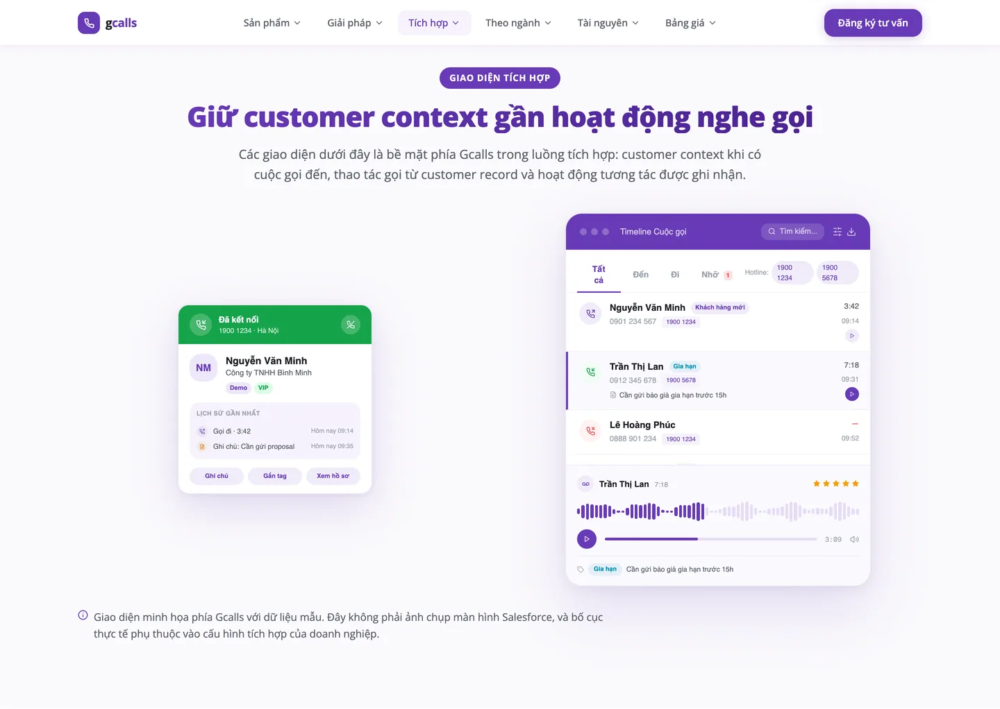

#### Section 15 — Trang này dành cho doanh nghiệp đã sử dụng Salesforce

> SALESFORCE-SPECIFIC WORKFLOW Trang này dành cho doanh nghiệp đã sử dụng Salesforce Nếu doanh nghiệp đang đánh giá tổng đài tích hợp CRM nói chung, hãy xem giải pháp CRM Integration.
> Trang này tập trung vào cách Gcalls hỗ trợ workflow khi Salesforce đã là hệ thống quản lý khách hàng hiện tại.
> Xem giải pháp Tổng đài tích hợp CRM

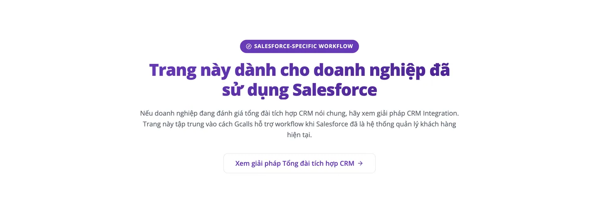

#### Section 16 — Doanh nghiệp đang sử dụng CRM khác?

> Mỗi nền tảng CRM có cấu trúc dữ liệu và cách kết nối riêng.
> Xem trang tương ứng với hệ thống doanh nghiệp đang sử dụng.
> HubSpot Kết nối hoạt động nghe gọi với workflow HubSpot.
> Tìm hiểu thêm Zoho CRM Kết nối hoạt động nghe gọi với workflow Zoho CRM.
> Tìm hiểu thêm Danh mục tích hợp Xem toàn bộ nền tảng đang có trang tích hợp riêng.
> Tìm hiểu thêm

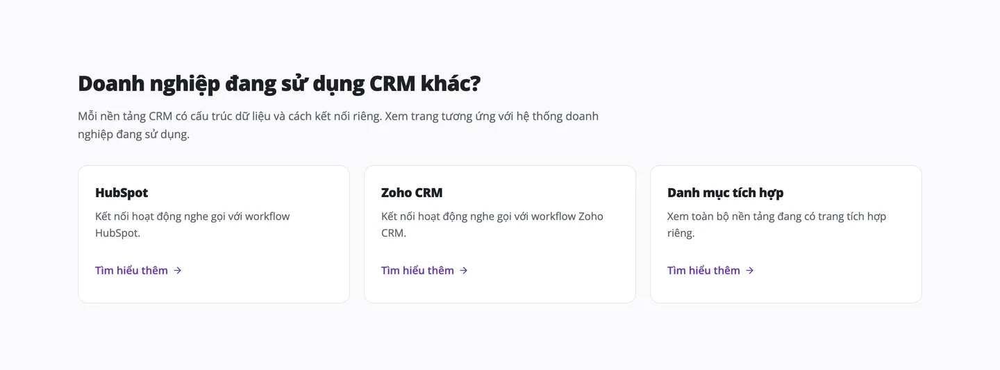

#### Section 17 — Salesforce Integration nằm ở đâu trong hệ sản phẩm Gcalls?

> PHÂN BIỆT SẢN PHẨM Salesforce Integration nằm ở đâu trong hệ sản phẩm Gcalls?
> Gcalls Plus Lớp nghe gọi trên trình duyệt — phần thực hiện cuộc gọi của doanh nghiệp.
> Tìm hiểu Gcalls Plus CRM Integration Giải pháp tích hợp CRM nói chung, khi doanh nghiệp chưa xác định nền tảng.
> Tìm hiểu CRM Integration Salesforce Integration Trang này Workflow riêng cho doanh nghiệp đã sử dụng Salesforce làm hệ thống khách hàng.
> QA QC Center Đánh giá chất lượng cuộc gọi với hỗ trợ của AI — không phải chức năng của lớp tích hợp CRM.
> Tìm hiểu QA QC Center

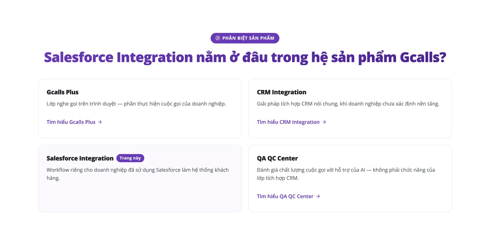

#### Section 18 — Tích hợp Salesforce cần bắt đầu từ object, permission và workflow thực tế

> PHẠM VI TRIỂN KHAI Tích hợp Salesforce cần bắt đầu từ object, permission và workflow thực tế Object, field, permission, user role và quy trình Sales/Service có thể khác nhau giữa từng Salesforce organization.
> Phạm vi tích hợp cần được xác định qua khảo sát và kiểm thử thay vì áp dụng một cấu hình giống nhau cho mọi doanh nghiệp.
> Trao đổi về Salesforce workflow hiện tại Ước tính cấu hình & chi phí Xem bảng giá Gcalls

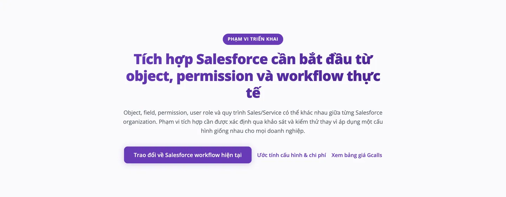

#### Section 19 — Câu hỏi thường gặp về Gcalls tích hợp Salesforce

> CÂU HỎI THƯỜNG GẶP Câu hỏi thường gặp về Gcalls tích hợp Salesforce Tổng đài tích hợp Salesforce là gì?
> Đây là mô hình kết nối chức năng nghe gọi của Gcalls với Salesforce để nhân viên có thể thực hiện cuộc gọi, nhận biết customer context và ghi nhận dữ liệu tương tác phù hợp trong workflow CRM.
> Gcalls có hỗ trợ Click-to-Call trên Salesforce không?
> Khi khách hàng gọi đến có thể xem thông tin Salesforce không?
> Lịch sử cuộc gọi có được ghi nhận trong Salesforce không?
> Ghi âm có được đồng bộ vào Salesforce không?
> Gcalls có thay thế Salesforce không?
> Tích hợp Salesforce mất bao lâu?

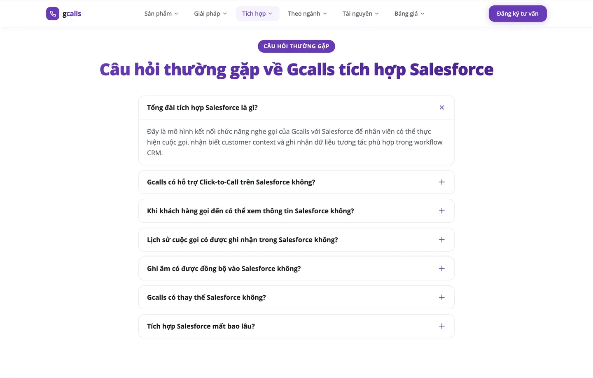

#### Section 20 — Xem thêm

> Gcalls CX Bảng giá Gcalls Ước tính chi phí Blog Gcalls Liên hệ

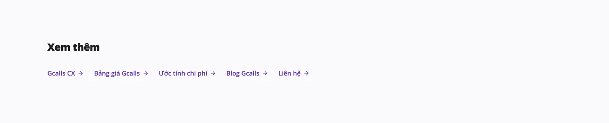

#### Section 21 — Xem hoạt động nghe gọi vận hành trong workflow Salesforce của doanh nghiệp

> GCALLS × SALESFORCE Xem hoạt động nghe gọi vận hành trong workflow Salesforce của doanh nghiệp Chia sẻ object, user role và quy trình Sales/Service hiện tại để Gcalls xác định phạm vi tích hợp và demo phù hợp.
> Xem demo tích hợp Salesforce Tư vấn tích hợp 028 7302 5469

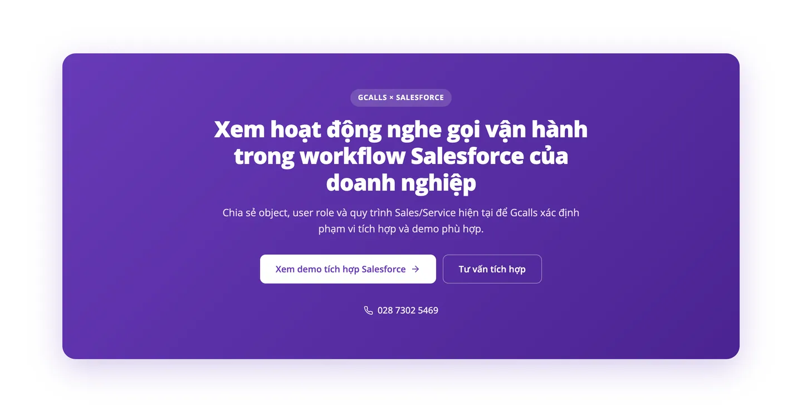

---

## Tích hợp Zoho CRM

- **Đường dẫn:** `/tich-hop/zoho-crm/`
- **Nhóm:** Tích hợp
- **Số section:** 20

📄 Ảnh toàn trang (full-page)

### Các section

#### Section 01

> Trang chủ Tích hợp Zoho CRM

#### Section 02 — Tổng đài tích hợp Zoho CRM cho đội Sales và CSKH

> GCALLS × ZOHO CRM Tổng đài tích hợp Zoho CRM cho đội Sales và CSKH Kết nối hoạt động nghe gọi của Gcalls với Zoho CRM để đội ngũ có thể sử dụng customer context, theo dõi lịch sử tương tác và tiếp tục follow-up gần hơn với quy trình CRM đang sử dụng.
> Đưa cuộc gọi gần customer record — Nhân viên có thể làm việc với cuộc gọi trong bối cảnh dữ liệu khách hàng đang được quản lý trên Zoho CRM theo phạm vi tích hợp.
> Có thêm context khi trao đổi — Thông tin liên quan giúp Sales và CSKH hiểu khách hàng trước hoặc trong quá trình xử lý cuộc gọi.
> Theo dõi tương tác tập trung hơn — Call activity phù hợp có thể được ghi nhận hoặc liên kết để đội ngũ tiếp tục follow-up trong CRM.
> Xem demo tích hợp Zoho CRM Xem workflow tích hợp CRM MODULE Theo cấu hình Module Leads / Contacts Customer record KH #3061 Lịch sử tương tác Đã liên kết SỐ ĐIỆN THOẠI ••• ••• •61 Click-to-Call CALL ACTIVITY Cuộc gọi ra Ghi chú Bước follow-up Giao diện minh họa.
> Số liệu hiển thị là dữ liệu mẫu.

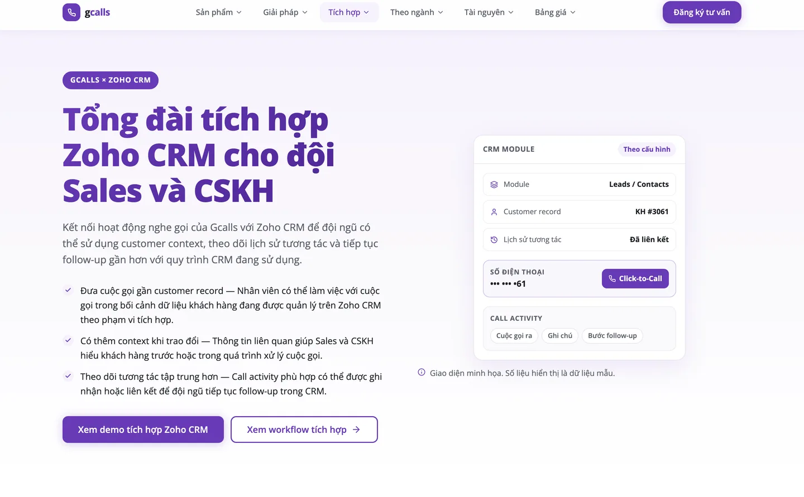

#### Section 03 — Tổng đài tích hợp Zoho CRM là gì?

> ĐỊNH NGHĨA Tổng đài tích hợp Zoho CRM là gì?
> Tổng đài tích hợp Zoho CRM kết nối hoạt động nghe gọi của Gcalls với quy trình quản lý khách hàng trên Zoho CRM để nhân viên có thể sử dụng customer context, theo dõi dữ liệu cuộc gọi phù hợp và tiếp tục follow-up trong workflow đang sử dụng.
> Phạm vi chức năng phụ thuộc vào cấu hình Gcalls, Zoho CRM và yêu cầu triển khai của doanh nghiệp.

#### Section 04 — Zoho CRM quản lý khách hàng, nhưng hoạt động gọi vẫn có thể nằm ngoài workflow

> BÀI TOÁN Zoho CRM quản lý khách hàng, nhưng hoạt động gọi vẫn có thể nằm ngoài workflow 01 Phải chuyển đổi giữa CRM và công cụ gọi Nhân viên làm việc với contact trong Zoho CRM nhưng lại thực hiện cuộc gọi trên một hệ thống riêng.
> 02 Thiếu customer context khi cuộc gọi bắt đầu Khi dữ liệu CRM và cuộc gọi chưa kết nối phù hợp, nhân viên cần tự tìm hồ sơ trước khi tiếp tục trao đổi.
> 03 Lịch sử tương tác bị phân mảnh Call activity nằm ngoài CRM khiến đội ngũ khó nhìn lại toàn bộ quá trình tư vấn và chăm sóc khách hàng.
> 04 Follow-up phụ thuộc vào ghi chú thủ công Nhân viên có thể phải nhập lại dữ liệu sau cuộc gọi để giữ Zoho CRM cập nhật.

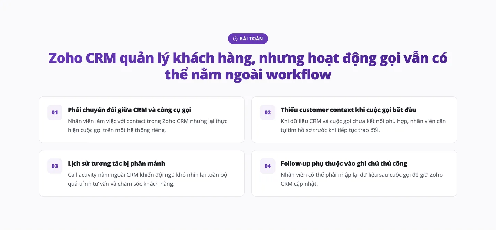

#### Section 05 — Kết nối lớp giao tiếp thoại với CRM đội ngũ đang sử dụng

> GCALLS FOR ZOHO CRM Kết nối lớp giao tiếp thoại với CRM đội ngũ đang sử dụng Zoho CRM tiếp tục quản lý customer record và workflow.
> Gcalls bổ sung lớp nghe gọi để cuộc hội thoại và dữ liệu tương tác được đặt gần hơn với quá trình Sales và CSKH.
> 01 Zoho CRM record Đội ngũ làm việc trên dữ liệu khách hàng đang được quản lý.
> 02 Call action Cuộc gọi bắt đầu theo capability và cấu hình được triển khai.
> 03 Gcalls conversation Gcalls xử lý lớp giao tiếp thoại.
> 04 Customer context Thông tin liên quan hỗ trợ nhân viên trong cuộc trao đổi.
> 05 Call activity Dữ liệu tương tác phù hợp được ghi nhận theo phạm vi tích hợp.
> 06 CRM follow-up Đội ngũ tiếp tục workflow trong Zoho CRM.

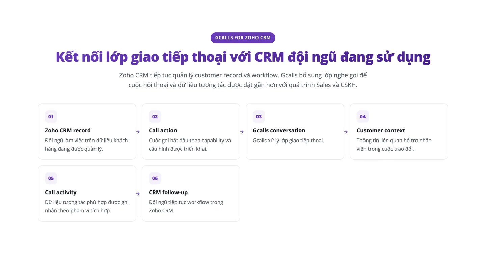

#### Section 06 — Những năng lực được xác nhận khi kết nối Gcalls với Zoho CRM

> NĂNG LỰC TÍCH HỢP Những năng lực được xác nhận khi kết nối Gcalls với Zoho CRM 01 Click-to-Call Nhân viên có thể bắt đầu cuộc gọi từ số điện thoại hoặc customer record trong Zoho CRM khi integration được cấu hình phù hợp.
> 02 Customer Context Thông tin khách hàng liên quan hỗ trợ đội ngũ có thêm bối cảnh khi xử lý cuộc gọi, và nhận biết khách hàng ở nơi dữ liệu cùng cấu hình tích hợp hỗ trợ.
> 03 Call Activity / Interaction History Dữ liệu cuộc gọi phù hợp có thể được ghi nhận hoặc liên kết theo phạm vi tích hợp để đội ngũ nhìn lại quá trình tương tác.
> 04 CRM Workflow Continuity Sales và CSKH tiếp tục follow-up trong Zoho CRM thay vì duy trì một luồng dữ liệu cuộc gọi riêng bên ngoài hệ thống.

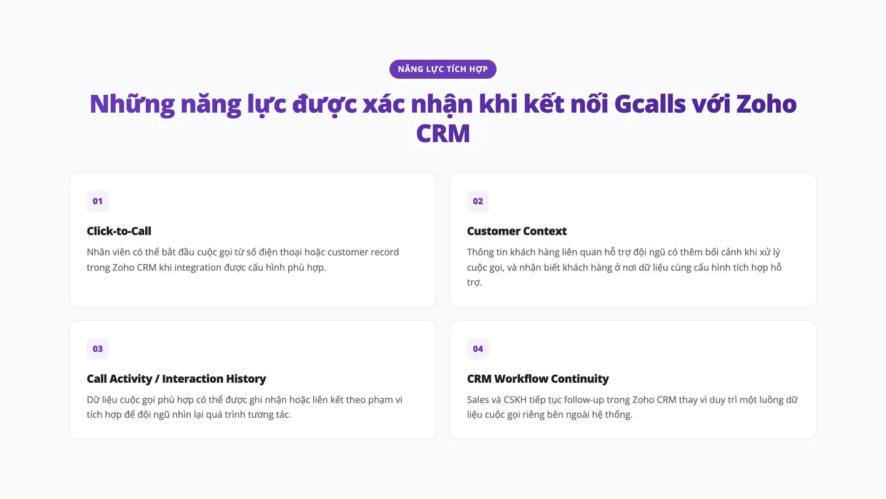

#### Section 07 — Từ Zoho CRM record đến cuộc gọi và bước follow-up tiếp theo

> QUY TRÌNH Từ Zoho CRM record đến cuộc gọi và bước follow-up tiếp theo 01 Mở lead hoặc contact Nhân viên tiếp tục làm việc trên dữ liệu khách hàng đang được quản lý trong Zoho CRM.
> 02 Bắt đầu hoặc tiếp nhận cuộc gọi Hoạt động thoại được thực hiện theo capability và cấu hình tích hợp được triển khai.
> 03 Sử dụng customer context Thông tin liên quan giúp nhân viên hiểu khách hàng và lịch sử trước đó.
> 04 Thực hiện cuộc hội thoại Gcalls xử lý lớp giao tiếp thoại trong workflow được cấu hình.
> 05 Ghi nhận dữ liệu phù hợp Call activity hoặc dữ liệu liên quan có thể được ghi nhận theo phạm vi tích hợp.
> 06 Tiếp tục Sales / CSKH workflow Nhân viên follow-up trong Zoho CRM thay vì duy trì lịch sử riêng bên ngoài hệ thống.

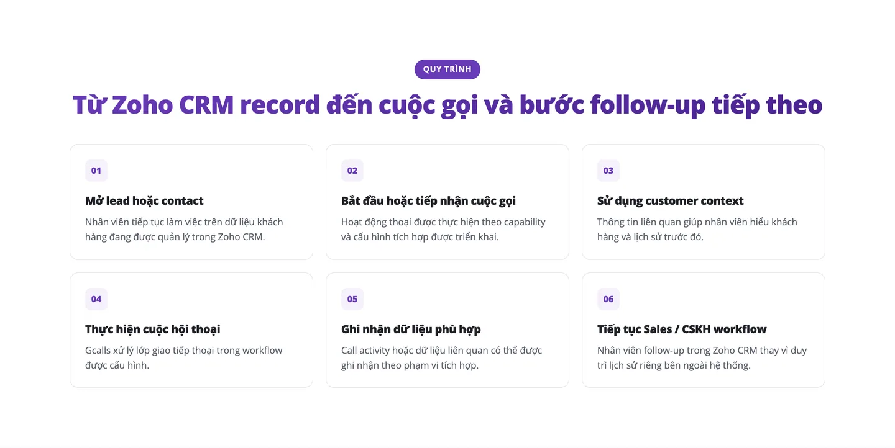

#### Section 08 — Giảm những bước thủ công giữa Zoho CRM và hệ thống gọi

> TRƯỚC & SAU TÍCH HỢP Giảm những bước thủ công giữa Zoho CRM và hệ thống gọi Trước tích hợp Zoho CRM Copy phone number Call tool Conversation Manual note Quay lại CRM Follow-up Sau tích hợp Zoho CRM record Configured call action Conversation Call activity CRM workflow tiếp tục Ít điểm chuyển đổi thủ công hơn

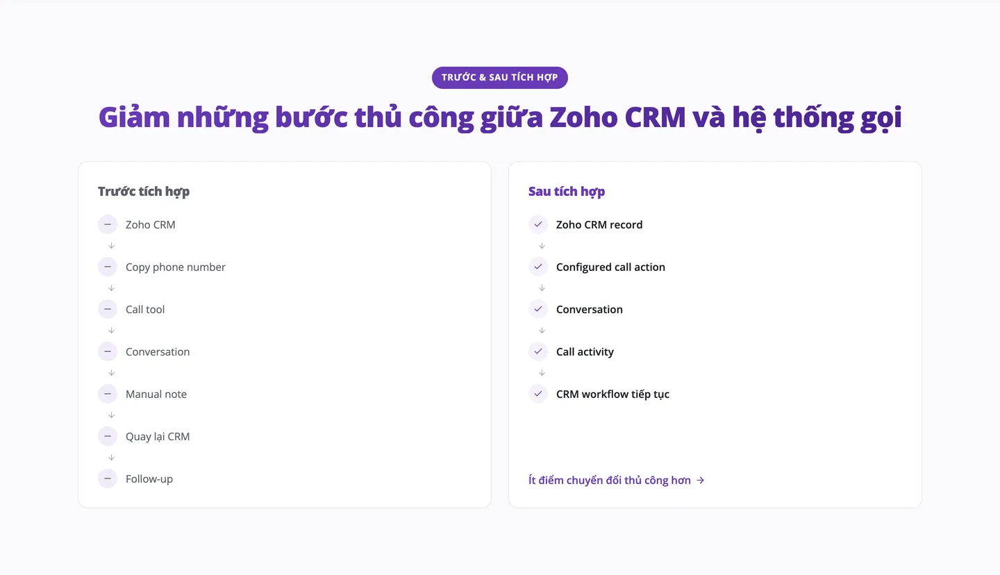

#### Section 09 — Giữ hoạt động gọi gần hơn với dữ liệu Sales và CSKH

> GIÁ TRỊ VẬN HÀNH Giữ hoạt động gọi gần hơn với dữ liệu Sales và CSKH Giảm thao tác chuyển đổi giữa nhiều công cụ Có thêm customer context khi trao đổi Theo dõi tương tác tập trung hơn Dễ tiếp tục follow-up khi người phụ trách thay đổi

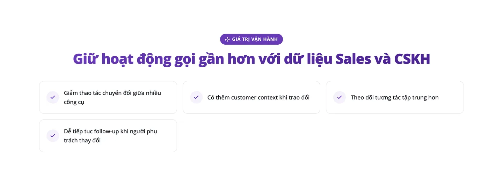

#### Section 10 — Gcalls × Zoho CRM phù hợp với những workflow nào?

> TÌNH HUỐNG SỬ DỤNG Gcalls × Zoho CRM phù hợp với những workflow nào?
> SME Sales Đội Sales làm việc với lead/contact trong Zoho CRM và tiếp tục follow-up dựa trên customer context đang có.
> Startup Sales Operations Đội vận hành có thể tổ chức hoạt động gọi gần hơn với dữ liệu CRM thay vì duy trì các danh sách rời rạc.
> Customer Service Agent sử dụng thông tin khách hàng và lịch sử liên quan để có thêm bối cảnh khi xử lý cuộc gọi.
> Customer Success Đội CS giữ hoạt động liên hệ gần hơn với dữ liệu vòng đời khách hàng đang theo dõi trong Zoho CRM.

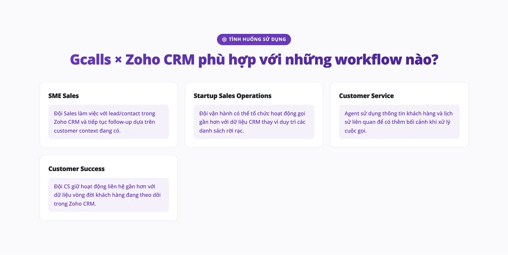

#### Section 11 — Tích hợp theo cấu hình Zoho CRM và workflow doanh nghiệp đang sử dụng

> THIẾT LẬP Tích hợp theo cấu hình Zoho CRM và workflow doanh nghiệp đang sử dụng 01 Khảo sát quy trình Zoho CRM 02 Xác định module/record liên quan 03 Xác định user và hotline 04 Xác định capability cần tích hợp 05 Kiểm tra permission/API 06 Cấu hình integration 07 Kiểm thử cuộc gọi và dữ liệu 08 Hướng dẫn đội ngũ 09 Go-live

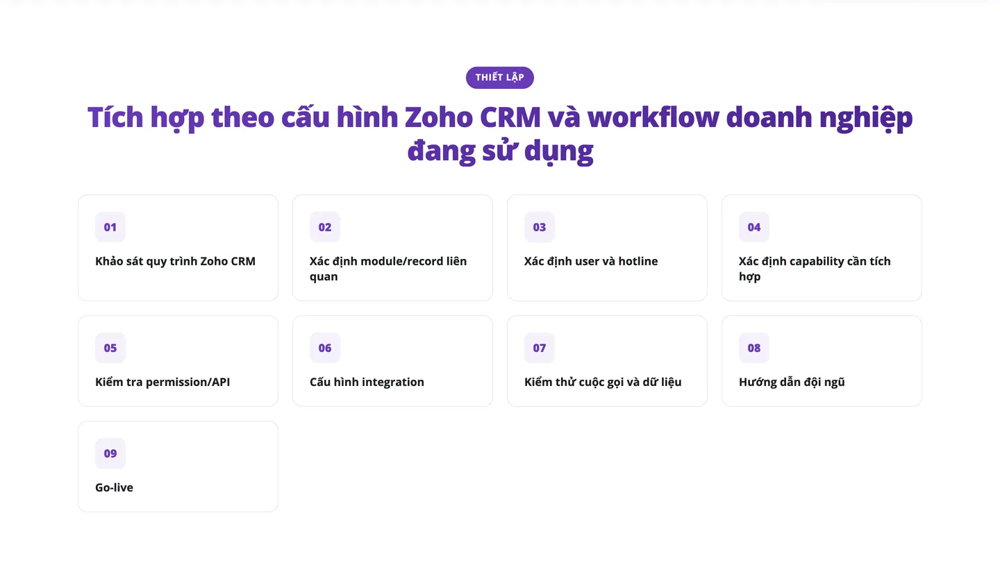

#### Section 12

> Phạm vi và thời gian triển khai phụ thuộc vào module, permission, số lượng người dùng, hotline và capability cần sử dụng, nên được xác định sau bước khảo sát thay vì theo một mốc cố định.
> Gcalls không mặc định mọi gói hoặc edition Zoho CRM đều hỗ trợ cùng một phạm vi tích hợp.

#### Section 13 — Giữ customer context gần hoạt động gọi

> GIAO DIỆN TÍCH HỢP Giữ customer context gần hoạt động gọi Giao diện dưới đây là bề mặt phía Gcalls trong luồng tích hợp: thông tin khách hàng liên quan và các nhóm dữ liệu lịch sử tương tác được đặt cạnh hoạt động nghe gọi.
> GCALLS · CUSTOMER CONTEXT Khách hàng KH #3061 Nguồn dữ liệu CRM module Phân loại Theo cấu hình LỊCH SỬ TƯƠNG TÁC Cuộc gọi trước đó Ghi chú của đội ngũ Bước follow-up đang mở Giao diện minh họa phía Gcalls với dữ liệu mẫu đã ẩn thông tin nhận dạng.
> Đây không phải ảnh chụp màn hình Zoho CRM, và bố cục thực tế phụ thuộc vào cấu hình tích hợp của doanh nghiệp.

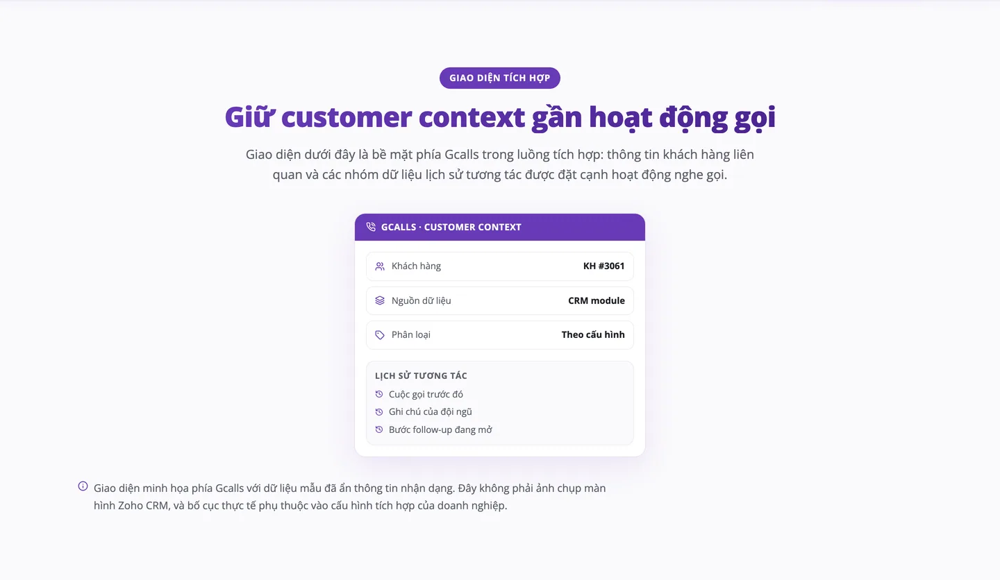

#### Section 14 — Trang này dành cho doanh nghiệp đã sử dụng Zoho CRM

> ZOHO CRM WORKFLOW Trang này dành cho doanh nghiệp đã sử dụng Zoho CRM Nếu doanh nghiệp đang đánh giá tổng đài tích hợp CRM nói chung, hãy xem giải pháp CRM Integration.
> Trang này tập trung vào workflow khi Zoho CRM đã là hệ thống quản lý khách hàng hiện tại.
> Xem giải pháp Tổng đài tích hợp CRM

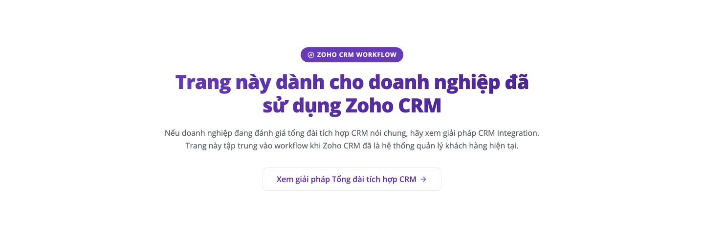

#### Section 15 — Doanh nghiệp đang sử dụng CRM khác?

> Mỗi nền tảng CRM có cấu trúc dữ liệu và cách kết nối riêng.
> Xem trang tương ứng với hệ thống doanh nghiệp đang sử dụng.
> HubSpot Kết nối hoạt động nghe gọi với workflow HubSpot.
> Tìm hiểu thêm Salesforce Kết nối hoạt động nghe gọi với workflow Salesforce.
> Tìm hiểu thêm Danh mục tích hợp Xem toàn bộ nền tảng đang có trang tích hợp riêng.
> Tìm hiểu thêm

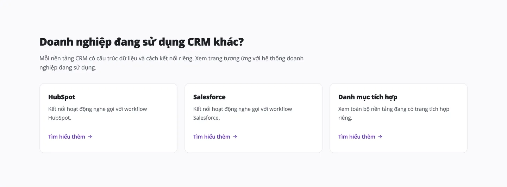

#### Section 16 — Zoho CRM Integration nằm ở đâu trong hệ sản phẩm Gcalls?

> PHÂN BIỆT SẢN PHẨM Zoho CRM Integration nằm ở đâu trong hệ sản phẩm Gcalls?
> Gcalls Plus Lớp nghe gọi trên trình duyệt — phần thực hiện cuộc gọi của doanh nghiệp.
> Tìm hiểu Gcalls Plus CRM Integration Giải pháp tích hợp CRM nói chung, khi doanh nghiệp chưa xác định nền tảng.
> Tìm hiểu CRM Integration Zoho CRM Integration Trang này Workflow riêng cho doanh nghiệp đã sử dụng Zoho CRM làm hệ thống khách hàng.
> Gcalls CX Giao tiếp đa kênh khi doanh nghiệp cần hợp nhất nhiều điểm chạm khách hàng.
> Tìm hiểu Gcalls CX

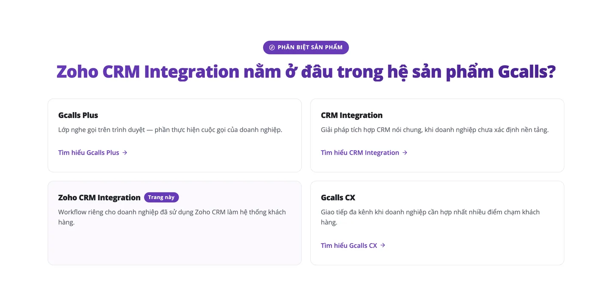

#### Section 17 — Tích hợp Zoho CRM cần bắt đầu từ module, permission và workflow thực tế

> PHẠM VI TRIỂN KHAI Tích hợp Zoho CRM cần bắt đầu từ module, permission và workflow thực tế Module, field, permission, user role và workflow có thể khác nhau giữa từng tài khoản Zoho CRM.
> Phạm vi tích hợp cần được xác định qua khảo sát và kiểm thử thay vì áp dụng cùng một cấu hình cho mọi doanh nghiệp.
> Trao đổi về workflow Zoho CRM hiện tại Ước tính cấu hình & chi phí Xem bảng giá Gcalls

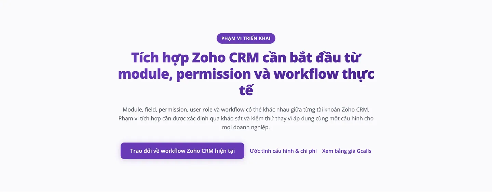

#### Section 18 — Câu hỏi thường gặp về Gcalls tích hợp Zoho CRM

> CÂU HỎI THƯỜNG GẶP Câu hỏi thường gặp về Gcalls tích hợp Zoho CRM Tổng đài tích hợp Zoho CRM là gì?
> Đây là mô hình kết nối hoạt động nghe gọi của Gcalls với Zoho CRM để đội ngũ có thể sử dụng customer context, dữ liệu cuộc gọi phù hợp và tiếp tục follow-up trong workflow CRM.
> Gcalls có hỗ trợ Click-to-Call trên Zoho CRM không?
> Khi khách hàng gọi đến có thể xem thông tin Zoho CRM không?
> Lịch sử cuộc gọi có được ghi nhận trong Zoho CRM không?
> Gcalls có hỗ trợ gửi SMS từ Zoho CRM không?
> Ghi âm có được đồng bộ vào Zoho CRM không?
> Gcalls có thay thế Zoho CRM không?

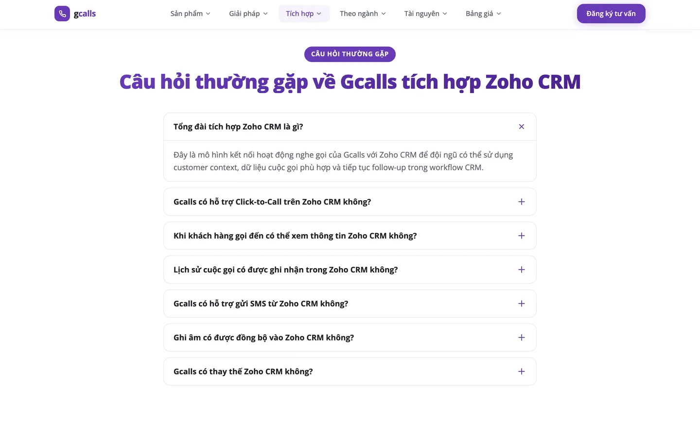

#### Section 19 — Xem thêm

> Bảng giá Gcalls Ước tính chi phí Blog Gcalls Liên hệ

#### Section 20 — Xem hoạt động nghe gọi vận hành trong workflow Zoho CRM của doanh nghiệp

> GCALLS × ZOHO CRM Xem hoạt động nghe gọi vận hành trong workflow Zoho CRM của doanh nghiệp Chia sẻ module, user và quy trình Sales/CSKH hiện tại để Gcalls xác định phạm vi tích hợp và demo phù hợp.
> Xem demo tích hợp Zoho CRM Tư vấn tích hợp 028 7302 5469

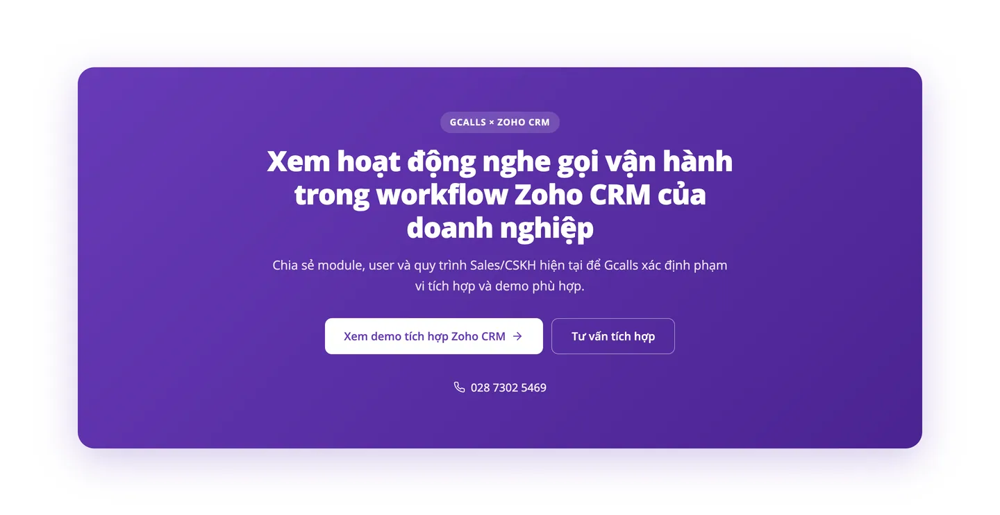

---

## Tích hợp Freshdesk

- **Đường dẫn:** `/tich-hop/freshdesk/`
- **Nhóm:** Tích hợp
- **Số section:** 21

📄 Ảnh toàn trang (full-page)

### Các section

#### Section 01

> Trang chủ Tích hợp Freshdesk

#### Section 02 — Tổng đài tích hợp Freshdesk cho đội CSKH và Support

> GCALLS × FRESHDESK Tổng đài tích hợp Freshdesk cho đội CSKH và Support Kết nối hoạt động nghe gọi của Gcalls với Freshdesk để nhân viên có thể sử dụng customer context, ticket liên quan và lịch sử hỗ trợ gần hơn với quy trình đang xử lý.
> Đưa cuộc gọi vào workflow hỗ trợ — Hoạt động thoại được đặt gần hơn với hồ sơ và quy trình hỗ trợ đang được quản lý trong Freshdesk.
> Có customer context khi tiếp nhận cuộc gọi — Thông tin liên quan giúp nhân viên hiểu khách hàng và yêu cầu hỗ trợ trước khi tiếp tục xử lý.
> Theo dõi cuộc gọi và ticket tập trung hơn — Dữ liệu phù hợp có thể được liên kết hoặc ghi nhận theo phạm vi tích hợp để đội ngũ tiếp tục follow-up.
> Xem demo tích hợp Freshdesk Xem workflow tích hợp GCALLS · CUỘC GỌI ĐẾN KH KH #2318 Đang kết nối · Agent 04 Lớp tích hợp Gcalls HỒ SƠ HỖ TRỢ Đã liên kết Cuộc gọi đến Hôm nay Yêu cầu hỗ trợ đang xử lý Đang mở Tương tác trước đó 2 lần Giao diện minh họa.
> Số liệu hiển thị là dữ liệu mẫu.

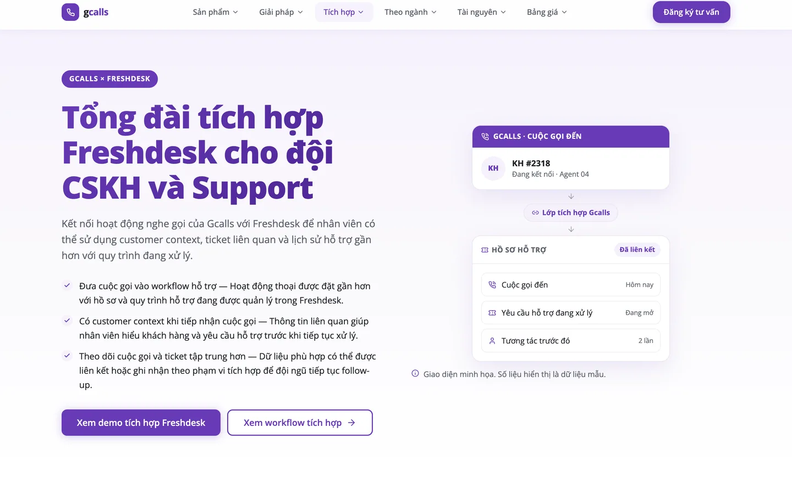

#### Section 03 — Tổng đài tích hợp Freshdesk là gì?

> ĐỊNH NGHĨA Tổng đài tích hợp Freshdesk là gì?
> Tổng đài tích hợp Freshdesk kết nối hoạt động nghe gọi của Gcalls với quy trình hỗ trợ trên Freshdesk để nhân viên có thể sử dụng customer context, ticket liên quan và dữ liệu tương tác phù hợp trong cùng workflow CSKH.
> Phạm vi chức năng phụ thuộc vào cấu hình Gcalls, Freshdesk, API và yêu cầu triển khai của doanh nghiệp.

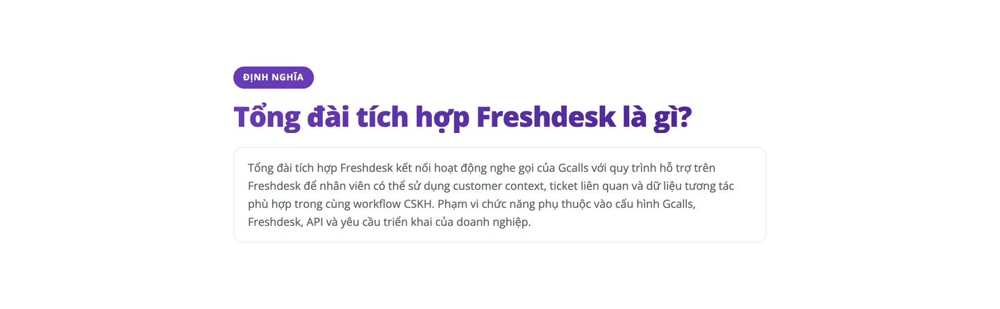

#### Section 04 — Freshdesk quản lý ticket, nhưng cuộc gọi vẫn có thể nằm ngoài lịch sử hỗ trợ

> BÀI TOÁN SUPPORT Freshdesk quản lý ticket, nhưng cuộc gọi vẫn có thể nằm ngoài lịch sử hỗ trợ 01 Nhân viên phải chuyển đổi giữa hai hệ thống Agent xử lý ticket trong Freshdesk nhưng lại thực hiện cuộc gọi bằng một công cụ riêng, khiến workflow bị chia thành nhiều bước.
> 02 Cuộc gọi đến thiếu customer context Khi Freshdesk và hệ thống gọi chưa được kết nối phù hợp, nhân viên phải tự tìm contact hoặc ticket trong lúc khách hàng đang chờ.
> 03 Ticket thiếu lịch sử cuộc hội thoại Nếu dữ liệu cuộc gọi nằm ngoài workflow hỗ trợ, nhân viên tiếp nhận sau có thể thiếu bối cảnh để tiếp tục xử lý.
> 04 Follow-up phụ thuộc vào ghi chú thủ công Nhân viên có thể phải nhập lại thông tin sau cuộc gọi để giữ lịch sử hỗ trợ cập nhật.

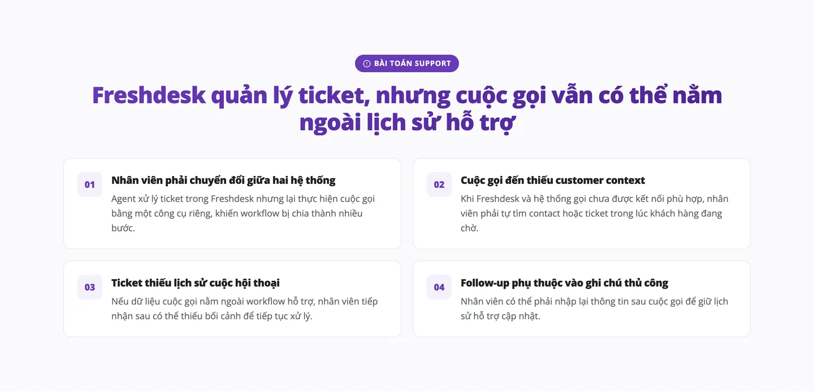

#### Section 05 — Đưa lớp giao tiếp thoại vào nơi đội Support đang quản lý yêu cầu khách hàng

> GCALLS FOR FRESHDESK Đưa lớp giao tiếp thoại vào nơi đội Support đang quản lý yêu cầu khách hàng Freshdesk tiếp tục quản lý ticket và support workflow.
> Gcalls bổ sung lớp nghe gọi để customer context, cuộc gọi và bước follow-up được đặt gần hơn với quy trình hỗ trợ hiện tại.
> 01 Freshdesk contact / ticket Agent làm việc trên yêu cầu hỗ trợ đang được quản lý.
> 02 Call action / incoming call Hoạt động thoại diễn ra theo capability và cấu hình đã triển khai.
> 03 Gcalls conversation Gcalls xử lý lớp giao tiếp thoại.
> 04 Customer context Thông tin liên quan hỗ trợ agent trong cuộc trao đổi.
> 05 Support activity Dữ liệu phù hợp được ghi nhận hoặc liên kết theo phạm vi tích hợp.
> 06 Ticket follow-up Đội Support tiếp tục workflow trong Freshdesk.

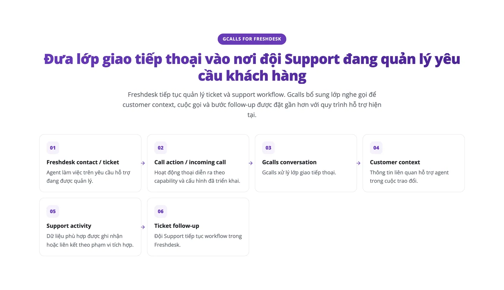

#### Section 06 — Những năng lực được xác nhận khi kết nối Gcalls với Freshdesk

> NĂNG LỰC TÍCH HỢP Những năng lực được xác nhận khi kết nối Gcalls với Freshdesk 01 Customer Context Thông tin khách hàng liên quan hỗ trợ agent nhận biết người đang liên hệ và yêu cầu hỗ trợ, ở phạm vi mà dữ liệu, permission và cấu hình tích hợp cho phép.
> 02 Call Activity Gcalls lưu lịch sử và dữ liệu hoạt động cuộc gọi.
> Việc đưa dữ liệu đó vào Freshdesk có thể được thực hiện theo phạm vi tích hợp và khả năng của nền tảng.
> 03 Ticket / Support Record Context Dữ liệu cuộc gọi có thể được liên kết với ticket hoặc hồ sơ hỗ trợ đang tồn tại khi nền tảng và cấu hình tích hợp cho phép.
> 04 Support Workflow Continuity Đội Support tiếp tục xử lý trong Freshdesk thay vì duy trì lịch sử hỗ trợ ở một luồng dữ liệu riêng bên ngoài Helpdesk.

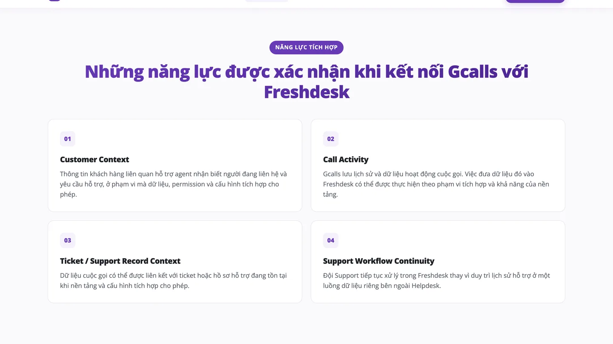

#### Section 07 — Từ Freshdesk contact hoặc ticket đến cuộc gọi và bước hỗ trợ tiếp theo

> QUY TRÌNH Từ Freshdesk contact hoặc ticket đến cuộc gọi và bước hỗ trợ tiếp theo 01 Mở contact hoặc ticket Nhân viên tiếp tục làm việc trên yêu cầu hỗ trợ đang được quản lý trong Freshdesk.
> 02 Bắt đầu hoặc tiếp nhận cuộc gọi Hoạt động thoại được thực hiện theo capability và cấu hình tích hợp đã triển khai.
> 03 Sử dụng customer context Thông tin liên quan giúp agent hiểu khách hàng, ticket hoặc lịch sử hỗ trợ trước đó.
> 04 Thực hiện cuộc hội thoại Gcalls xử lý lớp giao tiếp thoại trong workflow được cấu hình.
> 05 Ghi nhận dữ liệu phù hợp Call activity hoặc dữ liệu liên quan có thể được ghi nhận hay liên kết theo phạm vi tích hợp.
> 06 Tiếp tục ticket workflow Agent follow-up trong Freshdesk thay vì duy trì lịch sử hỗ trợ ở một luồng riêng bên ngoài Helpdesk.

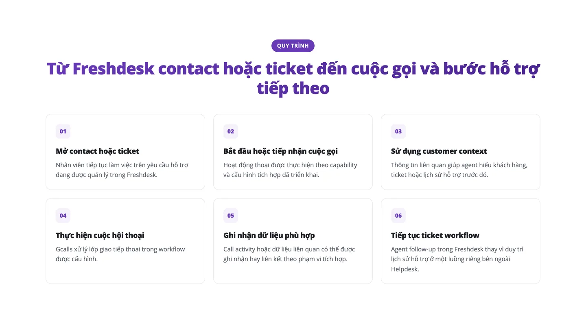

#### Section 08 — Giảm những bước chuyển đổi thủ công giữa Freshdesk và hệ thống gọi

> TRƯỚC & SAU TÍCH HỢP Giảm những bước chuyển đổi thủ công giữa Freshdesk và hệ thống gọi Trước tích hợp Freshdesk ticket Copy phone number Call tool Conversation Manual note Quay lại Freshdesk Cập nhật ticket Sau tích hợp Freshdesk contact / ticket Configured call action Conversation Support activity Ticket workflow tiếp tục Ít điểm chuyển đổi thủ công hơn

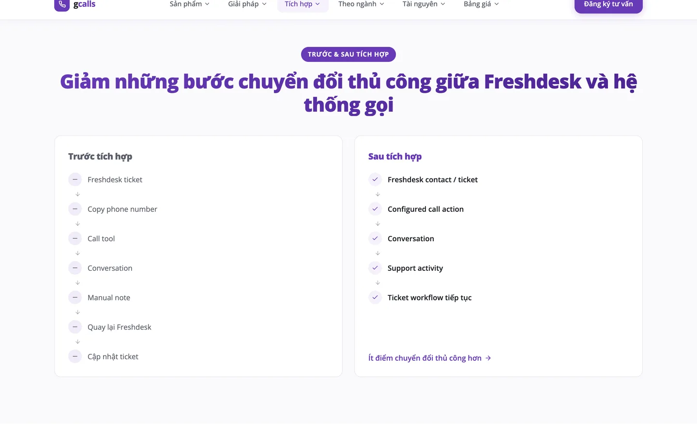

#### Section 09 — Hiểu yêu cầu hỗ trợ trước khi tiếp tục cuộc hội thoại

> CUSTOMER & TICKET CONTEXT Hiểu yêu cầu hỗ trợ trước khi tiếp tục cuộc hội thoại Khi customer context, ticket liên quan và lịch sử hỗ trợ được đặt gần hoạt động gọi, agent có thể hiểu tình huống tốt hơn trước khi phản hồi hoặc follow-up.
> Customer identity Ticket đang xử lý Ticket trước đó Tương tác gần đây Ghi chú Trạng thái hiện tại Đây là các nhóm dữ liệu có thể sử dụng, không phải danh sách trường được đồng bộ mặc định.
> Phạm vi thông tin thực tế phụ thuộc vào dữ liệu, permission và cấu hình tích hợp, và cần được xác định trong bước khảo sát kỹ thuật.
> CONTEXT HỖ TRỢ Khách hàng KH #2318 Ticket đang xử lý Đang mở Ticket trước đó 2 Tương tác gần đây Cuộc gọi · Hôm nay Trạng thái Chờ phản hồi

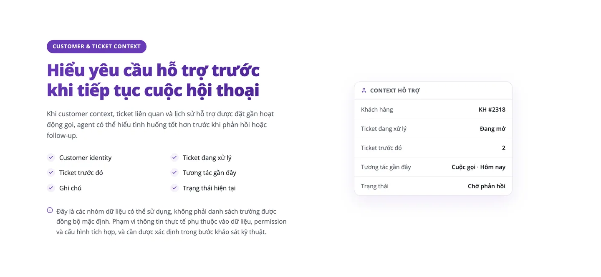

#### Section 10 — Giữ cuộc gọi gần hơn với quy trình ticket và customer support

> GIÁ TRỊ VẬN HÀNH Giữ cuộc gọi gần hơn với quy trình ticket và customer support Giảm chuyển đổi giữa nhiều công cụ Có thêm context khi tiếp nhận cuộc gọi Theo dõi lịch sử hỗ trợ tập trung hơn Dễ tiếp tục xử lý khi ticket chuyển người phụ trách

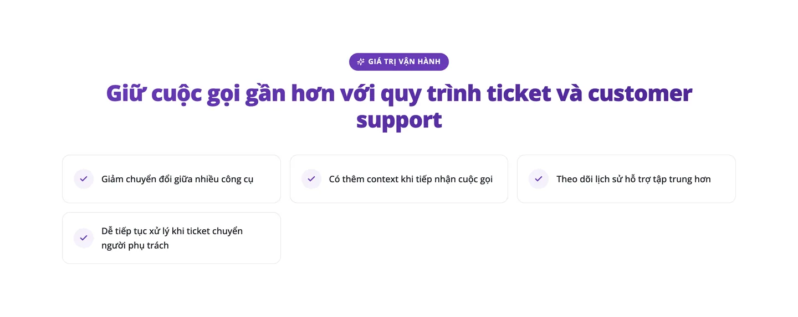

#### Section 11 — Gcalls × Freshdesk phù hợp với những workflow hỗ trợ nào?

> TÌNH HUỐNG SỬ DỤNG Gcalls × Freshdesk phù hợp với những workflow hỗ trợ nào?
> Inbound Customer Support Agent tiếp nhận cuộc gọi trong bối cảnh contact và yêu cầu hỗ trợ đang được quản lý trong Freshdesk.
> Ticket Follow-up Nhân viên gọi lại cho khách hàng và tiếp tục xử lý ticket từ context hiện có.
> SaaS Support Đội Support theo dõi cuộc gọi và ticket gần hơn trong quá trình xử lý vấn đề sản phẩm hoặc dịch vụ.
> E-commerce Customer Service Đội CSKH sử dụng customer và support context để tiếp tục giải quyết yêu cầu sau cuộc gọi.

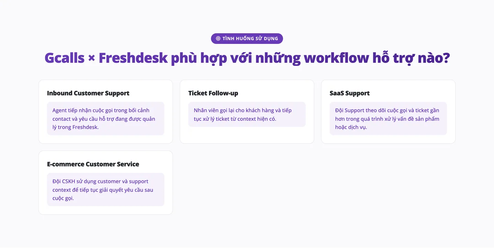

#### Section 12 — Tích hợp theo cấu hình Freshdesk và workflow hỗ trợ đang sử dụng

> THIẾT LẬP Tích hợp theo cấu hình Freshdesk và workflow hỗ trợ đang sử dụng 01 Khảo sát Freshdesk workflow 02 Xác định contact, ticket và dữ liệu liên quan 03 Xác định user và hotline 04 Xác định capability cần triển khai 05 Kiểm tra permission, API và phương thức kết nối hiện hành 06 Cấu hình integration 07 Kiểm thử cuộc gọi, context và ticket workflow 08 Hướng dẫn đội Support 09 Go-live

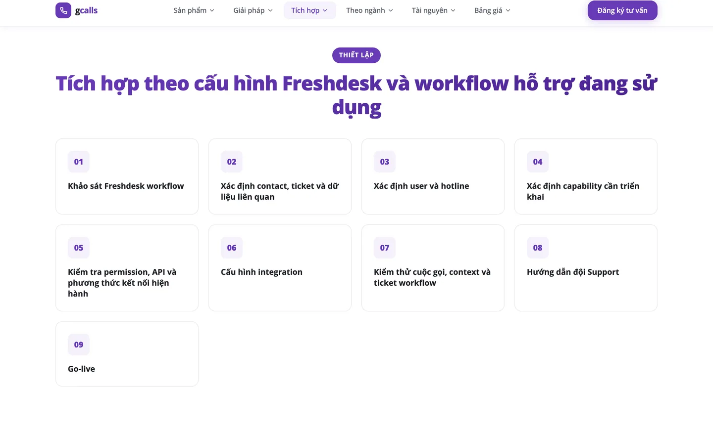

#### Section 13

> Phạm vi và thời gian triển khai phụ thuộc vào cấu trúc ticket, permission, API, số lượng người dùng, hotline và capability cần sử dụng, nên được xác định sau bước khảo sát thay vì theo một mốc cố định.
> Gcalls không mặc định mọi gói Freshdesk đều hỗ trợ cùng một phạm vi tích hợp, và phương thức kết nối cần được xác nhận theo hệ thống thực tế.

#### Section 14 — Giữ customer context và ticket gần hoạt động nghe gọi

> GIAO DIỆN TÍCH HỢP Giữ customer context và ticket gần hoạt động nghe gọi Sơ đồ dưới đây minh họa lớp tích hợp phía Gcalls: cuộc gọi được xử lý trên Gcalls và liên kết với hồ sơ hỗ trợ đang tồn tại, cùng những nhóm dữ liệu context mà agent có thể sử dụng.
> GCALLS · CUỘC GỌI ĐẾN KH KH #2318 Đang kết nối · Agent 04 Lớp tích hợp Gcalls HỒ SƠ HỖ TRỢ Đã liên kết Cuộc gọi đến Hôm nay Yêu cầu hỗ trợ đang xử lý Đang mở Tương tác trước đó 2 lần Đây là sơ đồ khái niệm phía Gcalls với dữ liệu mẫu đã ẩn thông tin nhận dạng, không phải ảnh chụp màn hình Freshdesk và không mô phỏng giao diện Freshdesk.
> Bố cục cùng phạm vi dữ liệu thực tế phụ thuộc vào cấu hình tích hợp của doanh nghiệp.

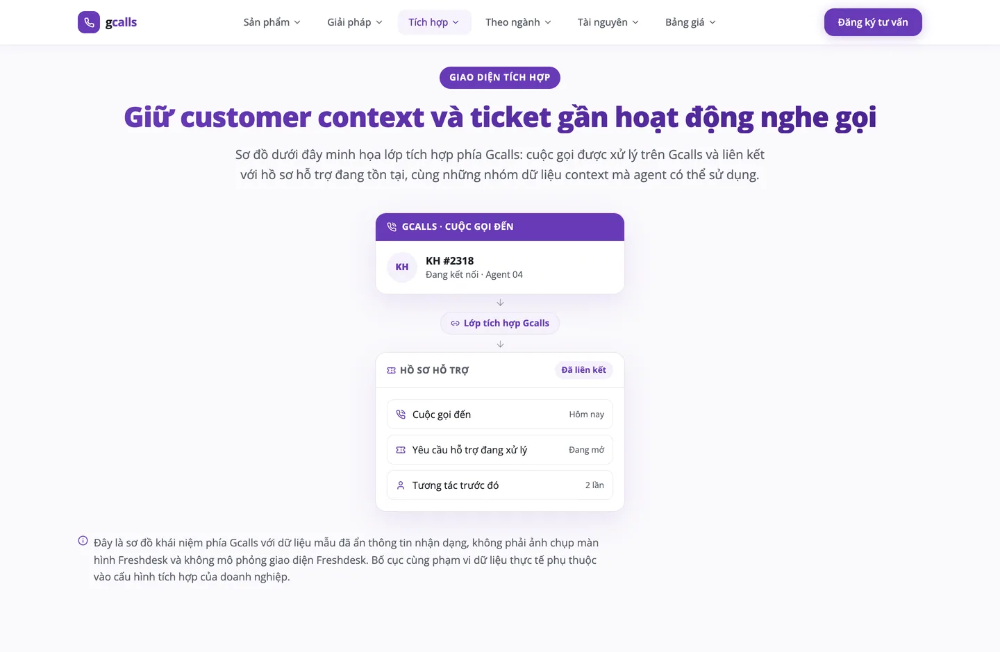

#### Section 15 — Trang này dành cho doanh nghiệp đã sử dụng Freshdesk

> FRESHDESK-SPECIFIC WORKFLOW Trang này dành cho doanh nghiệp đã sử dụng Freshdesk Nếu doanh nghiệp đang đánh giá tổng đài tích hợp Helpdesk nói chung, hãy xem giải pháp Helpdesk Integration.
> Trang này tập trung vào workflow khi Freshdesk đã là hệ thống quản lý ticket và hỗ trợ hiện tại.
> Xem giải pháp Tổng đài tích hợp Helpdesk

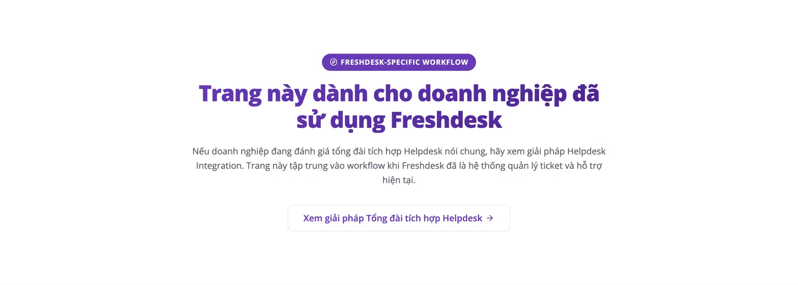

#### Section 16 — Doanh nghiệp đang sử dụng Helpdesk khác?

> Mỗi nền tảng Helpdesk có cấu trúc ticket và cách kết nối riêng.
> Xem trang tương ứng với hệ thống doanh nghiệp đang sử dụng.
> Zendesk Kết nối hoạt động nghe gọi với quy trình hỗ trợ trên Zendesk.
> Tìm hiểu thêm Danh mục tích hợp Xem toàn bộ nền tảng đang có trang tích hợp riêng.
> Tìm hiểu thêm

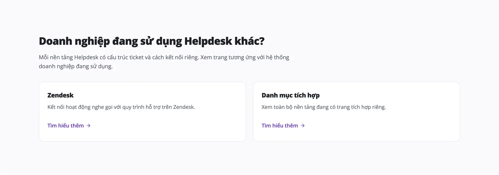

#### Section 17 — Freshdesk Integration nằm ở đâu trong hệ sản phẩm Gcalls?

> PHÂN BIỆT SẢN PHẨM Freshdesk Integration nằm ở đâu trong hệ sản phẩm Gcalls?
> Gcalls Plus Lớp nghe gọi trên trình duyệt — phần thực hiện cuộc gọi của doanh nghiệp.
> Tìm hiểu Gcalls Plus Helpdesk Integration Giải pháp tích hợp Helpdesk nói chung, khi doanh nghiệp chưa xác định nền tảng.
> Tìm hiểu Helpdesk Integration Freshdesk Integration Trang này Workflow riêng cho đội Support đã sử dụng Freshdesk để quản lý ticket.
> Gcalls CX Quản lý giao tiếp đa kênh khi doanh nghiệp cần hợp nhất nhiều điểm chạm khách hàng.
> Tìm hiểu Gcalls CX QA QC Center Đánh giá chất lượng cuộc gọi với hỗ trợ của AI — không phải chức năng của lớp tích hợp Helpdesk.
> Tìm hiểu QA QC Center

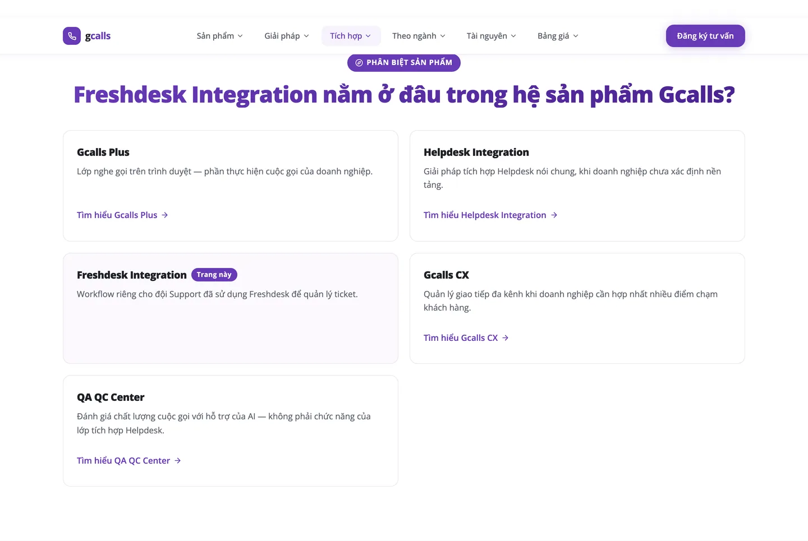

#### Section 18 — Tích hợp Freshdesk cần bắt đầu từ ticket structure, permission và workflow thực tế

> PHẠM VI TRIỂN KHAI Tích hợp Freshdesk cần bắt đầu từ ticket structure, permission và workflow thực tế Field, ticket type, permission, user role và quy trình hỗ trợ có thể khác nhau giữa từng tài khoản Freshdesk.
> Phạm vi tích hợp cần được xác định qua khảo sát và kiểm thử thay vì áp dụng cùng một cấu hình cho mọi doanh nghiệp.
> Trao đổi về workflow Freshdesk hiện tại Ước tính cấu hình & chi phí Xem bảng giá Gcalls

#### Section 19 — Câu hỏi thường gặp về Gcalls tích hợp Freshdesk

> CÂU HỎI THƯỜNG GẶP Câu hỏi thường gặp về Gcalls tích hợp Freshdesk Tổng đài tích hợp Freshdesk là gì?
> Đây là mô hình kết nối hoạt động nghe gọi của Gcalls với Freshdesk để đội Support có thể sử dụng customer context, ticket liên quan và dữ liệu tương tác phù hợp trong cùng workflow CSKH.
> Gcalls có hỗ trợ Click-to-Call trên Freshdesk không?
> Khi khách hàng gọi đến có thể xem ticket gần nhất không?
> Gcalls có tự động tạo ticket sau mỗi cuộc gọi không?
> Lịch sử cuộc gọi có được lưu trong Freshdesk không?
> Ghi âm có được đồng bộ vào Freshdesk không?
> Freshdesk Integration khác Gcalls CX như thế nào?

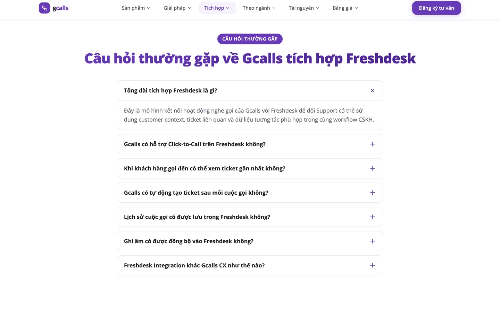

#### Section 20 — Xem thêm

> Tổng đài cho Thương mại điện tử Tổng đài cho BPO Blog Gcalls Liên hệ

#### Section 21 — Xem hoạt động nghe gọi vận hành trong workflow Freshdesk của đội Support

> GCALLS × FRESHDESK Xem hoạt động nghe gọi vận hành trong workflow Freshdesk của đội Support Chia sẻ cấu trúc ticket, user và quy trình CSKH hiện tại để Gcalls xác định phạm vi tích hợp và demo phù hợp.
> Xem demo tích hợp Freshdesk Tư vấn tích hợp 028 7302 5469

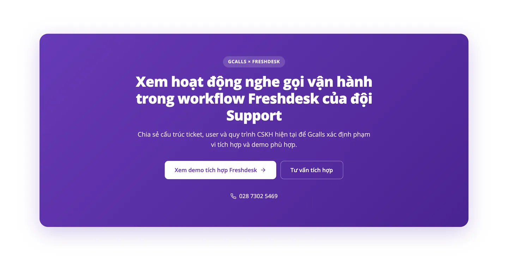

---

## Tích hợp Zendesk

- **Đường dẫn:** `/tich-hop/zendesk/`
- **Nhóm:** Tích hợp
- **Số section:** 21

📄 Ảnh toàn trang (full-page)

### Các section

#### Section 01

> Trang chủ Tích hợp Zendesk

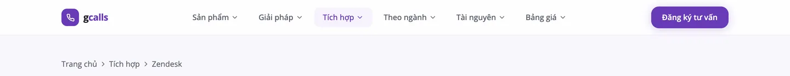

#### Section 02 — Tổng đài tích hợp Zendesk cho đội CSKH và Support

> GCALLS × ZENDESK Tổng đài tích hợp Zendesk cho đội CSKH và Support Kết nối hoạt động nghe gọi của Gcalls với Zendesk để nhân viên có thể sử dụng customer context, ticket liên quan và dữ liệu hỗ trợ gần hơn với quy trình đang xử lý.
> Đưa cuộc gọi gần ticket workflow — Hoạt động thoại được đặt gần hơn với hồ sơ và quy trình hỗ trợ đang được quản lý trong Zendesk.
> Có customer context khi hỗ trợ — Thông tin liên quan giúp nhân viên hiểu khách hàng và yêu cầu trước khi tiếp tục cuộc hội thoại.
> Theo dõi lịch sử hỗ trợ tập trung hơn — Dữ liệu phù hợp có thể được liên kết hoặc ghi nhận theo phạm vi tích hợp để đội ngũ tiếp tục follow-up.
> Xem demo tích hợp Zendesk Xem workflow tích hợp GCALLS · LỚP NGHE GỌI KH KH #4192 Cuộc hội thoại do Gcalls xử lý Lớp tích hợp Gcalls HỒ SƠ HỖ TRỢ Đã liên kết Khách hàng KH #4192 Ticket đang xử lý Đang mở Trạng thái hỗ trợ Chờ phản hồi BỐI CẢNH KHI CHUYỂN NGƯỜI PHỤ TRÁCH Agent 02 Cuộc gọi trước đó Agent 07 Ghi chú nội bộ Theo cấu hình tích hợp Khối "GCALLS · LỚP NGHE GỌI" là lớp nghe gọi của Gcalls, không phải call box được nhúng trong Zendesk.
> Trang này không tuyên bố khả năng trả lời cuộc gọi ngay trong giao diện Zendesk.

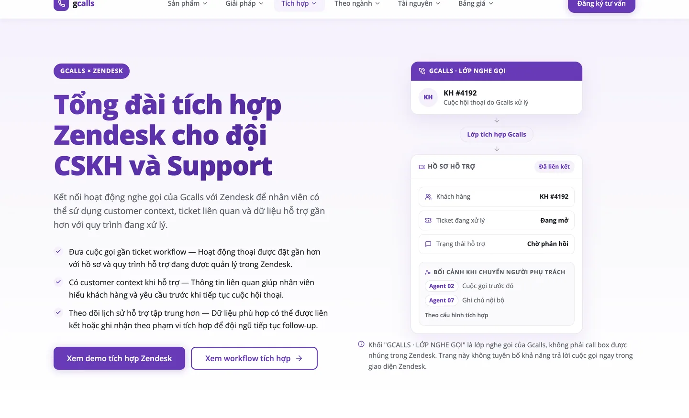

#### Section 03 — Tổng đài tích hợp Zendesk là gì?

> ĐỊNH NGHĨA Tổng đài tích hợp Zendesk là gì?
> Tổng đài tích hợp Zendesk kết nối hoạt động nghe gọi của Gcalls với quy trình hỗ trợ trên Zendesk để nhân viên có thể sử dụng customer context, ticket liên quan và dữ liệu tương tác phù hợp trong cùng workflow CSKH.
> Phạm vi chức năng phụ thuộc vào cấu hình Gcalls, Zendesk, API và yêu cầu triển khai của doanh nghiệp.

#### Section 04 — Zendesk quản lý ticket, nhưng cuộc gọi vẫn có thể nằm ngoài lịch sử hỗ trợ

> BÀI TOÁN SUPPORT Zendesk quản lý ticket, nhưng cuộc gọi vẫn có thể nằm ngoài lịch sử hỗ trợ 01 Nhân viên phải chuyển đổi giữa nhiều công cụ Agent quản lý ticket trong Zendesk nhưng thực hiện cuộc gọi ở một hệ thống riêng, khiến quy trình hỗ trợ bị chia thành nhiều bước.
> 02 Thiếu customer context khi cuộc gọi bắt đầu Nếu dữ liệu Zendesk và hoạt động gọi chưa kết nối phù hợp, nhân viên phải tự tìm contact hoặc ticket trong lúc khách hàng chờ.
> 03 Lịch sử cuộc hội thoại bị phân mảnh Call activity nằm ngoài ticket workflow khiến nhân viên tiếp nhận sau có thể thiếu bối cảnh để tiếp tục xử lý.
> 04 Follow-up phụ thuộc vào ghi chú thủ công Nhân viên có thể phải nhập lại nội dung sau cuộc gọi để giữ lịch sử hỗ trợ cập nhật.

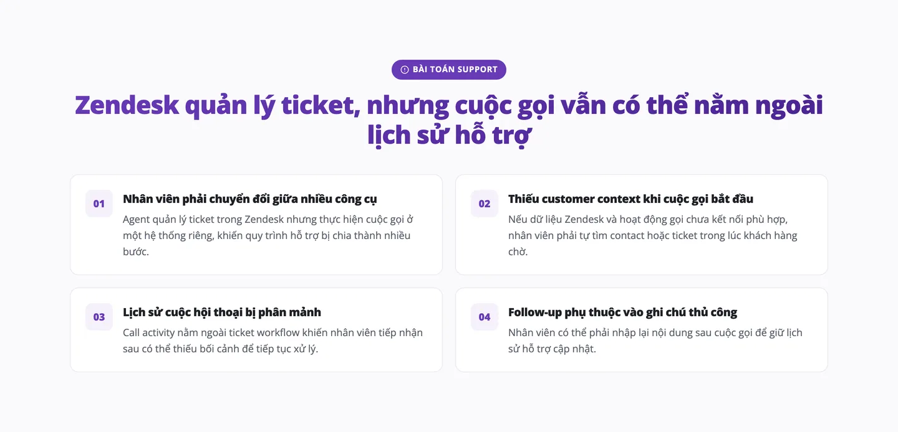

#### Section 05 — Đưa lớp giao tiếp thoại vào nơi đội Support đang quản lý ticket

> GCALLS FOR ZENDESK Đưa lớp giao tiếp thoại vào nơi đội Support đang quản lý ticket Zendesk tiếp tục quản lý ticket và support workflow.
> Gcalls bổ sung lớp nghe gọi để customer context, call activity và bước follow-up được đặt gần hơn với quy trình hỗ trợ hiện tại.
> 01 Zendesk contact / ticket Yêu cầu hỗ trợ đang được quản lý trong Zendesk.
> 02 Configured call action Cuộc gọi diễn ra theo capability và cấu hình đã triển khai.
> 03 Gcalls conversation Lớp giao tiếp thoại do Gcalls xử lý.
> 04 Customer context Thông tin liên quan giúp agent nắm tình huống.
> 05 Support activity Dữ liệu phù hợp được ghi nhận hoặc liên kết theo phạm vi tích hợp.
> 06 Ticket follow-up Người phụ trách tiếp theo tiếp tục xử lý trong Zendesk.

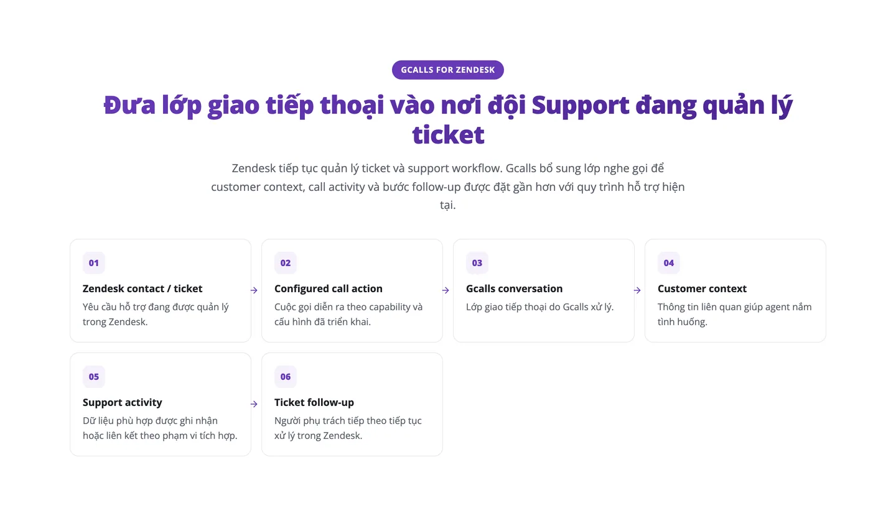

#### Section 06 — Những năng lực được xác nhận khi kết nối Gcalls với Zendesk

> NĂNG LỰC TÍCH HỢP Những năng lực được xác nhận khi kết nối Gcalls với Zendesk 01 Customer Context Agent có thể nắm thông tin khách hàng liên quan trước khi trả lời, trong phạm vi mà dữ liệu, permission và cấu hình tích hợp cho phép.
> 02 Ticket / Support Record Context Cuộc gọi có thể được đặt cạnh và liên kết với ticket hoặc hồ sơ hỗ trợ đang tồn tại, khi nền tảng và cấu hình tích hợp cho phép.
> 03 Call Activity Lịch sử và dữ liệu hoạt động cuộc gọi được lưu trong Gcalls.
> Việc đưa dữ liệu đó sang Zendesk phụ thuộc vào phạm vi tích hợp và khả năng của nền tảng.
> 04 Support Workflow Continuity Khi một yêu cầu đi qua nhiều người phụ trách, bối cảnh cuộc hội thoại nằm gần ticket thay vì ở một luồng dữ liệu riêng ngoài Zendesk.

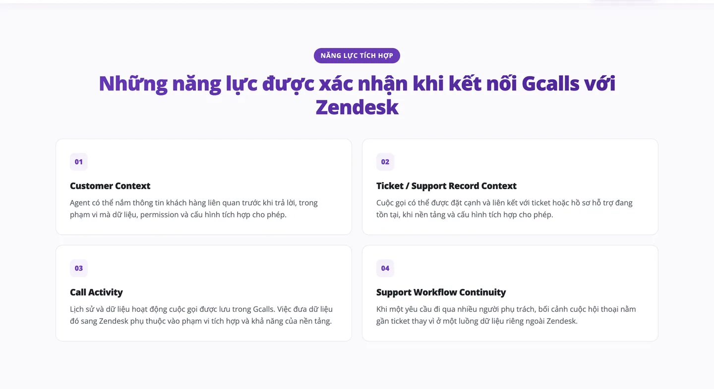

#### Section 07 — Từ Zendesk contact hoặc ticket đến cuộc gọi và bước hỗ trợ tiếp theo

> QUY TRÌNH Từ Zendesk contact hoặc ticket đến cuộc gọi và bước hỗ trợ tiếp theo 01 Mở contact hoặc ticket Nhân viên tiếp tục làm việc trên yêu cầu hỗ trợ đang được quản lý trong Zendesk.
> 02 Bắt đầu hoặc tiếp nhận cuộc gọi Hoạt động thoại được thực hiện theo capability và cấu hình tích hợp đã triển khai.
> 03 Sử dụng customer context Thông tin liên quan giúp agent hiểu khách hàng, ticket hoặc lịch sử hỗ trợ trước đó.
> 04 Thực hiện cuộc hội thoại Gcalls xử lý lớp giao tiếp thoại trong workflow được cấu hình.
> 05 Ghi nhận dữ liệu phù hợp Call activity hoặc dữ liệu liên quan có thể được ghi nhận hay liên kết theo phạm vi tích hợp.
> 06 Tiếp tục ticket workflow Agent follow-up trong Zendesk thay vì duy trì lịch sử hỗ trợ ở một luồng riêng ngoài Helpdesk.

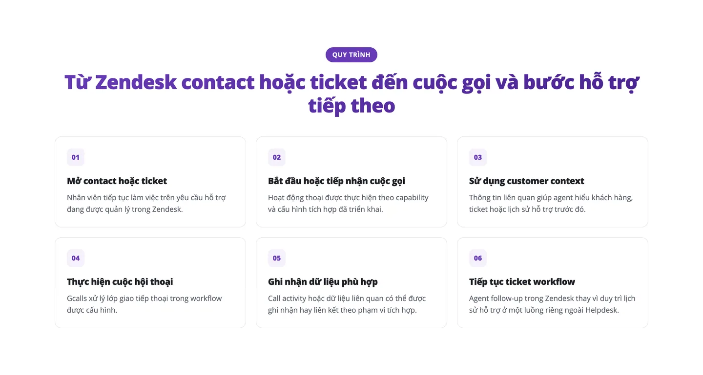

#### Section 08 — Giảm những bước chuyển đổi thủ công giữa Zendesk và hệ thống gọi

> TRƯỚC & SAU TÍCH HỢP Giảm những bước chuyển đổi thủ công giữa Zendesk và hệ thống gọi Trước tích hợp Zendesk ticket Copy phone number Call tool Conversation Manual note Quay lại Zendesk Cập nhật ticket Sau tích hợp Zendesk contact / ticket Configured call action Conversation Support activity Ticket workflow tiếp tục Ít điểm chuyển đổi thủ công hơn

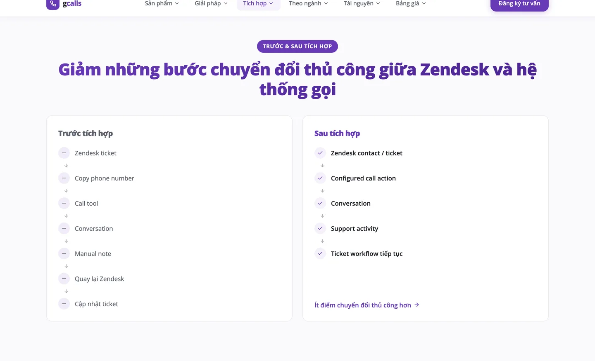

#### Section 09 — Hiểu yêu cầu hỗ trợ trước khi tiếp tục cuộc hội thoại

> CUSTOMER & TICKET CONTEXT Hiểu yêu cầu hỗ trợ trước khi tiếp tục cuộc hội thoại Khi customer context, ticket liên quan và lịch sử hỗ trợ được đặt gần hoạt động gọi, agent có thể hiểu tình huống tốt hơn trước khi phản hồi hoặc follow-up.
> Customer identity Ticket đang xử lý Ticket trước đó Tương tác gần đây Trạng thái hỗ trợ Ghi chú Đây là các nhóm dữ liệu agent có thể xem, không phải danh sách trường được đồng bộ mặc định và không bao gồm việc Gcalls cập nhật trạng thái hay tag trên ticket.
> Phạm vi thông tin thực tế phụ thuộc vào dữ liệu, permission và cấu hình tích hợp, cần được xác định trong bước khảo sát kỹ thuật.

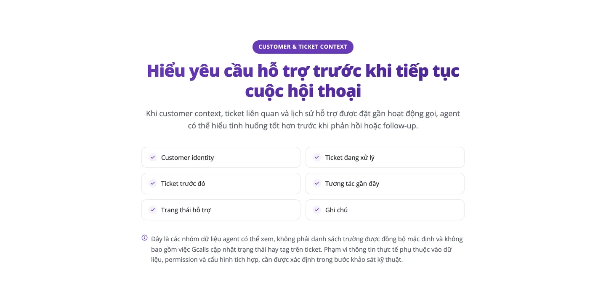

#### Section 10 — Giữ cuộc gọi gần hơn với quy trình ticket và customer support

> GIÁ TRỊ VẬN HÀNH Giữ cuộc gọi gần hơn với quy trình ticket và customer support Giảm chuyển đổi giữa nhiều công cụ Có thêm context khi tiếp nhận yêu cầu Theo dõi lịch sử hỗ trợ tập trung hơn Dễ tiếp tục xử lý khi ticket thay đổi người phụ trách

#### Section 11 — Gcalls × Zendesk phù hợp với những workflow hỗ trợ nào?

> TÌNH HUỐNG SỬ DỤNG Gcalls × Zendesk phù hợp với những workflow hỗ trợ nào?
> Inbound Customer Support Agent tiếp nhận yêu cầu trong bối cảnh contact và ticket đang được quản lý trong Zendesk.
> Ticket Follow-up Nhân viên gọi lại cho khách hàng và tiếp tục xử lý ticket từ context hiện có.
> SaaS Support Đội Support theo dõi cuộc gọi và ticket gần hơn khi xử lý vấn đề sản phẩm hoặc dịch vụ.
> Enterprise Customer Service Đội CSKH duy trì customer và support context khi nhiều nhân viên cùng tham gia xử lý một yêu cầu.

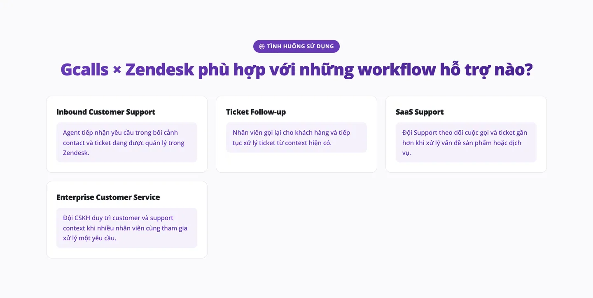

#### Section 12 — Tích hợp theo cấu hình Zendesk và workflow hỗ trợ đang sử dụng

> THIẾT LẬP Tích hợp theo cấu hình Zendesk và workflow hỗ trợ đang sử dụng 01 Khảo sát Zendesk workflow 02 Xác định contact, ticket và dữ liệu liên quan 03 Xác định user và hotline 04 Xác định capability cần triển khai 05 Kiểm tra permission, API và phương thức kết nối hiện hành 06 Cấu hình integration 07 Kiểm thử cuộc gọi, context và ticket workflow 08 Hướng dẫn đội Support 09 Go-live

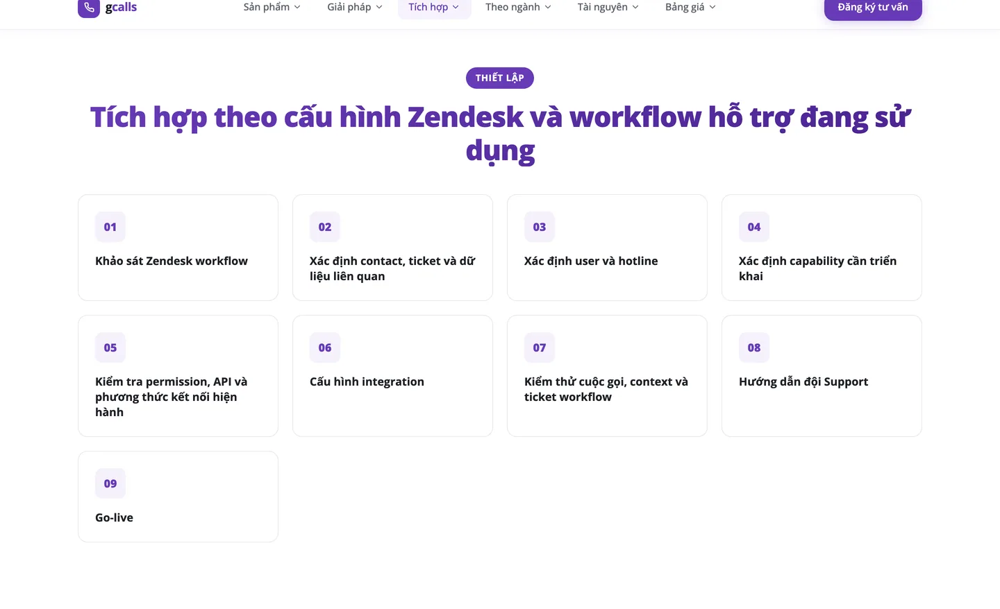

#### Section 13

> Phạm vi và thời gian triển khai phụ thuộc vào ticket form, field, permission, API, số lượng người dùng, hotline và capability cần sử dụng, nên được xác định sau bước khảo sát thay vì theo một mốc cố định.
> Gcalls không mặc định mọi gói Zendesk đều hỗ trợ cùng một phạm vi tích hợp, và phương thức kết nối cần được xác nhận theo hệ thống thực tế.

#### Section 14 — Giữ customer context và ticket gần hoạt động nghe gọi

> GIAO DIỆN TÍCH HỢP Giữ customer context và ticket gần hoạt động nghe gọi Sơ đồ dưới đây minh họa lớp tích hợp phía Gcalls: cuộc gọi được xử lý trên Gcalls và liên kết với hồ sơ hỗ trợ đang tồn tại, cùng bối cảnh mà người phụ trách tiếp theo có thể xem lại.
> GCALLS · LỚP NGHE GỌI KH KH #4192 Cuộc hội thoại do Gcalls xử lý Lớp tích hợp Gcalls HỒ SƠ HỖ TRỢ Đã liên kết Khách hàng KH #4192 Ticket đang xử lý Đang mở Trạng thái hỗ trợ Chờ phản hồi BỐI CẢNH KHI CHUYỂN NGƯỜI PHỤ TRÁCH Agent 02 Cuộc gọi trước đó Agent 07 Ghi chú nội bộ Theo cấu hình tích hợp Khối "GCALLS · LỚP NGHE GỌI" là lớp nghe gọi của Gcalls, không phải call box được nhúng trong Zendesk.
> Trang này không tuyên bố khả năng trả lời cuộc gọi ngay trong giao diện Zendesk.
> Đây là sơ đồ khái niệm phía Gcalls với dữ liệu mẫu đã ẩn thông tin nhận dạng, không phải ảnh chụp màn hình Zendesk và không mô phỏng giao diện Zendesk.
> Bố cục cùng phạm vi dữ liệu thực tế phụ thuộc vào cấu hình tích hợp của doanh nghiệp.

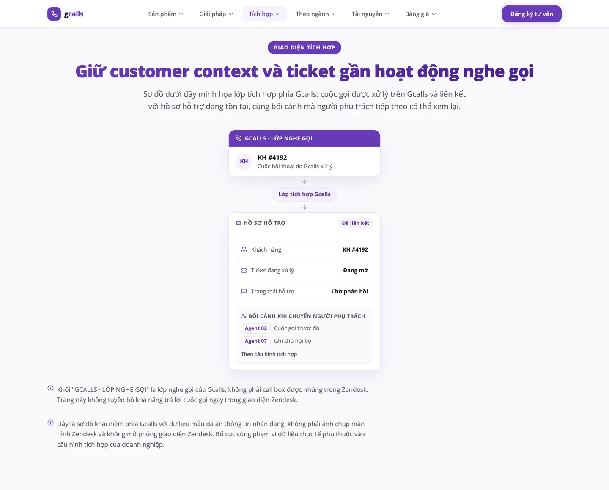

#### Section 15 — Trang này dành cho doanh nghiệp đã sử dụng Zendesk

> ZENDESK-SPECIFIC WORKFLOW Trang này dành cho doanh nghiệp đã sử dụng Zendesk Nếu doanh nghiệp đang đánh giá tổng đài tích hợp Helpdesk nói chung, hãy xem giải pháp Helpdesk Integration.
> Trang này tập trung vào workflow khi Zendesk đã là hệ thống quản lý ticket và hỗ trợ hiện tại.
> Xem giải pháp Tổng đài tích hợp Helpdesk

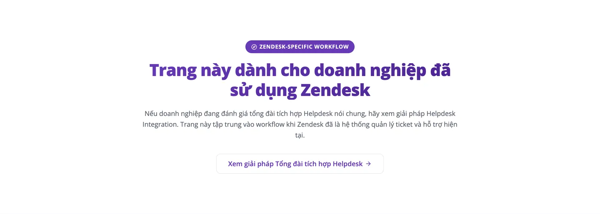

#### Section 16 — Doanh nghiệp đang sử dụng Helpdesk khác?

> Mỗi nền tảng Helpdesk có cấu trúc ticket và cách kết nối riêng.
> Xem trang tương ứng với hệ thống doanh nghiệp đang sử dụng.
> Freshdesk Kết nối hoạt động nghe gọi với quy trình hỗ trợ trên Freshdesk.
> Tìm hiểu thêm Danh mục tích hợp Xem toàn bộ nền tảng đang có trang tích hợp riêng.
> Tìm hiểu thêm

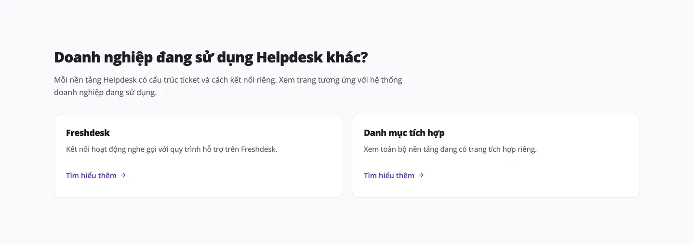

#### Section 17 — Zendesk Integration nằm ở đâu trong hệ sản phẩm Gcalls?

> PHÂN BIỆT SẢN PHẨM Zendesk Integration nằm ở đâu trong hệ sản phẩm Gcalls?
> Gcalls Plus Lớp nghe gọi trên trình duyệt — phần thực hiện cuộc gọi của doanh nghiệp.
> Tìm hiểu Gcalls Plus Helpdesk Integration Giải pháp tích hợp Helpdesk nói chung, khi doanh nghiệp chưa xác định nền tảng.
> Tìm hiểu Helpdesk Integration Zendesk Integration Trang này Workflow riêng cho đội Support đã sử dụng Zendesk để quản lý ticket.
> Gcalls CX Quản lý giao tiếp đa kênh khi doanh nghiệp cần hợp nhất nhiều điểm chạm khách hàng.
> Tìm hiểu Gcalls CX QA QC Center Đánh giá chất lượng cuộc gọi với hỗ trợ của AI — không phải chức năng của lớp tích hợp Helpdesk.
> Tìm hiểu QA QC Center

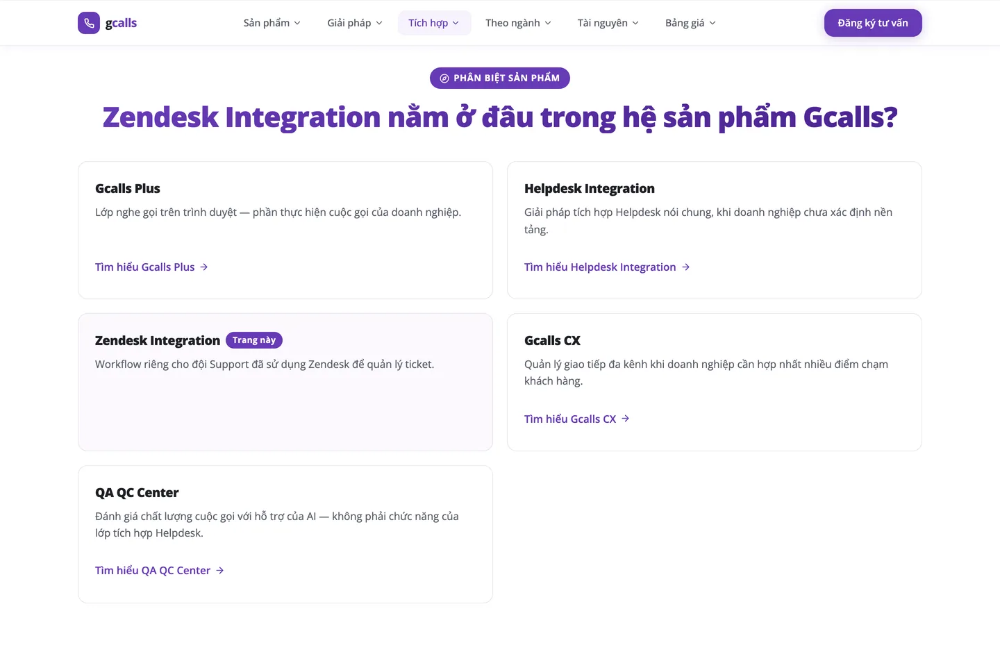

#### Section 18 — Tích hợp Zendesk cần bắt đầu từ ticket structure, permission và workflow thực tế

> PHẠM VI TRIỂN KHAI Tích hợp Zendesk cần bắt đầu từ ticket structure, permission và workflow thực tế Field, ticket form, permission, user role và support workflow có thể khác nhau giữa từng tài khoản Zendesk.
> Phạm vi tích hợp cần được xác định qua khảo sát và kiểm thử thay vì áp dụng cùng một cấu hình cho mọi doanh nghiệp.
> Trao đổi về workflow Zendesk hiện tại Ước tính cấu hình & chi phí Xem bảng giá Gcalls

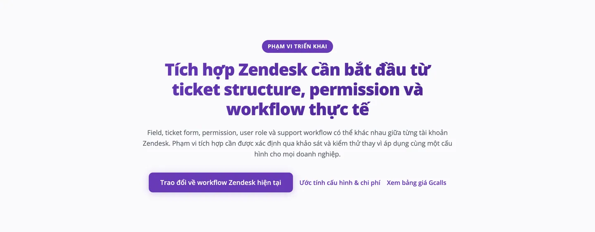

#### Section 19 — Câu hỏi thường gặp về Gcalls tích hợp Zendesk

> CÂU HỎI THƯỜNG GẶP Câu hỏi thường gặp về Gcalls tích hợp Zendesk Tổng đài tích hợp Zendesk là gì?
> Đây là mô hình kết nối hoạt động nghe gọi của Gcalls với Zendesk để đội Support có thể sử dụng customer context, ticket liên quan và dữ liệu tương tác phù hợp trong cùng workflow CSKH.
> Gcalls có hỗ trợ Click-to-Call trên Zendesk không?
> Khi khách hàng gọi đến có thể xem ticket liên quan không?
> Gcalls có tự động tạo ticket sau cuộc gọi không?
> Lịch sử cuộc gọi có được lưu trong Zendesk không?
> Ghi âm có được đồng bộ vào Zendesk không?
> Zendesk Integration khác Gcalls CX như thế nào?

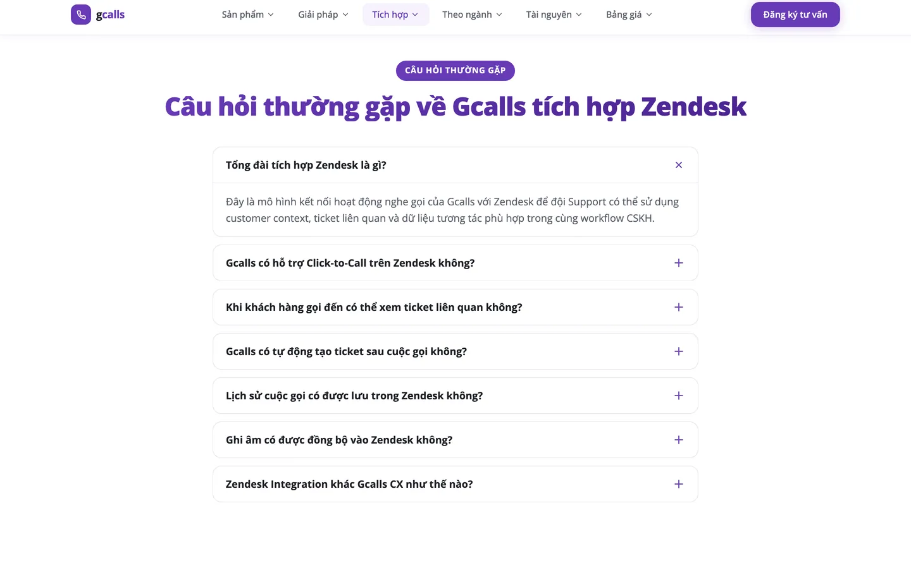

#### Section 20 — Xem thêm

> Tổng đài cho BPO Tổng đài cho Thương mại điện tử Blog Gcalls Liên hệ

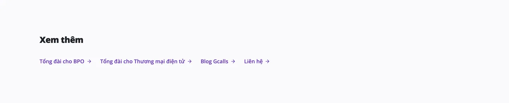

#### Section 21 — Xem hoạt động nghe gọi vận hành trong workflow Zendesk của đội Support

> GCALLS × ZENDESK Xem hoạt động nghe gọi vận hành trong workflow Zendesk của đội Support Chia sẻ cấu trúc ticket, user và quy trình CSKH hiện tại để Gcalls xác định phạm vi tích hợp và demo phù hợp.
> Xem demo tích hợp Zendesk Tư vấn tích hợp 028 7302 5469

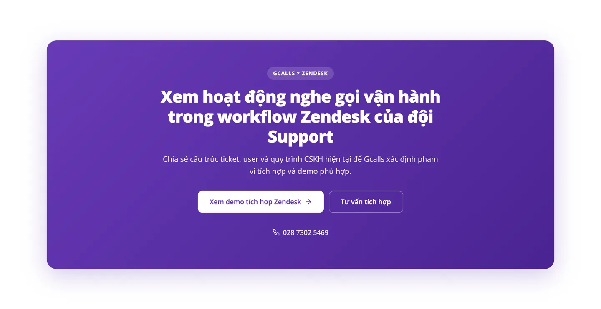

---

## Bảng giá

- **Đường dẫn:** `/bang-gia/`
- **Nhóm:** Định giá
- **Số section:** 11

📄 Ảnh toàn trang (full-page)

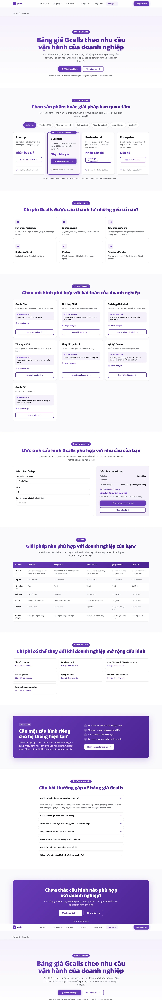

### Các section

#### Section 01

> Trang chủ Bảng giá

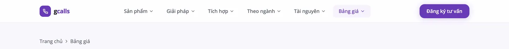

#### Section 02 — Bảng giá Gcalls theo nhu cầu vận hành của doanh nghiệp

> BẢNG GIÁ GCALLS Bảng giá Gcalls theo nhu cầu vận hành của doanh nghiệp Chi phí Gcalls phụ thuộc vào sản phẩm, quy mô đội ngũ, lưu lượng sử dụng, đầu số và mức độ tích hợp.
> Chọn nhu cầu phù hợp để xem cấu hình và cách nhận báo giá. Ước tính chi phí Nhận báo giá Bắt đầu từ nhu cầu thực tế của doanh nghiệp thay vì một gói cố định cho mọi mô hình.

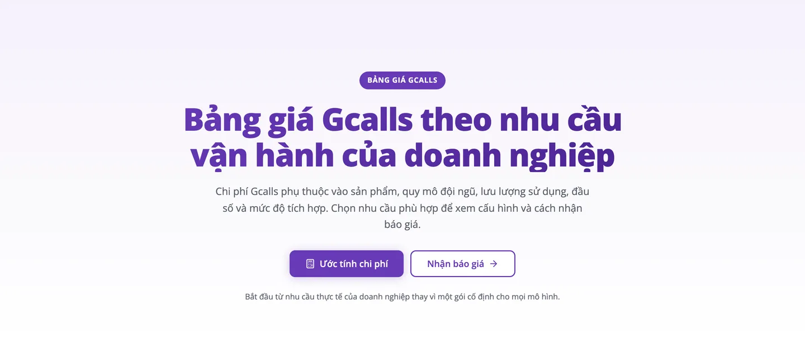

#### Section 03 — Chọn sản phẩm hoặc giải pháp bạn quan tâm

> CHỌN NHU CẦU Chọn sản phẩm hoặc giải pháp bạn quan tâm Mỗi sản phẩm có mô hình chi phí riêng.
> Chọn một mục để xem cách Gcalls xây dựng cấu hình và báo giá.
> Gcalls Plus Tích hợp CRM Tích hợp Helpdesk Tích hợp POS Tổng đài quốc tế QA QC Center Gcalls CX Startup Đội ngũ nhỏ bắt đầu triển khai kênh nghe gọi chuyên nghiệp.
> Nhận báo giá Tư vấn gói Startup Chi phí phụ thuộc cấu hình GỢI Ý CHO ĐỘI NGŨ ĐANG MỞ RỘNG Business Đội Sales/CSKH cần quản lý cuộc gọi và dữ liệu vận hành tập trung hơn.
> Nhận báo giá Tư vấn gói Business Chi phí phụ thuộc cấu hình Professional Đội ngũ có quy mô lớn hơn và yêu cầu quản trị, báo cáo hoặc tích hợp sâu hơn.
> Nhận báo giá Tư vấn gói Professional Chi phí phụ thuộc cấu hình Enterprise Doanh nghiệp cần cấu hình, tích hợp và quy trình triển khai theo yêu cầu riêng.
> Liên hệ Trao đổi với Gcalls Chi phí phụ thuộc cấu hình Tên gói phản ánh mức độ nhu cầu vận hành.
> Cấu hình chi tiết và chi phí được xác nhận sau khi trao đổi.

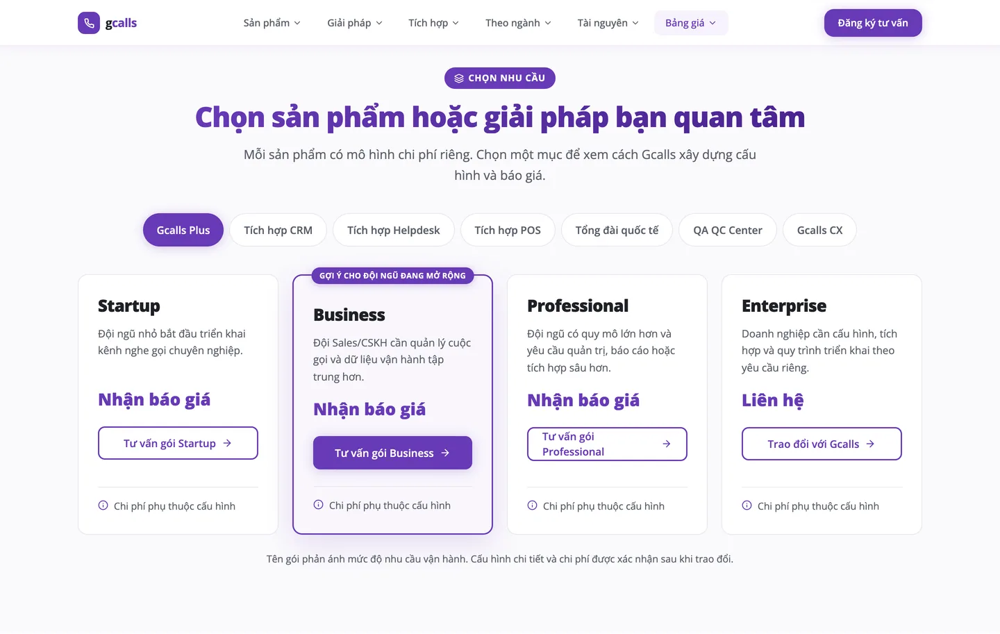

#### Section 04 — Chi phí Gcalls được cấu thành từ những yếu tố nào?

> CÁCH TÍNH CHI PHÍ Chi phí Gcalls được cấu thành từ những yếu tố nào?
> 01 Sản phẩm / giải pháp Gcalls Plus, tích hợp, quốc tế, QA QC Center hoặc Gcalls CX.
> 02 Số lượng Agent Quy mô người dùng ảnh hưởng tới cấu hình cần triển khai.
> 03 Lưu lượng sử dụng Phút gọi hoặc khối lượng tương tác có thể ảnh hưởng tới chi phí vận hành.
> 04 Hotline & đầu số Loại và số lượng đầu số cần sử dụng.
> 05 Tích hợp CRM, Helpdesk, POS hoặc hệ thống doanh nghiệp.
> 06 Yêu cầu triển khai Phạm vi cấu hình, dữ liệu và yêu cầu kỹ thuật thực tế.

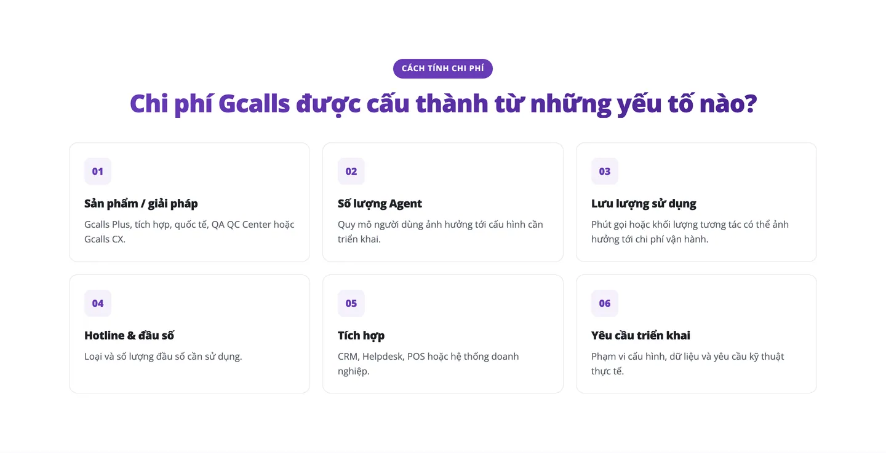

#### Section 05 — Chọn mô hình phù hợp với bài toán của doanh nghiệp

> THEO GIẢI PHÁP Chọn mô hình phù hợp với bài toán của doanh nghiệp Gcalls Plus Browser-based Webphone / Call Center tinh gọn.
> MÔ HÌNH BÁO GIÁ Theo gói + quy mô người dùng Nhận báo giá Xem Gcalls Plus Tích hợp CRM Kết nối cuộc gọi với dữ liệu và workflow CRM.
> MÔ HÌNH BÁO GIÁ Theo số người dùng + phạm vi tích hợp + triển khai Nhận báo giá Xem tích hợp CRM Tích hợp Helpdesk Kết nối cuộc gọi với quy trình hỗ trợ khách hàng.
> MÔ HÌNH BÁO GIÁ Theo người dùng + tích hợp + yêu cầu workflow Nhận báo giá Xem tích hợp Helpdesk Tích hợp POS Kết nối giao tiếp với dữ liệu bán hàng / khách hàng.
> MÔ HÌNH BÁO GIÁ Theo hệ thống tích hợp và phạm vi triển khai Nhận báo giá Xem tích hợp POS Tổng đài quốc tế Đầu số và hạ tầng liên lạc theo thị trường.
> MÔ HÌNH BÁO GIÁ Theo quốc gia + loại đầu số + lưu lượng gọi Nhận báo giá Xem tổng đài quốc tế QA QC Center AI hỗ trợ kiểm soát chất lượng hội thoại.
> MÔ HÌNH BÁO GIÁ Theo quy mô đội ngũ + khối lượng hội thoại cần phân tích + cấu hình QA Nhận báo giá Xem QA QC Center Gcalls CX Contact Center đa kênh.
> MÔ HÌNH BÁO GIÁ Theo Agent + kênh giao tiếp + tích hợp + quy mô vận hành Nhận báo giá Xem Gcalls CX

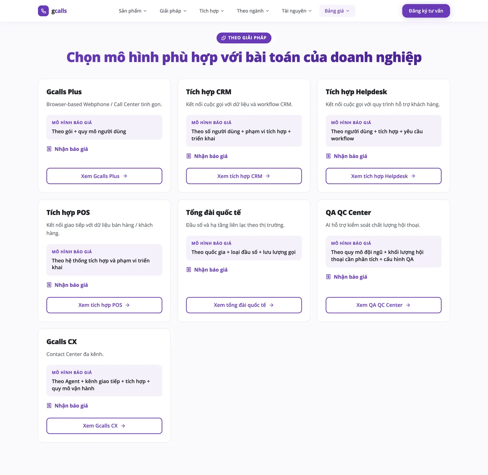

#### Section 06 — Ước tính cấu hình Gcalls phù hợp với nhu cầu của bạn

> ƯỚC TÍNH CHI PHÍ Ước tính cấu hình Gcalls phù hợp với nhu cầu của bạn Chọn giải pháp, số lượng Agent và nhu cầu sử dụng để chuẩn bị cấu hình tham khảo trước khi trao đổi với đội ngũ Gcalls.
> Nhu cầu của bạn Sản phẩm / giải pháp Gcalls Plus Tích hợp CRM Tích hợp Helpdesk Tích hợp POS Tổng đài quốc tế QA QC Center Gcalls CX Số Agent Lưu lượng gọi ước tính(phút/tháng) Cấu hình tham khảo Giải pháp Gcalls Plus Số Agent 5 Mô hình báo giá Theo gói + quy mô người dùng Cấu hình đã sẵn sàng Liên hệ để nhận báo giá Cấu hình đã sẵn sàng để đội ngũ Gcalls xác nhận và báo giá. Ước tính chi phí chi tiếtNhận báo giá

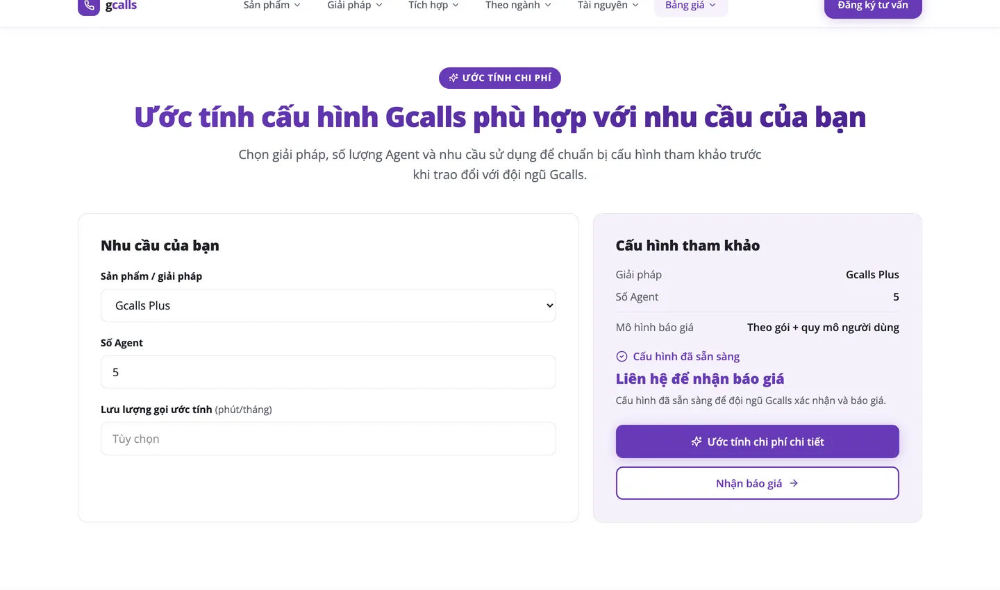

#### Section 07 — Giải pháp nào phù hợp với doanh nghiệp của bạn?

> SO SÁNH Giải pháp nào phù hợp với doanh nghiệp của bạn?
> So sánh theo tiêu chí lựa chọn thay vì danh sách tính năng.
> Giá trị mang tính định hướng và được xác nhận khi báo giá.
> So sánh các giải pháp Gcalls theo tiêu chí lựa chọn TIÊU CHÍ Gcalls Plus Integration International QA QC Center Gcalls CX Phù hợp khi Cần kênh nghe gọi chuyên nghiệp trên trình duyệt Đã có CRM/Helpdesk/POS cần gắn cuộc gọi vào quy trình Cần liên lạc với thị trường ngoài Việt Nam Cần kiểm soát chất lượng hội thoại Cần vận hành nhiều kênh giao tiếp Quy mô Theo nhu cầu Theo nhu cầu Theo nhu cầu Theo nhu cầu Theo nhu cầu Kênh giao tiếp Thoại Thoại Thoại Thoại Đa kênh Tích hợp Tùy cấu hình Trọng tâm Tùy cấu hình Tùy cấu hình Tùy cấu hình AI / QA Không phải trọng tâm Không phải trọng tâm Không phải trọng tâm Trọng tâm Tùy cấu hình Quốc tế Tùy cấu hình Tùy cấu hình Trọng tâm Không phải trọng tâm Tùy cấu hình Mô hình báo giá Theo gói + người dùng Theo người dùng + tích hợp Theo đầu số + lưu lượng Theo đội ngũ + khối lượng Theo Agent + kênh

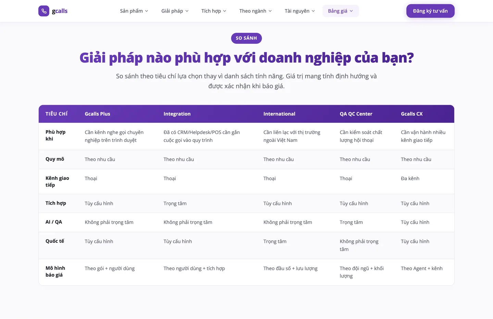

#### Section 08 — Chi phí có thể thay đổi khi doanh nghiệp mở rộng cấu hình

> DỊCH VỤ BỔ SUNG Chi phí có thể thay đổi khi doanh nghiệp mở rộng cấu hình Đầu số / Hotline Báo giá theo nhu cầu Lưu lượng gọi Báo giá theo nhu cầu CRM / Helpdesk / POS Integration Báo giá theo nhu cầu Đầu số quốc tế Báo giá theo nhu cầu QA QC volume Báo giá theo nhu cầu Omnichannel channels Báo giá theo nhu cầu Custom implementation Báo giá theo nhu cầu

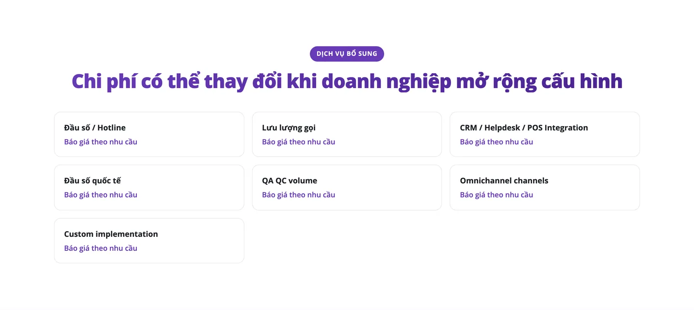

#### Section 09 — Cần một cấu hình riêng cho hệ thống hiện tại?

> ENTERPRISE Cần một cấu hình riêng cho hệ thống hiện tại?
> Với doanh nghiệp có yêu cầu tích hợp, nhiều nhóm người dùng, nhiều kênh hoặc quy trình vận hành riêng, Gcalls sẽ khảo sát nhu cầu trước khi xây dựng cấu hình và báo giá.
> Phạm vi triển khai theo hệ thống hiện tại Tích hợp theo quy trình doanh nghiệp Cấu hình theo quy mô đội ngũ Kế hoạch triển khai và hỗ trợ theo dự án Nhận báo giá Enterprise

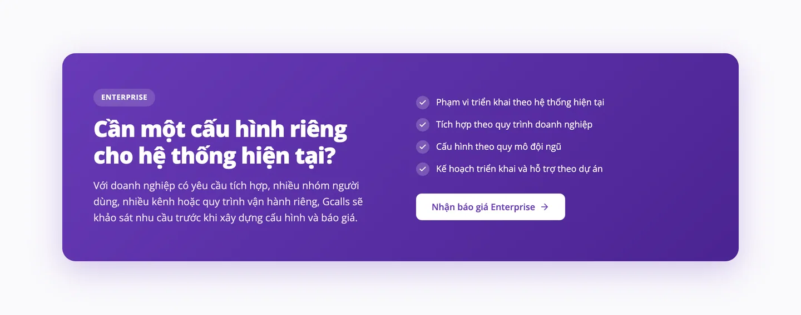

#### Section 10 — Câu hỏi thường gặp về bảng giá Gcalls

> CÂU HỎI THƯỜNG GẶP Câu hỏi thường gặp về bảng giá Gcalls Gcalls tính phí theo user hay theo phút gọi?
> Cách tính chi phí phụ thuộc vào sản phẩm và cấu hình sử dụng.
> Một số giải pháp có thể liên quan đến số lượng Agent, lưu lượng gọi, đầu số, tích hợp hoặc khối lượng dữ liệu cần xử lý.
> Gcalls Plus có gói dành cho SME không?
> Tích hợp CRM có được tính trong gói Gcalls Plus không?
> Tổng đài quốc tế tính giá như thế nào?
> QA QC Center được tính chi phí như thế nào?
> Gcalls CX tính theo Agent hay theo kênh?
> Tôi có thể nhận báo giá chính xác bằng cách nào?

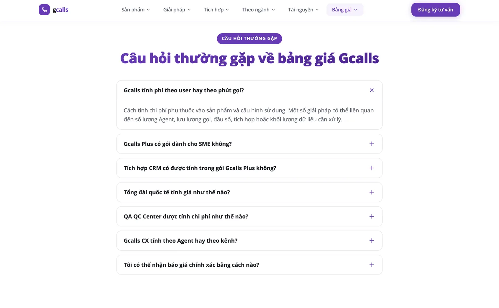

#### Section 11 — Chưa chắc cấu hình nào phù hợp với doanh nghiệp?

> Chia sẻ quy mô đội ngũ, hệ thống đang sử dụng và nhu cầu giao tiếp để Gcalls đề xuất cấu hình phù hợp. Ước tính chi phí Đăng ký tư vấn 028 7302 5469

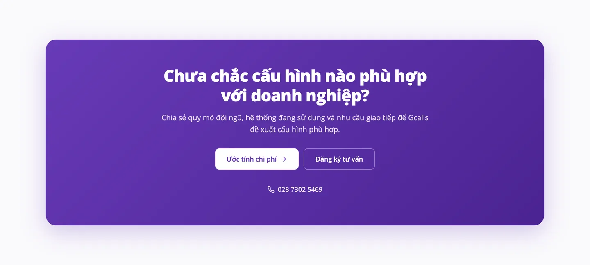

---

## Ước tính chi phí

- **Đường dẫn:** `/uoc-tinh-chi-phi/`
- **Nhóm:** Định giá
- **Số section:** 8

📄 Ảnh toàn trang (full-page)

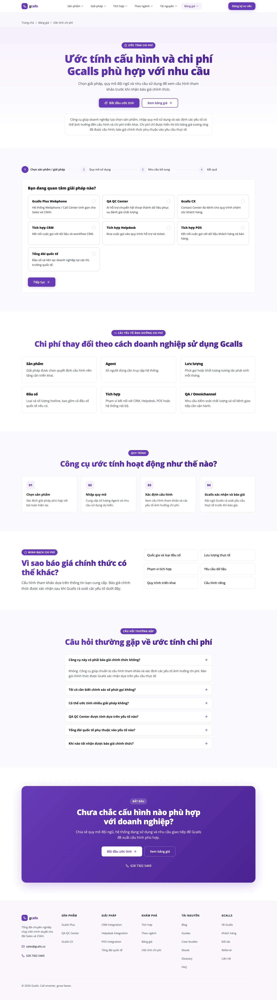

### Các section

#### Section 01

> Trang chủ Bảng giá Ước tính chi phí

#### Section 02 — Ước tính cấu hình và chi phí Gcalls phù hợp với nhu cầu

> ƯỚC TÍNH CHI PHÍ Ước tính cấu hình và chi phí Gcalls phù hợp với nhu cầu Chọn giải pháp, quy mô đội ngũ và nhu cầu sử dụng để xem cấu hình tham khảo trước khi nhận báo giá chính thức.
> Bắt đầu ước tính Xem bảng giá Công cụ giúp doanh nghiệp lựa chọn sản phẩm, nhập quy mô sử dụng và xác định các yếu tố có thể ảnh hưởng đến cấu hình và chi phí triển khai.
> Chi phí chỉ được hiển thị khi bảng giá tương ứng đã được cấu hình; báo giá chính thức phụ thuộc vào yêu cầu thực tế.

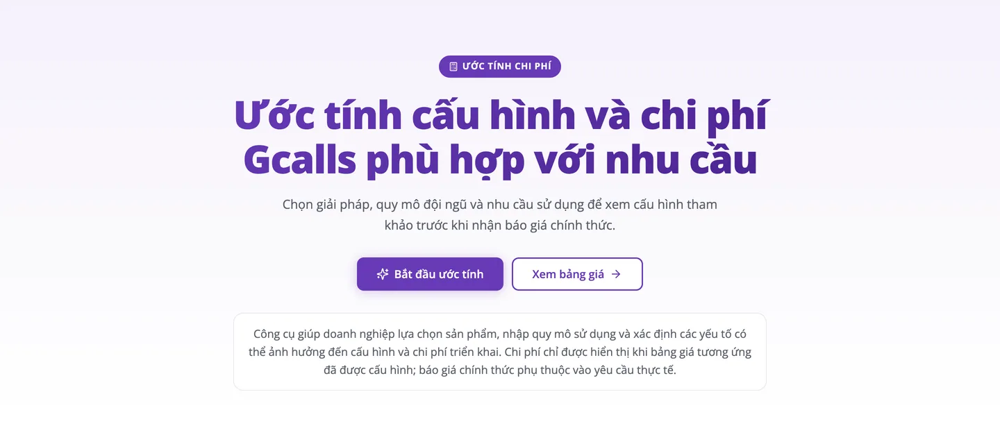

#### Section 03 — Công cụ ước tính cấu hình và chi phí

> 1 Chọn sản phẩm / giải pháp 2 Quy mô sử dụng 3 Nhu cầu bổ sung 4 Kết quả Bạn đang quan tâm giải pháp nào?
> Gcalls Plus Webphone Hệ thống Webphone / Call Center tinh gọn cho Sales và CSKH.
> QA QC Center AI hỗ trợ chuyển hội thoại thành dữ liệu phục vụ đánh giá chất lượng.
> Gcalls CX Contact Center đa kênh cho quy trình chăm sóc khách hàng.
> Tích hợp CRM Kết nối cuộc gọi với dữ liệu và workflow CRM.
> Tích hợp Helpdesk Đưa cuộc gọi vào quy trình hỗ trợ và ticket.
> Tích hợp POS Kết nối cuộc gọi với dữ liệu khách hàng và bán hàng.
> Tổng đài quốc tế Đầu số và liên lạc doanh nghiệp tại các thị trường quốc tế.
> Tiếp tục Các giải pháp có thể ước tính: Gcalls Plus Webphone, QA QC Center, Gcalls CX, Tích hợp CRM, Tích hợp Helpdesk, Tích hợp POS, Tổng đài quốc tế.

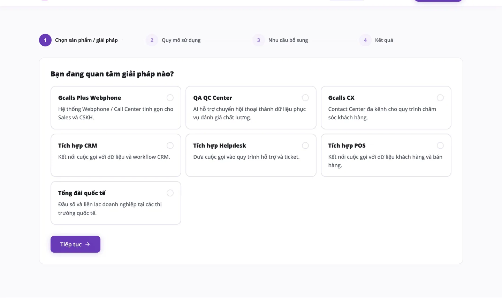

#### Section 04 — Chi phí thay đổi theo cách doanh nghiệp sử dụng Gcalls

> CÁC YẾU TỐ ẢNH HƯỞNG CHI PHÍ Chi phí thay đổi theo cách doanh nghiệp sử dụng Gcalls Sản phẩm Giải pháp được chọn quyết định cấu hình nền tảng cần triển khai.
> Agent Số người dùng cần truy cập hệ thống.
> Lưu lượng Phút gọi hoặc khối lượng tương tác phát sinh mỗi tháng.
> Đầu số Loại và số lượng hotline, bao gồm cả đầu số quốc tế nếu có.
> Tích hợp Phạm vi kết nối với CRM, Helpdesk, POS hoặc hệ thống nội bộ.
> QA / Omnichannel Nhu cầu kiểm soát chất lượng và số kênh giao tiếp cần vận hành.

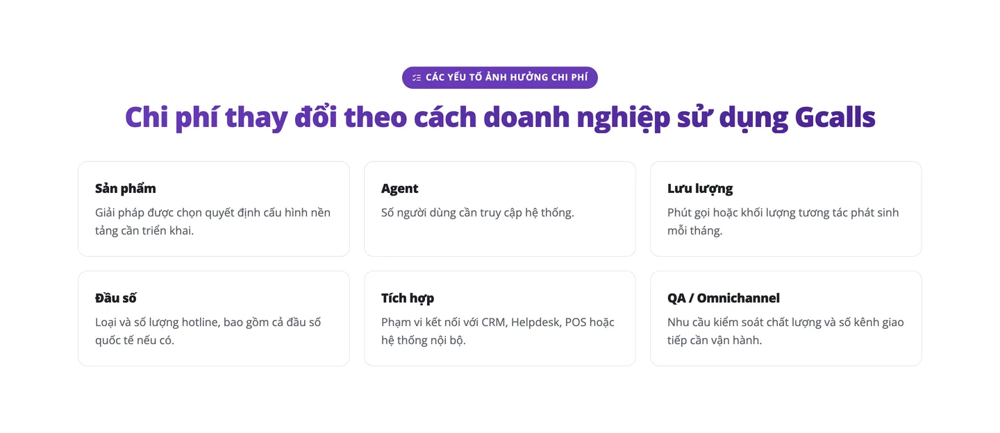

#### Section 05 — Công cụ ước tính hoạt động như thế nào?

> QUY TRÌNH Công cụ ước tính hoạt động như thế nào?
> 01 Chọn sản phẩm Xác định giải pháp phù hợp với bài toán hiện tại.
> 02 Nhập quy mô Cung cấp số lượng Agent và nhu cầu sử dụng dự kiến.
> 03 Xác định cấu hình Xem cấu hình tham khảo và các yếu tố ảnh hưởng chi phí.
> 04 Gcalls xác nhận và báo giá Đội ngũ Gcalls rà soát yêu cầu thực tế trước khi báo giá.

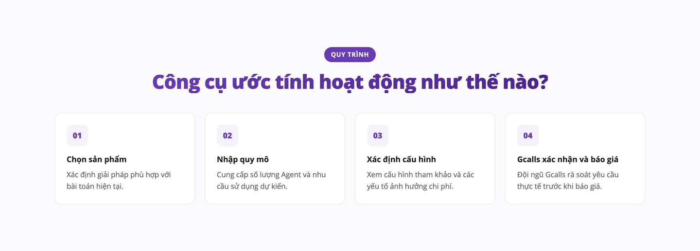

#### Section 06 — Vì sao báo giá chính thức có thể khác?

> MINH BẠCH CHI PHÍ Vì sao báo giá chính thức có thể khác?
> Cấu hình tham khảo dựa trên thông tin bạn cung cấp.
> Báo giá chính thức được xác nhận sau khi Gcalls rà soát các yếu tố dưới đây.
> Quốc gia và loại đầu số Lưu lượng thực tế Phạm vi tích hợp Yêu cầu dữ liệu Quy trình triển khai Cấu hình riêng

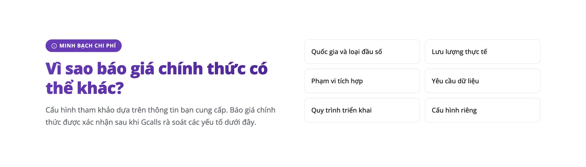

#### Section 07 — Câu hỏi thường gặp về ước tính chi phí

> CÂU HỎI THƯỜNG GẶP Câu hỏi thường gặp về ước tính chi phí Công cụ này có phải báo giá chính thức không?
> Không.
> Công cụ giúp chuẩn bị cấu hình tham khảo và xác định các yếu tố ảnh hưởng chi phí.
> Báo giá chính thức được Gcalls xác nhận dựa trên yêu cầu thực tế.
> Tôi có cần biết chính xác số phút gọi không?
> Có thể ước tính nhiều giải pháp không?
> QA QC Center được tính dựa trên yếu tố nào?
> Tổng đài quốc tế phụ thuộc vào yếu tố nào?
> Khi nào tôi nhận được báo giá chính thức?

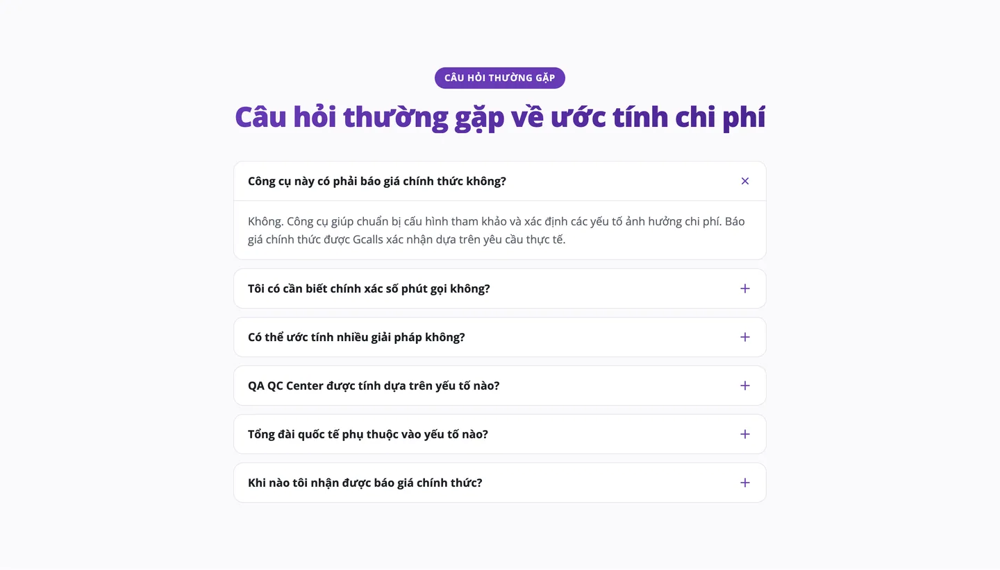

#### Section 08 — Chưa chắc cấu hình nào phù hợp với doanh nghiệp?

> BẮT ĐẦU Chưa chắc cấu hình nào phù hợp với doanh nghiệp?
> Chia sẻ quy mô đội ngũ, hệ thống đang sử dụng và nhu cầu giao tiếp để Gcalls đề xuất cấu hình phù hợp.
> Bắt đầu ước tính Xem bảng giá 028 7302 5469

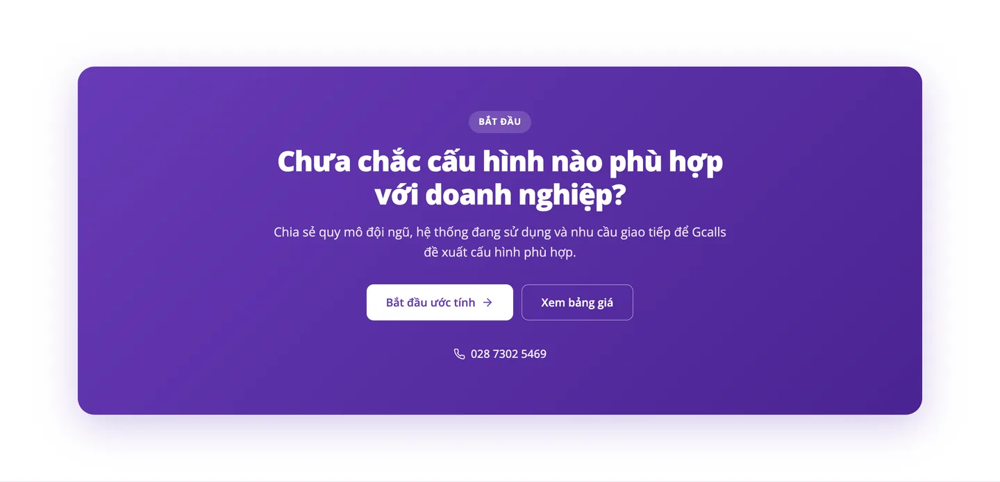

---
